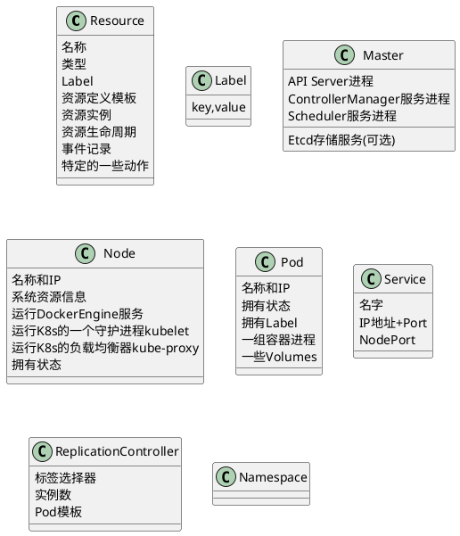

### Kubernete Concept

@import "img/k8s/k8s-post-ccm-arch.png"

@import "img/k8s/k8s-overview.png"

###### 
@import "img/k8s/k8s-abbr.png"

###### How Services in a Cluster Map to Functions in Pods
@import "img/k8s/k8s-service-function.png"

###### Kubernetes集群
@import "img/k8s/k8s-module_cluster.png"

* Master 负责集群的管理。Master 协调集群中的所有行为/活动，例应用的运行、修改、更新等。
* 节点（Node）作为Kubernetes集群中的工作节点，可以是VM虚拟机、物理机。
  每个node上都有一个`Kubelet`，用于管理node节点与Kubernetes Master通信。
  每个Node节点上至少还要运行 `container runtime`。
* Node节点使用master公开的 `Kubernetes API` 与主节点进行通信

@import "img/k8s/k8s-module_nodes.png" {width=450}

@import "img/k8s/k8s-module_rollingupdatesA.png" {width=550}
@import "img/k8s/k8s-module_rollingupdatesB.png" {width=600}
 
###### 概念
@import "img/k8s/k8s-concept.png" 
@import "img/k8s/k8s-minikube-part.png" {width=600}

###### Diagram

k8s中几乎所有重要概念都是资源.
**Resource 资源**
* 集群中的一种资源对象.
* 处于某个命名空间中
* 可以持久化存储到Etcd中
* 资源是有状态的
* 资源是可以关联的
* 资源是可以限定使用配额

