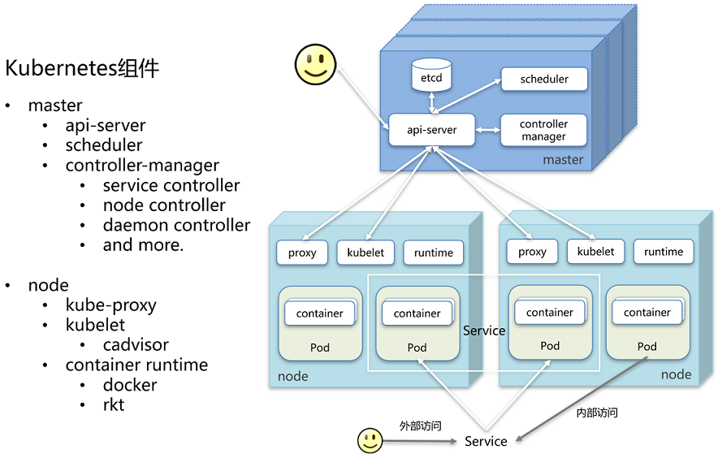
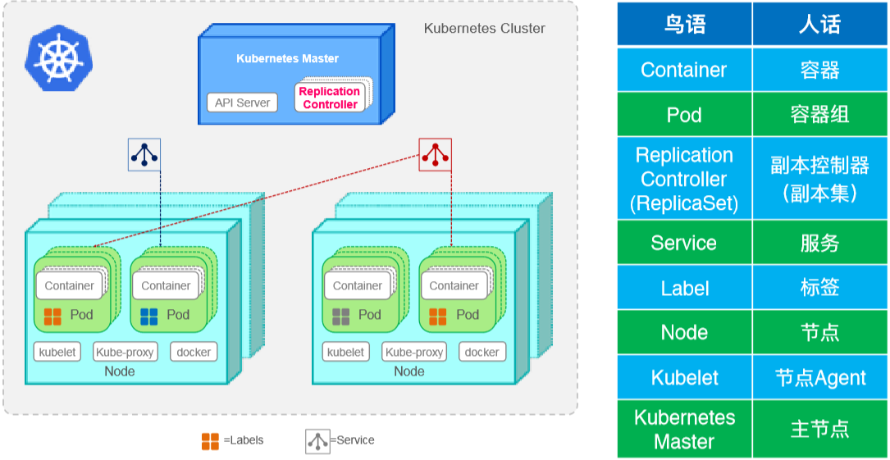
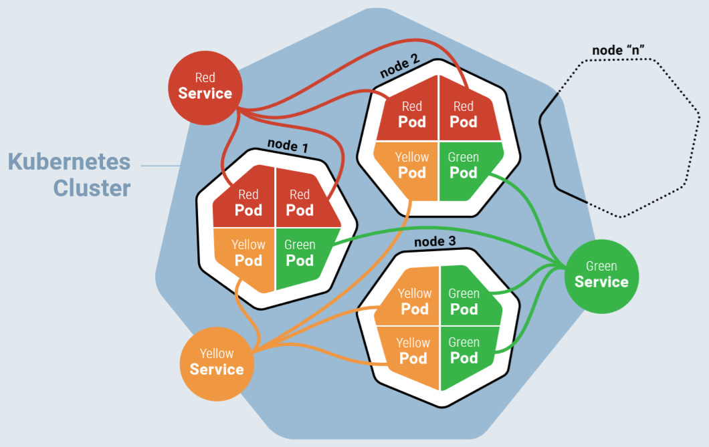
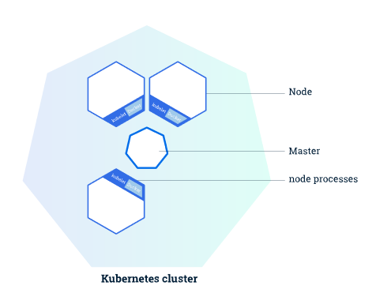
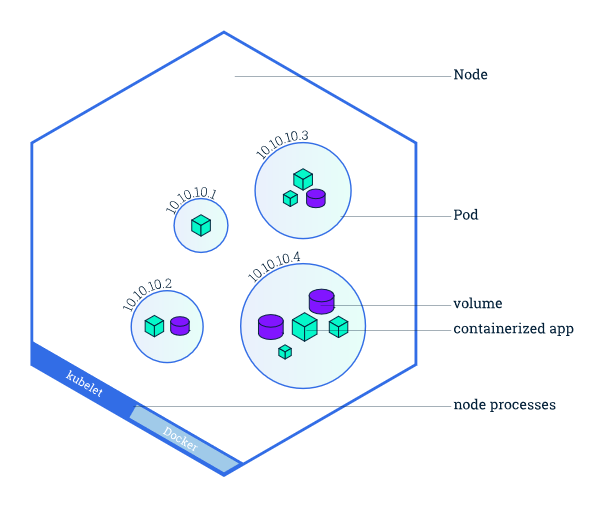
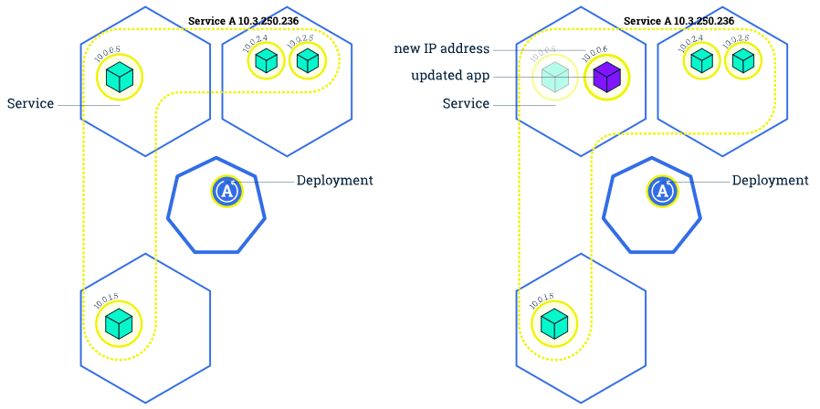
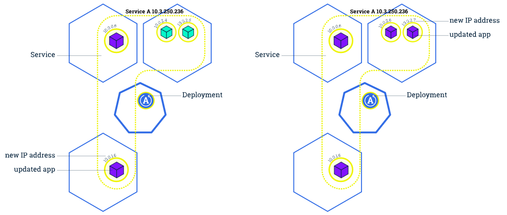
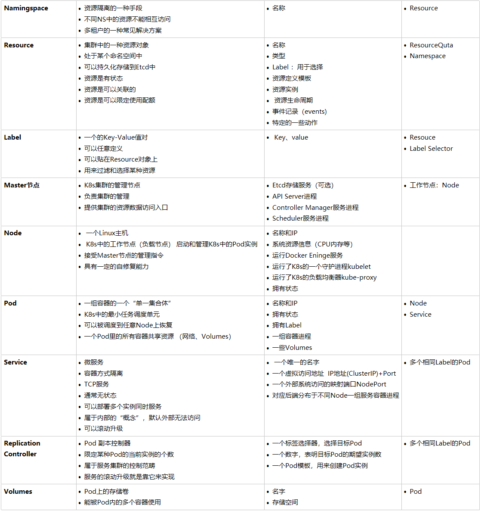
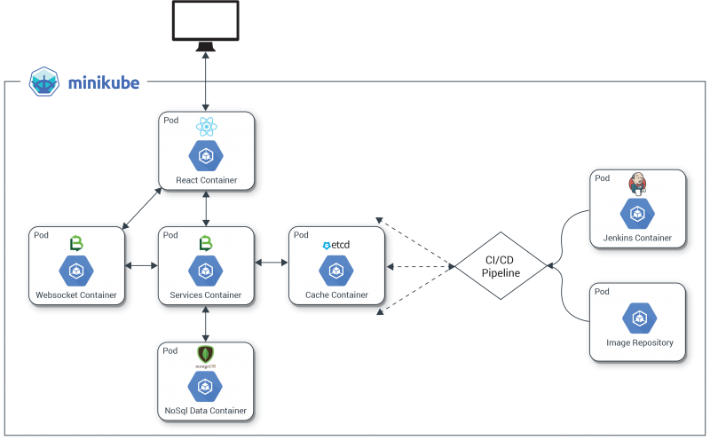

### Kubernete 基础

##### 

##### How Services in a Cluster Map to Functions in Pods

#### Kubernetes集群

* Master 负责集群的管理。Master 协调集群中的所有行为/活动，例应用的运行、修改、更新等。
* 节点（Node）作为Kubernetes集群中的工作节点，可以是VM虚拟机、物理机。
  每个node上都有一个`Kubelet`，用于管理node节点与Kubernetes Master通信。
  每个Node节点上至少还要运行 `container runtime`。
* Node节点使用master公开的 `Kubernetes API` 与主节点进行通信

 

#### 概念

