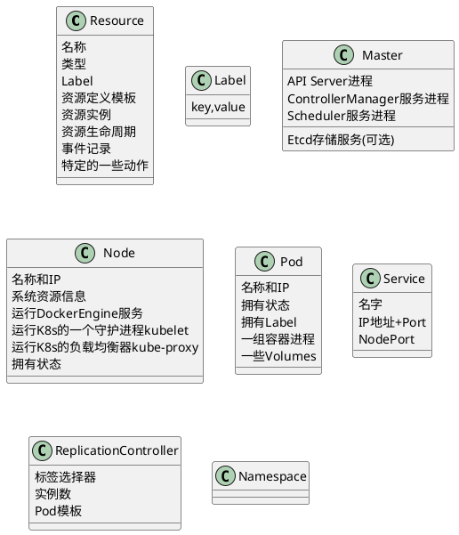

### Kubernete Concept

@import "img/k8s/k8s-post-ccm-arch.png"

@import "img/k8s/k8s-overview.png"

###### 
@import "img/k8s/k8s-abbr.png"

###### How Services in a Cluster Map to Functions in Pods
@import "img/k8s/k8s-service-function.png"

###### Kubernetes集群
@import "img/k8s/k8s-module_cluster.png"

* Master 负责集群的管理。Master 协调集群中的所有行为/活动，例应用的运行、修改、更新等。
* 节点（Node）作为Kubernetes集群中的工作节点，可以是VM虚拟机、物理机。
  每个node上都有一个`Kubelet`，用于管理node节点与Kubernetes Master通信。
  每个Node节点上至少还要运行 `container runtime`。
* Node节点使用master公开的 `Kubernetes API` 与主节点进行通信

@import "img/k8s/k8s-module_nodes.png" {width=450}

@import "img/k8s/k8s-module_rollingupdatesA.png" {width=550}
@import "img/k8s/k8s-module_rollingupdatesB.png" {width=600}
 
###### 概念
@import "img/k8s/k8s-concept.png" 
@import "img/k8s/k8s-minikube-part.png" {width=600}

###### Kubernetes中的资源管理与容器设计模式
Kubernetes通过声明式配置，真正让开发人员能够理解应用的状态，并通过同一份配置可以立马启动一个一模一样的环境，大大提高了应用开发和部署的效率，其中kubernetes设计的多种资源类型可以帮助我们定义应用的运行状态，并使用资源配置来细粒度得明确限制应用的资源使用。

Kubernetes提供了多种资源对象，用户可以根据自己应用的特性加以选择。这些对象有：

类别    |名称 
:------ | :----------- 
资源对象 |Pod、ReplicaSet、ReplicationController、Deployment、StatefulSet、 DaemonSet、Job、CronJob、HorizontalPodAutoscaling
配置对象 |Node、Namespace、Service、Secret、ConfigMap、Ingress、Label、 ThirdPartyResource、 ServiceAccount
存储对象 |Volume、Persistent Volume
策略对象 |SecurityContext、ResourceQuota、LimitRange

在 Kubernetes 系统中，Kubernetes 对象是持久化的条目。Kubernetes 使用这些条目去表示整个集群的状态。特别地，它们描述了如下信息：
* 什么容器化应用在运行（以及在哪个 Node 上）
* 可以被应用使用的资源
* 关于应用如何表现的策略，比如重启策略、升级策略，以及容错策略

Kubernetes 对象是 “目标性记录” -- 一旦创建对象，Kubernetes 系统将持续工作以确保对象存在。通过创建对象，可以有效地告知 Kubernetes 系统，所需要的集群工作负载看起来是什么样子的，这就是 Kubernetes 集群的期望状态。

###### Diagram

k8s中几乎所有重要概念都是资源.
**Resource 资源**
* 集群中的一种资源对象.
* 处于某个命名空间中
* 可以持久化存储到Etcd中
* 资源是有状态的
* 资源是可以关联的
* 资源是可以限定使用配额

