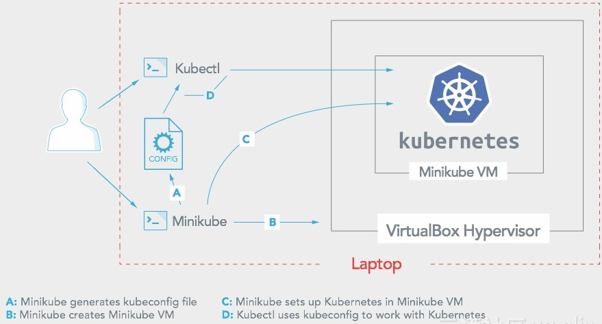

### Minikube
Kubernetes本地实验环境

###### Minikube: 本地运行Kubernete
Minikube 可以实现一种轻量级的Kubernetes集群，通过在本地计算机上创建虚拟机并部署只包含单个节点的简单集群。适合使用Kubernetes开发时。
Minikube支持Kubernetes功能: DNS、NodePorts、ConfigMaps和安全、仪表板、容器运行时、启用CNI（容器网络接口）、入口。
Minikube CLI提供集群管理的基本操作，包括 `start`、`stop`、`status`、`delete` 和 `minikube ssh docker info`




```bash
$ minikube stop
$ minikube delete
$ minikube service [-n NAMESPACE] [--url] NAME 
$ kubectl get nodes
$ kubectl run kubernetes-bootcamp --image=docker.io/jocatalin/kubernetes-bootcamp:v1 --port=8080
```


###### 安装参考
下载安装 `kubectl` 与 `minikube`, Minikube需要拟机驱动程序(如 virtualbox)
* [Running Kubernetes Locally via Minikube](https://kubernetes.io/docs/getting-started-guides/minikube/)
* [阿里云的镜像安装Minikube](https://yq.aliyun.com/articles/221687)
* [Installing Minikube and Kubernetes on Windows 10](https://technology.amis.nl/2017/10/24/installing-minikube-and-kubernetes-on-windows-10/)
* [First steps with Istio on Kubernetes on Minikube on Windows 10](https://technology.amis.nl/2017/10/25/first-steps-with-istio-on-kubernetes-on-minikube-on-windows-10/)

###### Windows 运行 minikube
```bash
PS C:\work\minikube> minikube start --registry-mirror=https://registry.docker-cn.com
There is a newer version of minikube available (v0.24.1).  Download it here:
https://github.com/kubernetes/minikube/releases/tag/v0.24.1

To disable this notification, run the following:
minikube config set WantUpdateNotification false
Starting local Kubernetes v1.8.0 cluster...
Starting VM...
Downloading Minikube ISO
 140.01 MB / 140.01 MB [============================================] 100.00% 0s
Getting VM IP address...
Moving files into cluster...
Downloading localkube binary
 148.34 MB / 148.34 MB [============================================] 100.00% 0s
Setting up certs...
Connecting to cluster...
Setting up kubeconfig...
Starting cluster components...
Kubectl is now configured to use the cluster.

PS C:\work\minikube> kubectl get pod --all-namespaces
NAMESPACE     NAME                          READY     STATUS    RESTARTS   AGE
kube-system   kube-addon-manager-minikube   1/1       Running   0          5m
kube-system   kube-dns-6cd97975b9-gb98k     3/3       Running   0          5m
kube-system   kubernetes-dashboard-7ltmb    1/1       Running   0          5m

PS C:\work\minikube> minikube dashboard
Opening kubernetes dashboard in default browser...
```


