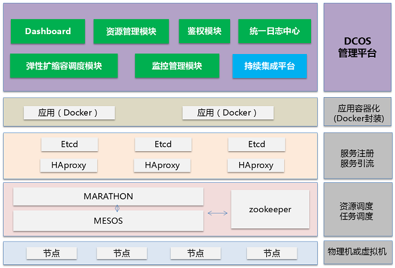

## Mesos

##### Mesos 架构

Mesos实现了**两级调度架构**，它可以管理多种类型的应用程序。
* 第一级调度是 **Master** 的守护进程，管理Mesos集群中所有节点上运行的 **Slave** 守护进程。集群由物理服务器或虚拟服务器组成，用于运行应用程序的任务，比如Hadoop和MPI作业。
* 第二级调度由被称作 **Framework** 的“组件”组成。Framework 包括 **调度器 (Scheduler)** 和 **执行器 (Executor)** 进程，其中每个节点上都会运行执行器。

Mesos能和不同类型的Framework通信，每种Framework由相应的应用集群管理。上图中只展示了Hadoop和MPI两种类型，其它类型的应用程序也有相应的Framework。

Mesos Master协调全部的Slave，并确定每个节点的可用资源，聚合计算跨节点的所有可用资源的报告，然后向注册到Master的Framework（作为Master的客户端）发出资源邀约。Framework可以根据应用程序的需求，选择接受或拒绝来自master的资源邀约。一旦接受邀约，Master即协调Framework和Slave，调度参与节点上任务，并在容器中执行，以使多种类型的任务，比如Hadoop和Cassandra，可以在同一个节点上同时运行。

##### Mesos流程

Slave是运行在物理或虚拟服务器上的Mesos守护进程，是Mesos集群的一部分。Framework由调度器（Scheduler）应用程序和任务执行器（Executor）组成，被注册到Mesos以使用Mesos集群中的资源。
1. **Slave 1** 向 **Master** 汇报其空闲资源：`4个CPU、4GB内存`。然后，**Master** 触发分配策略模块，得到的反馈是 **Framework 1** 要请求全部可用资源。
2. **Master** 向 **Framework 1** 发送资源邀约，描述了 **Slave 1** 上的可用资源。
3. **Framework** 的调度器（Scheduler）响应 **Master** ，需要在 **Slave** 上运行两个任务，第一个任务分配`<2 CPUs, 1 GB RAM>`资源，第二个任务分配`<1 CPUs, 2 GB RAM>`资源。
4. 最后，**Master** 向 **Slave** 下发任务，分配适当的资源给 **Framework** 的任务执行器（Executor）,接下来由执行器启动这两个任务（如图中虚线框所示）。 此时，还有`1个CPU和1GB的RAM`尚未分配，因此分配模块可以将这些资源供给 **Framework 2**。

##### 基于Mesos 构建的软件项目
* DevOps 工具： Vamp
* 长期运行服务：Aurora, Marathon, Singularity, SSSP
* 大数据处理：Cray Chapel, Dpark, Exelixi, Flink, Hadoop, Hama, MPI, Spark, Storm
* 批量调度：Chronos, Cook, Elastic-Job-Cloud, GoDocker, Jenkins, JobServer
* 数据存储：Alluxio, Cassandra, Ceph, ElasticSearch, Hypertable, MrRedis
* 机器学习：TFMesos

[Frameworks 参考](http://mesos.apache.org/documentation/latest/frameworks/)

----
## Mesosphere DC/OS

#### overview

#### Mesosphere DC/OS 架构
DC/OS是运行分布式容器化软件的平台，如应用程序，作业和服务。作为一个平台，DC/OS与基础架构层是不同的，也是不可知论的。这意味着只要提供计算，存储和网络，基础架构可能由虚拟或物理硬件组成。

* **软件层**
  在软件层，DC/OS提供了软件包管理和软件包存储库，可以轻松安装和管理多种类型的服务：数据库，消息队列，流处理器，工件库，监控解决方案，持续集成工具，源代码管理，日志聚合器，等等。除了这些打包的应用程序和服务之外，用户可以安装他们自己的定制应用程序，服务和预定作业。
* **平台层**
  有几十个**组件**分为以下几类: **集群管理**、**容器编排**、**容器运行时**、**包管理**、**日志和指标**、**IAM和安全企业**、**网络**、**存储**。
  这些组件分为多个**节点类型**：**主节点**、**私有代理节点**、**公共代理节点**
  对于要安装的DC/OS，每个节点必须已经配置了其中一个受支持的主机操作系统。
* **外部组件**
  除了在数据中心运行的软件之外，DC/OS还包含并集成了几个外部组件：`GUI`，`CLI`，`软件包存储库`和`容器注册表`。

#### Mesosphere DC/OS 节点 
**DC/OS节点** 是运行DC/OS组件的虚拟或物理机器。DC/OS节点联网在一起形成一个 DC/OS **群集**。
DC/OS集群由三种类型的节点组成：**主节点**，**私有代理节点** 和 **公共代理节点**。

##### 主节点
主节点是与其他主节点一起工作来管理群集的其余部分的节点。主节点包含大量DC/OS组件，包括Mesos master进程。支持高可用、领袖选举。

##### 代理节点
代理节点是运行用户任务的节点。代理节点包含一些DC/OS组件，包括Mesos代理进程。代理节点可以是公共或私有的，具体取决于代理和网络配置。
* **公共代理节点**
  公共代理节点允许通过群集的基础结构网络从群集外进入。公共代理节点主要用于面向外部的反向代理负载均衡器，如Marathon-LB。
  集群通常只有少数公共代理节点，因为少数负载平衡器通常可以处理代理多个服务。
* **私人代理节点**
  私人代理节点没有通过群集的基础结构网络从群集外面进行入口访问。
  私有代理节点上的资源默认情况下配置为允许无差异分配。更确切地说，资源被赋予了`*`角色，允许将它们分配给任何不指定角色的任务。请参阅 Mesos**资源角色**。
  由于这些资源没有区别，因此大多数任务都在私有代理节点上进行调度，并且从群集外部无法访问。因此，集群通常由大多数私人代理节点组成。
  
#### Mesosphere DC/OS 组件

##### 集群管理 Cluster Management
* Mesos 以分布式系统内核的方式管理资源和任务。
* ZooKeeper 为配置，同步，名称注册和集群状态存储提供了一致的，高度可用的分布式键值存储。
* Exhibitor 监督ZooKeeper并提供管理网页界面。
* DC/OS安装程序（dcos_generate_config.ee.sh）生成安装构件并安装DC/OS。
* DC/OS备份提供DC/OS组件状态的备份和恢复。

##### 容器编排 Container Orchestration
##### 管理路由器 Amdin Router
##### 容器运行时 Container Runtimes
##### 日志和指标 Logging and Metrics
##### 包管理 Package Management
##### IAM和安全 IAM and Security
##### 存储 Storage
##### 网络 Networking

### Misc

##### DCOS 之架构

* 用户空间包括 System Components 和 Services
* 内核空间包括 Mesos Masters 和 Mesos Agents ( Mesos container 和 Docker )

##### DCOS 之功能

DCOS 以开源技术 Mesos，Docker，Marathon 为引擎，在其上开发了 DCOS 控制台、监控管理模块、弹性扩缩容调度模块、统一日志模块、资源配置模块、鉴权模块、持续集成平台等。

##### DC/OS 安全

