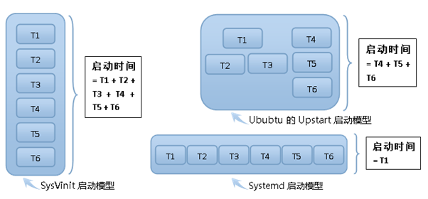
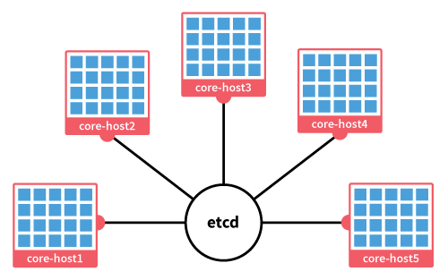

<span id="coreos01"></span>
## 1. CoreOS Overview
CoreOS实践指南（一）：CoreOS俯瞰。

##### 引言
相信许多人开始了解CoreOS是从2014年7月底的一则新闻：内置Docker容器的操作系统CoerOS发布首个正式稳定版本。在那之后的半年里CoreOS一路高歌猛进。8月中旬CoreOS收购私有Docker仓库服务商Quay.io，9月初DigitalOcean与CoreOS达成战略合作，9月底微软Azure云服务开始支持CoreOS系统镜像，10月中旬英国的知名云服务商BrightBox也加入支持CoreOS系统镜像的阵营，加上此前已经支持CoreOS镜像的全球主流云服务提供商，包括亚马逊的AWS、云计算巨头Rackspace和Google Computer Engine，CoreOS的名字已经无所不在。

作为一个发布仅仅一年有余的操作系统（首个发布版本在2013年3月），CoreOS在云计算相关的开源社区和大规模服务器集群的领域早已崭露头角，直接与主流Linux服务器操作系统同台竞争。至于后来RedHat祭出内建容器管理服务的系统Atomic，以及Canonical刚刚推出的Ubuntu Core，逐步掀起ContainerOps的大潮，一个全新的集群运维时代正在开启。而走在风头浪尖的CoreOS正是这股潮流的先驱者，它的出现远远不只是“又一个Linux发行版”，而是一个时代理念的颠覆。

这篇系列教程将从最基本的概念开始，顺着大规模集群管理和应用容器化这两条主线带大家了解 CoreOS 系统的独到之处，使得没有接触过这个系统的用户也能够快速的理解其中功能的精华和推荐的实践方法。

##### CoreOS 是什么
简单的说，它是一种基于 Chrome OS 再定制的轻量级 Linux 发行版本。
作为一个操作系统，CoreOS 采用了高度精简的系统内核及外围定制，将许多原本需要复杂人工操作或者第三方软件支持的功能在操作系统级别进行了实现，同时剔除了其他对于服务器系统非核心的软件，比如GUI和包管理器。
特别值得一提的是 CoreOS 对包管理器的态度和 Docker 的原生支持。这是许多习惯了传统 Linux 管理方式的用户在刚接触 CoreOS 时，最不习惯的地方，因为 CoreOS 没有提供现成的包管理工具。一个典型的困惑是：在 CoreOS 安装软件太不方便了。事实上 CoreOS 并不鼓励用户将各种应用软件直接安装在操作系统之上，而是提倡将所有服务运行在单独的应用容器中，由应用容器提供应用所需要的基础功能环境。这种做法将操作系统和应用程序的职责做了更彻底的分离，降低操作系统和应用程序的耦合度，使运行这些服务器的公司可以更快速、更廉价地更新自己的线上业务。

##### CoreOS 行走在云端
毫不夸张的说，CoreOS 是为云而生的操作系统。

这个“为云而生”包含两层含义：
* 首先，CoreOS 的设计立足点充分的考虑了云端生态系统的分布式部署、大规模伸缩扩展(Scaling)需求，我们将会再后面的内容中充分体会到这一点；
* 另一方面，CoreOS 对特定的云环境也有相当的依赖，其启动配置服务 cloud-init 是需要高度定制化的，CoreOS 官方提供了基于Vagrant、VMWare、AZure、AWS、RackSpace 等虚拟机或云服务提供商的定制版本，因此本地直接通过 ISO 安装的 CoreOS 则无法获得 cloud-init 相关的功能，比如集群的自发现和fleet的跨主机管理。

##### CoreOS 的用户体验
CoreOS 的核心思想来自于 Chrome 浏览器的用户体验：快速启动，后台更新，跨版本无缝更新，每个Tab页采用独立沙盒，单个Tab页崩溃能快速修复，整个浏览器也不会因为单个沙盒进程的崩溃而崩溃。引申到服务器上，试想将一个应用托管在应用容器中的服务从一个服务器转移到另一个服务器上，就像用鼠标将 Tab 页从一个浏览器拖拽到另一个浏览器界面上那样简单。而这些，正是 CoreOS 希望带给每一个用户的体验。
* **更快的启动速度**
  因为轻，所以快。做为现代网络的服务器的产物，CoreOS 团队对这个服务器操作系统做了最大的精简，结果不仅使得系统与应用高度分离，更获得了极大的启动速度提升。根据官方数据，其系统运行时内存使用量只有114M（作者注：这是官方数据，实测在Vagrant环境下只有大约80M，比宣传的还要低），只有常见 Linux 服务器系统的一半略多 (约60%)。
  此外，CoreOS 使用经 Mac 系统 launchd 的启发而开发的 Systemd 作为默认系统启动和服务管理器 (CentOS 7 也使用 Systemd 取代了过去的 SysV 启动服务)。与 SysV 相比，Systemd 不但可以更好的追踪系统进程，而且也具备优秀的并行化处理能力，加之按需启动等特点，并结合 Docker 的快速启动能力，在 CoreOS 集群中大规模部署 Docker Containers 与使用其他操作系统相比在性能上的优势将更加明显。
* **平滑版本升级**
  传统的服务器操作系统，包括大多数Linux发行版，每隔几年都会更换。在这期间，开发者会不断用安全补丁和更新完善这个系统，但是不会进行特别大的改动，最终这个操作系统以及其上的软件会慢慢僵化。但是 CoreOS 的思想是成为一个随时可被更新的操作系统，其本身没有跨发布版本升级的概念，而是使用了类似 Arch Linux 的升级通道(Update Channel)和滚动更新的方式，在任何时候系统都能够直接升级成最新的发布版本。甚至在整个更新的过程中，应用程序的运行不会被打断。有了 CoreOS，基础架构会自动升级，就像无需用户操心的 Chrome 浏览器升级一样。
  CoreOS 有两个系统分区 (dual root partition 有些地方翻译为双启动分区，这里实际上应该是系统分区，包括 /bin /sbin /lib 等目录，这些目录都是只读的)。两个分区分别被设置成主动模式和被动模式并在系统运行期间各司其职。主动分区负责系统运行，被动分区负责系统升级。一旦新版本的操作系统被发布，一个完整的系统文件将被下载至被动分区，并在系统下一次重启时从新版本分区启动，原来的被动分区将切换为主动分区，而之前的主动分区则被切换为被动分区。这个个过程中，被更新的机器不需要从负载集群中移除。同时，为了保证其它应用程序不被打断，CoreOS 会通过 Linux cgroups 限制更新过程中的硬盘和网络I/O。
  这里值得一提的是，与传统 Linux 服务器不同，CoreOS 的系统分区被设计成在系统运行期间保持只读状态，这样确保了 CoreOS 的安全性，也进一步体现了 CoreOS 不希望用户将应用软件直接安装在操作系统上的态度。同时，集群内高度一致的系统内核和外围应用版本，简化了由于版本问题带来的操作复杂性，使得操作系统自身的维护更加容易。
* **应用容器化**
  在 CoreOS 中，所有应用程序都被装在一个个 Docker 容器中，这些容器就像一个个软件代码的集装箱，通过最简单的接口运行在操作系统之上。这意味着它们可以被很轻松的在操作系统和计算机之间转移，就像是在轮船和火车上搬运箱子一样，同时也意味着可以在不中断应用程序的情况下更新操作系统。
  Docker 在开发者将应用部署到云基础架构上时变得日益流行。通过容器化 (containerized) 的运算环境向应用程序提供运算资源，应用程序之间共享系统内核和资源，却互不干涉运行。单个容器的故障能够快速的重启修复，并且容器内的应用故障不会引起整个系统的崩溃。这个思想和浏览器的沙盒是如出一辙的。

##### CoreOS 的分布式系统服务
云的问题，最主要是由集中式到分布式思考方式的转变，分布式服务、分布式部署、分布式管理、分布式数据存储… 而这些都是 CoreOS 带给服务器革命的一部分。
为了从系统层面上解决这些分布式思维所面临的问题，CoreOS 团队提供了一些重要的工具帮助用户管理 CoreOS 集群以及部署 Docker 容器。
* **Cloud-init**
  在系统启动时，CoreOS 会读取一个平台定制的用户配置文件 (称为 `cloud-config`) 完成系统的初始化配置。通过配置中的信息，新启动 CoreOS 服务器将初始化必要的服务进程，并自动发现并指定集群的其他服务器交互信息，然后加入这个集群中。这种基于集群的“自发现”组织方式使得集群管理变得简单且高效。
  通常来说，`cloud-config` 配置文件至少应当包括服务器所属的集群通信地址，以及启动 `etcd` 和 `fleet` 所需服务的参数。用户可以根据需要，在配置中添加更多定制化的服务，使得节点启动后立即成为功能完备的集群成员投入运行。
* **Etcd**
  在CoreOS 集群中处于骨架地位的是 `etcd`。 `etcd` 是一个分布式 `key/value` 存储服务，CoreOS 集群中的程序和服务可以通过 `etcd` 共享信息或做服务发现 。`etcd` 基于非常著名的 `raft` 一致性算法：通过选举形式在服务器之中选举 Lead 来同步数据，并以此确保集群之内信息始终一致和可用。`etcd` 以默认的形式安装于每个 CoreOS 系统之中。
  在默认的配置下，`etcd` 使用系统中的两个端口：`4001`和`7001`，其中`4001`提供给外部应用程序以`HTTP+Json`的形式读写数据，而`7001`则用作在每个 `etcd` 之间进行数据同步。用户更可以通过配置 CA Cert让 `etcd` 以 HTTPS 的方式读写及同步数据，进一步确保数据信息的安全性。
* **Fleet**
  `fleet` 是一个通过 `Systemd`对CoreOS 集群中进行控制和管理的工具。`fleet` 与 `Systemd` 之间通过` D-Bus` API 进行交互，每个 `fleet agent` 之间通过 `etcd` 服务来注册和同步数据。`fleet` 提供的功能非常丰富，包括查看集群中服务器的状态、启动或终止 Docker 容器、读取日志内容等。更为重要的是 `fleet` 可以确保集群中的服务一直处于可用状态。当出现某个通过 `fleet` 创建的服务在集群中不可用时，如由于某台主机因为硬件或网络故障从集群中脱离时，原本运行在这台服务器中的一系列服务将通过fleet 被重新分配到其他可用服务器中。虽然当前 fleet 还处于非常早期的状态，但是其管理 CoreOS 集群的能力是非常有效的，并且仍然有很大的扩展空间，目前已提供简单的 API 接口供用户集成。

##### 尾声
从下一篇开始我们将从构建一个 CoreOS 集群说起，一步一步来熟悉这个系统的方方面面。


<!-- pagebreak -->

<span id="coreos02"></span>
## 2. Setup CoreOS Cluster
CoreOS实践指南（二）架设CoreOS集群

CoreOS 集群的架设比架设一个传统服务器集群更加容易。一方面因为 CoreOS 使用了 `Cloud-init` 自动化了集群信息的配置，另一方面则是受益于 `etcd` 分布式存储实现的消息分发和服务器自发现机制。这些便利性正是 CoreOS 系统设计充分为集群架构考虑带来的效率提升。

##### 安装 CoreOS
CoreOS 的安装方法和传统 Linux 系统有很大的不同。鉴于是基础教程，在这一篇中，我们会使用官方的Vagrant镜像一步一步的构建CoreOS的VirtualBox虚拟机集群。本文使用了Linux/Mac作为测试环境，Vagrant从1.6版已经支持Windows，但需要安装Putty作为登录工具，略有不同，具体使用方法见 [链接](http://www.sitepoint.com/getting-started-vagrant-windows/)。

需要顺带说明一点，比较仔细的使用者可能已经发现官方提供的镜像中有一个是“ ISO镜像文件”，然而这个镜像实际上只是一个 Live CD，也就免安装的试用镜像，直接使用这个ISO启动的系统是不具备服务自发现和分布式消息分发的能力的。通过ISO镜像安装集群的方式我们会放到专题篇的内容里面详述。好，现在进入正题吧。

正如系列的第一篇所提到的，`Cloud-init` 通常依赖于具体平台的实现定制，将其直接在物理机上使用并不是主流的使用方法。对于这种安装方法， [官方有一篇文档](https://coreos.com/docs/running-coreos/bare-metal/installing-to-disk/)提供了详细的步骤，这里不再进行详细讨论。

首先来看一下 CoreOS 原生支持的平台。截止到目前，最新版本的CoreOS v540已经支持的平台如下图。
@import "img/coreos/coreos0201.png" {width="250px" title="coreos-platform-support" alt="coreos-platform-support"}

可以看到除去安装到本地的 Bare Metal，其余基本是针对主流的云服务平台定制的版本。这里的定制主要是 Cloud-init 等启动服务的配置，那么如何知道 CoreOS 已经支持自动化的集群部署的平台有哪些呢？我们可以从 CoreOS 源代码的 [coreos-base 目录](https://github.com/coreos/coreos-overlay/tree/master/coreos-base)里得到答案。
@import "img/coreos/coreos0202.png" {width="250px" title="coreos-platform-support" alt="coreos-platform-support"}

这些 oem 开头的目录就是平台定制的实现。其中每个目录中的 `files/cloud-config.yml` 文件，就是 `Cloud-init` 的配置文件。在每一种平台安装 CoreOS 的方式各有不同，可以从官方网站相应的页面找到相应步骤。这里我们选择其中的 Vagrant 作为演示的目标平台。

##### 在 Vagrant 上部署 CoreOS 集群
使用 Vagrant 建立 CoreOS 集群可以说是最简单且经济的方式了，使用本地虚拟机构建，特别适合快速验证 CoreOS 的功能。

###### 预备
需要准备的东西，包括一台连接到互联网的 Mac 或者桌面 Linux 电脑，安装好 Git、VirtualBox 和 Vagrant。

通过 Git 下载官方的 Vagrant 仓库：  
`git clone https://github.com/coreos/coreos-vagrant.git`  
下载完成后，我们接下来配置 CoreOS 集群。

###### 配置
为了使用集群服务器的自发现功能，我们需要一个能用来唯一标识一个集群并提供集群信息的地址。CoreOS 官方提供了这个服务，当然我们也可以使用自己搭建的私有集群标识服务器。鉴于搭建私有标识服务器属于比较进阶的内容，我们会在这个系列的后续文章详述。

通过浏览器或命令行 curl 访问地址 https://discovery.etcd.io/new 可以得到一个新的集群标识 URL（如果是在Windows下，可以直接使用浏览器访问这个URL地址），这个 URL 会在配置 `user-data` 时候使用到。  
`curl https://discovery.etcd.io/new`

进入 `coreos-vagrant` 目录，将 `user-data.sample` 和 `config.rb.sample` 两个文件各备份一份，并去掉 `.sample` 后缀。得到 `user-data` 和 `config.rb` 文件。

首先修改 `user-data` 文件，它将作为启动的配置文件提供给 CoreOS 操作系统。值得一提的是，在这个配置中，可以使用两个变量 `$private_ipv4` 和 `$public_ipv4`，它们会在实际运行的时候被自动替换为主机的真实外网 IP 和内网 IP 地址。

这里我们需要做的只是将其中 discovery所在行前面的注释符合“`#`”去掉，然后替换它的值为我们刚刚获得的集群标识 URL 地址。简单来说，所有使用了同一个标识 URL 的主机实例都会在 CoreOS 启动时自动加入到同一个集群中，这就实现了无需人工干预的集群服务器自发现。

```yaml
#cloud-config
coreos:
  etcd:
    # generate a new token for each unique cluster from https://discovery.etcd.io/new
    # WARNING: replace each time you 'vagrant destroy'
    discovery: <集群标识URL地址>
    addr: $public_ipv4:4001
    peer-addr: $public_ipv4:7001
    # ... ...
```

然后修改 `config.rb` 文件，这里包含了 Vagrant 虚拟机的配置。通过这个文件实际上可以覆写任何 `Vagrantfile` 里的参数，但是目前我们只需要关注 `$num_instances` 和 `$update_channel` 这两个参数的值。
* `$num_instances` 表示将启动的 CoreOS 集群中需要包含主机实例的数量；
* `$update_channel` 表示启动的 CoreOS 实例使用的升级通道，可以是 ‘`stable`’，’`beta`’ 或 ‘`alpha`’。
```ruby
$num_instances=3
$update_channel='stable'
```
CoreOS 没有跨越式的版本发布，而是使用与 Arch Linux 类似的平滑的滚动升级，确保用户任何时候下载到的版本都是最新发布的系统镜像，并且从根本上解决了服务器系统在运行几年后，由于无法平滑升级而被迫重新安装的情况。此外 CoreOS 提供了 Stable、Beta 和 Alpha 三种升级通道，用于满足不同用户对系统新特性和稳定性的平衡。关于升级通道的切换，可参考官方的文档。

###### 启动
启动集群，执行：
`vagrant up`

查看集群运行状态，所有的集群实例都已经启动。
```
vagrant up
Current machine states:
core-01 running (virtualbox)
core-02 running (virtualbox)
core-03 running (virtualbox)
```
此时，在 CoreOS 集群的内部正发生着许多故事，集群的实例之间通过自发现服务，相互认识了对方并建立了联系。它们具备了在集群中任意一个实例节点控制整个集群的能力。是的，一个功能完备的 CoreOS 服务器集群已经完全运行起来了。

##### 探索 CoreOS
在下一部分，我们将会进入启动完成的 CoreOS 实例中，继续探索其中的奥秘。


<!-- pagebreak -->

<span id="coreos03"></span>
## 3. Systemd
CoreOS实践指南（三）：系统服务管家Systemd

在系列教程的第一篇里我们已经提到了`Systemd`，它主要的设计目标是克服传统Linux主流启动程序SysVinit 固有的缺点，提高系统的启动速度。相比同类的 `SysVinit` 竞争者，例如Ubuntu 的 `upstart`，`Systemd` 的设计更加前卫，简单来说，它的设计思路借鉴了Mac系统的启动程序Launchd。事实上Systemd的作用远不仅是启动系统，它还接管了系统服务的启动、结束、状态查询和日志归档等职责，并支持定时任务和通过特定事件（如插入特定USB设备）和特定端口数据触发的任务。在CoreOS的世界里，推荐的做法是使用Systemd来管理所有用户服务，包括运行在应用容器（如Docker）中的服务。

值得指出的是，`Systemd`并不是CoreOS特有的服务。本质上说`Systemd`是没有依附于任何一个Linux发行版的独立项目，由于Systemd的作者Lennart Poettering 就职于红帽，整个项目实际由RedHat公司主导。虽然RedHat Linux直到2014年中旬才用上Systemd，但RedHat旗下的Fedora早在2011年时就已经引进了Systemd作为其启动管理程序了。

在开始使用Systemd之前，先了解一下Systemd有哪些特别之处。

##### Systemd 的设计理念
* **尽可能启动更少进程**
  当SysVinit 程序初始化系统的时，会将所有可能用到的后台服务进程全部运行起来。然而用户需要等待系统将所有服务都启动完成之后，才能够登录。这种做法会带来两个问题：系统的启动时间过长和系统资源的浪费。
  Systemd 提供了服务按需启动的能力，使得特定的服务只有在被真正请求的时候才启动。特别是具体硬件相关的服务，比如蓝牙服务仅在蓝牙适配器被插入时才需要运行，打印服务仅在打印机连接或程序要打印时才需要运行，甚至sshd服务也只需要在用户使用ssh连接到服务器时才需要启动。这种能力是建立在对Systemd对DBus总线或特定Socket端口监听的特性上的，这种设计相比于传统启动程序具有颠覆性的进步。
* **尽可能将更多进程并行启动**
  在SysVinit的时代，将每个服务项目编号的方式依次执行启动脚本。后来Ubuntu的Upstart解决了没有直接依赖的启动项之间的并行启动。而Systemd通过Socket缓存、DBus缓存和建立临时挂载点等方法进一步解决了启动进程之间的依赖，做到了所有系统服务并发启动，这一设计同样是Systemd独具特色的创意。当然，对于用户自定义的服务，Systemd允许配置其启动依赖项目，从而确保服务按必要的顺序运行，稍后会详细描述具体的使用方法。  
      
  Systemd启动模型与其它启动模型的对比
* **采用 Cgroup 跟踪和管理进程的生命周期**
  Cgroup的全称是controller group，是将任意进程进行分组化管理的Linux内核功能，最初由Google的工程师提出，从Linux内核版本2.6.24正式启用。拿Android来说，它的应用程序隔离就是使用的这种技术。而很长一段时间里，在更广阔的服务器领域，一直并没有一种主流的服务管理程序能够充分利用这种早已在手机端带来广泛好处的特性。
  而Systemd正是Cgroup方面的行家，它的出现正好弥补了这个领域的缺漏。通过Cgroup，Systemd不仅实现了服务之间的访问隔离，还能够限制特定应用程序对系统资源访问配额（比如CPU的用量、内存的量），以及精确的管理服务的生命周期。在这篇文章的后面部分会讲述相关操作具体的做法。
* **统一管理服务日志**
  使用Systemd 必须知道的还有它的伙伴：Journald日志服务，这个服务的设计初衷是克服现有syslog服务的日志内容易伪造和日志格式不统一等缺点，而它现在已经是Systemd的一个标准子服务了。Journald用二进制格式保存所有日志信息，用户需要使用 journalctl 命令来查看日志信息。在这篇文章的后面会介绍如何查看服务的日志。

##### 第一个Hello World服务
###### Unit和Target

先介绍两个概念，**Unit**和**Target**。  

**Unit** 是Systemd管理服务的基本单元，可以认为每个服务就是一个Unit，并使用一个Unit文件定义。Unit文件中需要包含相应服务的描述、属性以及需要运行的命令。在CoreOS中服务运行的命令通常是一系列的容器操作，而将具体的服务进程封装在容器中。

**Target** 是Systemd中用于指定服务启动组的方式（相当于SysVinit中的“运行级别”，如果不清楚这个概念也没有关系，搜索“Linux运行级别”可以查到很多相关文章）。每次系统启动的时候都会运行与当前系统相同级别Target关联的所有服务，如果服务不需要跟随系统自动启动，则完全可以忽略这个Target的内容。通常来说我们大多数的Linux用户平时使用的都是“多用户模式”这个级别，对应的Target值为“`multi-user.target`”。

###### Hello World服务的Unit文件

只说不做假把式，现在我们来用Systemd创建一个简单的系统服务。
在这个系列的上一节内容里，我们创建了一个由3个CoreOS虚拟机节点组成的集群，在这节中，我们只需要使用到其中的任意一个，比如`coreo-01`节点。首先使用`ssh`连接进入这个节点（这种方法适用于Linux/Mac用户，对于Windows用户需使用Putty客户端， 具体参考）。  
`vagrant ssh core-01`

登录成功后提示符变成 “`core@core-01 ~ $`” ，祝贺你又向CoreOS迈出了重要一步，接下来就可以开始在CoreOS里面玩耍了。

Systemd约定，服务的Unit文件需放置在` /etc/systemd/system` 或 `/usr/lib/systemd/system` 目录中，但由于在CoreOS的后一个目录是只读分区（整个`/usr`目录挂载的都是只读的系统分区），因此我们通常会将用户定义的Unit服务文件放在在`/etc/systemd/system`目录中。进入这个目录，新建一个叫“`hello.service`”的文件，内容入下。
```toml
[Unit]
Description=Hello World
After=docker.service
Requires=docker.service
[Service]
TimeoutStartSec=0
ExecStartPre=-/usr/bin/docker kill busybox1
ExecStartPre=-/usr/bin/docker rm busybox1
ExecStartPre=/usr/bin/docker pull busybox
ExecStart=/usr/bin/docker run --name busybox1 busybox /bin/sh -c "while true; do echo Hello World; sleep 1; done"
ExecStop="/usr/bin/docker kill busybox1"
[Install]
WantedBy=multi-user.target
```
在这个Unit文件里，我们首先为这个服务提供了一行简短的描述，然后指明它需要依赖docker的服务，并且要在docker服务运行以后才能运行。整个Unit文件是用的`ini`文件风格的分组配置格式，最开始的这段配置被放在了`Unit`组里面。在接下来的`Service`组中，使用`ExecStart`和`ExecStop`属性分别指定了服务运行时和结束时需要执行的命令。最后在`Install`组的配置中，我们指定了服务所属的`Target`为`multi-user.target`。

这里需要注意两个地方，首先`ExecStart`属性只能包含一条主要命令，而在这个属性的前后可以分别使用`ExecStartPre`和`ExecStartPost`指定更多的辅助命令，`ExecStop`同理。有些辅助命令会加上一个减号，表示忽略这些命令的出错（因为有些“辅助”命令本来就不一定成功，比如尝试清空一个文件，但文件可能不存在）。其次`TimeoutStartSec=0`这行的目的是将`Systemd`的服务启动超时检查关闭，对于`docker`应用这样做是必须的，因为`docker`在运行时可能会需要下载或更新镜像文件，使得服务启动时间变得很长，这样可以防止`Systemd`认为服务启动失败而将进程误杀。

###### 启动服务
有了`Unit`文件，现在就可以启动`Hello World`服务了，在控制台输入以下命令：
`sudo systemctl start hello.service`

>Tip：这个名字末尾的 `.service` 后缀是可以省略的，因为`systemctl`默认的后缀就是 `.service`。关于`Unit`文件后缀的含义，会在后续进阶篇的文章里详细说明。

`sudo systemctl enable /etc/systemd/system/hello.service`  
`Systemd`会自动找到 `/usr/lib/systemd/system` 目录中的 `hello.service` 文件，并启动其中定义的服务。如果之前创建的`Unit`文件是放在其他目录下的，这里需要使用文件的完整路径。首次运行的时候需要等待一段时间，因为`docker`需要从网络上下载需要的镜像。启动完成后可以通过 “`systemctl list-units`” 命令查看服务是否已经在运行（这个命令接受一个可选参数作为服务名的过滤条件，如果不带任何参数则输出所有服务）。
```
core@core-01 ~ $ sudo systemctl list-units hello*
UNIT LOAD ACTIVE SUB DESCRIPTION
hello.service loaded active running Hello World
```

我们还可以通过“`systemctl enable`”命令来将服务指定为在系统启动时自动启动。
`sudo systemctl enable hello.service`

此时就用到了之前定义的`Target`组，实际上`enable`操作只是创建了一个连接文件到指定的Target组的目录下面。通过下面命令可以证实。
```
core@core-01 ~ $ ls -l /etc/systemd/system/multi-user.target.wants/hello.service
/etc/systemd/system/multi-user.target.wants/hello.service -> /etc/systemd/system/hello.service
```
系统启动时，会自动运行其所在Target级别相应的目录里所有链接的服务。

##### 日志管理
至此，我们的第一个服务已经在后台哈皮的玩耍了，可是说好的“`echo Hello World`”呢？我们从头到尾都没有见到服务的任何输出啊。

其实我们启动的服务已经在后台默默的输出“`Hello World`”了。

Systemd通过其标准日志服务Journald将其管理的所有后台进程打印到到std:out（即控制台）的输出重定向到了日志文件。日志文件是二进制格式的，因此必须使用特定的工具才能查看。Journald提供了配套的程序`Journalctl`用于处理日志内容。`Journalctl`的使用非常简单，默认不带任何参数的时候会输出系统和所有后台进程的混合日志，常用的参数有
* `--dmesg` 用于查看内核输出的日志，
* `--system` 用于查看系统输出的日志，
* `--unit` 加上Unit的名字来指定输出特定Unit的日志，例如以下命令。
  `journalctl --unit hello.service`

其他还有一些比较实用的参数，比如使用 `--follow` 实时跟踪日志输出，使用 `--since` 和 `--until` 指定显示的日志时间区间等，可以通过 `journalctl --help` 命令获得完整的参数说明。

##### 服务的生命周期
前面我们使用了 `systemctl` 的 `start` 和 `enable` 两个命令将 `Hello World` 服务在系统后台启动并设置为了开机自动运行。实际我们会遇到的情况远不止这些，下面我们来将一个服务进程在`Systemd`的生命周期补充完整。

###### 服务的激活
当一个新的Unit文件被放入 `/etc/systemd/system/` 或 `/usr/lib/systemd/system/` 目录时，它是不会自动被`Systemd`识别到的。例如在 `hello.service` 文件刚刚创建好时，如果我们让`Systemd`列出所有的Unit。
`sudo systemctl list-units`

此时在输出的内容中是找不到`hello.service`这个Unit的。直到我们通过 `systemctl` 的 `start` 或 `enable` 命令将这个Unit登记到Systemd的服务列表中，这个过程就是Unit的激活。

在服务被激活前，Unit仅仅是以Unit 文件的形式存在，Systemd提供 `list-unit-files` 命令查看所有的Unit 文件。
`sudo systemctl list-unit-files`

这个命令同样接受一个可选的参数作为Unit名称的匹配条件，不带任何参数时会输出所有Systemd找到的（也就是在那两个目录）Unit文件。

>PS：顺便回答一个经常被问到的问题，这个命令的输出的第一列是Unit文件名，第二列是相应的Unit是否开机启动，它的值可以是`enable`、`disable`或`static`，这里的`static`是神马意思呢？其实它是指对应的 `Unit` 文件中没有定义`[Install]`区域，因此无法配置为开机启动服务。

###### 服务的启动、结束、强制终止和重新启动
启动、结束、强制终止和重新启动，没啥可说的，分别对应以下几个命令。
```
sudo systemctl start
sudo systemctl stop <Unit名称>
sudo systemctl kill <Unit名称>
sudo systemctl restart <Unit名称>
```

这里存在一个陷阱，直到目前版本的Systemd（v215）和Docker（v1.4.0）中，当Unit的主要命令是通过docker容器托管的时候，systemctl的kill命令会无法正确的杀掉服务进程，而必须使用 kill -s SIGKILL 才能正常的工作，原因见笔者在“ 不完美的CoreOS”中的分析。

服务的开机自动启动的启用和取消，分别对应下面两个。
```
sudo systemctl enable <Unit名称>
sudo systemctl disable <Unit名称>
```

###### 服务的修改和移除
这两部分是 Systemd 当中比较Tricky的地方。

首先，如果我们修改了一个放在 /etc/systemd/system/ 的文件，比如将输出的“Hello World”改成了“Bye World”，当执行 systemctl restart 以后，重新启动的服务输出的将依然是“Hello World”。这是因为当Unit文件被激活时，Systemd会将其中的内容记入到自己的缓存当中，因此为了得到更新后的内容，我们需要告诉Systemd重新读取所有的Unit文件。
`sudo systemctl daemon-reload`

再次重启Unit，可以看到更新就会生效了。

其次是Unit文件的移除，直接删除Unit文件后由于缓存的作用，Systemd仍然可以继续使用这个Unit，即使通过daemon-reload更新缓存，在list-units中会看见这个Unit只是被标为了not-found，依旧阴魂不散。
```
core@core-01 ~ $ sudo systemctl list-units hello*
UNIT LOAD ACTIVE SUB DESCRIPTION
hello.service not-found failed failed hello.service
```
此时，我们需要明确的告诉Systemd，移除这些已经被标记为丢失的Unit文件。
`sudo systemctl reset-failed`

现在这个Unit才真正的从Systemd的记录中被抹去了。

##### 目标：集群
Systemd 作为默认系统启动和服务管理器不但具备优秀的并行化处理能力，也提供了更好的系统进程追踪管理能力，加之按需启动等特点，结合 Docker 的快速启动，在 CoreOS 集群中大规模部署 Docker 容器与使用其他操作系统相比在性能上的优势更加明显。
实际上，Systemd的能力远远不止这些，在这篇文章仅仅介绍了它在服务管理方面的运用。在下一篇里我们将继续探索CoreOS是如何通过Fleet服务将这些功能扩展到大规模集群的。


<!-- pagebreak -->

<span id="coreos04"></span>
## 4. Fleet
CoreOS实践指南（四）：集群的指挥所Fleet

CoreOS是采用了高度精简的系统内核及外围定制的操作系统。ThoughtWorks的软件工程师林帆将带来“漫步云端：CoreOS实践指南”系列文章，介绍CoreOS精华和推荐的实践方法。本文为基础第四篇：集群的指挥所Fleet。

###### 集群上的服务生命周期
刚刚的启动流程看起来很简单，不是么？在实际的使用中，如果为了省事，用Fleet启动一个服务，这样做就可以了。但这种做法其实会带来的服务管理上的麻烦，特别当启动出错的时候。因此比较全面的理解Fleet在背后默默做了哪些工作，详细的了解一下Fleet模型中，集群上的服务生命周期是很有必要的。
下面这个图描述了Fleet中的服务从初始到运行，最后终止结束的完整过程中实际存在的几个阶段。
@import "img/coreos/coreos0401.png" {width="600px" title="coreos-fleet" alt="coreos-fleet"}   
Fleet中的服务生命周期

###### 提交服务
服务的提交阶段，这个步骤仅仅是在`Fleet`服务中完成的，目的是将指定的`Unit`文件添加到`Fleet`的记录缓存。此时`Fleet`并不会与`Systemd`进行通信。通过 `fleetctl list-unit-files` 和 `fleetctl list-units` 命令可以看到，`Unit`文件被提交后，并没有出现在后者的记录中。此时这个`Unit`文件已经被注册为一个`Fleet`可识别的`Unit`名称，但还不是一个可以执行的的服务。
```
$ fleetctl submit ${HOME}/hello.service
$ fleetctl list-unit-files
UNIT HASH DSTATE STATE TARGET
hello.service 4bff33d inactive inactive -
$ fleetctl list-units
UNIT MACHINE ACTIVE SUB
```

值得指出的是，这一步需要将完整的Unit文件路径作为参数传递给fleetctl，这也是服务在集群的整个Fleet生命周期中唯一一次需要提供完整路径的地方。
使用 `fleetctl cat` 命令可以打印出已经缓存了的Unit文件内容。
```toml
$ fleetctl cat hello.service
[Unit]
Description=Hello World
After=docker.service
Requires=docker.service
[Service]
TimeoutStartSec=0
ExecStartPre=-/usr/bin/docker kill busybox1
ExecStartPre=-/usr/bin/docker rm busybox1
ExecStartPre=/usr/bin/docker pull busybox
ExecStart=/usr/bin/docker run --name busybox1 busybox /bin/sh -c "while true; do echo Hello World; sleep 1; done"
ExecStop=/usr/bin/docker kill busybox1
[X-Fleet]
X-Conflicts=hello.service
```
和`Systemd`相似的，这里同样有一个容易犯错地方。由于`Fleet`已经缓存了整个`Unit`文件，之后如果原来的`Unit`文件内容发生改变，单纯的停止并重新启动服务并不会加载新变化的内容。此时若是需要让新的`Unit`文件被使用，需要重新提交这个文件，也就是再次执行这个`submit`操作。因此，这里再次强调使用者应该对`Fleet`管理服务的生命周期有一定了解。

###### 加载服务
加载服务实际上是根据`Unit`文件的 `X-Fleet` 配置段条件，将服务传递到符合条件的特定节点的本地`Systemd`系统的过程，这个过程中`Fleet`通过`DBus API`与节点的`Systemd`进行了通信。
```
$ fleetctl load hello.service
Unit hello.service loaded on 0acdd9bf.../110.0.2.15
$ fleetctl list-unit-files
UNIT HASH DSTATE STATE TARGET
hello.service 4bff33d loaded loaded 0acdd9bf.../10.0.2.15
$ fleetctl list-units
UNIT MACHINE ACTIVE SUB
hello.service 0acdd9bf.../10.0.2.15 failed failed
```
可以看到，现在 `fleetctl list-units` 已经识别到这个服务了。至此，这个服务的准备工作已经全部就绪。

###### 启动服务
启动服务是完成的服务运行周期的最后一个步骤。如之前所提过的，这里如果传递的参数不是服务的名称而是Unit文件的路径，`Fleet`也会自动完成`Unit`文件的提交和加载，并启动相应服务。这种做法仅仅在手工操作时可取，若是在自动操作脚本中，假如服务启动出现异常，单纯的从脚本的输出中就很难判断是哪个环节出了问题，会带来管理和排查的困难。
```
$ fleetctl start hello.service
Unit hello.service launched on 0acdd9bf.../10.0.2.15
$ fleetctl list-unit-files
UNIT HASH DSTATE STATE TARGET
hello.service 4bff33d launched launched 0acdd9bf.../10.0.2.15
$ fleetctl list-units
UNIT MACHINE ACTIVE SUB
hello.service 0acdd9bf.../10.0.2.15 activating start-pre
```
刚刚启动的服务会处于start-pre状态（服务正在执行Unit文件中的ExecStartPre部分操作），几分钟后再次查看服务的状态，服务状态就会变为running了。
```
$ fleetctl list-units
UNIT MACHINE ACTIVE SUB
hello.service 0acdd9bf.../10.0.2.15 active running
```

###### 停止服务
服务不能无休止的运行，终归有需要停止的时候。服务的停止同样会经过三个过程，依次为`stop`、`unload`和`destroy`，其本质上与启动过程一一对应。
```
$ fleetctl stop hello.service
Unit hello.service loaded on 0acdd9bf.../10.0.2.15
$ fleetctl unload hello.service
Unit hello.service inactive
$ fleetctl destroy hello.service
Destroyed hello.service
```
服务移除后系统又回到了初始的状态。
```
$ fleetctl list-unit-files
UNIT HASH DSTATE STATE TARGET
$ fleetctl list-units
UNIT MACHINE ACTIVE SUB
```

###### 服务自动启动
在一边阅读一边实际操作的读者可能已经发现，`Fleet`的管理工具`fleetctl`没有`enable`和`disable`这两个操作。实际上，只要服务通过`fleetctl start`运行起来以后，就已经是自动启动的了。可以通过运行节点本地的`Systemd`证实（在做这个验证前最好移除之前通过`Systemd`添加的本地`Hello`服务，以免影响结果可信度）。
```
$ fleetctl ssh hello # 跳转到运行Hello服务的节点
$ systemctl list-units | grep hello
hello2.service loaded active running Hello World
$ systemctl list-unit-files | grep hello
hello2.service enabled
```

##### 服务状态和日志
Fleet同样具有跨节点查看服务状态和日志的能力。通过`fleetctl status`加上服务的名称就能查看服务的基本状态，而不用关心服务运行在哪一个节点上面。
```
$ fleetctl status hello.service
...
Are you sure you want to continue connecting (yes/no)? yes <= 第一次使用的时候需要确认

hello.service - Hello World
...
Main PID: 4964 (docker)
CGroup: /system.slice/hello.service
└─4964 /usr/bin/docker run --name busybox1 busybox /bin/sh -c while true; do echo Hello World; sleep 1; done
Jan 10 08:58:07 core-03 docker[4964]: Hello World
Jan 10 08:58:08 core-03 docker[4964]: Hello World
Jan 10 08:58:09 core-03 docker[4964]: Hello World
...
```
同样的方式可以查看到任意节点上查看服务输出的日志，相应的命令是 `fleetctl journal` 。顺带一提，当服务程序使用`Systemd/Fleet`的方式管理后，其运行过程中输出到`std::out` 的内容都会被重定向到日志中。
```
$ fleetctl journal hello.service
-- Logs begin at Sat 2015-01-10 02:41:59 UTC, end at Sat 2015-01-10 08:58:56 UTC. --
Jan 10 08:58:46 core-03 docker[4964]: Hello World
Jan 10 08:58:47 core-03 docker[4964]: Hello World
Jan 10 08:58:48 core-03 docker[4964]: Hello World
...
```
`fleetctl fournal`常用的参数有：指定输出日志行数的 `--lines` 和跟随日志输出的 `--follow` (或`-f`) 。
```
fleetctl journal --lines 20 hello.service
fleetctl journal -f hello.service
```

##### 小结
在这一篇中，我们详细了解了在CoreOS集群中通过`Fleet`查看和管理集群的操作。CoreOS中的`Fleet`服务通过`Etcd`（一种分布式数据存储服务）获得集群的服务信息并通过`DBus`接口操作`Systemd`控制集群中任意节点的服务状态，在CoreOS集群上提供了跨节点，分布式，高容错的服务部署和管理能力。

在下一篇中，我们会深入CoreOS的另一个服务模块，`Fleet`幕后的数据功臣——`Etcd`的使用。


<!-- pagebreak -->

<span id="coreos05"></span>
## 5. Etcd (1)
CoreOS实践指南（五）：分布式数据存储Etcd（上）

作为一个操作系统，CoreOS 采用了高度精简的系统内核及外围定制，将许多原本需要复杂人工操作或者第三方软件支持的功能在操作系统级别进行了实现，同时剔除了其他对于服务器系统非核心的软件，比如GUI和包管理器。CSDN特邀ThoughtWorks的软件工程师林帆带来了“漫步云端：CoreOS实践指南”系列文章，带大家了解CoreOS的精华和推荐的实践方法。本文为基础第五篇：分布式数据存储`Etcd`。`Etcd`是CoreOS生态系统中处于连接各个节点通信和支撑集群服务协同运作的核心地位的模块，这篇文章将主要从系统运维工作者的角度介绍`Etcd`的操作和API的使用。

分布式数据的存储一直是解决集群服务消息同步和协调操作的核心关注点。在这个系列的上一篇，介绍了用于集群管理的Fleet服务，而Fleet的功能的实现除了依赖于`Systemd`服务的`DBus`扩展，其分布式控制部分很大程度上得益于CoreOS提供的可靠且高效的分布式数据服务`Etcd`。事实上，`Etcd`是CoreOS生态系统中处于连接各个节点通信和支撑集群服务协同运作的核心地位的模块，这篇文章将主要从系统运维工作者的角度介绍`Etcd`的操作和API的使用。
    

什么是分布式数据存储呢？从结果的角度上看，就是将数据分散存储在多台独立的设备上，从而提高数据的可靠性或读写性能的方法。从实现的角度上看，目前主流的NoSQL数据库，例如MongoDB、FoundationDB等都能够很方便地实现分布式存储。而`Etcd`本质上与一个NoSQL的数据库系统也有几分神似，但更准确的说法说是一个高可用的键值存储系统。与一般的NoSQL数据库不同，`Etcd`在设计的初衷主要用于是共享配置和服务发现，它的灵感来自于`ZooKeeper`和`Doozer`。关于这三者以及其他同类的服务发现框架的比较可以参看这篇文章，简单来说，`Etcd`对`TTL`的支持和`HTTP Restful API`是其比较大的亮点。与语言和平台无关的`Restful API`使得基于它的二次开发变得更加方便，并且能够对运行在应用容器中的程序提供（比如Docker）提供友好的支持。

在数据一致性方面，`Etcd`通过Raft一致性算法处理日志复制以保证强一致性。这里不打算对Raft算法进行深入的探讨，关于Raft算法的具体原理可以参看桂阳的这篇文章。

##### Etcd的发展
Etcd是CoreOS的核心服务模块中起步最早的，它的第一行代码提交于2013年6月，早于Fleet（2013年10月）以及其他CoreOS模块，它也是许多其他服务模块的根基。

值得一提的是，Etcd的最主要贡献者是两位华人开发者秦毅成和李响。最初的Etcd使用了一套独立的GoRaft库，在2014年中旬开始，Etcd做了一次大规模的代码重构，撤去了对GoRaft库的依赖，重新实现了一套更加精简和稳定的Raft算法。`Etcdctl`命令的代码也从单独的项目合并到了`Etcd`版本库中。从GitHub的代码提交量来看，Etcd一直是CoreOS的几个主要模块中活跃度最高的模块。

截止至这篇文章发布时，CoreOS最新的博客已经宣布了Etcd v2.0（即原来的v0.5版）的发布候选版本（Release Candidate），这个版本的完成将是Etcd 走向Production Ready的一个重要里程碑。需要注意的是，v2.0版本包含一个非常重要的更改，即将`Etcd`用于客户端数据操作API的端口`4001`修改为`2379`，同时用于Etcd节点之间通信的端口`7001`修改为`2380`。虽然新版本的API调用方式和接口依然和这一系列文章描述的内容保持兼容，并且`4001`/`7001`端口在可以预见的一段时间内会继续能够被使用，但请将来的你，在使用Etcd v2.0及其以后版本时务必注意到这个区别，将系列中的`4001/7001`端口替换为`2379/2380`端口，以免造成误导。Etcd服务可挖掘的内容较多，有关Etcd的API部分会放在系列的下一篇具体详述。

##### 从集群的节点自发现说起
从Etcd的发展过程来看，其设计初衷是一个与ZooKeeper相似的具有订阅/通知（Subscript/Public）功能的配置共享服务。在集群启动的时候，我们仅仅配置了一个集群标识的URL地址就使得各个节点相互认识，并可以通过Fleet获得其他节点的信息，这当中就有Etcd的默默的功劳。

CoreOS官方提供的discovery集群标识服务地址是https://discovery.etcd.io。在系列的第二篇构建CoreOS集群的过程中，通过访问这个网站下的 `/new` 页面获得了一个标识地址，如果已经忘记了这个地址，可以在集群中的任意一个节点查看 `/run/systemd/system/etcd.service.d/20-cloudinit.conf` 文件，这个文件记录了节点启动时的一些信息。
```
$ cat /run/systemd/system/etcd.service.d/20-cloudinit.conf
[Service]
Environment="ETCD_ADDR=172.17.8.101:4001"
Environment="ETCD_DISCOVERY=https://discovery.etcd.io/09363c5fcdfcbd42ed60b8931263fda1"
Environment="ETCD_PEER_ADDR=172.17.8.101:7001"
```

直接访问这个标识地址就能得到当前集群的基本节点信息。
```
core@core-01 ~ $ curl https://discovery.etcd.io/09363c5fcdfcbd42ed60b8931263fda1
{"action":"get","node":{ ... }}
```

当新的CoreOS节点启动时，首先会通过Cloud-init启动Etcd服务（也是在此前通过`user-data`文件进行配置的），Etcd启动的过程中，会通过这个标识地址获得集群中已有的节点的信息列表，然后将自己的信息也添加到这个列表中。提供这个节点信息的Discovery服务我们会在另外的一篇文章里单独来说。
在Etcd获得到集群的状态后，它会进行一系列的初始化工作，其中有一项是更新Etcd数据中关于集群成员的内容。因此以后的其他服务就可以通过Etcd的数据直接得到实时更新的集群成员信息了。
通过`etcdctl`命令可以查看到Etcd服务存储的这部分信息。例如下面这个命令能够列出Etcd存储的所有节点。
```
core@core-01 ~ $ etcdctl ls /_etcd/machines --recursive
/_etcd/machines/f260afd8224c4854bdf8427d8451da23
/_etcd/machines/0acdd9bf38194ea5ad1611ff9a4236f1
/_etcd/machines/f2558aaa231044f3abbe01510ac2b1d8
```

查看其中一个具体节点的信息。
```
core@core-01 ~ $ etcdctl get /_etcd/machines/f260afd8224c4854bdf8427d8451da23
etcd=http%3A%2F%2F172.17.8.102%3A4001&raft=http%3A%2F%2F172.17.8.102%3A7001
```

这里用到的`etcdctl`命令是`Etcd`提供的用于查询和操作其存储内容的命令行工具，下面来看看它的其他用法。

##### Etcdctl的基本使用
Etcd本身提供了基于`HTTP`的`Restful API`，但是为了方便运维人员的日常使用，`etcdctl`实现了这套API中的许多功能，熟练的使用它能够简化不少运维的工作量。

###### 查看目录或键的内容
在上一节中已经用到了的`etcdctl ls` 和 `etcdctl get` 命令是最经常使用到的两个基本命令。Etcd的键值可以进行分层和嵌套，Etcd中的目录可以存放多个键以及其他的目录，同时每个具体的目录和键都有自己的“访问路径”，这种做法与文件管理中的普通文件和目录颇为相似。.而`etcdctl ls`的作用是查看特定路径下的键或目录列表。例如列出根目录下面的内容：
```
core@core-01 ~ $ etcdctl ls /
/coreos.com
```
可以通过 `--recursive` 参数一次性列出指定目录及子目录下所有的内容。
```
core@core-01 ~ $ etcdctl ls / --recursive
/coreos.com
/coreos.com/updateengine
/coreos.com/updateengine/rebootlock
/coreos.com/updateengine/rebootlock/semaphore
```

而 `etcdctl get` 命令用于获得指定的键所存储的值，例如：
```
core@core-01 ~ $ etcdctl get /coreos.com/updateengine/rebootlock/semaphore
{"semaphore":1,"max":1,"holders":[]}
```
对一个目录使用 `etcdctl get` 命令会得到一个提示信息，告诉使用者这是一个目录。
```
core@core-01 ~ $ etcdctl get /coreos.com
/coreos.com: is a directory
```
可以通过`etcdctl`的 `-o` 参数指定输出内容的格式，例如 `-o extended` 参数会打印这个键的更详细信息。
```
core@core-01 ~ $ etcdctl -o extended get /coreos.com/updateengine/rebootlock/semaphore
Key: /coreos.com/updateengine/rebootlock/semaphore
Created-Index: 6
Modified-Index: 76156
TTL: 0
Etcd-Index: 104439
Raft-Index: 413950
Raft-Term: 12
{"semaphore":1,"max":1,"holders":[]}
```

###### 创建、修改目录和键的内容
创建一个新的目录和键分别使用 `etcdctl mkdir` 和 `etcdctl mk` 命令。
```
core@core-01 ~ $ etcdctl mkdir /demo
core@core-02 ~ $ etcdctl get /demo
/demo: is a directory
core@core-01 ~ $ etcdctl mk /demo/hello "Hello Etcd" # 实际情况中这里会回显输出“Hello Etcd”，省略
core@core-02 ~ $ etcdctl get /demo/hello
Hello Etcd
```

实际情况中每次使用 `mk` 以后，屏幕会回显写入值的内容。由于之后我们都会再次用 `get` 取出这个值，以验证内容确实写入了Etcd记录中，所以统一省略回显的输出，后面的`update`和`set`的例子也是。注意在上面的例子中，我们在`core-01`节点创建了新的键和目录，然后在`core-02`节点检查Etcd记录的内容。这样做是为了说明在Etcd服务组成的集群里，每一个节点上获取的数据都是实时同步的。当然，要是在`core-01`上检查记录内容也会得到相同的结果。
使用 `etcdctl mk`命令时，如果创建键的路径不存在，会自动创建相应的目录结构，例如：
```
core@core-01 ~ $ etcdctl mk /path/to/the/new/key "Text Message"
core@core-02 ~ $ etcdctl get /path/to/the/new/key
Text Message
```
尝试重复创建一个已经存在的键会产生一个错误。
```
core@core-01 ~ $ etcdctl mk /demo/hello "Something Else"
Error: 105: Key already exists (/demo/hello) [130187]
```
更新键的记录内容可以通过`etcdctl update`（或 `etcdctl set`）命令完成。
```
core@core-01 ~ $ etcdctl update /demo/hello "Hello CoreOS"
core@core-02 ~ $ etcdctl get /demo/hello
Hello CoreOS
```
使用`etcdctl update`与`etcdctl set`的区别在于尝试`update`不存在的键时，会产生一个错误。
```
core@core-01 ~ $ etcdctl update /demo/xx "Message"
Error: 100: Key not found (/demo/xx) [129853]
```
下面这个表格比较了`etcdctl mk`、`etcdctl update`和`etcdctl set`的异同。从结果可以看出`etcdctl set`相当于前两者的功能的合并。在实际情况中应该根据实际的应用场景选择相应的命令。
| 命令/操作	| etcdctl mk | etcdctl update	| etcdctl set|
|---|:---|:---|:---:|
|目标键不存在|创建此键并赋值|出错：Key not found|创建此键并赋值|
|目标键已经存在|出错：Key already exists|更新键的内容|更新键的内容|

###### 删除键和目录
删除键和目录的命令分别为`etcdctl rm`和`etcdctl rmdir`：
```
core@core-01 ~ $ etcdctl rm /demo/hello
core@core-01 ~ $ etcdctl get /demo/hello
Error:  100: Key not found (/demo/hello) [131166]
core@core-01 ~ $ etcdctl rmdir /demo
core@core-01 ~ $ etcdctl get /demo
Error:  100: Key not found (/demo) [131189]
```
注意，`etcdctl rmdir`只能删除空的目录，这一点和Linux的`rmdir`命令很相似。试图删除还有其他键或子目录的目录会产生一个错误。这种情况可以使用`etcdctl rm`配合`--recursive`参数递归删除目录下的所有子目录和键。
```
core@core-01 ~ $ etcdctl rmdir /path
Error:  108: Directory not empty (/path) [131209]
core@core-01 ~ $ etcdctl rm /path --recursive
```

###### TTL：存活时间
Etcd的键值系统有一个对应用配置很有帮助的特性，可以给每一个键或目录指定一个存活时限（TTL，即Time To Life）。TTL的单位是秒，当指定的秒数过去以后，如果相应的键或目录没有得到更新，就会被自动从Etcd记录中移除。
用于给键或目录添加TTL的参数是`--ttl`，这个命令对几个创建和更新的命令都适用。
```
core@core-01 ~ $ etcdctl mkdir /path/to/demo --ttl 120  # 给目录添加TTL时间
core@core-01 ~ $ etcdctl mk /path/to/demo/title “Message Title” --ttl 120  # 给键添加TTL时间
```
通过 `update` 和 `updatedir` 的 `--ttl` 参数能够将键和目录的剩余存活周期重置为指定的新值。这个功能有点像用于确保仪器正确运行的“看门狗”程序，一旦发现程序一定时间内都没有更新相应的Etcd记录，这条记录就会被认为是过期的而直接被移除。在设定了TTL之后，可以使用带 -o extended 参数的ectdctl get命令来检查数据键或目录剩余的存活时间。
```
core@core-01 ~ $ etcdctl updatedir /path/to/demo --ttl 500  # 更新目录的TTL时间
core@core-01 ~ $ etcdctl update /path/to/demo/titl “Message Title” e--ttl 400  # 更新键的TTL时间
```
这个功能使得局部的系统出现节点或服务失效时，系统的其余部分能够及时发现这一情况，并作出调整。具体的应用场景我们在以后的进阶篇内容中会举例说明。

##### 监控变化
如果Etcd的功能仅仅局限于数据的存储和分发，它与普通的NoSQL数据库就没有特别的差别了。事实上Etcd所做的远不止这些，作为一个用于集群配置共享的服务，除了TTL这种典型特性外，另一个重要的功能便是数据变更的订阅/通知（`Subscript/Public`）。

集群中的应用程序为了保持正确的行为，需要时刻依据所需的配置信息进行相应的调整，通常有两种方式可以实现。一种是定期去检查集群配置的内容，即定时轮询（Polling）。另一种是订阅特定的事件，由集群配置服务（Etcd）在相应事件发生的时候直接通知应用程序做出处理。显然从响应的及时性和对应用程序效率的影响来说，后者要更加适用一些。

其实Etcd本身并没有提供一套直接的订阅/通知服务机制，但通过它提供的监控变化API以及`HTTP long-polling`的办法，是可以实现相同的功能的。与此相关的命令是`etcdctl watch`和`etcdctl exec-watch`，前者用于等待指定的键发生变化，后者在前者的基础上提供了变化发生后，自动触发另一段用户指定的命令的能力。
```
core@core-01 ~ $ etcdctl watch /path/to/demo
core@core-02 ~ $ etcdctl update /path/to/demo “new-value”
```
上面这段例子使用了在`core-01`节点监听路径`/path/to/demo`，当`etcdctl watch`执行后，程序就开始进入等待状态。然后在`core-02`节点对这个路径上的键进行了更新，此时等待在`core-01`节点上的`etcdctl`进程收到了这个变化随即退出。

这个命令可以接收一个参数 `--recursive` 用于递归监听指定路径下所有子路径的变化。
```
core@core-01 ~ $ etcdctl watch --recursive /path
```
单独使用`etcdctl watch`命令没有太大的意义，因为它每次监听到指定的变化就退出了，什么也做不了。一般会将监听到记录变化以后需要执行的命令写在这行命令的后面，这样当事件发生以后，就会马上执行特定的操作了。在一些后台的脚本中，这种监听功能十分有用。下面的这段脚本实现了自动监听`/path/to/demo`路径的变化，一旦有变化发生，就将这个键的值前面加上一个“Hello”。
```bash
KEY=/path/to/demo
while true; do
etcdctl watch ${KEY}
  sleep 1s
  etcdctl update ${KEY} “Hello $(etcdctl get ${KEY})”
done
```
需要注意这段脚本中的“`sleep 1s`”这一行，如果去掉这一行，在后面立即使用`etcdctl get`得到依然是变化发生之前这个键的内容。即`etcdctl`在接收到变化信号时候，如果想获取变化后的内容，需要等待一点点时间。已经将这个问题提交到了GitHub，有兴趣的同学可以跟一下后续的回复。

除了将需要执行的命令放到`etcdctl watch`命令之后，`etcdctl`也提供了一条能够一步到位的命令：`exec-watch`。但是在实际使用中发现这个命令还存在很多问题，在监视同一个键时，修改了键的内容后，使用`watch`命令总是能立即返回，但是`exec-watch`命令经常无缘无故的接收不到；此外`exec-watch`在执行了指定的命令后会存在命令无法正确退出的问题。鉴于它所完成的工作使用`etcdctl watch`已经能够做到，这里暂时略去对这个命令的介绍。

##### 走进幕后
在这一篇中，我们主要从Etcd服务的作用和它提供的数据操作工具`etcdctl`介绍了CoreOS的核心分布式数据服务的概貌及用法。然而在这些工具表象的背后，是一套支撑着Etcd业务扩展的API系统。在系列的下一篇中，会继续探讨Etcd服务的`Restful API`使用、Etcd的配置参数以及其他一些使用者需要知道的Etcd特性。敬请期待。


<!-- pagebreak -->

<span id="coreos06"></span>
## 6. Etcd (2)
CoreOS实践指南（六）：分布式数据存储Etcd（下）

在“漫步云端：CoreOS实践指南”系列第五篇： 分布式数据存储Etcd（上）中，ThoughtWorks的软件工程师林帆从系统运维工作者的角度介绍了Etcd的操作和API的使用。本文为分布式数据存储Etcd的下篇。Etcd是CoreOS生态系统中处于连接各个节点通信和支撑集群服务协同运作的核心地位的模块，这篇文章将主要介绍Etcd的RESTful API。如果说Etcd数据存储服务是CoreOS分布式架构的基石，那么Etcd的RESTful API就是架在这基石上的顶梁立柱。

如果说Etcd数据存储服务是CoreOS分布式架构的基石，那么Etcd的RESTful API就是架在这基石上的顶梁立柱。由于CoreOS中的许多分布式应用都会使用Etcd作为其存储配置的地方，对于一个普通的运维人员，熟练的使用`etcdctl`工具已经可以完成很多系统配置的任务。为什么还要单独的一篇来介绍Etcd的API体系呢？一方面来说，`ectdctl`实现功能的只是Etcd API的一个子集（例如不支持指定监控事件的起始时间），因此Etcd API的内容可以看做是前一篇的锦上添花。另一方面，`etcdctl`是Etcd API的CLI（Command Line Interface）实现，比较适合通过脚本和配置管理工具运行，却不适合在一般的编程语言当中直接使用。相比ZooKeeper提供特定语言Library扩展支持，Etcd API采用的是通用的HTTP协议和Json数据格式，几乎没有编程语言的限制，也使得基于Etcd的二次开发应用更加容易调试，甚至只需简单的curl命令行工具便能测试这些API的返回结果。

额外说明：正所谓计划赶不上变化，正在写作这篇文章的同时，Etcd官方的Github版本库恰好也已经将v2.0的文档合并到了 主干分支上，距离Etcd的V2.0版本发布又近了一步。但截止目前，即便在Alpha发布通道上Etcd V2.0尚不可用，出于示例的真实性考虑，本篇的内容将依然采用V0.4的API为例。Etcd V2.0（原V0.5）API与此前的V0.4 API基本兼容，其中最大的却别在于其规范了端口号码的使用（已经写入 IANA组织的标准端口记录，感谢百度段兵指出这个出处）。提供给外部客户端的端口变为`2379`，而用于Etcd服务间通信的端口变为`2380`（在V0.4版本中分别为`4001`和`7001`）。以下例子中API与V2.0版本不兼容的地方将单独指出。

##### 初识Etcd RESTful API
RESTful API是基于HTTP协议和Json格式的无状态应用程序接口，比如在一个运行了CoreOS的节点上，使用`curl`（或浏览器）访问地址http://127.0.0.1:4001/version，就能得到当前节点运行的Etcd服务版本。
```
core@core-01 ~ $ curl -L http://127.0.0.1:4001/version
etcd 0.4.6
```
这个`curl`命令中的 `-L` 参数表示如果遇到重定向，应该跟随到重定向后的地址访问。需要指出的是，Etcd的文档中所有`curl`访问的例子都没有使用 `-L` 参数，但在实际的测试中发现，有些API（特别是PUT和POST操作的那些）如果不使用 `-L` 时是不能生效的，这一点可能是Etcd文档的错误。

###### 增删改查
注意到没有？刚刚获得Etcd版本的调用返回值是版本号的字符串，没有使用Json格式，因此它是一个特殊的API。一般来说，Etcd API路径的一部分始终是API的版本号，对于V0.1以后的Etcd版本，包括V0.4和V2.0使用的都是第2版的API，因此这个根路径是 `/v2/`。第二级路径是API的分类，对于键值和目录的API，这个分类路径是 `/keys/`，即完整的路径为 `/v2/keys/`。而对数据的增、删、改、查操作是通过 HTTP 的访问方式和参数区别。
例如通过 HTTP GET 方式访问 `/v2/keys/` 路径将返回Etcd数据存储结构中根路径上的所有键和目录。
```json
core@core-01 ~ $ curl -L http://127.0.0.1:4001/v2/keys/
{
"action":"get",
"node":{
  "key":"/",
  "dir":true,
  "nodes":[{
  "key":"/coreos.com",
  "dir":true,
  "modifiedIndex":6,
  "createdIndex":6
  }]
}
}
```
我们访问的路径 `/v2/keys/` 表示的是Etcd根目录，相应的 `/v2/keys/coreos.com/`则表示Etcd中的`/coreos.com`目录。输出结果中的`node.nodes`是一个目录中所有键和子目录的列表。

上面的Json结果使用了缩进格式排版，实际的输出格式是压缩过的Json文本。关于控制台Json输出的格式化会在篇末的部分介绍。

这里API路径最后的那个反斜杠号表示访问Etcd的根目录，不能省略，否则会出现`404 Not Found`错误。对于访问的是非根目录的时候，最后的反斜杠则可有可无。可以通过参数来获得不一样的结果，下面的例子可以递归打印所有目录和子目录内容。
```json
core@core-01 ~ $ curl -L http://127.0.0.1:4001/v2/keys/coreos.com?recursive=true
{
  "action": "get",
  "node": {
  "key": "/coreos.com",
  "dir": true,
  "nodes": [{
  "key": "/coreos.com/updateengine",
  "dir": true,
   "nodes": [{
  "key": "/coreos.com/updateengine/rebootlock",
  "dir": true,
  "nodes": [{
  "key": "/coreos.com/updateengine/rebootlock/semaphore",
  "value": "{\"semaphore\":0,\"max\":1,\"holders\":[\"0acdd9bf38194ea5ad1611ff9a4236f1\"]}",
  "modifiedIndex": 6,
  "createdIndex": 6  }],
  "modifiedIndex": 6,
  "createdIndex": 6  }],
  "modifiedIndex": 6,
  "createdIndex": 6  }]
  }
}
```
对于API调用需要传递附加的参数，需要根据当前使用的`HTTP`操作类型选择传参的方法。对于`GET`和`DELETE`操作可以通过`HTTP`参数的方式传递，例如上面在`GET`获取列表时通过参数 `recursive=true` 来递归列出指定节点下包括子孙节点在内的所有目录和键。对于`PUT`和`POST`操作则需要将参数通过`HTTP`正文发送，在使用`curl`的时候就是通过 `-d`或`--data`来附加参数内容，在后面会使用到具体例子的时候再来说明。
如果通过`HTTP GET`访问的是一个键而不是目录，就会获得这个键的内容。
```toml
core@core-01 ~ $ curl -Lhttp://127.0.0.1:4001/v2/keys/coreos.com/updateengine/rebootlock/semaphore
{
  "action": "get",
  "node": {
   "key": "/coreos.com/updateengine/rebootlock/semaphore",
  "value": "{\"semaphore\":0,\"max\":1,\"holders\":[\"0acdd9bf38194ea5ad1611ff9a4236f1\"]}",
  "modifiedIndex": 6,
  "createdIndex": 6
  }
}
```
可以看到`node.value`部分的输出就是这个键存储的内容。

如果使用了`PUT`或`POST`方法操作目录所对应的API路径，则可以创建和更新目录或键。但两者有很大的区别。对于大多数的情况，我们应该使用`PUT`方法，例如新建一个Etcd的键。
```toml
core@core-01 ~ $ curl -L http://localhost:4001/v2/keys/path/demo1-XPUT -d value="Hey"
{
  "action": "set",
  "node": {
  "key": "/path/demo1",
  "value": "Hey",
  "modifiedIndex": 248530,
  "createdIndex": 248530
  }
}
```
注意键的内容是通过HTTP正文的方式传入的（`curl`的`-d`或 `--data`参数），这种参数传递方法适用于所有`PUT`和`POST`的操作。创建目录同样通过参数的方法指定，所使用的参数是 d`ir=true`。
```json
core@core-01 ~ $ curl -L http://127.0.0.1:4001/v2/keys/path/demo2-XPUT -d dir=true
{
  "action": "set",
  "node": {
  "key": "/path/demo2",
  "dir": true,
  "modifiedIndex": 248955,
  "createdIndex": 248955
  }
}
```
其实一直到这里，我们有意的回避未提在输出结果中两个反复出现的数据单元`modifiedIndex`和`createdIndex`。这两个数据分别表示键或目录的最后修改时间和创建时间。但它们的变化规律可能和许多人直观感觉的不太一样（并且文档中对于这部分内容阐述得并不十分清晰），下面是关于这两个值的一些特点。
* 首先，Etcd记录的每一个目录或键都有这两个属性，它们都是只增不减的整型数字；
* 其次，其值与目录或键的创建时间和修改时间正相关，同时被创建的目录或键可能会有相同的`modifiedIndex`和`createdIndex`（只会在父子目录出现这种相同的情况）；
* 细心的用户也许还会发现，这两个值并不是在集群全局一致的，在同一个集群的不同节点上查看同一个键或目录获得的值并不相同；
* 同样两个键或目录的`Index`值之间相减的差始终是一样的，也就是说，顺序和相对位置始终是一致的；
* 最后，对同一个键进行多次`PUT`操作，它的`modifiedIndex`和`createdIndex`值会同时增加，并保持相等，而不仅仅是想直觉认为的只增加`modifiedIndex`的数值。

关于上面的最后一点，实际的原因是，直接`PUT`一个已经存在的键，默认的操作是覆写（而不是更新）原本的键。也就是说Etcd会新建一个键放到指定的位置上替代原来的那个，因此代表创建时间的`createdIndex`值也相应的变化了。在大多数情况下，使用者不会去关心这点差别，但任然要指出的是，如果用户确实希望原地更新这个键的内容，需要在`PUT`时加上 `prevExist=true`参数。
```toml
core@core-01 ~ $ curl -L http://localhost:4001/v2/keys/path/demo1-XPUT -d value="New" -d prevExist=true
{
  "action": "update",
  "node": {
  "key": "/path/demo1",
  "value": "New",
"modifiedIndex": 248675,
"createdIndex": 248530
  },
  "prevNode": {
  "key": "/path/demo1",
  "value": "Hey",
  "modifiedIndex": 248530,
  "createdIndex": 248530
  }
}
```
POST操作的作用是创建一组以有序数值为键的序列，说起来比较抽象，举个例子。
```toml
curl -L http://127.0.0.1:4001/v2/keys/path/demo-XPOST -d value="Val1"
curl -L http://127.0.0.1:4001/v2/keys/path/demo-XPOST -d value="Val2"
curl -L http://127.0.0.1:4001/v2/keys/path/demo-XPOST -d value="Val3"
curl -L http://127.0.0.1:4001/v2/keys/path/demo
{
  "action": "get",
  "node": {
  "key": "/path/demo",
  "dir": true,
  "nodes": [{
  "key": "/path/demo/206981",
  "value": "Val3",
  "modifiedIndex": 206981,
  "createdIndex": 206981
  }, {
  "key": "/path/demo/206975",
  "value": "Val1",
  "modifiedIndex": 206975,
  "createdIndex": 206975
  }, {
  "key": "/path/demo/206978",
  "value": "Val2",
  "modifiedIndex": 206978,
  "createdIndex": 206978
  }],
  "modifiedIndex": 206975,
  "createdIndex": 206975
  }
}
```
可以看到在指定的 `/path/demo` 目录下创建了三个以相应的 `createdIndex` 同名的键，而键的值是`POST`操作时设置的内容。这样做的好处是确保了生成存放内容的键依照创建顺序命名，只有在一些对内容顺序敏感的应用场景，这个功能才能够发挥实际的价值。

删除Etcd键和目录的方法是使用`HTTP DELETE`操作访问相应的`URL`。对于目录的删除需要加上`dir=true` 参数，而删除非空的目录还需要再加上 `recursive=true`参数。
```toml
core@core-01 ~ $ curl -L http://127.0.0.1:4001/v2/keys/path/demo?dir=true\&recursive=true-XDELETE
{
  "action": "delete",
  "node": {
  "key": "/path/demo",
  "dir": true,
  "modifiedIndex": 207070,
  "createdIndex": 206975
  },
  "prevNode": {
  "key": "/path/demo",
  "dir": true,
  "modifiedIndex": 206975,
  "createdIndex": 206975
  }
}
```
注意，在 Shell 中输入`GET`或`DELETE`操作的多个参数时，连接参数的 `&` 符号需要转义，即写成 `\&`，见上面命令的例子。

###### 拥抱变化
Etcd API对数据节点操作的其他高级功能上在`etcdctl`工具中的大部分都有对应的命令，比如监视数据节点变化、设置TTL、原子读写等，没有特别新鲜的新货，大家可直接查询Etcd文档，不在这里枉添篇幅。然而其中有一点依然值得提出与君共赏，那就是Etcd API中的监控变化功能中，提供了个`etcdctl`里没有的东西：指定监控的时间起点。

试想这样一种情况，用户编写的一个程序通过`etcdctl watch`命令的方式在循环中等待指定数据节点的变化，当变化发生之后，这个程序开始执行另一端代码处理这个变化。然而，在这个部分的处理还未完成之前，一个新的变化到来了，等到程序完成处理后继续回到下一次 `etcdctl watch`时，它完全不知道自己刚刚错过了一次数据变化的时间。而指定监控变化的时间起点就能够解决这个问题。

在GET获取数据的时候，加上参数`wait=true`就能够等待在特定的值上，直到变化发生才返回监控变化后的内容。例如在`core-01`节点上监控`/path/demo1`键的变化。
```
core@core-01 ~ $ curl -L http://127.0.0.1:4001/v2/keys/path/demo1?wait=true
```
然后在`core-02`节点上对`/path/demo1`键进行更新。
```
core@core-02 ~ $ curl -L http://127.0.0.1:4001/v2/keys/path/demo1-XPUT -d value=”New”
```
此时在`core-01`监视的操作会立即返回，`curl`会在屏幕上打印出此次变化的内容。
```toml
{
  "action": "set",
  "node": {
  "key": "/path/demo1",
  "value": "Hey",
  "modifiedIndex": 248640,
  "createdIndex": 248640
  },
  "prevNode": {
  "key": "/path/demo1",
  "value": "Hey",
  "modifiedIndex": 248530,
  "createdIndex": 248530
  }
}
```
用户通过Etcd API获得的内容比`etcdctl` 工具多了一些内容，其中包含数据节点的`modifiedIndex`和`createdIndex`。因此除了简单的监控，直接使用API还可以指定一个监控变化的起始时间。通过`waitIndex=<参考时间>`参数传入。一般来说会使用前一次获得数据节点的 `modifiedIndex` 值加1作为参考时间的值，即当这个数据节点的 `modifiedIndex` 大于或等于其原本多1时（即说明发生了变化），就立即返回。
```
core@core-01 ~ $ curl -L http://127.0.0.1:4001/v2/keys/path/demo1?wait=true\&waitIndex=248640
```
这样即便在两次监听的间隔区发生了数据变化，应用程序任然可以正确的获得通知消息。

###### 集群的统计信息
除了对数据节点进行操作，通过Etcd API还能够获得一些有用的集群信息。这些信息的API都在`/v2/stats/` 路径下面。例如访问 `/v2/stats/leader`路径可以获得集群通过 Raft 选举的`Leader`节点、`Follower`节点的ID及网络延时等信息。
```toml
core@core-01 ~ $ curl -L http://127.0.0.1:4001/v2/stats/leader
{
  "leader": "0acdd9bf38194ea5ad1611ff9a4236f1",
  "followers": {
  "f2558aaa231044f3abbe01510ac2b1d8": {
  ... ...
  },
  "f260afd8224c4854bdf8427d8451da23": {
  ... ...
  }
  }
}
```
而访问 `/v2/stats/self`路径将得到一些关于当前所在节点与集群有关的信息。
```json
core@core-01 ~ $ curl -L http://127.0.0.1:4001/v2/stats/self
{
  "name": "f2558aaa231044f3abbe01510ac2b1d8",
  "state": "follower",
  "startTime": "2015-01-17T16:22:02.814304197Z",
  "leaderInfo": {
  "leader": "0acdd9bf38194ea5ad1611ff9a4236f1",
  "uptime": "69h22m13.913201673s",
  "startTime": "2015-01-19T16:20:29.297796915Z"
  },
  "recvAppendRequestCnt": 2457288,
  "recvPkgRate": 20.100779810395967,
  "recvBandwidthRate": 1410.8737348916932,
  "sendAppendRequestCnt": 562007
}
```
其中的 `recvBandwidthRate / recvPkgRate`这个节点与 `Leader` 通信的速度，单位分别是每秒的字节数和每秒的请求数。如果当前节点是Leader节点，则看到的是`sendBandwidthRate / sendPkgRate`，但含义基本相同。这些数据对于排查集群中的一些问题具有参考作用。
路径 `/v2/stats/store` 可以获得整个集群的所有Etcd API请求次数的统计数据，这个数据对于普通用户没有太多的价值，而一般是用于评价和分析集群的健康度时提供一些有用的数据。
```json
core@core-01 ~ $ curl -L http://127.0.0.1:4001/v2/stats/store
{
  "getsSuccess": 547387,
  "getsFail": 17829,
  "setsSuccess": 69650,
 "setsFail": 6,
  ... ...
  "expireCount": 139,
  "watchers": 0
}
```

##### Etcd的启动配置
Etcd的配置一般通过`cloud-init`在系统启动时就进行设定，具体设定方法与使用的平台有关。比如AWS、GCE这些会在启动`Instance`时有一步配置`cloud-config`里面。对于Vagrant启动的虚拟机，这个配置就是我们之前修改过的`user-data`文件。默认时候这个配置大致是这个样子的：
```
$ cat user-data
  ...
  etcd:
  discovery: https://discovery.etcd.io/09363c5fcdfcbd42ed60b8931263fda1
  addr: $public_ipv4:4001
  peer-addr: $public_ipv4:7001
  ...
```

如何知道有哪些可用的配置参数呢？首先，通过 `etcd -h` 命令能够打印出所有Etcd启动时接收的参数项，将这些参数最开头的横杆去掉，并用冒号连接参数与值，写入 `user-data`文件后面，例如指定节点名称的参数是“`-name=刘备`”，写到 `user-data` 文件里面就成了“`name: 刘备`”。Etcd的文档中也有针对特定情况应该采用的配置，限于篇幅，不展开说了。

怎样在运行期动态修改这些配置哩？额，其实大部分是不可以修改的。并且这部分的API在V0.4到V2.0的升级是不兼容的。下面是V0.4.x版本中与集群成员配置相关的Etcd键，注意这里使用的是`7001`端口，也就说这些API最初是设计给Etcd服务之间通信使用的。通过PUT操作修改相应键的值就能动态的对这些配置进行修改。
```json
core@core-01 ~ $ curl -L http://127.0.0.1:7001/v2/admin/config
{
  "activeSize": 9,
  "removeDelay": 1800,
  "syncInterval": 5
}
core@core-01 ~ $ curl -L http://127.0.0.1:7001/v2/admin/machines
[
  {
  "name": "0acdd9bf38194ea5ad1611ff9a4236f1",
  "state": "leader",
  "clientURL": "http://172.17.8.103:4001",
  "peerURL": "http://172.17.8.103:7001"
  },
  {
  "name": "f2558aaa231044f3abbe01510ac2b1d8",
  "state": "follower",
  "clientURL": "http://172.17.8.101:4001",
  "peerURL": "http://172.17.8.101:7001"
  },
  {
  "name": "f260afd8224c4854bdf8427d8451da23",
  "state": "follower",
  "clientURL": "http://172.17.8.102:4001",
  "peerURL": "http://172.17.8.102:7001"
  }
]
```

这些API在V2.0修改到了2379端口下的`/v2/members`路径下，结构也不太一样了，参见 官方文档。

##### 小技巧
###### 隐藏数据节点
在Etcd的存储系统中，所有以下划线开头的目录都被认为是“隐藏目录”。这种目录是不能通过 `etcdctl ls` 命令或 `HTTP GET`访问其上级目录列出来的。而知道路径的准确名称的用户可以通过的完整路径以处理普通数据一样的方式对隐藏目录下的数据节点进行增删查改。
```json
core@core-01 ~ $ curl -L http://127.0.0.1:4001/v2/keys/App/_message-XPUT -d value="Hello hidden world"
{
  "action":"set",
  "node": {
  "key":"/App/_message",
  "value":"Hello hidden world",
  "modifiedIndex":321911,
  "createdIndex":321911
  }
}
```

然后直接使用GET访问 `/App` 目录看到的是一个空目录，但显示的获取 `/App/_message`数据节点，却能发现这个键是确实存在的。也就是说，隐藏的目录或键不会被列出，只有知道完整路径的用户可以直接访问到。
```json
core@core-01 ~ $ curl -L http://127.0.0.1:4001/v2/keys/App/
{
  "action":"get",
  "node":{
  "key":"/App",  <-- 没有 node.nodes 数据
  "dir":true,
  "modifiedIndex":219320,
  "createdIndex":219320
  }
}
core@core-01 ~ $ curl -L http://127.0.0.1:4001/v2/keys/App/_message
{
  "action": "get",
  "node": {
  "key": "/App/_message",
  "value": "Hello hidden world",
  "modifiedIndex": 219320,
  "createdIndex": 219320
  }
}
```

在 v0.4 的API中，有一个存放了集群节点信息的隐藏键，可以通过`curl -Lhttp://127.0.0.1:4001/v2/keys/_etcd`命令查看到，这个键在 V2.0 中合并到 `/v2/member` 中成为非隐藏的普通键了。

###### Json格式化
在控制台输出的Json内容难以直接阅读的，相关的格式化方法很多，这里推荐一个控制台下的开源工具软件`jq`，下载地址是：http://stedolan.github.io/jq/download/。它其实是一个Json数据的处理器，使用C语言编写，支持Windows、Linux、Mac等平台，使用起来十分方便。格式化Json数据可参考下面的例子，对于更完整的使用方法，请参考jq的官方文档。
```
wget http://stedolan.github.io/jq/download/linux64/jq
chmod +x jq
curl -L http://127.0.0.1:4001/v2/keys/coreos.com?recursive=true| ./jq '.'
```

##### 小结
作为CoreOS最核心的服务，Etcd主要的功劳在于设计了一种简便、高效、可靠的集群应用程序配置共享的解决方案，并提供了编程语言无关RESTful API。围绕着这个悍将，CoreOS实现了集群的自组建（Discovery）、服务的跨节点调度（Fleet）、有序的集群重启（Locksmith）等许多分布式服务，极大的简化了集群的操作。同时由于Raft算法通过平等投票方式选择Leader节点，使用Etcd组成的网络具有一种高度扁平的系统结构，减少了层级带来的集群繁琐管理和资源浪费。扁平化的组织，不论是管人还是管机器，都真心好使，这是题外话。

这个系列写到这里，如果有人再要问我，CoreOS到底牛B在什么地方。我想在设计层面，Etcd至少功居前列。以下是我认为CoreOS三个最值得圈点的优秀之处：
高度精简的发行版和只读系统分区：不仅大大减少了系统的资源占用，更重要的意义在于迫使用户养成使用容器运行应用的习惯。就像智能手机系统给每个软件都包装了一个沙盒，其带来的安全和管理的好处远远大于使用沙盒带来的开销；
平滑升级的系统：这里只强调平滑升级，而不是官方大力宣传的AB双分区升级概念。其实即便使用了双分区，依然不可避免的需要重启完成升级，和单分区后台升级带来的好处并不是十分明显。而平滑升级却意味着操作系统可以长期运行，而不用担心版本过老又无法更新带来的漏洞问题；

稳定可靠的分布式配置系统（也就是`Etcd`服务），以及基于这个服务实现的一整套集群解决方案。这里包括刚刚提及的集群自组建，以及`Fleet`、`Locksmith`、`Confd`、`Flannel`、甚至`Deis`等众多基于`Etcd`构建的服务。

个人的薄见，不代表任何官方观点，欢迎共同探讨。

在下一篇中，我们将走进另一个大家应当早已熟识的鲸鱼朋友，Docker。聊聊它与CoreOS之间的那段佳事。