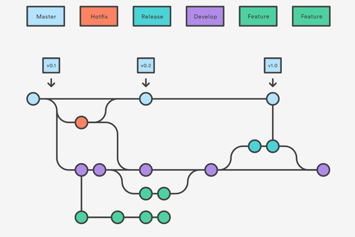

## git

###### git 托管平台介绍
* [GitHub](https://github.com/)
* [Bitbucket](https://bitbucket.org/)
* [coding](https://coding.net)
* [oschina](http://git.oschina.net/)
* [阿里云](code.aliyun.com)
* [csdn](https://code.csdn.net/)
* [Gitflow Workflow](https://www.atlassian.com/git/tutorials/comparing-workflows)
* [A successful Git branching model](http://nvie.com/posts/a-successful-git-branching-model/)
* [Git分支管理策略](http://www.ruanyifeng.com/blog/2012/07/git.html)

#### A successful Git branching model
GIT，在技术层面上，绝对是一个无中心的分布式版本控制系统，但在管理层面上，我建议你保持一个中心版本库。

###### 主分支  
* 建议一个中心版本库(我们叫它`origin`)至少包括两个分支，即“主分支(`master`)”和“开发分支(`develop`)”
* 要确保：团队成员从主分支`(master`)获得的都是处于可发布状态的代码，而从开发分支(`develop`)应该总能够获得最新开发进展的代码。

###### 辅助分支  
* 在一个团队开发协作中，我建议，要有“辅助分支”的概念。
* “辅助分支”，大体包括如下几类：“管理功能开发”的分支、“帮助构建可发布代码”的分支、“可以便捷的修复发布版本关键BUG”的分支，等等。
* “辅助分支”的最大特点就是“生命周期十分有限”，完成使命后即可被清除。
* 我建议至少还应设置三类“辅助分支”，我们称之为“`Feature branches`”，“`Release branches`”，“`Hotfix branches`”。

至此，我们形成了如下这张最重要的组织图，包含了两个粗体字分支（`master`/`develop`）和三个细体字分支（`feature`/`release`/`hotfixes`）。
    

###### Feature branches  
* “`Feature branches`”，起源于`develop`分支，最终也会归于`develop`分支。
* “`Feature branches`”常用于开发一个独立的新功能，且其最终的结局必然只有两个，其一是合并入“`develop`”分支，其二是被抛弃。最典型的“`Fearture branches`”一定是存在于团队开发者那里，而不应该是“中心版本库”中。

创建“Feature branches”：
```shell
git checkout -b myfeature develop   ## 切换到新分支 “myfeature”
## 在 “myfeature” 完成开发
git checkout devleop                ## 切换到分支 "develop"
git merge --no-ff myfeature         ## 合并分支
git branch -d myfeature             ## 删除分支 “myfeature”
git push origin develop             ## 推送分支 "develop"
```
>`--no-ff`，即not fast forward，其作用是：要求`git merge`即使在fast forward条件下也要产生一个新的`merge commit`
>（此处要求采用`--no-ff`的方式进行分支合并，其目的在于，希望保持原有“`Feature branches`”整个提交链的完整性）  

###### Release branch  
* “Release branch”，起源于`develop`分支，最终归于“`develop`”或“`master`”分支。这类分支建议命名为“`release-*`”
* “`Relase branch`”通常负责“短期的发布前准备工作”、“小bug的修复工作”、“版本号等元信息的准备工作”。与此同时，“`develop`”分支又可以承接下一个新功能的开发工作了。
* “`Release branch`”产生新提交的最好时机是“`develop`”分支已经基本到达预期的状态，至少希望新功能已经完全从“`Feature branches`”合并到“`develop`”分支了。

创建“Release branches”：
```shell
git checkout -b release-1.2 develop             ##
./bump-version.sh 1.2                           ##
git commit -a -m "Bumped version number to 1.2" ##
```
>`bump-version.sh` 脚本用于将代码所有涉及版本信息的地方都统一修改到`1.2`，另外，需要用户根据自己的项目去编写适合的`bump-version.sh`  

在一段短时间内，在“Release branches”上，我们可以继续修复bug。在此阶段，严禁新功能的并入，新功能应该是被合并到“`develop`”分支的。

经过若干bug修复后，“Release branches”上的代码已经达到可发布状态，此时，需要完成三个动作：第一是将“Release branches”合并到“`master`”分支，第二是一定要为`master`上的这个新提交打TAG（记录里程碑），第三是要将“Release branches”合并回“`develop`”分支。
```shell
git checkout master
git merge --no-ff release-1.2
git tag -a 1.2
git checkout develop
git merge --no-ff release-1.2
git branch -d release-1.2
```
（使用-u/-s/-a参数会创建tag对象，而非软tag）  

###### Hotfix branches  
* “Hotfix branches”源于“master”，归于“`develop`”或“`master`”，通常命名为“`hotfix-*`”
* “Hotfix branches”类似于“Release branch”，但产生此分支总是非预期的关键BUG。
* 建议设立“Hotfix branches”的原因是：希望避免“`develop`分支”新功能的开发必须为BUG修复让路的情况。

建立 “Hotfix branches”：
```shell
git checkout -b hotfix-1.2.1 master
./bump-version.sh 1.2.1
git commit -a -m "Bumpt version to 1.2.1"
## （然后可以开始问题修复工作）
git commit -m "Fixed severe production problem"  ## 问题修复后，进行第二次提交
```

BUG修复后，需要将“Hotfix branches”合并回“`master`”分支，同时也需要合并回“`develop`”分支，方法是：
```shell
git checkout master
git merge --no-ff hotfix-1.2.1
git tag -a 1.2.1
git checkout develop
git merge --no-ff hotfix-1.2.1
git branch -d hotfix-1.2.1
```

可以将组织图图打印出来，贴在写字台的墙壁上，随时参考。

###### git-flow
git-flow主要有5中分支：`master`、`hotfix`、`release`、`develop`、`feature`。  
  
* `feature`分支开始于`develop`分支，完成以后合并到`develop`分支。
* 当完成一定数量`feature`分支以后，从`develop`再开一个`release`分支出来，这些特性将被更行到下一个发布的版本中，之后的`feature`将不会被合并到`release`中。
* 之后在`release`分支中，只修改bug，然后完成`release`分支。完成release分支会完成以下三个操作：
  1. 合并`release`分支到`master`；
  2. 给`master`打上版本的标签；
  3. `release`回归到`develop`分支。
* 当发现`master`上有bug时，开一个`hotfix`，完成后合并到`master`分支。

基本的开发流程就是这样，不清楚的可以看看文档[Gitflow Workflow](https://www.atlassian.com/git/tutorials/comparing-workflows)


#### 清理历史记录
* [rtyley/bfg-repo-cleaner](https://github.com/rtyley/bfg-repo-cleaner)
* [清除git的历史提交](http://openfibers.github.io/blog/2015/03/04/use-bfg-to-clean-big-blog-in-git/)
* [git清除历史记录 并创建新项目](http://blog.csdn.net/wlchn/article/details/52470670)

###### 清除特定文件
```bash
git filter-branch --index-filter 'git rm -r --cached --ignore-unmatch path/to/your/file' HEAD
git filter-branch --force --index-filter 'git rm --cached --ignore-unmatch path/to/your/file' --prune-empty --tag-name-filter cat -- --all
## 以强制覆盖的方式推送你的repo
git push origin master --force
## 清理和回收空间
rm -rf .git/refs/original/
git reflog expire --expire=now --all
git gc --prune=now
git gc --aggressive --prune=now
```

###### Git清除历史记录 并创建新项目
```bash
# remove all history
rm -rf .git

# reconstruct the Git repo with only the current content
git init
git add .
git commit -m "Initial commit"

# push to GitHub.
git remote add origin <github-uri>
git push -u --force origin master
```


#### 多个github帐号的SSH key切换

创建 ssh key
```
ssh-keygen -t rsa -C "wangwg2@msn.com"        (id_rsa_wangwg2)
ssh-keygen -t rsa -C "wang.wgw@gmail.com"     (id_rsa_wgw)
ssh-keygen -t rsa -C "hhk2go@163.com"         (id_rsa_163)
```


`~/.ssh/config` 文件
```bash
# 该文件用于配置私钥对应的服务器
# Default github user(wangwg2@msn.com)
Host github.com
  HostName github.com
  User git
  IdentityFile ~/.ssh/id_rsa

# 建一个github别名，新建的帐号使用这个别名做克隆和更新
# github user (wangwg2@msn.com)
Host github1
  HostName github.com
  User git
  IdentityFile /home/wangwg/.ssh/id_rsa_wangwg2

# github user(hhk2go@163.com)
Host github2
  HostName github.com
  User git
  IdentityFile /home/wangwg/.ssh/id_rsa_163

# github user(wang.wgw@gmail.com)
Host githubx
  HostName github.com
  User git
  IdentityFile /home/wangwg/.ssh/id_rsa_wgw
```

其规则就是：从上至下读取config的内容，在每个Host下寻找对应的私钥。这里将GitHub SSH仓库地址中的 `git@github.com`替换成新建的Host别名如：`github1`.
那么原地址是：`git@github.com:wangwg2/learngit.git`，替换后应该是：`github1:wangwg2/learngit.git`.


测试
```
ssh -T git@github.com
ssh -T git@github1
ssh -T git@github2

git clone github1:wangwg2/learngit.git
git clone github2:hhk2go/gitdemo.git
```


###### github/wangwg2
`.git/config` (https://github.com/wangwg2/gitdemo)
```
[core]
    repositoryformatversion = 0
    filemode = false
    bare = false
    logallrefupdates = true
[remote "origin"]
    url = github1:wangwg2/gitdemo.git
    fetch = +refs/heads/*:refs/remotes/origin/*
[branch "master"]
    remote = origin
    merge = refs/heads/master
```

###### github/hhk2go
`.git/config` (https://github.com/hhk2go/gitdemo)
```
[core]
    repositoryformatversion = 0
    filemode = false
    bare = false
    logallrefupdates = true
[remote "origin"]
    url = github2:hhk2go/gitdemo.git
    fetch = +refs/heads/*:refs/remotes/origin/*
[branch "master"]
    remote = origin
    merge = refs/heads/master
```

###### github/deckerws
`.git/config` (https://github.com/deckerws/gitdemo)
```
[core]
    repositoryformatversion = 0
    filemode = false
    bare = false
    logallrefupdates = true
[remote "origin"]
    url = githubx:deckerws/gitdemo.git
    fetch = +refs/heads/*:refs/remotes/origin/*
[branch "master"]
    remote = origin
    merge = refs/heads/master
```
