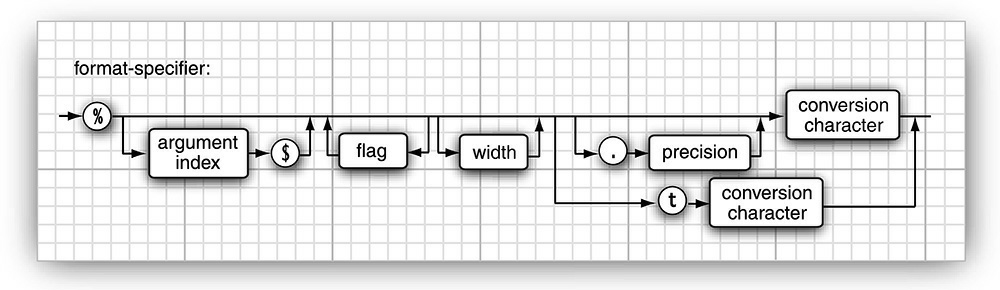

## Core Java

## 1. Java 程序设计概述
* Java程序设计平台
* Java "白皮书" 的关键术语
* Java 与 Internet
* Java 发展简史
* 关于Java的常见误解
* 相比`C++`：无头文件、指针运算、结构、联合、操作符重载、虚基类。

## 2. Java 程序设计环境
* 安装 Java 开发工具箱
* 选择开发环境
* 使用命令行工具
* 使用集成开发环境
* 运行图形化应用程序
* 建立并运行applet

<!-- pagebreak -->
## 3. Java基本的程序设计结构
#### 一个简单的Java应用程序
* Java 大小写敏感；
* 执行 `java ClassName` 时，Java虚拟机从指定类的`main`方法开始执行；
* `main()` 方法必须声明为`public`;
  ```java
  public class ClassName {
    public static void main(String[] args) {
        // program statements
    }
  }
  ```
* `main`方法没有给操作系统返回`退出代码`; `main`方法正常退出，返回`0`;
  需要终止程序时返回其他代码，使用 `System.exit`方法。

#### 注释
* 三种形式：`/* */`, `//`, `/** */`
* `/** */`可以自动生成文档

#### 数据类型
* 8种基本类型(primitive types)：`byte`、`short`、`int`、`long`、`float`、`double`、`char`、`boolean`；
* 除了基本类型和枚举类型（enumeration type），剩下的都是引用类型（reference type）。`String` 不是基本类型。
* 整型用于表示没有小数部分的数值，允许是负数。4种整型：`byte`、`short`、`int`、`long`。 长整型有后缀`L`;
* 三个特殊浮点类型常量：`Double.POSITIVE_INFINITY`, `Double.NEGATIVE_INFINITY`, and `Double.NaN`
  ```java
  if (x == Double.NaN)  // is never true
  if (Double.isNaN(x))  // check whether x is "not a number"
  ```
* `float`类型的数值后面有`F`后缀，没有后缀`F`的浮点数值默认为`double`类型；
  ```java
  float f=3.4;          // 错误
  float f=3.4F;         // ok
  float f=(float)3.4;   // 强制转换
  double d=3.4;         // ok
  double d=3.4D;        // ok
  ```
* Java中，char 类型用UTF-16编码描述一个代码单元；
* `boolean`与整型不能互相转换；
* 自动装箱/拆箱机制
  原始类型: `boolean`，`char`，`byte`，`short`，`int`，`long`，`float`，`double`
  包装类型：`Boolean`，`Character`，`Byte`，`Short`，`Integer`，`Long`，`Float`，`Double`
* 基于效率原因，一般不建议使用包装类型；

#### 变量
* Java不区分变量的声明与定义；
* 使用 `final` 关键字声明常量: `final double CM_PER_INCH = 2.54;`
* `const`是Java保留字，未使用；
* 声明变量之后，必须用负责语句初始化，使用未初始化变量报错；

#### 运算符
* **算数运算符**：`+`、`-`、`*`、`/`; 取余 `%`; 整数除`0`异常，浮点数除`0`得到无穷大或`NaN`;
  `x += 4;` 即 `x = x + 4;`
* `strictfp`关键字标记的方法采用严格的浮点计算产生理想结果；
* **自增自减运算符**: `++`、`++`
  ```java
  int m = 7;
  int n = i;
  int a = 2 * ++m;    // a：16，m: 8
  int b = 2 * n++;    // b：14，n: 8
  ```
* **关系运算符**: `==`，`!=`, `<`, `>`, `<=`, `>=`
  逻辑运算 与 `&&`，或 `||`； 按`短路`方式求值；
  支持三元操作：`condition ? expression1 : expression2`
* **位运算符**：与 `&`、或 `|`、异或 `^`, 非 `~`
  位运算符应用于 `Boolean`,结果也是 `Boolean`,不按`短路`方式计算。
  `>>` 和 `<<` 运算符将二进制位进行右移或左移。
  `>>>`高位用`0`填充，`>>`用符号位填充高位，没有`<<<`运算符；
* **数学函数与常量**：`Math`类中包含各种数学函数,`Math.sqrt(x)`,`Math.pow(x,a)`,...    
  常量：`Math.PI` 与 `Math.E`；
  `Math`类与`StrictMath`类；性能还是完全可预测结果?
  静态导入 `import static java.lang.Math.*` 可避免在数学函数与常量前加 `Math.`前缀；
* **数值之间的转换** 合法转换考虑是否损失精度。
  不损失精度(`byte` -> `short` -> `int` -> `long`; `int` -> `double`);
  可能损失精度(`int` -> `float`; `long` -> `double`);
  二元操作符，先将两个数值转换位同一类型，在进行计算：
  `double` -> `float` -> `long` -> `int`
* **强制转换**
  `double x = 9.997;`
  `int nx = (int) x;`
* 示例
  ```java
  int n = 123456789;
  float f = n;        // f is 1.23456792E8

  double x = 9.997;
  int nx = (int) x;

  double x = 9.997;
  int nx = (int) Math.round(x);
  ```
* **符号与运算优先级**
  `[]` `.` `()` 方法调用;
  `!` `~` `++` `--` `+`(一元运算) `-`(一元运算) `()`强制类型转换 `new`
  `*` `/` `%` `+` `-` `<<` `>>` `>>>` `<` `<=` `>` `>=` instanceof `==` `！=`
  `&` `^` `|` `&&` `||` `?:`
  `=` `+=` `-=` `*=` `/=` `%=` `&=` `|=` `^=` `<<=` `>>=`  `>>>=`
* **枚举类型**
  `enum Size { SMALL, MEDIUM, LARGE, EXTRA_LARGE };`
  `Size z = Size.MEDIUM;`

#### 字符串
* Java字符串就是`Unicode`字符序列，没有内置的字符串类型；提供预定义类 `String`；
* **子串** `String newName = strName.Substring(0,3)`, 从0开始到3为止，不包括3;
* **拼接** `String newString = string1 + string2;`
* **不可变字符串** `String`没有提供修改字符串的方法；编译器可让字符串共享；
  可修改字符串变量，让它引用别的字符串；
* **检测字符串是否相等** `s.equals(t);`; 如`"hello".equals(greeting)`;
  不用`==`检测字符串相等；
* **代码点与代码单元**
  `greeting.length()`返回代码单元数量；`greeting.codePointCount(0,greeting.length())`代码点数量；
  返回代码单元`charAt(int index);` 返回代码点 `int codePointAt(int index);`
  使用`UTF-16`表示`😀`需要两个代码单元。 `Hello你好😀` 代码单元数量 `9`, 代码点数量 `8`；
* **字符串API** String类包含了50多个方法；
* 阅读联机文档了解标准库
* **构建字符串** 字符串串联每次需要创建对象，效率较低。使用`StringBuilder`构建字符数。
  `append(str)`添加内容，需要构建时调用`toString()`方法得到`String`对象；

#### 输入输出
* **读取输入**  `Scanner`, `Console`;
  ```java
  Scanner in = new Scanner(System.in);
  String Name = in.nextLine();      // 一行， 可包含空格
  String firstName = in.next();     // 读一个单词
  int age = in.nextInt();           // 读一个单词

  // 控制台取密码
  Console cons = System.console();
  String username = cons.readLine("User name: ");
  char[] passwd = cons.readPassword("Password: ");
  ```
* **格式化输出** `System.out.printf`方法。沿用`C`语言函数库中`printf`方法；
      
  `System.out.printf("%,8.2f", x);`
* **文件输入输出** 用`Path`对象构造一个`Scanner`对象。
  ```java
  Scanner in = new Scanner(Paths.get("myfile.txt"), "UTF-8");
  PrintWriter out = new PrintWriter("myfile.txt", "UTF-8");
  ```

#### 控制流程
* **块作用域**  `{ }`, 不能在嵌套的两个块中声明同名的变量。
* **条件语句** `if (condition)  { statement1;  statement2; }`
  `if (condition) statement1 else statement2`语句，`else`可选; `else`子句与相邻的`if`构成一组；
* **循环**
  `while (condition) statement`
  `do statement while (condition)`
* **确定循环** `for`
  `for (int i = 1; i <= 10; i++) System.out.println(i);`
  `for`循环语句内部定义的变量不能在循环体外使用；
* **多重选择** `switch`
  从匹配的`case`开始执行直到遇到`break`语句，无匹配`case`, 执行`default`子句；
  `case`标签必须为：整数，枚举常量 或 字符串(Java 7);
* **中断控制流程语句**
  `break`中断循环；
  带标签的`break`;  只能跳出语句块，不能跳入语句块；
  `continue` 中断正常控制流程，将控制转移到最内层循环的首部；
  带标签的`continue`，跳到与标签匹配的循环首部；

#### 大数值
* `java.math`包中有两个类 `BigInteger`和`BigDecimal`

#### 数组
* **数组** 声明创建 `int[] a = new int[100];`
* **for earch** 循环 `for (variable: collection) statement`
  `for (int element: a) System.out.println(element);`
* **数组初始化以及匿名数组**
  `int[] anonymous = { 17, 19, 23, 29, 31, 37 };`
  Java中允许数组长度为`0`; `new elementType[0]`;
* **数组拷贝**
  数组变量拷贝给另一个数组变量，两个变量引用同一数组；
  将一个数组的值拷贝到新数组中，使用`Arrays.copyOf(a,length)`方法；
* **命令行参数**
* **数组排序** `Arrays.sort(a)`
* **多维数组** 使用多个下标访问数组元素；
  二维数组的每个元素都是一个一维数组，这些数组不一定都是等长的。
  ```java
  int[][] a = { {1,2,3}, {4,5,6} };
  for (int[] row : a) {
    for (int value : row)
      System.out.printf("%4d", value);
    System.out.println(value);        
  }
  ```
* **不规则数组**
  Java 实际上没有多维数组，只有一维数组，多维数组被解释为“数组的数组”；
  使用 `new double[10][6]`自动循环创建数组;但需要不规则数组时，只能单独创建行数组；
  ```java
  int[][] odds = new int[NMAX + 1][];
  for (int n = 0; n <= NMAX; n++)
     odds[n] = new int[n + 1];
  ```

<!-- pagebreak -->

## 4. 对象与类
#### 面向对象程序设计概述
* **类**：类是构造对象的模板，对象是类的实例；所有类源自`Object`类；类的扩展；

* **对象**：行为、状态、标识
* **识别类**：“名词与动词原则”
* **类的关系**：依赖(`uses-a`)、聚合(`has-a`)、继承(`is-a`)。
  ```plantuml
  @startuml
  interface Interface
  Interface <|.. ClassA
  ClassA <|-- ClassA01
  Class04 *-- Class05
  Class06 o-- Class05
  Class06 <.. Class08
  Class06 <-- Class09
  Class10 -- Class09
  @enduml
  ```

#### 使用现有类
* **对象和对象变量** 要想使用对象，就必须首先构造对象，并指定其初始状态；
  构造器名称与类名相同；
  ```java
  new Date();                       //
  System.out.println(new Date());   // 将对象传递给一个方法；
  String s = new Date().toString(); // 可以将方法应用于刚创建的对象上
  ```
  对象变量并没有实际包含对象，仅仅引用一个对象；
* **更改器方法与访问器方法**
  对实例域做出修改的方法成为更改器方法，仅访问实例域而不修改的方法被称为访问器方法；

#### 用户自定义类
* **一个 `Employee` 类**
  最简单的类的形式：
  ```java
  class ClassName {
    // instance fields
    // constructors
    // methods
  }
  ```
  `Employee` 类：
  ```java
  class Employee {
    // instance fields
    private String name;
    private double salary;
    private LocalDate hireDay;

    // constructor
     public Employee(String n, double s, int year, int month, int day) {
      name = n;
      salary = s;
      hireDay = LocalDate.of(year, month, day);
    }

    // a method
    public String getName() {
       return name;
    }

    // more methods
    //  ...
  }  
  ```
* **多个源文件的使用** 一个源文件可以包含多个类，或 每个类存在一个单独的源文件；
* **解析 `Employee` 类**
  一个构造器和4个方法；
  `public`,`private` 为访问级别（共4种）；
* **从构造器开始**
  每个类可以有一个以上的构造器；
  构造器可以有0，1，或1个以上的参数；
  构造器没有返回值；
  构造器总是伴随着`new`操作一起调用；
* **隐式参数 和 显示参数**
  `this` 表示隐式参数，显示参数是明显列在方法声明中的显示参数；
* **封装的优点**
  实例域：私有的数据域；公有的域访问器方法；公有的域更改器方法；
  可以改变内部实现，除类的方法外，不影响其他代码；
  更改器方法可以执行错误检检查，直接赋值不会；
* **基于类的访问权限** 一个方法可以访问所属类的所有对象的私有数据；
* **私有方法** 可能希望将一个计算代码划分成若干独立的辅助方法，通常这些辅助方法和当前实现机制联系紧密，这样的方法最好被设计为`private`；
* **`final` 实例域** 构造对象必须初始化这样的域，后续不能进行修改；
  `final`修饰符大都应用于 基本数据类型域 或 不可变类的域(`String`);

#### 静态域和方法
* **静态域**(也称`类域`)；如果将域定义为 `static`，每个类中只有一个这样的域。
* **静态常量**；静态变量使用较少，静态常量使用较多；
* **静态方法**:
* **Factory方法** 静态方法还有一个常见用途是 `factory`方法；
  不使用构造器使用`factory`方法主要原因：
  1.无法命名构造器，构造器名称必须与类名相同；
  2.当使用构造器时，无法改变所构造的对象类型；
* **main方法** 不需要使用调用静态方法；
  `main`方法是一个静态方法。`main`方法不对任何对象进行操作；启动程序时还没有任何对象；`main`方法将执行并创建程序需要的对象；
  每个类可以有一个`main`方法，这是常用于对类进行测试的技巧；

#### 方法参数
* 有“`值调用`”和“`引用调用`”两种调用方式，Java 语言总是采用"`值调用`"；
* 方法参数有两种类型：`基本数据类型` 和 `对象引用`；
* 对 `对象引用` 采用的是值传递；
* 一个方法不能修改一个基本数据类型的参数；
* 一个方法可以改变一个对象参数的状态；
* 一个方法不能实现让对象参数引用一个新的对象；

#### 对象构造
* 构造方法有独特的特征：名字必须不类名相同丏大小写敏感，而且构造方法不能声明返回值，这两个特征缺一不可。
* **重载** 如果多个方法，有相同的名字，不同的参数，便产生了重载；编译器挑选匹配具体执行哪个方法（重载解析）；
* **默认域初始化** 如果构造器中没有显示地给域赋初值，那么就会被自动地赋为默认值（数值为`0`，布尔为`false`，对象引用为`null`）；
  建议明确初始化类中的域；
* **默认构造器** 是指没有参数的构造器；
  仅当类没有任何构造器时，系统才会提供一个默认的构造器；
  默认构造器将所有的实例域设为默认值；
* **显式域初始化** 由于类的构造器方法可以重载，所以可以采用多种形式设置类的实例域的初始状态；
  在类定义种，直接将一个值赋给任何域；
  在执行构造器之前，先执行赋值操作；
* **参数名**
  参数名加前缀(如`a`);
  参数变量用同样的名字将实例域屏蔽起来；
* **调用另一个构造器**
  `this` 调用同一个类的另一个构造器；
  ```java
  public Employee(double s) {
    // calls Employee(String, double)
    this("Employee #" + nextId, s);
    nextId++;
  }
  ```
* **初始化块**
  已介绍两种初始化数据域的方法：在构造器中设置值；在声明中赋值；
  第三种：初始化块；在内的声明中，可以包含多个代码块，只要构造类的对象，这些块就会被执行；
  首先运行初始化块，然后才运行构造器的主体部分；
  ```java
  class Employee {
    private static int nextId;

    private int id;
    private String name;
    private double salary;

    // object initialization block
    {
      id = nextId;
      nextId++;
    }

    public Employee(String n, double s) {
      name = n;
      salary = s;
    }

    public Employee() {
      name = "";
      salary = 0;
    }
    // ...
  }
  ```
* 调用构造器的具体步骤：
  1)所有数据域被初始化为默认值(`0`,`false`,`null`)；
  2)按照在类中声明的次序，依次执行所有的域初始化语句和初始化块；
  3)如果构造器第一行调用了第二个构造器，则执行第二个构造器主体；
  4)执行这个构造器的主体；
* 可以使用静态初始化块
  ```java
  // static initialization block
  static
  {
    Random generator = new Random();
    nextId = generator.nextInt(10000);
  }
  ```
* **实例** (重载构造器/`this`调用另一个构造器/默认构造器/对象初始化块/静态初始化块/实例域初始化)
  ```java
  import java.util.*;

  /**
   * This program demonstrates object construction.
   * @version 1.01 2004-02-19
   * @author Cay Horstmann
   */
  public class ConstructorTest {
    public static void main(String[] args) {
      // fill the staff array with three Employee objects
      Employee[] staff = new Employee[3];

      staff[0] = new Employee("Harry", 40000);
      staff[1] = new Employee(60000);
      staff[2] = new Employee();

      // print out information about all Employee objects
      for (Employee e : staff)
        System.out.println("name=" + e.getName() + ",id=" + e.getId() + ",salary="
           + e.getSalary());
    }
  }

  class Employee {
    private static int nextId;

    private int id;
    private String name = ""; // instance field initialization
    private double salary;

    // static initialization block
    static
    {
      Random generator = new Random();
      // set nextId to a random number between 0 and 9999
      nextId = generator.nextInt(10000);
    }

    // object initialization block
    {
      id = nextId;
      nextId++;
    }

    // three overloaded constructors
    public Employee(String n, double s) {
      name = n;
      salary = s;
    }

    public Employee(double s) {
      // calls the Employee(String, double) constructor
      this("Employee #" + nextId, s);
    }

    // the default constructor
    public Employee() {
      // name initialized to ""--see above
      // salary not explicitly set--initialized to 0
      // id initialized in initialization block
    }

    public String getName() {
      return name;
    }

    public double getSalary() {
      return salary;
    }

    public int getId() {
      return id;
    }
  }
  ```
* **对象析构域 finalize 方法**
  可以为任何类添加 `finalize`方法，方法将在垃圾回收器清楚对象之前调用。
  如果某个资源需要在使用完毕后立刻关闭，那么就需要人工进行管理；

#### 包
Java允许使用包将类组织起来。标准的Java包具有一个层次结构。所有标准的java包都处于`java`和`javax`包层次中；
从编译器角度，嵌套的包之间没有任何关系；
* **类的导入** 一个类可以使用所属包中的所有类，以及其他包中的公有类；
  采用两种形式访问另一个包中的公有类:
  第一种，每个类名前添加完整的包名： `java.util.Date today = new java.util.Date();`
  第二种，使用 `import`语句：`import java.util.*;`, 然后直接使用类名，`Date today = new Date();`
  也可以 `import java.util.Date;` 导入特定类；
* **静态导入**
  `import`可导入静态方法和静态域；添加 `import static java.lang.System.*;` 语句，就可以使用`System`类的静态方法和静态域，而不必添加类名前缀；
  ```java
  import static java.lang.System.*;

  out.println("Goodby, World!");  // System.out
  exit(0);                        // System.exit
  ```
  静态导入的两个主要用途: 算术函数(`Math.sqrt/Math.pow`)，笨重的常量(`Calendar.DAY_OF_WEEK/Calendar.MONDAY`)；
  如：`sqrt(pow(x,2)) + pow(y,2)`, `if (d.get(DAY_OF_WEEK) == MONDAY)`
* **将类放入包中** 将包的名字放在源文件的开头；`package com.dsl.project`; 如无`package`语句，类就放在默认包中；
  编译器对文件进行操作，Java解释器加载类；
* **包作用域**
  如果没有指定`public`或`private`,这个部分(类、方法或变量)可以被同一个包中的所有方法访问；

#### 类路径
* 类存储在文件系统子目录中，类的路径必须与包名匹配；
* 类文件也可以存储在`JAR`文件中；
* 设置类路径： 采用`-classpath`或`cp`选项指定类路径；
* 设置 `CLASSPATH`环境变量
* `/home/user/classdir:.:/home/user/archives/archive.jar`

#### 文档注释
* `javadoc`工具由源文件生成HTML文档；
* **注释的插入** `javadoc`实用程序由：包，公有类和接口，公有的和受保护的方法，公有的和受保护的域；
* **类注释** 在`import`语句之后，类定义之前；
* **方法注释** `@param`, `@return`，`@throws`
* **域注释** 只需要对公有域建立文档
* **通用注释** `@author`，`@version`，`@since`，`@deprecated`，`@see`，
* **包与概述注释** 提供 `package.html`文件 或 `package-info.java`
* **注释的抽取**
  `javadoc -d docDirectory nameOfPackage1 nameOfPackage2 ...`

#### 类设计技巧
* 一定将数据设计为私有；
* 一定要对数据初始化；
* 不要在类中使用过多的基本数据类型；
* 不是所有的域都需要独立的域访问器和域更改器；
* 使用标准格式进行类的定义；采用如下书写顺序：公有访问特性部分；包作用域访问特性部分；私有访问特性部分；
  每一部分顺序：实例方法、静态方法、实例域、静态域；
* 将职责过多的类进行分解；
* 类名和方法名要能体现他们的职责；


<!-- pagebreak -->
## 5. 继承
利用继承，可以基于已存在的类创造新类；
#### 类、超类和子类
* `is-a`关系是继承的一个明显特征；
* 关键字`extends`表示继承；Java中所有继承都是公有继承；
  **超类**(supper class) / 基类(base class) / 父类(parent class);
  **子类**(subclass) / 派生类(derived class) / 孩子类(child class);
  在子类中，可以增加域，增加方法或覆盖超类方法；
* `supper.方法名`调用超类的方法；
  使用`supper`调用构造器的语句必须是子类构造器的第一条语句；
  如果在子类的构造器中没有显式地调用超类的构造器，则将自动调用超类默认的构造器，如超类无默认构造器则报错；
* **多态**(ploymorphism) 与 **动态绑定**(dynamic binding)。
* **继承层次** 由一个公共超类派生出来的所有类的集合成为继承层次；
  继承链：类到其祖先的路径；
* **多态**
  判断是否设计为继承关系：`is-a`，`置换法则`；
  Java中对象变量是多态的，对象变量可以引用此类的对象或此类任何子类的对象；
* **动态绑定**
  调用方法的执行过程；
  覆盖一个方法时，不能低于超类方法的可见性；
* **阻止继承：final类和方法**
  不允许扩展的类被成为`final`类；使用`final`修饰符；
  类声明为`final`,其中的方法自动成为`final`，但不包括域；
  域可以声明为`final`,构造对象后不允许改变它的值；
* **强制类型转换**  
  只能在继承层次内进行类型转换；
  在超类转换成子类前，应该使用`instanceof`进行检查： `x instanceof Manager`
  尽量少用类型转换和`instanceof`运算符；
* **抽象类** 包含一个或多个抽象方法的类必须被声明为抽象的。
  除抽象方法外，抽象类还可以包含具体数据和具体方法；
  类即使不含抽象方法，也可以将类声明为抽象的；
  抽象类不能实例化；
  ```java
  public abstract class Person {
    private String name;

    public Person(String name) {
      this.name = name;
    }

    public abstract String getDescription();

    public String getName() {
      return name;
    }
  }
  ```
* **受保护访问** `protected`
  访问修饰符：
  1)仅对本类可见 -- `private`
  2)对所有类可见 -- `public`
  3)对本包和所有子类可见 -- `protected`
  4)对本包可见 -- `默认`

#### Object: 所有类的超类
`Object`是所有类的最终祖先，如果没有明确指出超类，`Object`就是这个类的超类；
* **Equals方法** 检测一个对象是否等于另一个对象；
  `getClass`返回一个对象所属的类；两个对象属于同一个类，才可能相等；
  在子类中定义`equals`方法时，首先调用超类的`equals`方法；
* **相等测试与继承** Java规范要求`equals`方法具有下面的特性：
  `自反性`; `对称性`; `传递性`; `一致性`; 对任意非空引用`x`,`x.equals(null)`应该返回`true`;
* **HashCode方法** 散列码是由对象导出的一个整数值。
* **toString方法** 返回对象值的字符串；

#### 泛型数组列表 `ArrayList`
* `ArrayList<Employee> staff = new ArrayList<>();` 声明构造一个保存`Employee`对象的数组列表；
  `ArrayList<E>(int initialCapacity)` 用指定容量构造一个空数组列表；
  `void ensureCapacity(int capacity)` 确保数组列表在不重新分配存储情况下能够保存的元素数量；
  `int size()` 返回当前元素数量；
  `staff.trimToSize()` 将存储容量缩减到当前尺寸；
* **访问数组列表元素**
  `void set(int index, E obj)` 设置元素值；
  `E get(int index)` 获取元素值；
  `void add(int index, E obj)` 插入元素；
  `E remove(int index)` 删除元素；
* **类型化与原始数组列表的兼容性** 应该使用类型参数的数组列表，而不是原始数组列表；
  将类型化的数组列表传递给使用原始数组列表的方法，不需要类型转换，无告警；
  将原始数组列表传递给使用类型化的数组列表的方法，有警告；

#### 对象包装器和自动打包
* 每个包装器对应一个基本类型(如 `Integer` <--> `int`);
* `ArrayList<>` 不支持基本数据类型(`ArrayList<int>`)
* 对象包装器类是不可变的， 还是 `final`;
  自动打包/装箱，原始类型->对象包装器类(`int` -> `Integer`);
  自动拆包/拆箱，对象包装器类型 -> 原始类型(`Interger` -> `int`);
  打包和拆包是编译器认可的，而不是虚拟机；

#### 参数数量可变的方法

#### 枚举类
* 定义枚举类型
  `public enum Size {SMALL, MEDIUM, LARGE, EXTRA_LARGE};`
  实际上，这个声明定义的是一个类，有四个实例，在此尽量不要再构造新对象；
* 在比较两个枚举类型的值时，永远不需要调用`equals`,直接使用`==`;
* 所有枚举类型均是`Enum`类的子类；继承了这个类的许多方法。
  `toString`方法返回枚举常量名；`Size.SMALL.toString()`返回 "`SMALL`"。
* `toString`的逆方法是`valueOf`:
  `Size s = (Size) Enum.valueOf(Size.class, "SMALL");`
* 每个枚举类型都有一个静态的`values`方法；返回全部枚举值的数组；

```java
public class EnumTest {  
  public static void main(String[] args) {  
    Scanner in = new Scanner(System.in);
    System.out.print("Enter a size: (SMALL, MEDIUM, LARGE, EXTRA_LARGE) ");
    String input = in.next().toUpperCase();
    Size size = Enum.valueOf(Size.class, input);
    System.out.println("size=" + size);
    System.out.println("abbreviation=" + size.getAbbreviation());
    if (size == Size.EXTRA_LARGE)
      System.out.println("Good job--you paid attention to the _.");      
  }
}

enum Size {
  SMALL("S"), MEDIUM("M"), LARGE("L"), EXTRA_LARGE("XL");

  private Size(String abbreviation) {
     this.abbreviation = abbreviation;
  }

  public String getAbbreviation() {
    return abbreviation;
  }
  private String abbreviation;
}
```

#### 反射
放射库提供了一个非常丰富且精心设计的工具集，以便编写能够动态操纵Java代码的程序；
能够分析类能力的程序被称为反射；
* **Class类**
  `getClass()` 返回`Class`类型的实例；`Class`类的`getName()`返回类的名字；

* **捕获异常**

* **利用反射分析类的能力**
  `java.lang.reflect`包中有三个类`Field`,`Method`,`Constructor`分别用于描述类的域、方法和构造器；
* **在运行时使用反射分析对象**

* **使用反射编写泛型数组代码**
* **方法指针**
  Method类中有一个invoke方法，它允许调用包装在当前`Method`对象中的方法:
  `Object invoke(Object obj, Object ... args)`
  对于静态方法，第一个参数可以被忽略，即可以将它设置为`null`；

#### 继承设计的技巧
* 将公共操作和域放在超类；
* 不要使用受保护的域；
* 使用继承实现`is-a`关系；
* 除非所有继承的方法都有意义，否则不要使用继承；
* 在覆盖方法时，不要改变预期的行为；
* 使用多态，而非类型信息；
* 不要过多使用反射；


<!-- pagebreak -->

## 6. 接口与内部类
* 接口主要描述类具有什么功能，而并不给出每个功能的具体实现；
* 一个类可以实现一个或多个接口，并在需要接口的地方，随时使用实现了相应接口的对象；
* 克隆对象(又称深拷贝)，是指创建一个新对象，且新对象的状态与原始对象的状态相同；
* 内部类定义在一个内的内部，其中的方法可以访问包含在它们外部类的域，是一项比较复杂的技术，内部类主要用于设计具有相互协作关系的类的集合；
* 代理是一种实现任意接口的对象，是一种非常专业的构造工具，它可以用于构造系统级的工具；

#### 接口
* 接口不是类，是对类的一组需求描述
* 接口中所有方法自动的属于`public`；
* 接口不能包含实例域；
* 不能在接口中实现方法；
* **接口的特性**  
  不能实例化接口，能声明接口变量，接口变量必须引用实现了接口的类对象；
  接口可以被扩展；
  接口中可以定义常量；
  ```java
  public interface Moveable  {
    void move(double x, double y);
  }

  public interface Powered extends Moveable  {
    double milesPerGallon();
    double SPEED_LIMIT = 95; // a public static final constant
  }
  ```
* **接口与抽象类**
  每个类只能扩展一个类；
  但每个类可以实现多个接口；
  ```java
  class Employee extends Person, Comparable { /*...*/ }         // Error
  class Employee implements Cloneable, Comparable { /*...*/ }   // OK
  ```
* **静态方法(Java 8)** 允许在接口中定义静态方法；
  ```java
  public interface Path {
    public static Path get(String first, String... more) {
      return FileSystems.getDefault().getPath(first, more);
    }
    //...
  }  
  ```
* **default method (Java 8)**  
  可以为任何接口方法提供缺省实现；  
  ```java
  public interface Collection {
    int size();       // An abstract method
    default boolean isEmpty() {
      return size() == 0;
    }
    //...
  }
  ```
* **Resolving Default Method Conflicts**

####  接口示例
* **Interfaces and Callbacks**
* **The Comparator Interface**
* **Object Cloning**
*

#### 对象克隆

#### 接口与回调

#### 内部类

#### 代理
 利用代理可以在运行时创建一个实现了一组给定接口的新类；
 假设有一个表示接口的`Class`对象，它的确切类型在编译时无法知道；要想构造一个实现了这些接口的类，就需要使用`newInstance`方法或反射找出这个类的构造器。但是，不能实例化一个接口，需要在程序处于运行状态时定义一个新类。
 代理机制是一种好的解决方案。代理类可以在运行时创建全新的类，代理类能够实现指定接口。
 * 指定接口需要的全部方法；
 * `Object`类中的全部方法；
 * 一个类加载器；
 * 一个`Class`对象数组；
 * 一个调用处理器；

使用代理出于多种原因：
* 路由对远程服务器方法的调用；
* 在程序运行期间，将用户接口事件与动作关联起来；
* 为调试，跟着方法调用；


<!-- pagebreak -->
## 7. 图像程序设计
* Swing 概述
* 创建框架
* 框架定位
* 在组件中显示信息
* 2D图形
* 颜色
* 字体
* 图像

## 8. 事件处理
* 事件处理基础
* 动作
* 鼠标事件
* AWT事件继承层次

## 9. Swing用户界面组件
* Swing与模型-视图-控制器设计模式
* 布局管理概述
* 文本输入
* 选择组件
* 菜单
* 复杂的布局管理
* 对话框

## 10. 部署应用程序和applet
* JAR文件
* Java Web Start
* Applet
* 应用程序配置的存储

<!-- pagebreak -->
## 11. 异常、日志、断言和调试
#### 处理异常
#### 捕获异常
#### 使用异常机制的技巧
#### 使用断言
#### 日志
#### 调试技巧
#### 使用调试器


<!-- pagebreak -->
## 12. 泛型程序设计
#### 为什么要使用泛型程序设计
#### 简单泛型类的定义
#### 泛型方法
#### 类型变量的限定
#### 泛型代码和虚拟机
#### 约束和局限性
#### 泛型类型的继承规则
#### 通配符类型
#### 反射与泛型


<!-- pagebreak -->
## 13. 集合
#### 集合接口
#### 具体的集合
#### 集合框架
#### 算法
#### 遗留的集合

<!-- pagebreak -->
## 14. 多线程
#### 线程的概念
#### 中断线程
#### 线程属性
#### 同步
#### 堵塞队列
#### 多线程安全的队列
#### Callable 与 Future
#### 执行器
#### 同步器
#### 线程与Swing


<!-- pagebreak -->
## 1. 流与文件
* 流
* 文本输入与输出
* 读入和写出二进制数据
* ZIP文档
* 对象流与序列化
* 文件管理
* 新I/O
* 正则表达式

<!-- pagebreak -->
## 2. XML
* XML概述
* 解析XML文档
* 验证XML文档
* 使用XPath来定位信息
* 使用命令空间
* 流机制解析器
* 生成XML文档
* XSL转换

<!-- pagebreak -->
## 3. 网络
* 连接到服务器
* 实现服务器
* 可中断套接字
* 发送E-mail
* 建立URL连接

## 4. 数据库编程
* JDBC的设计
* 结构化查询语言
* JDBC配置
* 执行SQL语句
* 执行查询操作
* 可滚动和可更新的结果集
* 行级
* 元数据
* 事务
* Web和企业应用中的连接管理
* LDAP简介

## 5. 国际化
* Locales
* 数字格式
* 日期与时间
* 排序
* 消息格式
* 文本文件和字符集
* 资源包
* 一个完整的例子

<!-- pagebreak -->
## 6. 高级Swing
* 列表
* 表格
* 树
* 文本构件
* 进度指示器
* 构建组织器

## 7. 高级AWT
* 绘图操作流程
* 形状
* 区域
* 笔划
* 着色
* 坐标切换
* 剪切
* 透明与组合
* 绘图提示
* 图像读取器和写入器
* 图像处理
* 打印
* 剪贴板
* 拖放操作
* 平台集成

## 8. JavaBean构件
* 为何使用Bean
* 编写Bean的过程
* 使用Bean来构造一个应用
* Bean属性与事件的命名模式
* Bean属性的类型
* Beaninfo类
* 属性编辑器
* 定制器
* Javabean持久化

<!-- pagebreak -->
## 9. 安全
* 类加载器
* 字节码校验
* 安全管理器与访问权限
* 用户认证
* 数字签名
* 代码签名
* 加密

## 10. 分布式对象
* 客户与服务器的角色
* 远程方法调用
* RMI编程模型
* 远程方法中的参数传递
* 远程对象激活
* Web Services 与 SOAP

<!-- pagebreak -->
## 11. 脚本、编译与注释处理
* Java平台的脚本
* 编译器API
* 使用注解
* 注解语法
* 标准注解
* 源码级注解处理
* 字节码工程

<!-- pagebreak -->
## 12. 本地方法
* 从Java程序中调用C函数
* 数值参数与返回值
* 字符串参数
* 访问域
* 编码签名
* 调用Java方法
* 访问数组元素
* 错误处理
* 使用调用API
* 完整的示例：访问Windows注册表


## MISC

* 访问修饰符`public`,`private`,`protected`,以及不写（默认）时的区别
  类的成员不写访问修饰时默认为`default`。默认对于同一个包中的其他类相当于公开（`public`），对于不是同一个包中的其他类相当于私有（`private`）。受保护（`protected`）对子类相当于公开，对不是同一包中的没有父子关系的类相当于私有。
  `public` -- 当前类/同包/子类/其他
  `protected` -- 当前类/同包/子类
  `default` -- 当前类/同包
  `private` -- 当前类

* Java中的基本数据类型只有8个：`byte`、`short`、`int`、`long`、`float`、`double`、`char`、`boolean`；除了基本类型（primitive type）和枚举类型（enumeration type），剩下的都是引用类型（reference type）。`String` 不是基本类型。
* `float f=3.4;`是否正确?
  `3.4`是双精度数，将双精度型（double）赋值给浮点型（float）属于下转型,会造成精度损失，因此需要强制类型转换`float f =(float)3.4;` 或者写成`float f =3.4F;`。
* 自动装箱/拆箱机制
  原始类型: `boolean`，`char`，`byte`，`short`，`int`，`long`，`float`，`double`
  包装类型：`Boolean`，`Character`，`Byte`，`Short`，`Integer`，`Long`，`Float`，`Double`

* 列出一些你常见的运行时异常？
  `ArithmeticException`（算术异常）
  `ClassCastException` （类转换异常）
  `IllegalArgumentException` （非法参数异常）
  `IndexOutOfBoundsException` （下表越界异常）
  `NullPointerException` （空指针异常）
  `SecurityException` （安全异常）
* `final`, `finally`, `finalize` 的区别?
  `final`：修饰符（关键字）有三种用法：如果一个类被声明为final，意味着它不能再派生出新的子类，即不能被继承，因此它和abstract是反义词。将变量声明为`final`，可以保证它们在使用中不被改变，被声明为`final` 的变量必须在声明时给定初值，而在以后的引用中只能读取不可修改。被声明为`final` 的方法也同样只能使用，不能在子类中被重写。
  `finally`：通常放在`try ... catch`的后面构造总是执行代码块，这就意味着程序无论正常执行还是发生异常，这里的代码只要JVM不关闭都能执行，可以将释放外部资源的代码写在`finally`块中。
  `finalize`：Object类中定义的方法，Java中允许使用`finalize()` 方法在垃圾收集器将对象从内存中清除出去之前做必要的清理工作。这个方法是由垃圾收集器在销毁对象时调用的，通过重写 `finalize()` 方法可以整理系统资源或者执行其他清理工作。
