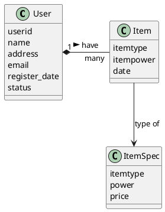

#### 性能考量

我们既然选择了Key-Value数据库，应尽量避免需要多个索引的情况。
MongoDB的索引代价很大
FindOne({_id:xxx})

`FindOne({_id:xxx},filter),filter`
`FindOne({_id:xxx},{Items:{"$slice":[3,1]}})`

**精细的使用Update**

`Update({_id:xxx},{$set:{"Items.3.Item.Health":38}});`

## MongoDB的真正性能
来源：[MongoDB的真正性能](http://www.cnblogs.com/crazylights/archive/2013/05/08/3066056.html)

**有说MongoDB慢**
* 反对：不设其他唯一索引的情况下，只用`_id` 在普通办公电脑上每秒插入几万，在普通x86服务器上每秒插入十几万，你好意思说这个性能低？比mysql强出一个数量级。
* 赞同：检索是真的慢，和sql数据库不同，越复杂的条件搜索MangoDB越吃亏，CPU和IO的双重压力。面对那些直接把SQL查询改写成MangoDB的用法，别转了，你不会收获任何性能提升。
* MongoDB领导了NoSQL运动，NoSQL请注意，我们最主要反对的就是SQL的方法论，按SQL方法使用MangoDB你只能收获失望。再想想MongoDB的设计思想：文档化。
`_id` 就是文件名，MongoDB是个文件系统。全文检索？别闹了，用文件名找文件，一个文件名对应一个文件，你绝对不会失望。

**那么MongoDB究竟应该怎么用呢？**
* 首先，忘记SQL  
  你应该忘记你学过的那些优雅无敌的SQL，不是说为了提升检索性能，扔索引就有好处。
  有一个简单的事实如下：只有一个默认的`_id` 索引，此时插入性能为`1`，你再加一个索引，插入性能约`1/2`,再加一个约`1/3` ,以此类推......  
  如果这个事实对你是很震撼的，那说明你还没有忘记SQL，接着忘。
* MongoDB的索引对插入性能有着不可忽略的拖后腿效应，  
  所以，我们应该使用且仅使用 `_id` 作为插入key，作为查询key，作为所有的那个key。

* 其次，直接忘记搜索这件事。
  把MongoDB当做你的硬盘，给他文件名去操作文件.这就是Key-Value数据库的做法，你稍加设计就能这么用。
  那么其实你所有的操作可以简化为两个指令，逻辑上 就是一个字典
  你给他_id,往字典里插一个数据，或者拿一个数据。
  Save({_id:xxx,.....})
  FindOne({_id:xxx})
  要想高性能，善用那个_id,把你原来准备当主键的那个玩意，hash成_id.
  把你原来准备的查询条件，什么？查询，拿_id来，别的全砍掉。
* 第三、这不是数据表
  记住，这不是数据表，一个_id对应的东西不是一行数据，而是一个文件。
  文件存储和表存储有什么不同呢？
  我举个例子，比如我们要存储用户列表和每个用户的道具列表。

  数据表的做法是建一张用户表，一张道具表，道具表里有个字段表示他属于哪个用户。
  然后，你就离不开万恶的查询了。
  然后如果一个用户有100条道具，100万用户意味着道具表有一亿条记录。
  这时候就开始考验你的小数据库了，但这都是过去式了，这一亿的道具，用MongoDB，根本不是个事儿
  因为MongoDB的方法是当做文件存，只设计一个用户集合，每个用户的信息是一个文件，然后这100个道具就分开存在每个用户的文件里。
  然后来比较一下，我们取得用户的记录，然后从中拿出100个道具，NoSQL方法。
  查一亿的表，找出属于某个用户的记录。

熟快熟慢？

然后你可能回想，SQL方法，我也可以搞个道具字段，把用户的100个道具用某种协议打包，然后操作啊，一样可以取得巨大的优化呀。

没错，你的想法很好，你正在用NOSQL的方式用SQL。

第四、文件存储的精华之处
如果问题止于此处，MongoDB就毫无优势可言了，如果这个方法在SQL数据库上也是如此容易使用，那还费劲搞MongoDB干什么？

我们再折腾一点，如果每个道具还要存100条转手记录，你还是可以打包，但你这个打包字段已经1M了。

于是每次存取这个打包字段都是一个系统工程了，还要负担1M的流量。

MongoDB这边呢？我们可以直接对文件的一部分进行读写，比如我只返回一个用户的第二个道具的信息，和返回第二个道具的第1~30条转手记录。

这，是一种怎样的差距啊。

你想要一张美女的照片，你朋友有，但是他只有一个压缩包，他那里没有解包工具，于是他把整个包传给了你。他想问你要一张照片，但是他没有压缩工具，为了存档需要，他让你再压进包里传给他。

这个朋友就是你的用户表的一行，如果换成真实世界的事件是多么的不可思议，这就是在一个字段里打包数据的问题。

MongoDB的一条记录就是一个脑筋更正常的朋友，你要他一张照片，他从包里找出来给你。你给他一张照片，他分门别类的放置到他的包里去。

用文件的思维去访问，MongoDB是一个更好的朋友。

审视一下你项目中的大部分的数据需求，是不是都可以用这种方式去组织呢？

如果是，加入NOSQL吧，我们的口号是：很暴力不SQL

还有什么好处
1.不用逻辑关心的水平切分

　　无需多言，对MongoDB而言，这是运维人员的工作了

2.不用对齐的数据结构

　　不用对齐意味着你不用为以前表结构变化的迁移烦恼，有些文件里有一个部分，有些没有，这对MongoDB而言，很正常。

#### 场景

使用情景
开始之前，我们先设定这样一个情景：

1.一百万注册用户的页游或者手游，这是不温不火的一个状态，刚好是数据量不上不下的一个情况。也刚好是传统MySql数据库性能开始吃紧的时候。

2.数据库就用一台很普通的服务器，只有一台。读写分离、水平扩展、内存缓存都不谈。一百万注册用户如果贡献度和活跃度都不高，恐怕公司的日子还不是那么宽裕，能够在数据库上的投资也有限。

以此情景为例，设每个用户都拥有100个道具，用户随时会获得或失去道具。

我们就来看看这一亿的道具怎么搞。

道具一般要使用原型、实例的设计方法，这个不属于数据库的范畴。

道具类型001 是屠龙刀，屠龙刀价格1500，基础攻击150，这些，我们把它们称为道具原型，保存在原型数据文件中。

这个原型数据文件，无论是存在何种数据库或者本地文件中，对服务器来说都不是问题，也不干扰数据库设计，所以我们不去讨论他。

关系数据库设计方法
典型的关系数据库设计方法：

用户表：字段 xxx userid xxx   ，记录数量100万

xxx是其他字段，userid标示用户

用户道具表：字段 xxx userid itemtype xxx ,记录数量一亿

xxx是其他字段，userid 标示

一个亿的记录数是不是看起来有点头疼，mysql这个时候就要想各种办法了。

MongoDB设计方法
但我们用mongoDB来实现这个需求，直接就没有问题

首先第一个集合：users集合，用UserName 作为_id ,记录数100万

然后道具的组织，我们有两种选择

1.在users集合的值中建立Items对象，用Bson数组保存道具(Mongo官方称为Bson，和Json一模一样的存储方法)

方法一，没有额外的记录数

2.新建userItems集合，同样用UserName作为_id 每个UserItems集合的值中建立一个Item对象，使用一个Bson数组来保存道具

方法二，多了一个集合和100万记录数

我们的道具数据看起来像下面这样:

{_id:xxx,Items:[

{Itemtype:xxx,ItemPower:xxx},

...

...

...

]}

测试方法
测试方法如下：测试客户端随机检查一个用户的道具数量，小于100加一个道具，大于100 删除一个道具。

连续100万次，采用10个线程并发。

如果用关系数据库设计方法+mysql来实现，这是一个很压力很大的数据处理需求。

可是用文档数据库设计方法+MongoDB来实现，这个测试根本算不上有压力。

注意事项
即使我们用了一个如此胜之不武的设计方式，你依然有可能还是能把他写的很慢。

因为MongoDB在接口设计上并没有很好的引导和约束，如果你不注意，你还是能把他用的非常慢。

第一个问题：Key-Value数据库可以有好多的Key，没错,但对MongoDB来说，大错特错

MongoDB的索引代价很大，大到什么程度：

1.巨大的内存占用，100万条索引约占50M内存，如果这个设计中，你一个道具一条记录，5G内存将用于索引。

我们的屌丝情景不可能给你这样的服务器，

2.巨大的性能损失，作为一个数据库，所有的东西终将被写入硬盘，没有关系数据库那样的表结构，MongoDB的索引写入性能看起来很差，如果记录数据较小的时候，你可以观测到这样震撼的景象，加一个索引，性能变成了1/2,加两个索引，性能变成了1/3。

只有当第二个索引的查询不可避免，才值得增加额外索引。因为没索引的数据，查询性能是加几个零的慢，比加索引更惨。

我们既然选择了Key-Value数据库，应尽量避免需要多个索引的情况。

所有的索引只能存在于内存中，而读取记录时，也需要将Bson在内存中处理，内存还承担着更重要的作用：读取缓存。

本来就不充裕的内存，应该严格控制我们的记录条数，能够用Bson存储的，尽量用之。

那么我们之前在MongoDB的设计中怎么还考虑第二种设计方法呢？独立一个userItems 集合，不是又多出100万条记录了吗？

这基于另两个考虑:a.Bson的处理是要反复硬盘和内存交换的，如果每条记录更小，则IO压力更小。内存和硬盘对服务器来说都是稀缺资源，至于多大的数据拆分到另一个集合中更划算，这需要根据业务情况，服务器内存、硬盘情况来测试出一个合适大小，我们暂时使用1024这个数值，单用户的道具表肯定是会突破1024字节的，所以我们要考虑将他独立到一个集合中

b.可以不部署分片集群，将另一个集合挪到另一个服务器上去。只要服务器可以轻松承载100万用户，200万还会远么？在有钱部署分片集群以前，考虑第二组服务器更现实一些。

第二个问题：FindOne({_id:xxx})就快么？

毋庸置疑，FindOne({_id:xxx})就是最直接的用Key取Value。

也的确，用Key取Value 就是我们能用的唯一访问Value的方式，其他就不叫Key-Value数据库了。

但是，由于我们要控制Key的数量，单个Value就会比较大。

不要被FindOne({_id:xxx}).Items[3].ItemType这优雅的代码欺骗，这是非常慢的，他几乎谋杀你所有的流量。

无论后面是什么 FindOne({_id:xxx})总是返回给你完整的Value,我们的100条道具，少说也有6~8K.

这样的查询流量已经很大了，如果你采用MongoDB方案一设计，你的单个Value是包含一个用户的所有数据的，他会更大。

如果查询客户端和数据库服务器不在同一个机房，流量将成为一个很大的瓶颈。

我们应该使用的查询函数是FindOne({_id:xxx},filter),filter里面就是设置返回的过滤条件,这会在发送给你以前就过滤掉

比如FindOne({_id:xxx},{Items:{"$slice":[3,1]}})，这和上面那条优雅的代码是完成同样功能，但是他消耗很少的流量

第三个问题：精细的使用Update

这和问题二相对的，不要暴力的FindOne，也尽量不要暴力的Update一整个节点。虽然MangoDB的性能挺暴力的，IO性能极限约等于MongoDB性能，暴力的Update就会在占用流量的同时迎接IO的性能极限。

除了创建节点时的Insert或者Save之外，所有的Update都应该使用修改器精细修改.

比如Update({_id:xxx},{$set:{"Items.3.Item.Health":38}});//修改第三把武器的健康值

至于一次修改和批量修改，MongoDB默认100ms flush一次(2.x),只要两次修改比较贴近,被一起保存的可能性很高。

但是合并了肯定比不合并强，合并的修改肯定是一起保存，这个也要依赖于是用的开发方式，如果使用php做数据客户端，缓存起来多次操作合并了一起提交，实现起来就比较复杂。

注意以上三点，一百万注册用户并不算很多，4G内存，200G硬盘空间的MongoDB服务器即可轻松应对。性能瓶颈是硬盘IO，可以很容易的使用Raid和固态硬盘提升几倍的吞吐量。不使用大量的Js计算，CPU不会成为问题，不要让索引膨胀，内存不会成为问题。你根本用不着志强的一堆核心和海量的内存，更多的内存可以让缓存的效果更好一些，可是比读写分离还是差远了。如果是高并发时查询性能不足，就要采用读写分离的部署方式。当IO再次成为瓶颈时，就只能采用集群部署MongoDB启用分片功能，或者自行进行分集合与key散列的工作。
