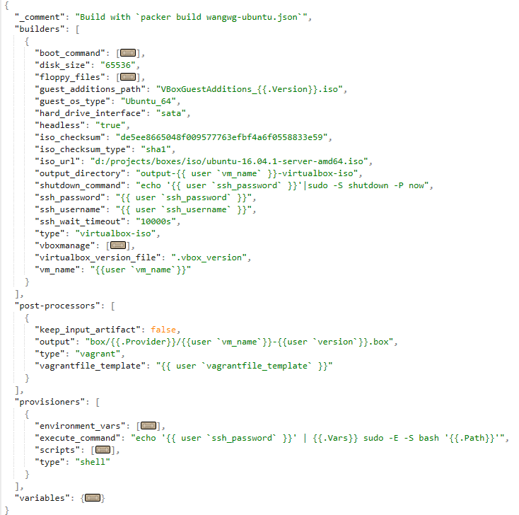

## packer

参考资料
* [mwrock/packer-templates](https://github.com/mwrock/packer-templates)
* [Hyper-V Builder (from an ISO)](https://www.packer.io/docs/builders/hyperv-iso.html)

#### Hyper-V Vagrant Box

```json
{
  "type": "hyperv-iso",
  "iso_url": "http://releases.ubuntu.com/12.04/ubuntu-12.04.5-server-amd64.iso",
  "iso_checksum": "769474248a3897f4865817446f9a4a53",
  "iso_checksum_type": "md5",
  "ssh_username": "packer",
  "ssh_password": "packer",
  "shutdown_command": "echo 'packer' | sudo -S shutdown -P now"
}
```


#### 概述

Packer 从单一配置来源为多平台创建相同的机器映像的开源工具。Packer 本身用Go语言开发。

特点：轻量级、主要操作系统支持、高性能、并行创建。

镜像支持多种平台：Amazon EC2 (AMI)、Azure、DigitalOcean、Docker、Google Compute Engine、OpenStack、Parallels (PVM)、QEMU、VirtualBox (OVF)、VMware (VMX)。

使用Packer的优势：多供应商迁移、改善稳定性、更大的可测试性
* Multi-provider portability 多供应商迁移
* Improved stability 改善稳定性
* Greater testability 更大的可测试性

#### 安装使用
1. 安装：提供二进制文件，安装简单，单一文件。确认 packer --version
2. 创建模板文件（JSON格式的文件，用来描述要构建的镜像信息）。
3. 创建镜像：packer build template_filename.json

#### Packer命令
```
usage: packer [--version] [--help] <command> [<args>]

Available commands are:
    build       build image(s) from template
    fix         fixes templates from old versions of packer
    inspect     see components of a template
    push        push a template and supporting files to a Packer build service
    validate    check that a template is valid
    version     Prints the Packer version

Usage: packer build [options] TEMPLATE

  Will execute multiple builds in parallel as defined in the template.
  The various artifacts created by the template will be outputted.

Options:

  -color=false               Disable color output (on by default)
  -debug                     Debug mode enabled for builds
  -except=foo,bar,baz        Build all builds other than these
  -force                     Force a build to continue if artifacts exist, deletes existing artifacts
  -machine-readable          Machine-readable output
  -on-error=[cleanup|abort|ask] If the build fails do: clean up (default), abort, or ask
  -parallel=false            Disable parallelization (on by default)
  -var 'key=value'           Variable for templates, can be used multiple times.
  -var-file=path             JSON file containing user variables.
```


#### Template 模板文件
一个JSON格式的模板（Template）文件，用来描述要构建的镜像信息。

**Template 结构**
* `builders` (required)  定义用于创建机器镜像的一个或多个要被构建的对象；
* `description` (optional)  模板的说明仅在 inspect 命令中输出；
* `min_packer_version` (optional)  Packer最小版本要求；
* `post-processors` (optional)  post-processors定义；
* `provisioners` (optional) 预安装与配置软件定义；
* `variables` (optional) 变量定义；
* Comments 注释：JSON 不支持注释。可以使用顶层KEY加"_"前缀。




```json
{
  "_comment": "Build with `packer build wangwg-ubuntu.json`",
  "builders": [
    {
      "boot_command": [...],
      "disk_size": "65536",
      "floppy_files": [ ...],
      "guest_additions_path": "VBoxGuestAdditions_{{.Version}}.iso",
      "guest_os_type": "Ubuntu_64",
      "hard_drive_interface": "sata",
      "headless": "true",
      "iso_checksum": "de5ee8665048f009577763efbf4a6f0558833e59",
      "iso_checksum_type": "sha1",
      "iso_url": "d:/projects/boxes/iso/ubuntu-16.04.1-server-amd64.iso",
      "output_directory": "output-{{ user `vm_name` }}-virtualbox-iso",
      "shutdown_command": "echo '{{ user `ssh_password` }}'|sudo -S shutdown -P now",
      "ssh_password": "{{ user `ssh_password` }}",
      "ssh_username": "{{ user `ssh_username` }}",
      "ssh_wait_timeout": "10000s",
      "type": "virtualbox-iso",
      "vboxmanage": [...],
      "virtualbox_version_file": ".vbox_version",
      "vm_name": "{{user `vm_name`}}"
    }
  ],
  "post-processors": [
    {
      "keep_input_artifact": false,
      "output": "box/{{.Provider}}/{{user `vm_name`}}-{{user `version`}}.box",
      "type": "vagrant",
      "vagrantfile_template": "{{ user `vagrantfile_template` }}"
    }
  ],
  "provisioners": [
    {
      "environment_vars": [...],
      "execute_command": "echo '{{ user `ssh_password` }}' | {{.Vars}} sudo -E -S bash '{{.Path}}'",
      "scripts": [...],
      "type": "shell"
    }
  ],
  "variables": {...}
}
```

说明：
* Provision： Packer支持自动在镜像中预安装软件。
* Post-Processor：可以将之前的构建转换为一个新的。Vagrant post-processors可以将部件转换到Vagrant 的box文件。在template中加入 "post-processors"定义。

**boot_command**  
boot_command 配置非常重要。定义镜像第一次启动安装OS的按键和命令。boot_command  和要安装的OS相关。
* For Ubuntu/Debian it is called preseeding, for Red Hat/CentOS/SLES there are kickstart files, and other Linux distributions probably have similar features.
* Ubuntu - Automating the installation using preseeding. https://help.ubuntu.com/lts/installation-guide/i386/apb.html
* Kickstart
* Kernel Parameters. https://www.kernel.org/doc/Documentation/kernel-parameters.txt
* Packer normally uses the boot_command in conjunction with the http_directory directory. Ubuntu is booted from ISO, then Packer types in the keystrokes of boot_command and then serves a static HTTP download link with the preseed configuration to do the rest of the installation, eg. installing packages.


#### 模板文件
wangwg-ubuntu.json
```json
{
  "_comment": "Build with `packer build wangwg-ubuntu.json`",
  "builders": [
    {
      "boot_command": [
        "{{ user `boot_command_prefix` }}",
        "/install/vmlinuz noapic ",
        "initrd=/install/initrd.gz ",
        "file=/floppy/{{ user `preseed` }} ",
        "debian-installer=en_US.UTF-8 auto locale=en_US.UTF-8 kbd-chooser/method=us ",
        "hostname=vagrant ",
        "grub-installer/bootdev=/dev/sda<wait> ",
        "fb=false debconf/frontend=noninteractive ",
        "keyboard-configuration/modelcode=SKIP keyboard-configuration/layout=USA ",
        "keyboard-configuration/variant=USA console-setup/ask_detect=false ",
        "passwd/user-fullname={{ user `ssh_fullname` }} ",
        "passwd/user-password={{ user `ssh_password` }} ",
        "passwd/user-password-again={{ user `ssh_password` }} ",
        "passwd/username={{ user `ssh_username` }} ",
        "-- <enter>"
      ],
      "disk_size": "65536",
      "floppy_files": [
        "http/{{ user `preseed` }}"
      ],
      "guest_additions_path": "VBoxGuestAdditions_{{.Version}}.iso",
      "guest_os_type": "Ubuntu_64",
      "hard_drive_interface": "sata",
      "headless": "true",
      "iso_checksum": "de5ee8665048f009577763efbf4a6f0558833e59",
      "iso_checksum_type": "sha1",
      "iso_url": "d:/projects/boxes/iso/ubuntu-16.04.1-server-amd64.iso",
      "output_directory": "output-{{ user `vm_name` }}-virtualbox-iso",
      "shutdown_command": "echo '{{ user `ssh_password` }}'|sudo -S shutdown -P now",
      "ssh_password": "{{ user `ssh_password` }}",
      "ssh_username": "{{ user `ssh_username` }}",
      "ssh_wait_timeout": "10000s",
      "type": "virtualbox-iso",
      "vboxmanage": [
        [ "modifyvm", "{{.Name}}", "--memory", "512" ],
        [ "modifyvm", "{{.Name}}", "--cpus", "1" ]
      ],
      "virtualbox_version_file": ".vbox_version",
      "vm_name": "{{user `vm_name`}}"
    }
  ],
  "post-processors": [
    {
      "keep_input_artifact": false,
      "output": "box/{{.Provider}}/{{user `vm_name`}}-{{user `version`}}.box",
      "type": "vagrant",
      "vagrantfile_template": "{{ user `vagrantfile_template` }}"
    }
  ],
  "provisioners": [
    {
      "environment_vars": [
        "CLEANUP_PAUSE={{user `cleanup_pause`}}",
        "DESKTOP={{user `desktop`}}",
        "UPDATE={{user `update`}}",
        "INSTALL_VAGRANT_KEY={{user `install_vagrant_key`}}",
        "SSH_USERNAME={{user `ssh_username`}}",
        "SSH_PASSWORD={{user `ssh_password`}}",
        "http_proxy={{user `http_proxy`}}",
        "https_proxy={{user `https_proxy`}}",
        "ftp_proxy={{user `ftp_proxy`}}",
        "rsync_proxy={{user `rsync_proxy`}}",
        "no_proxy={{user `no_proxy`}}"
      ],
      "execute_command": "echo '{{ user `ssh_password` }}' | {{.Vars}} sudo -E -S bash '{{.Path}}'",
      "scripts": [
        "script-ubuntu/update.sh",
        "script-ubuntu/vagrant.sh",
        "script-ubuntu/sshd.sh",
        "script-ubuntu/virtualbox.sh",
        "script-ubuntu/minimize.sh",
        "script-ubuntu/cleanup.sh"
      ],
      "type": "shell"
    }
  ],
  "variables": {
    "boot_command_prefix": "<enter><wait><f6><esc><bs><bs><bs><bs><bs><bs><bs><bs><bs><bs><bs><bs><bs><bs><bs><bs><bs><bs><bs><bs><bs><bs><bs><bs><bs><bs><bs><bs><bs><bs><bs><bs><bs><bs><bs><bs><bs><bs><bs><bs><bs><bs><bs><bs><bs><bs><bs><bs><bs><bs><bs><bs><bs><bs><bs><bs><bs><bs><bs><bs><bs><bs><bs><bs><bs><bs><bs><bs><bs><bs><bs><bs><bs><bs><bs><bs><bs><bs><bs><bs><bs><bs><bs>",
    "cleanup_pause": "",
    "custom_script": ".",
    "desktop": "false",
    "ftp_proxy": "{{env `ftp_proxy`}}",
    "http_proxy": "{{env `http_proxy`}}",
    "https_proxy": "{{env `https_proxy`}}",
    "install_vagrant_key": "true",
    "locale": "en_US",
    "no_proxy": "{{env `no_proxy`}}",
    "preseed" : "preseed.cfg",
    "rsync_proxy": "{{env `rsync_proxy`}}",
    "ssh_fullname": "vagrant",
    "ssh_password": "vagrant",
    "ssh_username": "vagrant",
    "update": "false",
    "vagrantfile_template": "",
    "version": "1.x.{{timestamp}}",
    "virtualbox_guest_os_type": "Ubuntu_64",
    "vm_name": "wangwg-ubuntu1604"
  }
}
```


#### 示例
preseed.cfg (Ubuntu 16.04)
```
choose-mirror-bin mirror/http/proxy string
d-i base-installer/kernel/override-image string linux-server
d-i clock-setup/utc boolean true
d-i clock-setup/utc-auto boolean true
d-i finish-install/reboot_in_progress note
d-i grub-installer/only_debian boolean true
d-i grub-installer/with_other_os boolean true
d-i partman-auto-lvm/guided_size string max
d-i partman-auto/choose_recipe select atomic
d-i partman-auto/method string lvm
d-i partman-lvm/confirm boolean true
d-i partman-lvm/confirm boolean true
d-i partman-lvm/confirm_nooverwrite boolean true
d-i partman-lvm/device_remove_lvm boolean true
d-i partman/choose_partition select finish
d-i partman/confirm boolean true
d-i partman/confirm_nooverwrite boolean true
d-i partman/confirm_write_new_label boolean true
d-i passwd/root-login boolean true
d-i passwd/root-password password puppet
d-i passwd/root-password-again password puppet
d-i passwd/make-user boolean false
d-i user-setup/allow-password-weak boolean true
d-i pkgsel/include string curl gcc make nfs-common ntp openssh-server perl wget
d-i pkgsel/install-language-support boolean false
d-i pkgsel/update-policy select none
d-i pkgsel/upgrade select full-upgrade
d-i time/zone string US/Pacific
tasksel tasksel/first multiselect standard, ubuntu-server
d-i preseed/late_command string \
sed -i 's/\(GRUB_CMDLINE_LINUX_DEFAULT=\).*/\1\"\"/g' /target/etc/default/grub; \
in-target bash -c 'update-grub2'; \
in-target sed -i 's/PermitRootLogin.*/PermitRootLogin yes/g' /etc/ssh/sshd_config ; \
in-target apt-get -y upgrade
```

boot_command (Centos 7.2)
```
"boot_command": [
  "<tab> <wait>",
  "text <wait>",
  "ks=http://{{ .HTTPIP }}:{{ .HTTPPort }}/x86_64.ks <wait>",
  "<enter>"
],
```

x86_64.ks (Centos 7.2)
```
install
cdrom
lang en_US.UTF-8
keyboard us
network --bootproto=dhcp
rootpw --iscrypted $1$v4K9E8Wj$gZIHJ5JtQL5ZGZXeqSSsd0
firewall --enabled --service=ssh
authconfig --enableshadow --passalgo=sha512
selinux --disabled
timezone UTC
bootloader --location=mbr

text
skipx
zerombr

clearpart --all --initlabel
autopart

auth  --useshadow  --enablemd5
firstboot --disabled
reboot --eject

%packages --ignoremissing
@core
bzip2
kernel-devel
kernel-headers
gcc
make
net-tools
patch
perl
curl
wget
nfs-utils
-ipw2100-firmware
-ipw2200-firmware
-ivtv-firmware
%end
```
