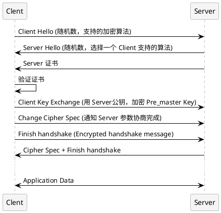
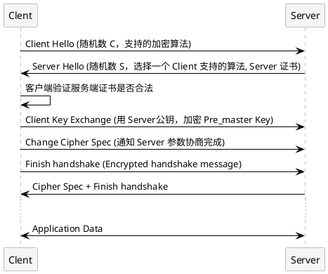

## TLS/SSL
* [图解SSL/TLS协议](http://www.ruanyifeng.com/blog/2014/09/illustration-ssl.html)

* [Announcing Keyless SSL™: All the Benefits of CloudFlare Without Having to Turn Over Your Private SSL Keys](https://blog.cloudflare.com/announcing-keyless-ssl-all-the-benefits-of-cloudflare-without-having-to-turn-over-your-private-ssl-keys/)
* [Keyless SSL: The Nitty Gritty Technical Details](https://blog.cloudflare.com/keyless-ssl-the-nitty-gritty-technical-details/)
* [What is a Digital Signature?](http://www.youdzone.com/signature.html)

###### SSL/TLS协议运行机制的概述

###### 单项认证

