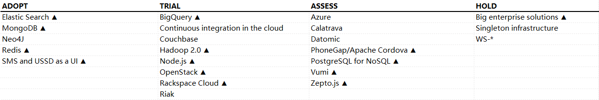
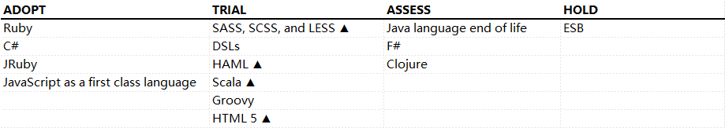
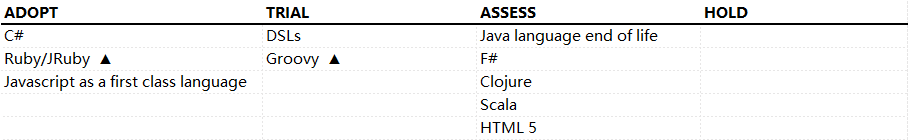

---
html:
  embed_local_images: true
  embed_svg: true
  offline: true
  toc: TECHNOLOGY RADAR
print_background: false
---

## TECHNOLOGY RADAR (2013.05 Vol 08)

#### 最新动态
* **拥抱界线下落 Embracing falling**
  不管你喜欢与否, 你周围的界线都在下降。我们通过检查“`无边界企业`”、“`云端开发环境`”和“`虚拟临场感`”等概念来接受这一选择。
  Whether you like it or not, boundaries are falling down around you. We choose to embrace this by examining concepts like `perimeterless enterprise`, `development environments in the cloud`, and `co-location by telepresence`.
* **不要错过行之有效的实践 Applying proven practices to areas that somehow missed them**
  我们不太清楚为什么, 但我们行业中的许多人都忽略了诸如 “捕获客户端 javaScript 错误”、“移动连续交付”、“NoSQL 的数据库迁移” 以及 “CSS 框架” 等想法。
  We are not really sure why, but many in our industry have missed ideas like capturing client side javaScript errors, continuous delivery for mobile, database migrations for NoSQL, and frameworks for CSS.

* **轻量级分析 Lightweight options for analytics**
  数据科学和分析不只是为那些拥有博士学位的人。我们强调协作分析和数据科学, 所有开发人员都了解基础知识, 并在必要时与专家密切合作。
  Data science and analytics are not just for people with a PhD in the field. We highlight collaborative analytics and data science, where all developers understand the basics and work closely with experts when necessary.

* **基础设施即代码 Infrastructure as code**
  持续的交付和 DevOps 提升了我们对基础设施的思考。将基础架构视为代码和对新工具的需求的影响仍在发展。
  Continuous delivery and DevOps have elevated our thinking about infrastructure. The implications of thinking about infrastructure as code and the need for new tools are still evolving.

<!-- pagebreak -->
#### 技术

多年来，团队和组织都已经看到了围绕技术学科进行专业细分的危险性。当我们就高级应用听取专家的建议时，开发人员至少应当了解用户界面，数据库和数据科学等业界新宠的基础知识。当高级应用需要深入的专业知识时，我们要在所有开发人员使用基础统计分析理论和工具的领域，推动 **协作分析与数据科学 (Collaborative analytics and data science)**，以此做出更好的决策，并在事情愈趋复杂时，开展与专家的密切合作。

技术趋势已经冲破了原本保护着企业IT网络的围墙，成为 **没有边界的企业 (Perimeterless enterprise)**。员工们频繁使用自己的消费设备通过云服务和Web API访问企业数据，而企业往往对此并不知情。随着设备不断扩散以及更多的应用程序迁移到云端，迫使企业重新考虑数据访问和网络安全的基本假设。

**在云端搭建的开发环境 (Development environments in the cloud)** 意味着开发的基础设施能够外包，开发人员只需要一台笔记本电脑和网络连接。通过组合使用最佳的服务，如GitHub的私有资料库加上云端的Snap CI持续集成环境，你的团队也许永远都不再需要为自建IT基础设施而劳神了。

廉价或免费的视频会议工具，质量正在不断改善，选择也越来越多，让分布式团队有了一种全新的工作方式。即便团队分散在各地，全天候（Always-on）视频连通也可以帮助建立一种 **虚拟的临场感 (co-location by telepresence)**。事实上，这已经成为我们部分离岸交付中心的标配。我们还看到像ScreenHero这样的屏幕共享工具已经开始被广泛用于远程结对编程。但我们也必须警惕寻找银弹消除物理上同处一地的需求，毕竟没有什么可以替代面对面沟通时所产生的相互理解和情感交流。

一旦开始使用一件全新的工具，管理不同环境的部署，或者尝试着理解应用程序的行为为何在不同环境表现各异，对应用的配置就会成为痛苦的根源。作为最小化 **应用配置(application configuration)** 的拥趸，我们正尝试去保证应用能在最小配置下能够正常工作。

多数虚拟化技术都提供了通过加载镜像启动虚拟机的方法。在构建管道中要尽早创建 **虚拟机镜像作为构建产物 (machine image as a build artifact)**, 随着它通过后续的测试套件对其进行提升，如此就能实现从测试环境到产品环境机器上的可靠部署 。此技术剔除了导致snowflake server反模式的多数原因。

**蓝绿部署 (Blue-green deployment)** 是一种执行软件升级的模式。首先，将最新版本的应用部署到一个和当前产品环境完全一样的应用栈副本中。这样，当新版本的应用通过了相应的测试并得到了业务上的许可后，访问就可以被瞬间切换这个新版本的应用上。尽管这不是一项新技术，但基础设施自动化和云端资源使它值得被重新考虑。

以前，像Chef和Puppet这样的工具都缺乏对Windows的支持，导致构建简单的基础设施自动化任务都需要大量的Powershell脚本。所以，想要使Windows到达和Unix一样的自动化水平可谓困难重重。不过在过去的一年里，Chef和Puppet对Windows的支持得到了很大改善。这种支持与强大的PowerShell相结合，使得 **Windows基础设施自动化 (Windows infrastructure automation)** 极为可行。

HTML5存储，也被称为本地存储或Web存储，是一种在现代浏览器里存储客户端数据的机制，其中也包括iOS和Android移动浏览器。 在几乎所有情况下，我们都建议使用 **HTML5存储替代cookie (HTML5 storage instead of cookies)** 。 HTML5存储最多可容纳5MB的数据，而cookie则被限制在4KB。 Cookie的数据在每一次请求中都会被发送，这会拖慢你的应用程序，并且有可能将数据暴露于不安全的HTTP连接中。 与此相反，HTML5存储只需要由浏览器来保证数据安全。 Cookie则只应该用来保存像session id这样的简单数据。

使用 **Promise进行异步编程 (promises for asynchronous programming)** 是一项古老的技术，也被称为futures。由于JavaScript在客户端和服务器端的的广泛使用，它又再次得到了关注。这项技术消除了深层嵌套回调、标志位和轮询，同时得到了像jQuery库的一等支持。如果项目涉及到非常复杂的JavaScript代码库，团队就应该利用这项技术。

**捕获客户端JavaScript错误 (Capturing client-side JavaScript errors)**，已经被我们的交付团队用来识别与浏览器或插件配置相关的影响用户体验的问题。在过去一年中，一些服务提供商业已开始对这一需求提供支持。除了将这些错误储存于应用数据存储中，一些Web应用还会将这些错误记录到网络分析工具，或像New Relic这样监测工具中，以减轻存储的需求。

随着HTML5模糊了传统本地应用和Web应用程序之间的界线，我们正开始试验 **移动设备上的持续交付 (continuous delivery for mobile devices)**。 如TestFlight服务可让你在一天内多次部署本地应用程序到实际设备上。对于全部或部分基于HTML5的应用程序，可以直接部署修改，而无需向应用商店提交一个新的应用。如果你的组织有企业内应用程序商店，就可以轻松的发布应用。我们注意到，当移动设备上的持续交付技术实现不断改进时，测试实践则相对落后。要取得成功，你需要更加专注于自动化测试，以确保应用被部署到设备上时能够正常工作。

我们越来越多的看到移动应用在开发和测试过程中工作良好，但在发布出去后却问题多多。**移动网络的移动测试（Mobile testing on mobile networks）** 揭示了应用是如何在不同条件下运行的。你可能需要测试3G，LTE，或者故意使用一个访问超载的糟糕的WiFi网络。先获取目标环境下的网络性能，然后用延迟和丢包诱导工具去模拟相同的环境。 此外，使用像Wireshark这样的工具去检测你的设备和软件到底如何使用网络，有时也是必要的。

NoSQL数据存储正继续成为主流，但团队需要充分认识到对 **迁移数据库到NoSQL (database migrations for NoSQL)** 的需求。特别是使用隐式或动态schema，你可能会随着时间的推移需要重新配置数据。这里提供了几种方法：比如在部署新版本应用时进行显式地迁移，或者通过代码在加载和处理文档时进行动态迁移。

失败的测试揭示了产品代码中的bug。然而，针对其他属性进行 **分析性测试** 则可以揭示一些有趣的信息。 一个简单的例子是监测频繁失败的测试，然后在构建管道中尽早运行它们，从而快速得到反馈。同理，跟踪其他属性，如测试执行时间和耗时测试的比例，也可以为达成快速测试提供可操作的指标。

在以前的雷达中，我们曾经建议延长自动化验收测试的周期，在我们称之为语义监控（semantic monitoring）的阶段，不断在产品环境中运行这些测试。 现在我们仍然相信，这是一项使团队可以提前预测情况的重要技术。但现在, 尤其是在初创公司中, 我们还看到这种方法的一个变体, 就是在减少测试次数的同时，增加监控与自动报警。这使关注点从避免可预见的问题转移到 **对所有问题减少平均的恢复时间 (reducing mean time to recovery)**。

虽然单元测试和验收测试被广泛接受并作为标准的开发实践，但这一趋势还没有延伸到性能测试领域。目前，常用的测试工具促使测试人员养成编写一次性代码, 对点击进行脚本化的心态。 **给予性能测试一等公民待遇 (performance testing as a first-class citizen)**，可以创造更好的测试，涵盖了更多的功能，引导出更好的工具来创建和运行性能测试，从而使得测试套件可以被维护，并能自我测试。

<!-- pagebreak -->
#### 工具

在上期的技术雷达中，我们谈到的 **嵌入式servlet容器**。如今，这已经在我们的项目中广泛采用。像 SimpleWeb 和 Webbit 这样的工具在追求简洁和嵌入式的方向上更进一步，提供了未实现 Java Servlet 规范的原生HTTP 服务器功能。同时，最流行的 Java 应用服务器 Tomcat 在嵌入式安装中应用的逐渐增多，以及微软为 .NET 框架提供的自托管服务器，都加强了这一趋势。

**D3** 作为一个用来在浏览器上创建丰富可视化效果应用的 JavaScript 库，也在持续获得更多的关注。此前，使用 D3多少 显得有点底层， 比起那些更简单更有针对性的库，它需要更多的工作量完成常用的可视化效果。自从发布了上一次技术雷达，随着诸如用于图表的 Rickshaw 以及用于在浏览器中进行数据探索的 Crossfilter 等库的出现，使得 D3 比以前更容易使用了。

我们看到一些 JavaScript 框架正在拥抱 **基于浏览器的模板化 (browser-based templating)** 的趋势，它们把更多的布局工作转移到客户端来做。虽然这种方法在很多情况下很有效，但它也会引入一些涉及缓冲、性能和搜索方面的运营问题。我们认为在使用这些工具前，需要仔细对这些工具进行评估，以确保满足目标部署环境的要求。

通过把 IObservables 和 IObservers 放到与 IEnumerables 和 IEnumerators 同等的地位上，.NET 上的响应式编程框架 Rx (**Rx for .NET**) 允许开发者通过observable事件流的通用底层抽象，使用已有的 LINQ（Language INtegrated Query） 操作符，来查询和编写异步操作和基于事件的代码。微软也发布了 RxJS 库把响应式编程的好处带到 JavaScript 中。整个 Rx 框架的开源，也使其在 Windows 富客户端应用和单页面 JavaScript 应用中发挥更大的作用。

一些 ThoughtWorks 的团队特别提到 Ruby 的 HTTP 客户端类库 **Faraday** 的实用性。它为各种适配器提供了通用的接口，并且和 **Rack** 中间件有良好的集成。

针对第三方库的包管理系统继续在所有平台上获得认可，也都在不断添加新的功能。我们最近把 **NuGet** 和 **Chocolatey NuGet** 列入到技术雷达，也证实了这个重要的敏捷工程实践的先进性。

基于Windows的基础自动化应该采用，然而仍然要比在 Unix 上进行基础设施自动化要困难得多。Chef 和 Puppet 正在增加对 Windows 基础设施自动化的支持，同时也有正在研发中的像Octopus这种专门针对 Windows 的解决方案。**Octopus** 可以在自动部署 ASP.NET 应用程序和 Windows 服务时减少对 PowerShell 的依赖。它也可以与 NuGet 和 TeamCity 一起使用，以此创建一个完整的构建、打包、部署管道。

Puppet 和 Chef 都需要处理社区针对通用服务和任务而共享的module和manifest。Puppet Forge 和 Chef的Cookbook 资料库能在一定程度上解决这个问题，但结果是人们总是复制和粘贴这些脚本到自己的代码中，这样他们就不能享受到最近的错误修正和改进的好处。**Puppet-librarian 和 Chef-librarian** 通过让你更容易地声明自己的模块依赖关系，试图解决这个问题。其做法包括从这些社区网站取得已知版本的代码。

在分布式系统上的依赖关系管理非常复杂，这也是越来越多人在迁移到细粒度的微服务（micro-services）时所需要面对的问题。来自 Netflix 的 **Hystrix** 是一个实现了处理各种下游故障模式的 Java 类库，它提供连接的实时监控、缓存和批处理机制，以更有效地管理服务间的依赖关系。

不需要应用程序商店，**TestFlight 和 HockeyApp** 让你能够管理移动应用程序的部署，让用户测试更容易。它们提供了崩溃报告和实际数据分析的能力。HockeyApp 支持 iOS、Andriod 和 Windows Phone 平台，而 TestFlight 只支持 iOS 和 Android 平台。我们已经成功地使用这两种工具来帮助移动应用程序的发布。这显然是一个快速发展的领域。

**Frank** 是一个开源库，可以使用Cucumber 编写iOS 的功能测试，并在远程设备上执行。以前在 iOS上，验收测试驱动开发非常麻烦，该库填补了一项重要的空白。

**UIAutomator** 允许测试时对用户界面组件的细粒度控制，以及为在多个设备上的测试提供帮助，因此被认为是Android 用户界面测试方面最有前途的工具。

随着具有多种外形因素和像素密度的设备的兴起，呈现全尺寸高品质图标的问题已经变得非常重要。图标字体利用浏览器对WebFonts和SVG的支持，而不是使用缩放图像或维护不同的图标集，解决了这个问题。但当大量使用 SVG 时，需要注意移动设备的功耗问题和旧设备上的性能问题。

随着我们构建的系统比以往涉及越来越多细粒度服务，分布在越来越多的机器上，如何获得集中的信息以便更方便地识别和解决问题，比以往任何时候都更具挑战。**Logstash** 已经成为一种解析和过滤日志再将它们转发到单一聚合节点的简单方法。虽然 Logstash 也提供了一些日志的搜索和过滤功能，但配合 **Graylog2** 使用，能提供更全面的日志查询和报告功能。

我们认为 **Snowplow Analytics** 在网络数据分析方面具有远大前景。它是一个开源网络分析平台，基于公开数据原则和云存储，并能从常规的网络分析中得出智能信息。

我们在 ThoughtWorks 的项目中看到对 **PhantomJS** 的兴趣，它是一个针对现实目标进行功能测试的 headless 网络测试工具。

**Gatling** 是另一个在自动化性能测试领域的新成员。它和 Locust 类似，都比传统的 JMeter 和 Grinder 更轻量级。Gatling 的DSL构建在Scala基础上，提供了易配置的数据源和响应断言等广泛的开箱即用功能。在需要个性化配置时，也可以很容易直接使用Scala 来进行扩展。通过 Highcharts 默认生成数据的各种动态视图的功能，更增加了它的吸引力。

许多已经迁移到敏捷工作方式的组织还在继续使用 **重量级的测试工具 (heavyweight testing tools)**。这些工具并不适合快速发展的软件交付。重量级测试工具较陡的学习曲线及对专业技能和培训的要求，使团队很难使用这些工具来进行测试。通常这会导致随着其他团队的加入，对于每一个版本的发布都造成不必要的开销。这些工具昂贵的软件授权费用更加剧了这个问题。一些重量级的测试工具使用“模型驱动”的方法，试图精确地对应用程序的使用模式进行建模，但软件缺陷的误报却导致测试脚本昂贵的的开发和维护代价。其实我们经常看到一些简单的开源解决方案能以少得多的时间、精力和预算，给予对所要求的软件质量的信心。

基于语言的构建工具 **Gradle** 和 **Rake** 继续提供比Ant 和 **Maven** 等基于XML和插件的构建工具更细粒度的抽象和更灵活的长期解决方案。这使得它们在项目变得更加复杂时，还能保持优雅的增长。

我们继续看到尝试使用 **TFS** 作为版本控制系统的那些团队遭遇到生产力下降的问题。那些团队在实践作为持续集成核心部分的频繁代码提交时，发现TFS重量级的方式显著降低了生产效率。这往往导致团队更少地进行代码提交，导致产生诸多问题的代码合并。我们建议使用 Git、Perforce和 Subversion。

<!-- pagebreak -->
#### 平台

**PostgreSQL** 正在逐渐成为SQL数据库中的NoSQL选择。版本9.2支持存储JSON格式的数据，并在其之上提供完备的查询功能。另外，PostgreSQL还提供了允许用户以键值对（key/value pair）的形式存储和查询数据的扩展。该扩展让你可以直接利用稳定的数据库底层存储和事务的能力， 而无需绑定在关系数据模型上.对于那些希望同时开发SQL和NoSQL应用，却又倾向于使用一套他们熟知的可靠基础设施的开发者而言，提供这一特性就再理想不过了。

网站的访问量即使再低，其产生的数据量也可能是巨大的。一旦你把各种分析结果，业务图表， 统计数据，用户资料以及对多设备的支持囊括进来，数据量可能会大到难以想象。许多组织使用数据仓库来存储从各部门收集上来的数据。这样做的挑战是数据仓库会变成一座“数据森林”。即使是获取及时的业务图表也已变成一种挑战，更别提在整个数据集上运行探索性查询了。而基于 **BigQuery** 之类的云技术对此会有帮助。它们即时付费的模式和可以运行任意查询的能力使你无需购买特殊的软硬件也能获得对数据的全面掌控。数据驱动的商业模式应该将数据送到决策者手中, 而不是隐藏在技术障碍和官僚主义中。

对于适用文档数据库模型的问题来说，**MongoDB** 是当下最流行的选择. 除了易于使用和提供高可靠性的技术实现之外，开发社区及整个生态系统对其成功也贡献良多。我们也听说了一些团队抵受不住MongoDB流行的诱惑而产生了问题，比如并不适用文档数据库的应用, 又或者团队没有充分理解其内在的复杂性。然而若能用对， MongoDB已经在很多项目中证明了自己。

**Redis** 已经在多个ThoughtWorks项目中被证明是有用的工具。它被用作结构化的缓存或者跨越多个国家的分布式数据存储。

Hadoop最初的架构基于水平扩展数据，垂直扩展元数据的模式。 尽管slave节点可以从容的进行数据的存储和处理，管理元数据的master却是瓶颈，同时也限制了规模化网络的使用。 **Hadoop 2.0** 重新设计了HDFS和Map Reduce框架的架构，以此来解决这些问题。现在，HDFS的命名空间可以通过使用同一个集群的多个name nodes来联合在一起，并且部署为高可用性(HA)模式。 MapReduce也被YARN取代了。YARN解耦了集群的资源管理和任务的状态管理，并且通过JobTracker消除了伸缩性和性能问题. 最重要的是，这些变化鼓励在Hadoop集群上开发除了MapReduce之外的分布式计算模型。

在过去的一年中，我们发现采用 **Elastic Search（弹性搜索）** 作为开源的搜索平台呈逐步上升趋势。Elastic Search基于Apache Lucene, 是一个可扩展的，多租户的， 支持水平伸缩的搜索解决方案。它允许索引复杂数据, 并可通过JSON获取。它支持从集群, 故障转移及备份中自动恢复各节点。Elastic Search可以通过基于插件系统的REST API来扩展，它提供了一个优雅的操作模型, 允许添加新功能, 或者改变现有行为。围绕着Elastic Search的社区是非常活跃的。一个证据就是已经开发出了包括Java、 C#、 Ruby 和 JavaScript 在内的多个客户端类库。

**Node.js** 是一个轻量级web容器。它在开发微服务, 移动服务端以及单页面web应用方面都是极好的选择。因为其天然的异步特性, 开发人员可以通过使用promise类库来简化应用代码。 随着在node.js社区promise应用的成熟, 我们期望看到更多为node.js开发的应用。 对那些不愿在产品环境中尝试node.js的团队, 用node.js来实现一些开发任务仍然值得考虑, 比如在浏览器之外运行JavaScript测试, 或者从类似CoffeeScript, SASS和LESS之类的工具中生成静态web内容。

**Zepto.js** 是一个轻量级的JavaScript类库。它的API与JQuery相同, 但并非100%兼容.因其压缩显著的文件大小, Zepto在开发响应式web应用方面颇有竞争力。

**PhoneGap**, 现在叫 **Apache Cordova**, 允许你使用HTML, CSS和JavaScript 来开发跨平台的移动应用。它通过一组JavaScript API对平台特定的本地代码做了抽象, 同时还保持了不同移动平台之间的一致性。Cordova支持非常多的平台, 包括iOS、Android、 Blackberry、 Windows Phone 以及 WebOS。

在云存储和云计算领域, 尽管AWS还在持续的增加功能, **Rackspace Cloud** 却悄悄发展为一名不可忽视的竞争者。部分用户会非常看重Rackspace更加周到的客户支持, 以及混合多种传统托管模型的能力。 我们并不为之而感到激动人心，因为Rackspace是我们的客户, 我们在参与该平台的开发过程中已经收获了许多乐趣。我们在另外多个客户的项目中已经成功地应用了Rackspace Cloud, 目前正期待着它能辐射到更多的地区。

开源 **OpenStack** 项目的发展可谓蒸蒸日上, 在最近几个月，它已经逐渐成为部署私有云的不二选择。 许多原来导致OpenStack难以使用以及运行不稳定的问题都得到了解决. 新功能也一直都在增加。显然，OpenStack联盟包括它的成员如Rackspace，Redhat，HP等都在不断为其添砖加瓦, 并以此作为自有的基于OpenStack的云服务基础。

在去年全球售出的手机中, 58%其实是老式的功能手机, 而非智能手机。 在很多发展中国家, 这一比例甚至更高。如果你的客户需要你为这些地区开发应用, 你需要考虑到这些限制。这些手机使用 **SMS和USSD作为用户界面 (SMS and USSD as a user interface)**。SMS是存在已久的发送消息的技术, 而USSD允许你通过安全会话来发送SMS之类的消息。你应该把SMS和USSD看做另外一个UI和UX的平台, 给予它们一等公民的待遇。

**Vumi** 是一个可伸缩的开源的消息引擎。 它在移动设备上通过一些廉价的方式来完成通信。 Vumi帮助公司和它们的客户, 医疗服务机构和它们的病人, 政府和市民, 以及更多的团队之间通过SMS , IM 和 USSD进行交互. Vumi与电信公司进行了集成, 使你能够很容易的基于它构建应用, 而你只需要向运营商支付通信费。

“企业级”商业软件包提供的功能, 和实际需要的功能之间的差距正在拉大。这对面向互联网的应用来说更是如此。那些真正能够扩展自如的创新方案, 易于支持的现代技术如持续交付等, 都是实践者写给实践者的。它们肇始于许多互联网规模的公司, 而后作为开源软件得到了提炼。**庞大的企业解决方案 (Big enterprise solutions)** 通常会阻碍高效的交付，因为这些方案经过长久累积，具有臃肿而繁琐的许可限制；它驱动出来的功能集来自于检查列表，依靠假想出来的脱离多数团队开发现实的需求。

<!-- pagebreak -->
#### 语言和框架

随着支持数据绑定、客户端模板和校验等功能的框架的蓬勃发展，单页面Web应用开发继续高歌猛进。在ThoughtWorks， 诸如 **AngularJS**、**Knockout**和 **Ember.js** 这样的 **JavaScript MV* 框架** 有着广泛的应用，且各有其倡导者和反对者。我们期望在此充满活力的领域有更多的创新。

随着基于Node.js的服务器端应用程序的持续增长，单页面应用和基于移动浏览器的应用渐渐融入主流， CoffeeScript 也因其能简化 JavaScript 代码而越来越多地得到采用。作为一种将源代码编译成 JavaScript 代码以供运行时执行的语言，**CoffeeScript** 应用程序的调试难度备受关注。CoffeeScript 1.6.1 引入了 Source Maps 以帮助开发工具生产厂商解决这个问题，同时，像Dropbox 这样的著名技术公司也开始使用 CoffeeScript，我们预计它将获得更广泛的应用。

我们在新产品中对node.js的使用越多，对可靠的 JavaScript 包管理工具的需求就越迫切。**Node Package Manager（npm）** 作为 node.js 应用的打包工具，是其生态系统的重要组成部分。对于要面对大量 JavaScript 或 CoffeeScript 代码的浏览器应用开发人员来说，应考虑使用 Require.js 组织代码结构以及在运行时装载依赖。

在客户端和服务器端，微框架正成为解决应用程序复杂度日益增加问题的新兴方式。**Sinatra** 正是这一领域的先驱，它能够使用轻量级DSL在服务器端构建快速的、易于组合的服务。其它语言也有类似的框架，例如Java平台下的Spark、Python语言的Flask、面向Scala的Sclatra、基于Clojure的Compojure 和 .NET平台下的Nancy。

在.NET平台上，构建一个多样的、开源的Web开发生态系统始终步履维艰，原因之一就是对`IIS`和`ASP.NET` 框架的过度依赖。**OWIN** 之于.NET平台，正如Rack之于Ruby 社区，它定义了一个开放的HTTP操作接口，从而将Web服务器从应用程序中解耦出来。我们为此激动不已，因为OWIN打开了一扇大门，使得在.NET平台下诞生简单的、可独立开发模块的Web开发工具成为可能。Nancy 正是一个利用这种可能性的完美例子。我们也希望它能促使人们在.NET平台下将web应用程序部署为单独的、自托管服务方面进行更多的实践。

最近发布的 **Play Framework** 2.1.1 支持控制器依赖注入、异步、非阻塞I/O、Code - Reload工作流、数据库迁移、资源管道以及灵活的部署选项，这些特性对开发者产生了更大的吸引力。基于这个原因，Play重新出现在我们的技术雷达上，我们希望团队在 JVM 上构建 Web 应用程序和服务时，认真考虑选用 Play。然而需要提醒的是，Play 使用了函数式编程风格，在结合使用 Java 时， Play 会产生过多的静态方法，因此很难在运行中的服务器外围进行单元测试。

和 JavaScript、HTML 一样，CSS 是构建网站的核心技术。很不幸，CSS 本身缺乏一些关键特性，这导致代码具有高度重复性并且缺乏有意义的抽象。虽然 CSS3 旨在纠正其中的一些问题，但要等到大多数浏览器都正确支持 CSS3 ，恐怕还需很多年。幸运的是，通过 SASS，SCSS，LESS 这样的 **CSS 框架 (CSS frameworks)** 可以帮助解决这个问题。基于这些框架的质量和相应支持，我们相信，除非需要细微的样式调整，**手写 CSS (handwritten CSS)** 的时代已经一去不复返了。

**CSS 框架 (CSS frameworks)** 简化了大规模 CSS 代码的开发，而无需每次都从头开始。面对琳琅满目的各种框架，选择一个支持持续增强与维护，而不仅仅是能够快速上手的框架就显得尤为重要。就这一点而言，基于 mix-ins 的框架如Compass，或者Susy这种有针对性的框架，将是更合适的选择。

**Twitter Bootstrap** 是一个流行的 CSS 框架， 它可以帮助你快速构建流畅的、具有响应式布局（responsive layouts）的精美网站。基于我们长期的使用经验，在此版技术雷达中，我们把 Bootstrap 从试用阶段移到了评估阶段。如果想要替换或定制应用程序外观，其与 HTML 标记的深度集成将成为需要面对的挑战。但这并不妨碍你选择Twitter Bootstrap，只是做决定时需要考虑到这些限制。

<!-- pagebreak -->
-----
## TECHNOLOGY RADAR (2012.10 Vol 07)
#### 最新动态
* **移动 Mobile**
  随着移动迅速成为人们访问互联网的主要方式, 需要考虑新的企业应用策略、产品战略和实施--从 "移动第一" 设计到新的测试工具。
  As mobile is rapidly becoming the primary way that people access the internet, this needs to be factored in to new enterprise application strategy, product strategy and implementation – from “mobile first” design all the way through to a new breed of testing tools.
* **可访问分析 Accessible Analytics**
  大数据不必等于大的预算。开源工具和基于云的基础结构的结合提供了更易于访问的分析和可视化方法。
  Big Data does not have to equal Big Budgets. A combination of open-source tooling and cloud-based infrastructure provides a more readily accessible analytics and visualization approach.
* **简单体系结构 Simple architectures**
  简单化继续加剧, 包括构建和组合应用的技术, 以及基础设施技术简化部署、故障切换和恢复。这个主题对我们来说是经常性的, 但我们还没有看到我们认为必要的使用转移。
  Simple continues to gain traction, including both techniques for building and composing applications, as well as infrastructure-based techniques to enable simple deployment, failover and recovery. This theme is a recurring one for us, but we have not yet seen the usage shifts we believe are necessary.
* **可重现环境 Reproducible environments**
  在这一版本的雷达上, 支持标准化、设置自动化和协调管理开发、测试和生产环境的工具在内部托管和公共云环境中占有突出地位。
  Tools supporting the standardization, set-up automation and coordinated management of development, test and production environments for both internally hosted and public cloud environments feature prominently on this edition of the radar.
* **正确数据持久 Data persistence done right**
  随着 NoSQL 数据库的成熟和获得接受, 对使用模式 (和滥用) 的理解变得势在必行。
  As NoSQL databases are maturing and gaining acceptance, an understanding of the patterns for use (and abuse) becomes imperative.

<!-- pagebreak -->
#### 技术

我们看到，无论是在ThoughtWorks还是在更广泛的社区，采用 **微服务（micro-services）** 的越来越多。诸如Dropwizard的框架和声明性配置（declarative provisioning）都表明了技术和工具的成熟。避免通常的大规模整体替换，而是逐个替换系统的各个部分，对系统的总成本有积极的影响。我们看到，这对中长期尤其是二至五年的重写周期影响最大 。

打破单一整块的应用模式、而是以微服务来构建系统，需要一个可靠的策略把各个分开的系统整合起来从而给最终用户提供连贯的体验。在表现层使用 **Edge Side Includes (ESI) 来整合（Edge Side Includes (ESI) for page composition）**，是一个实用而优雅的解决方案。该方案以诸如Varnish的反向代理的形式存在于你的环境中，或在内容交付网络（Content Delivery Network - CDN）中贴近用户。

应用程序部署经常由于过量的特定于环境的配置而痛苦，这些配置包括依赖的服务的主机名。在 **DNS配置（Configuration in DNS）** 中使用诸如“mail”“db”的标准主机名是降低配置复杂度的有价值的技术。该技术有多种实现方式，包括水平分割（split-horizon）的DNS或者配置搜索子域。要做到这一点，开发团队和IT运营之间的合作是不可缺少的，但遗憾的是这种合作在一些组织中依然很难实现。

在设计领域模型时，聚合模式有助于结构和模块化。映射到关系型数据库，这种聚合在数据库表中时不可见的。文档型数据库，例如MongoDB，则可以将你的建 **模聚合成文档（aggregates as documents）**。这种1：1的映射意味着，聚合的根应该是从集合中加载的对象。

采纳持续交付意味着很多团队正在建立一个 **自动部署管道（automated deployment pipeline）**，用以把他们的代码一直送到产品环境。管道给其他复杂的构建、部署活动链条提供可视化。此外，针对通往产品环境的每一阶段的构建产物，管道为其提供了可靠的跟踪能力。现在，许多厂商都在建立持续集成（CI）服务器，并以管道做为其首要的功能，而不是仅仅提供可视化模块。我们建议，团队要仔细研究这些产品，以避免把自己的管道硬塞到一个不适当的产品中去。

在敏捷开发已经成为主流的情况下，我们提及这一点可能听起来有些奇怪。但是我们发现团队证重新发现并拥抱采纳 **对半成品的限制（work-in-progress limits）**。各种方法，例如看板（Kanban），限制了正在进行中的半成品，迫使团队采取更优的工作流程，将瓶颈可视化。

诸如Pallet等工具给 **声明性配置(declarative provisioning)** 下的环境创建和管理提供了令人信服的方法。通常，它以以下形式完成：用一种领域特定语言（Domain Specific Language, DSL）声明环境拓扑——实例数、操作系统、网络配置和应用——之后用命令行工具自动化创建整个环境。这种方法的不同之处在于将实例的创建和应用的配置解耦；另一个不同之处在于，对搭建在多个机器上的特定领域应用层服务，这种方法具有声明各个服务之间依赖性的能力。

随着部署自动化工具的成熟, 包括 Windows 上的 PowerShell, 脚本越来越复杂, 包含了大量的逻辑。我们推荐 **部署和脚本测试工具（deployment and scripting test tools）**, 如用于PowerShell 的 Pester 和 用于 Chef 与 Puppet的 TOFT。在部署自动化中的围绕重要方面进行好的测试覆盖是至关重要的。

我们在迅速走向一个移动设备上的用户交互占主导的世界。**“移动优先”（Mobile first）**拥抱这种变化趋势，以移动设备为第一目标来进行用户界面和服务器交互的设计。对比带着高能力客户端和快速可靠网络的假设的其他方法，移动优先策略降低用户体验以适应移动设备的限制。

实现这一目标的一种技术是**响应式网页设计（responsive web design）**。该技术使页面开始于基本内容展示－通常是保持基本的信息不变－按照检测到的浏览器的功能进行相应的用户体验增强。这通常根据屏幕的大小来改变表单的布局和格式。

在过去的15年里，机器学习，语义分析，文本挖掘，定量分析，和其他 **先进的分析技术（advanced analytics）** 不断成熟。这些方法在预言、预测识别重复的模式、洞察非结构化的数据提供了令人难以置信的潜力。从历史上看，我们存储和快速分析大的音频、视频和图像数据的能力受到严重限制。这种限制约束了样本大小，也同样束缚了验证分析模型并将之放入产品的时间。现在，通过使用一些列诸如NoSQL，data harvesters，MapReduce框架和无共享（shared-nothing）的商品服务器集群等新技术，我们有了真正有效利用这些技术的必要能力。结合源自传感器、移动设备和社交媒介的全球数据的大量增加，我们看到的是一个蕴藏着巨大商机的领域。

Web服务器、数据库、网络基础设施和后台系统生成的日志文件是业务的运作和行为重要数据来源。在过去，这些文件大多数被视为失败情况下的诊断信息。但是，以如此低廉的存贮，加上诸如 Splunk等可用工具的对数以百万计的事件的索引和检索，日志文件也可以是了解客户的数据源。**日志即数据（logs as data）**、并存储完整的日志而不是预定义的指标，提供一种方法来解答“一个企业不能达到先前预期”的新奇问题。

把用户带到一个可控环境下进行正式的测试是一个缓慢而昂贵的提议。更有用的是，定性的反馈可以快速而廉价的从 **游击式用户测试（guerrilla user testing）** 得到——通过到外面的世界对一般公众的小样本进行测试。另一个替代方案是 **远程可用性测试（remote usability testing）**，你可以将从设计线框图到最终产品等各种东西发出去给全球各地的人进行测试。Usabila, Loop11 和 Treejack等都可以提供工具，让你可以要求用户完成特定的任务，并捕捉所有信息，从任务完成时间到用户完成任务过程中的想法和感受。

开发团队通常会产生测试来指定和验证应用程序的行为，但是这些测试在产品发布后就不再运行了。这是一个被错过的机会。**语义监控（Semantic monitoring）** 利用你的测试来持续评估你的应用程序，测试、执行相结合并进行实时监控。采用微服务和相同粒度的架构方法，运行时的交互测试越来越重要。将对用户驱动的合约的验证合并到一个监控设施中来是实现方法的一种。虽然仍在发展中，我们看到这两种独立但重要的验证方案有很大的合并的希望。

验收测试一般从“外部”运行被测系统，为运行整个应用的安全性遍历整个网络堆栈。**过程中的验收测试（In-process acceptance testing）** 对测试代码和被测应用必须运行在不同的进程中才能获得这些好处的概念作出挑战。当使用嵌入式的容器，不必花费由部署和与另一个容器通信带来的成本，就可以容易的搭建系统、通过HTTP运行测试并验证最终状态。

之前我们已经谈过在应用程序所有适当的层运行自动化测试。在本期技术雷达中，我们要十分具体——我们不推荐 **基于浏览器的详尽测试（exhaustive browser based testing）**。诸如Selenium等浏览器自动化工具鼓励通过浏览器进行广泛的测试。而这些测试在测试集中持续占有自己的位置，大多数团队发现，通过浏览器执行这些大量的测试缓慢而脆弱。

<!-- pagebreak -->
#### 工具

在各种项目中，我们使用过多种语言与构件工具，其中一个经常被我们使用的就是Rake。Rake 是一种优雅、简单和强大的构建语言，它作为内部DSL并基于Ruby实现。Ruby可以运行于多种虚拟机平台，这意味着Rake也同样可以，并为用户留下了利用更多特定语言工具实现特定任务的空间。无论你使用哪种平台，你都很难找到像Rake这样的优雅与灵活性的结合体，所以我们推荐尝试 **Rake for Java and .Net 项目（Rake for Java and .Net projects）**。

以XML为基础的构件工具，例如Ant和Maven，由于太多令人生厌的尖括号和粗糙的插件框架而逐渐失宠。虽然尖括号问题可以通过自动生成来解决，但当项目变得越来越复杂的时候，粗糙的插件框架却严重地限制了构建工具的能力。我们已经逐渐感觉到插件框架其实是一种不合理的抽象层次，更推荐使用以语言为基础的工具，例如 **Gradle** 和 Rake，因为它们从长远来看抽象更加合理而且也更加灵活。

在Java和Ruby混搭的应用开发中，对包的格式和依赖管理的方式将截然不同。通过提供与Ivy兼容的代理将RubyGems和JAR打包，并且使用Ivy来解决Gem依赖，**GemJars** 将合并和简化Java和Ruby混搭系统的构建工作。

在企业数据中心中，以前由云服务提供商所设定的准则也在发生着变化。在云环境中，很多系统将会自动扩容以提供额外的可用性或应对访问量的增长。对于寻求 IaaS 和 PaaS 解决方案的企业来讲，管理日益增长的集群环境，使用 **不可变更服务器（immutable servers）**（或者称为“**凤凰服务器**”）是一个不错的选择。与此相对应的是，配置可更改的雪片服务器增加了运营团队的负担并且鼓励了一种“在我的机器上可以啊？！”的工作心态。利用例如 Chef 或 Puppet 工具可以通过脚本快速构建服务器或虚拟机，从而大大减轻了管理服务器集群的复杂度。配合应对系统异常的软件共同使用将大大增加系统的扩展性和稳定性。

我们一直以来都认为 Javascript 是一流的计算机语言，并且它努力跟随着它所在领域的测试工具的发展。优秀的成果之一就是基于浏览器的测试框架 Jasmine。**Jasmine 搭配 Node.js（Jasmine paired with Node.js）** 使用是构建强壮的客户或服务器端的 JavaScript 应用的最佳选择。

当构建分布式应用来应对网络扩展或大数据需求的时候，配置合适的监测工具将是一件不可舍弃的工作。**Zipkin** 可以采集不同服务组建的数据，并可通过类似于 firebug 的显示方式显示经由不同服务组建的具体访问信息。原始数据可保存在 Hadoop 中用于进一步的数据挖掘。

**Zucchini** 是提供给 iOS 应用的 Cucumber 风格的BDD测试框架。它使用 CoffeeScript 进行特征定义，并且我们非常高兴的是它可以在运行中保存快照信息。

iOS 本地应用是Apple移动平台成功的基石。在 JetBrains 将其在其它平台上的IDE的优势注入并发布了 **AppCode** 以后，开发 iOS 和 OS X 应用已经变得越来越方便和高效。

像很多优秀的软件开发者一样，我们精心选择我们使用的工具。我们的口味一般与众不同，这是为什么我们选择支持 **Light Table** Kickstarter 项目的原因。尽管项目还处于早期开发阶段，基于新的诠释，他们承诺的交互性将匹拟 Smalltalk 世界中的佼佼者，我们期待着这一宏大项目所产生的影响。

Hadoop 继续作为开发分布式系统的主流框架。尽管使用 Java 开发 Hadoop 应用并不困难，但设计高效的 MapReduce 的数据处理通道确实需要相当的项目开发经验。**Apache Pig** 通过提供高层语言 Pig Latin 和语言运行环境，简化了 Hadoop 的开发。Pig Latin 是过程式语言，提供类似于 SQL 的方式与大型数据集进行交互。底层运行平台将 Pig Latin 编译成为运行在集群上的一系列优化后的 MapReduce 程序。Pig Latin 可以基于不同语言，例如 Ruby，JavaScript，Python 和 Java 通过用户自定义函数的方式进行扩充。

有很多实用性测试工具非常适合我们的游击战方式。视线跟踪一直以来是设计迷人的用户界面的有效工具，然而与之相关的软件和硬件设备都非常昂贵并需要专业公司的指导。**Crazy Egg** 是廉价的软件解决方案，它基于鼠标移动产生热成像图，鼠标移动与视线焦点又具备非常相关的联系并且可作为近似估算。**Silverback** 不仅在测试过程中可以截屏，也可以录制用户的面部影像和声音。这些特点能为大型开发团队提供非常宝贵的测试体验分享。

尽管存在许多用以支持系统监测的图表生成工具，**Graphite** 无疑正在成为它们之中的首选。除了可以实时显示图表数据，它所采用的环状数据库既可以存储大量的历史数据，也可以提供可靠的近期数据。在界面上还提供了不少配置选项，最终的数据图表也可被嵌入网页从而提升展示效果。

**Riemann** 是一个开源服务器，它可以实时地将各种事件进行整合和传递。它基于 Netty 用 Clojure 编写，能够应对单个节点上的成千上万次的并发请求。Riemann 使用简单的 Protobuf 作为事件处理协议，支持将各种类型，例如 CPU、内存使用、订单错误率的事件信息整合起来，并可将数据提供给例如 Graphite 类型的图表系统或者触发邮件通知，同时提供数据的监测页面。Riemann 把数据处理理解为实时的通用事件流，相对于使用特定系统处理特定类型的数据的而言，Riemann 无疑是向前迈出了一大步。

JavaScript 引擎的性能提升结合着广泛被采纳的基于 HTML 的嵌入式 SVG 文档，这使得基于纯 Javascript 的客户端图表和可视化解决方案被更多人所接受。**Highcharts** 是我们尝试过的优秀者之一，它具备对高可配置性互动图表的灵活支持，并可轻而易举地对大数据集进行渲染。

**D3** 是将数据集绑定至 DOM 的 JavaScript 函数库，通过声明式的方法将文档转换为不同的可视化效果（从图表到热成像图）。对 HTML、CSS 和 SVG 的支持，和采用可扩展的插件模型，我们喜欢它所提供的通过多种直观方法表现数据的方式。

我们对代码可视化技术非常着迷。特别是已经被证明非常有用的 **Dependency Structure Matrices (DSM)** ，它支持进化式结构与浮现式设计并且存在大量的支持 DSM 的工具。

我们已经谈论过很多关于 **embedded servlet containers** 的事情，并且它们也已经被我们的项目所广泛采用。像 SimpleWeb 和 Webbit 这样的工具通过简单和嵌入式的途径更进一步提供了无需实现 Java Servlet 标准的精简 HTTP 服务器功能。我们也高兴地看到利用此优势的相关测试代码的复杂度也在降低。

我们是内建式自动化性能测试的信仰者，但目前在这领域的开源测试工具数量有限。**Locust** 是非常推荐的 Python 测试工具，它支持运行多个注入器，生成基本的统计数据，还提供了实用的网页面板。它在性能测试方面更专注于对用户行为的模拟而不仅是生成访问流量，所以相对于传统的 JMeter 和 Grinder 我们更推荐使用 Locust。

当前 **SaaS 性能测试工具（SaaS performance testing tools）**，例如 Blitz.io 和 Tealeaf 的兴起使我们避免了性能测试中搭建集群环境以及软件许可给我们带来的种种麻烦。这些服务通过不同地域的客户端的支持使性能测试变得异常简单，并且免去了在基础平台上的大量投入。

<!-- pagebreak -->
#### 平台

**混合云（Hybrid clouds）** 结合了公有云和私有数据中心的最佳特性。混合云允许应用程序在正常时间运行于私有数据中心，而高峰时段的过载请求则运行于公有云中的租赁空间。有很多基础设施解决方案允许在混合云上自动一致的部署，例如Palette和RightScale。由于Amazon，Rackspace和其他服务商提供的强大的产品，我们将混合云放到本版雷达的试用圈中。

从令人眼花缭乱的云服务商中做正确的选择依然很困难。一个策略就是采用 **开源IaaS（open source IaaS)** 平台，例如OpenStack或者CloudStack。开源IaaS平台可以运行和公有云一致的私有云，在有需要时从一个云服务商迁移到另一个上去。Apache的Deltacloud进一步从服务商特定的APIs中抽取以提供跨云平台的一致体验。

Google的 **BigQuery** 将数据分析带到云上。不再是将数据载入到一个昂贵的，提前定义索引的数据仓库，BigQuery通过随机的类似SQL的查询允许上传和分析一个数据集。数千台服务器在几秒内处理数千兆数据, 这为概念证明甚至一个完整的应用都提供了一个廉价的方式。

微软的 **Azure** 云平台继续和AWS这些更成熟的平台扮演追赶者的角色，但微软如何响应市场需求仍然让我们印象深刻。像大多数微软的解决方案一样，Azure仍然是一个竞争者并且值得评估。

**云端的持续集成（Continuous integration in the cloud)** 是支持敏捷开发且事后显而易见的基础设施解决方案之一。没有本地软件，只有最少配置就可以工作。随着产品的成熟，开发人员没有理由不采用这个重要的实践。

尽管在全球北美遭到明显的抵制，像肯尼亚的M-Pesa这样的 **移动支付系统（mobile payment systems）** 正提供安全的非现金货币交易。随着这项服务在非洲的展开，这个系统为百万有着手机却无法访问传统的银行网点的人们打开了一个巨大的市场。如Square这样的供应商正缓慢改变现状，但是北美继续落后。

对于适用于文档数据库模型的问题，**MongoDB** 提供了简单的可编程性，一个查询借口，自动故障转移的高可用性和自动的分片能力。它允许从一个关系型数据库管理系统模型平滑地转移到NoSQL数据存储，并且用一些大家熟悉的概念，如能够定义索引。

图形数据库将信息存储为由命名关系形成的任意互连节点，而不是表和连接。没有Schema，高度的可扩展性，图形数据库是复杂领域建模半结构化数据的一个非常好的选择。**Neo4j** 是该领域的领跑者，它的REST API和Cypher查询语言支持简单快速的存储和图表的遍历。

**Riak** 是分布式键值存储，没有Schema，与数据类型无关。对于写任务很重的项目，例如存储像会话，购物车和流日志这样的信息，Riak非常适用，同时它也能在全文本搜索中运行复杂查询。分布式集群可以在没有单主站时自我恢复，有可调的一致性和可用性设置，能够检测冲突，如果需要可以解决冲突-这些对于高可用性环境特别有帮助。

基于对数据库工作原理的重新思考，**Datomic** 是一个不可变的数据库服务器，具备事务处理和部署的特性。在敏捷项目里一个共同的头痛之处在于管理数据库迁移，特别是备份之前的状态。Datomic让迁移的需求不再存在-每一个版本的数据（以及schema)都被数据库保存。虽然仍在演进，但我们欣赏Datomic的气魄。

**Couchbase** 是一个持续缓存，具备自动分片，无主机集群和为了避免缓存丢失的数据复制等功能。因为支持Memcached协议，它允许基于Memcached系统的简易替换。

作为从传统，独立应用程序容器中进化而来的代表，**Vert.x** 是一个连接同步和异步编程风格的应用框架。程序员为了简单起见，可以选择权衡可扩展性和性能。和Node.js不同，Vert.x是一个可以从很多支持JVM的语言中被调用的库，包括Java，Ruby和JavaScript。

我们之前对跨平台重用代码持怀疑态度。我们将市场上很多工具的经验融合，并且建议对这种类型解决方案感兴趣的客户慎重。如果在这个较为危险的领域做选择的话，我们感觉 **Calatrava** 是移动应用开发中值得评估的。它的架构很好地遵守了业务和表现层逻辑的分离，最大化重用相同的部分，并且提供平台本地接口的访问来满足速度以及设备特定功能的需求。

**Meteor.js** 是一个客户端和服务端的JavaScript应用框架，在web浏览器或Node.js容器里运行，用MongoDB支持保持持久性。它使用“智能包”-很少的一部分代码，可以作为浏览器运行或者作为云服务的一部分。它允许热部署和在浏览器中更新。我们觉得尽管这个框架还没有完全成熟，但是这个想法还是很棒。

尽管 **Windows Phone** 有一个良好的开端，一个深思熟虑的用户界面，以及可能所有移动平台中最好的开发体验，我们还是看到微软和它的合作伙伴在平台策略执行过程中的一些牵绊。和上一版雷达比，这让我们对这个平台的将来不太乐观。

有时，架构上的决定导致你将基础设施包含在内，而通常我们只能承受一个基础设施，例如大型机或者搜索设备。这是个很糟糕的想法。它严重限制了测试和部署的灵活性。我们强烈支持可以容易设置和拆除的基础设施。**一个基础设施(Singleton infrastructure)** 属于过去被误导的供应商驱动的架构。

<!-- pagebreak -->
#### 语言和框架

JavaScript已经超出了浏览器，作为跨平台开发的一个重要技术新兴而起。它在如Node.js，Meteor.js，以及如Calatrava的移动框架的代码重用的方式中，是一个前端和中间件。随着近来其他编译成JavaScript的语言的扩散，我们考虑是否应该 **将JavaScript作为一个平台(JavaScript as a platform)** 而不是一种语言。

随着JavaScript越来越多地被采用，许多JavaScript代码库的大小也在增加。为了改进代码模块化以及帮助管理，我们看到团队欢迎一些如 **Require.js** 的库。使用异步模块定义（AMD）格式后，代码被分成模块，使得开发和维护都变轻松，也是一个合并和减小产品环境部署脚本的优化工具。

随着JavaScript的发展，越来越多的需要可重用，可扩展的UI工具。**Twitter Bootstrap** 是该领域最好的产品，提供了一系列强大的模式和组件，帮助开发者创建有艺术感的响应式和自适应的应用。

我们认为鼓舞下一代技术者们非常重要。**Scratch，Alice和Kodu** 是一些依赖视觉环境和教育设备模块的编程语言。他们为培养在学术环境外的普及编程知识的教育项目和组织提供更多可能性。

作为编程语言领域一个不可能的竞争者，**Lua** 在不同的行业中都得到了广泛的采用。在游戏开发和音乐创作中作为脚本平台；在销售点设备和网络设备中嵌入；在有安全执行语义的扩展NoSQL数据库中使用。我们期待将来会有更多的应用。

作为在客户端和服务器端处理应用中增加的复杂度的一种方式，微框架正新兴起来。**Sinatra** 是服务器端这一领域的先驱，通过轻量级的DSL来快速构建服务。Flask, Scalatra和Compojure是和Python,Scala和Clojure对应的一些类似产品。

**Dropwizard** 是一些轻量级Java工具和框架的组合，这些工具和框架大多值得推荐。这个组合体现了许多我们喜爱的技术，包括嵌入的HTTP服务器，支持RESTful端点，内建的运营指标和健康检查，以及直接部署。Dropwizard使做正确的事更容易，允许你关注问题关键的复杂部分而不是其他的支持部分。

**Gremlin** 是急需的一种由多种图形数据库支持的图形遍历语言。其简洁的结构可以在数据库的原生语言中被应用，可以更快的开发，有些情况下，更快的运行。我们推荐它作为简单场景的一个选择。

**Jekyll** 代表了网站发布领域的框架的“微观化”。当关注点只有一个，博客网站尽可能透明，并且指向一个更轻量级的未来。一个我们喜欢的例子就是现在发布软件项目有用的文档更加轻松了。

作为Ruby编译器以及iOS应用开发的工具，**RubyMotion** 在ThoughtWorks开发社区中不出意外地引起了不小的轰动。开发应用时理解底层的iOS APIs和一些Objective-C的需求依然存在，但RubyMotion对于更习惯于Ruby语言和工具的人来说还是很有帮助。

有一种趋势认为离线功能的需求和开发一个应用的需求等同。尽管标准化流程缓慢，大部分HMTL5的功能已经在主流浏览器上被应用。本地存储能力，跨手机和平板浏览器支持能力，这些使得 **使用HMTL5开发离线应用（HTML5 for offline applications)** 一个非常合适的选择。

我们看到创建单页面网站应用的一个通用模式。不再需要整个页面刷新，只需要服务器端很小的一部分数据集，通过修改DOM来改变页面内容的展示。为了使这些更易管理，JavaScript MV*框架用来支持数据绑定，客户端模板以及验证。轻量级应用可能不需要一个框架，对于更复杂的场景，**AngularJS和Knockout** 可以看做该领域的领跑者。

**Backbone.js** 是一个抽象较弱的例子。我们喜欢开始很容易的搭建，但实际上它和所有从WebForms到客户端/服务端工具的数据绑定框架有同样的问题。我们发现它让框架和模型太过模糊，从而容易造成要么产生出不佳的架构设计,要么只能通过精妙的框架修改来保持概念的完整性。

随着整个行业从桌面GUI开发转向web, 将大多数成功的模式和设计移植到新的范例中看起来很自然。在15年的尝试后，我们感觉仍然没有 **基于组件的框架（component-based frameworks)** 成功地实现。我们推荐不要试图在本质不同的东西上做网站开发。现在是接受网站的网页和基于请求的本质的时候了，关注支持的架构而不是和这些概念斗争。

<!-- pagebreak -->
----
## TECHNOLOGY RADAR (2012.03 Vol 06)
#### 最新动态
* Continued development of alternatives to SQL datastores
  继续开发 SQL 数据的替代方案
* Treating all code from UI to tests with respect
  从 UI 到测试的所有代码都要尊重
* Increasing diversification and rigor in browser based languages and technologies
  提高基于浏览器的语言和技术的多样化和严谨程度
* Smaller, simpler and faster applications and services
  更小、更简单、更快的应用程序和服务

<!-- pagebreak -->
#### 技术

**浮现式设计 (Emergent Design)** 是敏捷工程实践中的一种高级实践，目前该领域上的研究十分活跃，且在不断发展。系统架构应由系统中相关技术的需求驱动产生，而不应基于对未来可能产生变化的主观推断来确定。我们已经至少识别出两种浮现式设计方法：基于精益软件原则的最后责任时刻（Last Responsible Moment）的设计，该方法适用于新建项目；而积累惯用模式（idiomatic patterns）则更适用于已有项目。

我们建议采用 **演进式架构（evolutionary architecture）** 来替代传统的预先设计出的重量级企业架构。

**微服务（Micro-services）** 部署时通常不依赖容器（out-of-container）或者使用内嵌的HTTP服务器，这种方式摆脱了传统的大型技术服务模式。通过增加运营和维护期的复杂度换取了更高的可维护性。而运营和维护期的复杂度可以通过采用基础设施自动化和持续部署的相关技术加以降低。总的来说，微服务是管理技术债和应对扩展差异性的有效方式，尤其是部署在围绕业务能力构建的面向服务架构中时。

当十多年前内存十分昂贵时，作为在共享服务器或集群上运行和管理多个应用程序的手段，应用程序服务器技术是非常有价值的，因此深受欢迎。如今，应用程序则更多运行于独立的物理或虚拟服务器上，因此对应用程序服务器的需求大幅减少。我们建议在您的组织中评估是否 **停止使用应用服务器（server/application container end-of-life）**，而只有在该复杂技术能给你带来额外收益时再使用它。

在Java应用中嵌入诸如Jetty这样的 **嵌入式servlet容器（ Embedding a servlet container）** 要比让应用运行在一个容器中有更多的好处。由于应用的启动过程更简单、开发环境更接近于生产环境，因此测试变的相对容易。因为多个应用无需共享库或驱动程序，所以不会出现库或驱动版本不匹配等令人讨厌的问题。虽然采用这种模型需要在生产环境下同时管理和监控多个Java虚拟机，但这种模型的简单性和隔离性所带来的优势更为显著。

随着嵌入式HTTP服务器越来越受欢迎，**脱离容器的功能测试（out-of-container functional testing）** 也越来越普及。 通过采用模拟容器，你可以在系统的边界上构建测试，这样既可以实现快速反馈，又能获得较高的测试覆盖率。诸如Jetty等服务器和.NET平台上的Plasma工具可以大大降低运行测试集所需的时间。

**体验式设计（Experience Design － XD）** 是敏捷理念为适应现实世界的约束而演进的方式之一。我们一直在寻找创新方法，以便将传统的预先设计与持续交付（Continuous Delivery）等实践相结合。体验式设计是一个比较成熟的研究领域。

目前有一个令人担忧的趋势，那就是开发人员与运行代码的硬件越来越远。开发和维护之间日益增长的虚拟化和分离使这种情况变得更糟。与之形成鲜明对比的是某些团队正在编写可以获得 **机械同情（mechanical sympathy）** 的代码，这种代码可以使软件获得难以想象的性能提高。例如Java平台上的LMAX Disruptor开源项目就是一个例子。对于金融和大数据等对性能有很高要求的领域，越贴近底层就越能获得更高的回报。

将敏捷方法应用于数据仓库、商业智能和 **敏捷分析（Agile Analytics）**，可以获得更好的回报，并且可以提高商业响应速度。与传统的批量更新相比，通过采用轻量级的技术，如REST服务等来实现，几乎可以达到实时地更新数据。这样可以从应用中获取用户的行为数据，以支持更好的用户体验和数据可视化效果。

我们发现在应用中添加简单的健康检查页面（Health Check Pages）非常有用。这样人们可以快速了解单个节点的健康状况。我们经常对其进行扩展并添加如订单号、错误率或类似的度量信息。使用简单的嵌入式web服务器，甚至可以让非web的服务也很容易的通过HTTP暴露内部的信息。通过使用微格式，这些网页可以很容易的被其他监控工具所使用，从而成为全面监控系统的一部分。

持续交付过程的一个关键点是要具备基于业务需要可任意发布软件的能力。**一键式部署（Single Command Deploy）** 的能力取决于将持续交付下的一系列活动，包括从构建、测试到脚本化环境搭建和部署的自动化。我们发现，以持续交付为目标，会将自动化和测试的先决条件推向您公司内的其他上游部门。

持续交付技术正在缩短软件交付的“最后一英里”，从而允许更频繁地发布新功能。**生产环境免疫系统 (Production Immune System)** 可以追踪进入到生产环境中的这些变更，当变更对系统的关键度量指标，比如利润，产生不良影响时能够自动回滚变更。成功执行这种对系统影响很大的回滚需要依赖可靠的度量指标，以及自动化的A/B部署。

自动化是持续交付的核心实践。当公司在自动化管理基础设施和环境方面做得越来越好的同时，**开发环境基础设施的自动化 (Infrastructure Automation of development workstations)** 却常常被遗忘。由于避免了人工搭建特定环境，这种方法大大提高了生产率，并可实现同一环境的无缝复制。至于环境的其它部分，一般情况下使用平台包和语言构建工具就足够了，也可根据需求来使用Puppet 或Chef等工具 。

PowerShell等成熟的工具，搭配使用Chef和Puppet等新工具，是驱使我们本期《技术雷达》重点介绍 **Windows环境自动化 (Windows Infrastructure Automation)** 的主要因素。使用鼠标和菜单选项手动配置环境太慢，而且在错误配置时易导致机器处于未知不可用状态。我们建议使用命令行工具来确保配置过程可脚本化，从而更加清晰。

我们一向提倡使用静态和动态代码分析工具来帮助我们收集代码库信息。由于持续交付运动使软件开发的重点拓宽，**开发和运维过程中的数据可视化 (Data Visualizations of development and operations)**，高效且有目的性的程序分析（profiling）和监测也应成为公司技术栈的一部分。

用户故事级别的测试会导致将重点放在完成单个故事，而不是耦合的功能上。这样往往会导致开发出一组过于庞大、运行缓慢且难以维护的测试套件，从而导致反馈时间的延长。针对此的一个可选方案是使用 **用户旅程 (User Journey)**，即将用户故事分组然后抽象出用户交互行为，从而为用户和业务双方提供价值。将用户旅程作为自动化的测试套件，可以在相对长的时间内和用户需求匹配，这类测试如果失败，则表明应用程序不能满足用户的需求。

一些行为驱动设计（BDD）的测试框架，比如Cucumber,与浏览器端自动化测试框架的组合，比如Selenium等，使得浏览器级别的验收测试被广泛使用。这样做的一个缺点就是增加了大量运行成本很高的测试。相反，我们应该 **在合适的粒度去进行测试 (Test at the Appropriate Level)**，尽可能的贴近代码本身，这样才能最大程度上提高测试运行的效率。浏览器级别的测试应该处于金字塔塔尖的位置，下面应该是相应层的验收测试与单元测试。

虽然单元测试和功能测试被广泛用于标准的开发实践中，但这种趋势并没有延续到性能测试领域中。目前，常用的测试工具会让测试人员创建出不可重用代码或陷入录制脚本（click-and-script）的思维方式。**将性能测试作为头等公民来对待 (performance testing as a first class citizen)**，可以让我们产生出更高质量的测试，覆盖更多的功能点。还有助于创建更好的工具来运行性能测试，以及产生出易于维护和可测试的测试套件。

**测试录制工具 (Test Recorder)** 看似很有价值，因为它们提供了一种快速捕获录制用户对应用程序操作的方式。然而我们反对将测试录制工具作为一种常用工具，因为录制的测试往往非常脆弱，会因为UI的轻微变化而导致失败。测试录制工具产生的测试代码质量往往相对较差，经常出现不必要的重复。更重要的是，测试录制工具会阻碍测试自动化团队和开发团队之间的沟通。当面对一个很难通过用户界面进行测试的应用时，团队之间进行一次重要的谈话从而构建一个更容易测试的UI才是一个合理的解决方案。

<!-- pagebreak -->
#### 工具

**混合持久化 (Polyglot persistence)** 是指根据效率和数据使用方式的差异而使用不同的数据存储方式的技术。不是所有的应用场景都适合使用RDBMS做为默认的数据库。相反，先问这样的问题： session相关数据是否应该保存在这个数据库中？还是应该保存在某个Key-Value存储系统中？客户和产品的关系数据是否应该保存于图形数据库中？即使是在一个应用程序内，使用如MongoDB,Riak或Neo4J等 **NoSQL** 数据库，也会让我们重新考虑如何管理数据。

**Riak** 是一个无模式（schemaless）、无数据类型的分布式Key-Value存储系统。它在写入诸如session、购物车、日志流等大数据时很有优势。它的分布式簇的自我恢复、簇间分布数据的一致性保证、冲突检测并自动修复等功能，在需要高可用性的环境下会非常有用，并且可以为架构设计提供有趣的解决方案。

随着移动应用的兴起，JavaScript的文件大小和性能变得尤为重要。作为对一些大库的直接回应，
**JavaScript微框架 (Javascript micro frameworks)** 出现了。这些轻量级的框架只做一件事情，比如DOM操作或MVC，并且大小在1KB内。通过一些微框架的组合使用，开发人员就可以获得他们想要的所有功能，并且不需要大库的开销。Microjs.com里有大量这样的微框架，当然也有工具可以将这些微框架捆绑成一个单独的库。

JavaScript现在已经被认为是一种功能强大的主流语言，可以在多种客户端和服务器环境下使用。随着JavaScript代码库的不断扩展，需要有更多 **JavaScript工具 (Javascript Tooling)** 的支持，尤其是在持续集成和测试领域。来自于不断成长且充满活力的社区的Backbone.js，SpineJS，JavaScriptMVC，Jasmine，JSTestDriver和 HRcov等工具正在向前端发展 。

**Frank** 是一个开源库，可以使用Cucumber编写iPhone和iPad的功能测试，并在远程设备上执行。以前在iOS上，验收测试驱动的开发非常麻烦，该库填补了一项重要的空白。

虽然过去几年中MVC一直是web开发的主流模式，但大多数库和框架未能遵守其最重要的原则之一：保证View层无逻辑。如果不能保证 **View层没有逻辑 (logic-free markup)**，会增加应用程序复杂性，使其难于测试，代码无法重用。最近出现的一些DSL，如Mustache开始扭转这种局面，它们适用于多种语言和平台，并且允许使用任意工具编辑，无需额外的语言支持，对UI开发和应用程序的总体设计很有帮助。

我们将继续强调 **基础设施即代码 (infrastructure as code)**。该技术将基础设施配置与代码同等对待，将配置信息提交到源代码管理系统，然后将更改谨慎地应用到数据中心。

使用原生操作系统包部署组件及其依赖有许多优点，然而，使用工具创建Linux原生包的过程却比较繁琐。**FPM** 则是一个有用的工具，可以轻松创建RPM，DEB或Solaris包，减少了很多麻烦。

包管理系统是一种被广泛采用的实践方法，用于整合第三方类库。像RubyGems，Maven，APT等工具在语言和系统层面均可支持。**NuGet** 是.NET平台上的包管理系统：它由一个Visual Studio IDE 扩展和一个PowerShell模块组成，为进一步实现在.NET平台上的自动化构建提供了可能。

**PSake**（“sake”的发音类似于日语米酒的发音）是用PowerShell实现的自动化构建工具。PSake提供了简明的语法来声明构建任务和依赖，而不使用XML。并且您还可以在自己的构建脚本内使用PowerShell和.NET框架的所有功能。

**Maven** 一直是Java领域自动化构建的主打产品。然而，由于其缺少灵活性和自动化最佳实践的支持，尤其是在持续交付领域，应考虑使用Gradle替代Maven。

<!-- pagebreak -->
#### 平台

Node.js只是越来越受欢迎的 **异步I/O单线程服务器 (single threaded servers with asynchronous I/O)** 的一个例子。传统的web或应用服务器为每个访问请求创建一个线程，当与该访问请求相关联的所有处理任务都完成且收到响应之后才释放资源。如果其中任意一个处理任务需要占用I/O，则在I/O发生时线程会被阻塞。这种方法导致每个连接都会占用一个线程，而不管该线程实际是否消耗CPU周期，所以会浪费如文件描述符和内存等资源。现今开始出现一种新的服务器架构，它使用单线程来服务多个连接，可以异步处理I/O。这种架构已经出现在如下平台上：Node.js （运行在Google V8上的JavaScript服务器），Nginx（开源的Web和代理服务器），以及Webbit（Java应用服务器）。这些服务器因为处理每个连接所占用的资源非常少，所以处理并发连接的能力比传统的web服务器要高上很多量级。

出于对隐私和安全的担心，或是为了赋予已投资的硬件新的用途，许多公司开始选择建立自己的 **私有云 (Private Cloud)**。针对此市场有多种开源产品以及商业产品。但计算、存储和网络管理仅仅是应用私有云的起点。私有云中许多服务和流程必须要定制实施，这样才足以和外部Amazon, Rackspace或者其他开放云平台提供的公有云服务进行竞争。

**混合云 (Hybrid clouds)** 描述了集成公有云和私有数据中心最佳特性的一组模式。混合云允许应用程序在正常时间运行于私有数据中心，而高峰时段的过载请求则运行于公有云中的租赁空间。另一种集成公有云和私有云的敏捷的方法是利用公有云的灵活性和延展性来开发和了解应用的生产环境特性，然后在其稳定时移入私有数据中心的永久架构内。

虽然用户很容易忽略基于云服务的地理位置，但在考虑选择合适的平台时，因为法律或者技术方面的原因，地理位置反而是一个严重的制约因素。随着Amazon最近加入了巴西和新加坡区域，对于以前处于IaaS服务不太好的地区的人们来说，基于AWS的系统将变得更加切实可行。此外，Amazon持续的为已有的服务添加新的特性，比如VPC，因此在对资源初始化的灵活性要求很高的场景下，我们仍然推荐使用 **AWS**。

**AppHarbor** 为.NET平台提供了PaaS（平台即服务）选择。它遵循了由Heroku开创的价格模型和架构。AppHarbor是.NET应用部署的很有前景的一种方式，它抽象了与平台相关的最基本的配置要求。AppHarbor正在迅速成熟，我们预期在不久的将来它会吸引更多人的注意。

虚拟容器做为一种虚拟化的方式，对SaaS和PaaS十分有吸引力。像OpenVZ这样的 **Linux容器 (Linux Containers)**，提供了隔离和管理虚拟机的便利，而省去了一般虚拟化带来的管理成本。在容器模型中，子操作系统受限于主操作系统，需保持和主操作系统一致，对于许多云应用来说，这种限制不是大问题。

我们发现许多企业都开始建立他们自己的内部云部署环境，这些环境在搭建开发和测试环境时很容易被复制。很多情况下，创建环境的过程可以实现自动化，只需一个按键，开发人员就可以创建一组可以运行企业核心业务和协作系统的主机。从某种意义上讲，这是为内部客户提供的 **特定领域的PaaS(Domain-specific PaaS)**。

**Windows Phone 7** 令人惊讶地挺过了Windows平台长时间的危机。经过多次失败尝试后，微软不仅生产出用户体验与行业内其他主要竞争者相当的手机操作系统，而且还提供了配套的开发支持。微软正在使Windows Phone 7成为一个强有力的竞争者，以及成为企业竞技场上整合体验更好的另一个选择。然而是否能够影响用户的选择还有待观察。

**OpenSocial** 定义了一组规范，为不完全受信任的应用程序共享信息提供了标准方式。虽然OpenSocial起初是为面向公众的社交网站提出的，但它在企业防火墙之内却可能有更大的潜力，因为用标准的方式共享应用程序之间的数据和内容经常比满足标准和安全的需求更有价值。

敏捷软件开发中的一个重要的机制是反馈回路。我们观察到的一个共同的且代价昂贵的反馈环路断路是 **硬件和软件负责人之间沟通 (communication between those responsible for hardware and software)** 缺失，最终造成了不必要的损失。您必须全面考虑总体架构，从单一角度考虑硬件或软件都是不充分的。

随着虚拟化的不断发展，有些公司 **将虚拟机当成物理设备 (treating virtual machines like physical infrastructure)**。我们不赞成为每个虚拟机都安装全套的操作系统或使用虚拟机进行负载测试。虚拟机可以被克隆、快照和操作，这些都是实际机器做不到的。虚拟机也有与实际机器硬件非常不同的性能特点。使用虚拟机时应全面了解其优点和局限性，否则您真的会遇到麻烦。

许多团队会遇到一些问题，这些问题是因为测试环境缺少一个只在生产环境中才具备的昂贵的硬件组件。而在许多情况下，预生产环境并不能达到生产环境的规模，因为不具备生产环境下的所有组件。如果您 **只能购买的起一个解决方案 (buying solutions you can only afford one of)**，如SAN, 防火墙或负载平衡器，那我们建议您不要购买这样的解决方案，因为这会导致只能在生产环境中进行实际测试，而其它环境都不具备这样的能力。

长期以来，我们一直对Flash和Silverlight等 **RIA** 技术不太热情，因为潜在的供应商封锁，对敏捷工程实践的支持不到位，以及潜在的过度使用等问题。现在看起来大厂商也开始同意我们了。因为较新版本的HTML可以处理大多数以前需要RIA才能解决的常见问题。我们认为新项目在使用任何这样的技术之前必须理由充分，并审慎地进行战略考虑。

目前市面上有大量的企业软件包，声称可采用零编码提供灵活的功能。这当然是一个有吸引力的概念——非技术的商业用户可以根据业务的独特要求配置软件，而不需要学习编程语言或雇用专业软件开发人员。但是应当牢记，影响生产环境中软件行为的任何变化，无论是编码、配置、数据还是环境，都会导致业务系统缺陷或故障。编码只是专业软件生产周期中的一步，系统修改不论是通过拖拽界面还是高级编程语言来实现，反复地分析、测试、构建和部署还是必须的，并不会因此而消失。在评估一个 **零代码定制软件包 (zero-code package)** 时，要确保产品支持这些过程，并具有实施零代码定制软件包所需的IT支持。

基于简单的网络即平台的技术，例如REST，OAuth所取得的进展和大家的接受程度以及WS-已知问题，我们重申我们的观点：**WS-** 技术应谨慎使用。

<!-- pagebreak -->
#### 语言

软件行业在编程语言方面正在经历一场复兴。ThoughtWorks认为现在是时候评估哪些语言对您的公司更有帮助，同时评估所做出选择的有效期限。您需要 **关注语言(care about languages)**。有独立支持团队的传统结构化的组织可能会发现技术限制了选择，此时，DevOps提供了一个途径。

函数式编程的发展依然较为缓慢，但其在开发人员心中的地位和代码库却在稳步上升。Scala，Clojure，F＃等新语言提供了许多新功能。现在 **Functional Java**，TotallyLazy 和 LambdaJ 等库将某些函数式语言的特性，尤其是一些高阶函数的特性和集合操作，移植回了Java。我们喜欢这种趋势，因为它展现出了未来语言的常见功能，并且还允许开发人员在自己熟悉的语言中使用这些新特性。

微软 **F#** 不断发展，最近发布了 F# 3.0 beta。F#十分擅长清晰地表达业务逻辑和领域逻辑。想要在程序中清晰表达业务逻辑的开发人员，可以选择使用F#，而其它主要管道代码（plumbing code）使用C#。

**ClojureScript** 仅仅展示了Clojure核心的跨平台功能，它将Clojure的主要部分移植到了JavaScript上来运行，抛弃了一些Clojure在JVM和CLR上的独特功能，比如软件事务存储，但ClojureScript更高级的复杂功能却具有令人惊讶的高保真度。ClojureScript提供的一个有趣的功能是可以使用ClojureScript将含有JSON格式的数据结构以原有的形式发送出去。这是因为Clojure是一种Lisp语言，也就意味着您也可以发送“真正”的代码。

将丰富的用户体验通过网络传送到桌面、平板电脑和手机设备主要依赖于JavaScript，我们继续推荐在您的应用将 **JavaScript作为“一等公民” 语言 (JavaScript as a “first class” language)**。开发人员应认真考虑如何采用与其他编程语言同样严格的标准来构建，测试，重构和维护JavaScript代码。

由于JavaScript语言本身的缺陷及其内在的性能问题，Google发明了 **Dart** 语言用来取代JavaScript。Dart与之前Google发明的语言一样，其语法和语义与Java类似，想要比JavaScript原型特性更具吸引力。浏览器开发社区对Dart的接受程度仍然比较低，这也是可以理解的，Chrome的持续发展和CoffeeScript等替代产品的研究可能会打破这种僵局，但该语言是否能被广泛接受还有待时间考验。

<!-- pagebreak -->
----
## TECHNOLOGY RADAR (2011.07 Vol 05)
#### 最新动态
* Tools for effectively delivering and testing mobile web
  有效地交付和测试移动 web 的工具
* Simple techniques for testing and obtaining performance
  测试和获得性能的简单技术
* Several new approaches to business intelligence
  商业智能的几种新方法
* Continued emphasis on continuous delivery and web based architectures
  继续强调持续交付和基于 web 的体系结构

<!-- pagebreak -->
#### 技术

如果你想知道 "敏捷之后会发生什么", 你应该期待 **持续交付 (continuous delivery)**。虽然您的开发过程可能已完全优化, 但您的组织仍可能需要几周或几个月的时间才能对生产进行一次更改。持续交付的重点是最大限度地提高自动化程度, 包括 **基础结构即代码 (infrastructure as code)**、环境管理和部署自动化, 以确保您的系统始终可以进行生产。它是关于收紧你的反馈回路, 而不是推迟任何东西直到结束。持续交付与 **连续部署** 不同, 这意味着将每次更改部署到生产。持续交付不是牛仔表演。它让你负责你的生产环境。企业可以选择什么和何时部署。如果你认为你已经成功地完成了敏捷开发, 但是没有考虑如何实现持续交付, 你甚至还没有开始。

改进开发和 IT 操作之间的交互和关系, 为我们提供更稳定、更易维护的更有效的交付和生产系统。创建 **DevOps** 的文化需要注意团队组织、工作实践、报告行和激励, 从而共同负责更快更安全的交付。我们建议采用 DevOps, 因为我们不能看到任何情况下, 在这方面的关注不会有一个积极的利益。

与传统的 up-front、重质量的企业建筑设计相比, 我们建议采用 **渐进式架构 (evolutionary architecture)**。它提供了企业架构的好处, 而没有通过尝试准确地预测未来而带来的问题。进化体系结构支持适应性, 使用适当的抽象、数据库迁移、测试套件、连续集成和重构来收获在系统中发生的重用, 而不是猜测组件将如何重用。应及早确定系统的驱动技术要求, 以确保在随后的设计和实施中正确处理。我们主张将决定推迟到最新的责任时刻, 这可能实际上是 up-front 的决定。

RESTful APIs 已经成为我们行业的标准。良好的 REST API 提供了构建自定义和集成的简单、轻量级的方法。但是, 我们想要构建的许多快速、高价值集成需要知道发生了什么事情。请考虑生成一个 **事件 API (event API)**, 当与 REST API 一起使用时, 它有助于简单的工作流、通知和同步集成。这些集成通常不需要超过20或30行代码。事件 API 通常采用 "web 钩子" 或回调机制的形式, 但也不要害怕使用 poll-based 的 Atom 样式。Atom 事件 API 可以便宜地扩展, 并为客户提供保证交付的能力。

SOA 的目标之一是通过交换可读的业务文档而不是编程参数来解耦服务。但是, 在实施 SOA 时, 许多企业只使用 web 服务来公开后端系统的底层编程模型。**面向过程的集成 (Procedure oriented integration)** 只不过是通过不同协议实现的远程过程调用。这样做的后果是额外的复杂层, 业务灵活性没有改善。为了避免这种情况, SOA 的实施者首先应该了解其服务的业务含义, 然后实现与遗留系统实现无关的可读合同。

通常, 缓存是一种事后使用的方法, 用于解决使用橡皮布和通用缓存生存期的性能问题。这会导致问题和变通方法。信息的 "时间价值" 与业务目的有内在的联系, 因此需要与其他需求同时捕获。我们认为, **考虑周到的缓存 (thoughtful caching)** 应该在项目的早期处理, 而不只是作为最后一分钟的性能修复处理。

在项目后期启动性能测试是危险且成本高昂的。非常简单的性能测试, 锻炼系统的关键部分, 定期运行, 是足够好, 以跟踪趋势, 所以我们可以作出反应, 如果我们看到性能的变化。使用您的生成或隔夜作业运行这些测试, 并对结果进行图表, 以创建 **简单的性能趋势 (simple performance trending)**。在真正具有代表性的环境中进行复杂的性能测试仍然很有用, 但不要等待它们开始了解代码的性能是如何变化的。

如果业务变化的速度是需求变化的指示器, 那么做前期数据库设计的日子就一去不复返了。相反, 项目应遵循 **渐进式数据库 (evolutionary database)** 技术, 并继续更改其数据库模式, 因为在项目过程中实现了新的要求。还应自动部署数据库更改, 以便依赖于这些更改的应用程序发布不必等待手动部署数据库更改。**自动化数据库部署 (Automated database deployment)** 可确保自动部署应用程序和数据库更改。进化数据库和自动化的数据库部署确保高生产力的团队成为持续交付的途径。

尽管在自动化方面取得了进步, 但许多人还是依靠 **手动基础架构管理 (manual infrastructure management)**。我们经常看到由手动配置防火墙和负载平衡器引起的问题, 尤其是 dba 将 SQL 脚本剪切和粘贴到生产数据库中。所有这些活动, 如果不是完全自动化的, 至少应该在整个环境中进行脚本化和可重复。

令人失望的是, 我们继续看到开发团队接受 **功能分支 (feature branching)** 的做法, 以隔离工作并推迟集成。功能分支在后期合并中通常会造成显著的痛苦和不可预知性, 但更重要的是防止持续的设计改进, 以维护高质量的软件。我们建议将连续集成和抽象分支作为特征分支的替代方法。

最近使用移动应用程序进行 **渐进式增强 (progressive enhancement)** 的功能非常有效, 并演示了此 web 设计策略的普遍性。我们鼓励人们采取这种策略, 以保持他们的代码干净, 并给每个用户的最佳体验为他们的设备。

**事件来源 (Event sourcing)** 是一种思考持久性数据的方法, 其中主记录是所有更新的事件的日志。通过处理此事件日志, 可以完全重新创建数据库状态的传统表示形式。事件采购的好处包括强大的审计, 创造历史的状态, 并重播事件进行调试和分析。事件的来源已经有一段时间了, 但我们认为它使用得比它应该的少得多。

传统的实现数据仓库和业务智能的方法从底层到水平层, 从整个企业组装和清理数据源, 然后在报告之前将它们聚合成一个全面的数据集市可以生成。一些人现在正在采用一种替代的方法, 从实际的结果开始--一个业务决策--在需要的过程中拉工作项来支持这个决定。**决策驱动的业务智能 (Decision driven business intelligence)** 允许对 BI 采取更渐进的方法, 并有助于快速反馈给决策者, 他们是商业智能的最终消费者。

与迭代软件开发一样, 使用迭代技术交付数据仓库项目有很多价值。**迭代数据仓储 (Iterative data warehousing)** 技术允许数据仓库的最终用户确定他们想要什么报告, etl 开发人员和数据建模者能够提供这些功能, 而不会浪费时间在不提供即时对业务的价值。

**数据可视化 (Data visualizations)** 在业务和 IT 决策方面都是有效的。组织通过可视化效果有效地利用实时数据。这些可视化包括时间数据的点, 以及随着时间的推移绘制的趋势。我们看到这些技术在优化操作和软件开发中的应用越来越多。

**建立自己的技术雷达 (Building your own technology radar)** 可以帮助您决定、规范和公布所有感兴趣的各方的共识技术观点。ThoughtWorks 为客户和朋友生产技术雷达, 向世界讲述我们对即将到来的技术趋势的看法。你也应该为自己的公司做这个。在大公司里, 太多的决策都是在真空中发生的, 没有那些每天都要和他们一起生活的技术人员的投入。

<!-- pagebreak -->
#### 工具

DevOps 运动继续增长, 开发商和操作人员紧密合作, 解决 "软件最后一英里" 的问题。**基础设施即代码 (Infrastructure as code)** 是一种以与代码相同的方式处理基础设施配置的技术; 将其签入源代码管理, 然后使用它将更改推送到数据中心。除了 web 服务器、应用服务器和应用程序配置外, 我们还看到网络配置以同样的方式处理。网络交换机、防火墙和负载平衡器配置可以作为代码进行基础结构, 甚至在运行时更改。

测量软件内部质量仍然是个谜, 尽管许多源代码度量已经存在多年了。这些度量标准的问题是它们通常只捕获质量的一个方面。我们必须参考许多指标来得出关于我们的代码的总体质量的结论。**Sonar** 是一种用于检查、跟踪和可视化这些指标的集成工具。它不仅将度量组合在一起, 而且还将它们与历史度量相混合, 从而使我们更好地了解代码库的内部质量。

许多组织试图尽量减少生产 IT 环境中的更改。这常常导致行为反。其中一个例子是 **在配置中使用代码 (code in configuration)** 来影响生产系统的行为。真正属于代码的更改最终会出现在配置文件中, 它们不一定会通过与应用程序相同的测试级别。精简生产道路, 注重质量, 简化而不是使事情复杂化。

如果您的测试套件增长缓慢, 并且您已经验证了它对您的应用程序不是一个严重的问题, 请先让您的测试更快, 然后查看并行化。**测试负载平衡器 (TLB) Test Load Balancer** 项目是并行测试执行领域的一大发展。它使用智能算法和历史测试执行数据消除了手动工作分配的效率低下, 从而优化了工作负载分配并将运行时间降至最低。此外, 它还以智能方式对测试进行排序, 如执行前一次执行失败的测试以获得更快的反馈。并行执行可能发生在一台计算机的网格中, 也可以跨越单个机器上的多个进程。JUnit, RSpec, 测试:: 单位, 扭和黄瓜目前支持和 NUnit 正在开发中。

将 **缓存反向代理 (caching reverse proxies)** 作为第一类设计元素的应用程序设计更简单, 对基础结构故障具有更强的适应性。在应用程序和 web 服务之间放置缓存反向代理会降低影响应用程序的服务失败风险, 同时提高总体系统性能。

尽管 JavaScript 在当今软件开发领域中的作用越来越重要, 但是在一个干净的结构中组织起来仍然很麻烦。**Backbone.js** 是一个图书馆, 它提供了一个 MVC (模型视图控制器) 框架的 JavaScript 重应用。它允许开发人员以更易于管理和可测试的方式编写 JavaScript 代码。

从对 Linux 社区的挑战开始到停止使用商业版本控制, **Git** 已经证明了自己。Git 体现了分布式版本控制的良好架构、高性能实现。Git 是强大的, 所以它应该用于尊重, 但这种力量使敏捷工程工作流程, 根本无法与其他工具存在。**GitHub** 的存在支持了 Git 的流行。GitHub 结合了公共和私有的 Git 存储库、社交网络以及一系列其他创新工具和方法。

一些工具寻求帮助和促进不同的工作方式。不幸的是, 其他工具是使用不同的前提创建的, 一个是用户信任度较低, 另一个是需要强制执行预定义的过程。ClearCase 和 TFS 这样做。这使得 **版本控制系统具有 "隐式工作流" (version control systems with “implicit workflow”)** 不适合现代敏捷软件开发的工具。项目方法和项目工作的最佳方法需要出现。工具, 执行高仪式周围的东西, 如检查, 只是得到的方式和扼杀生产力。

Thoughtworks 在两个移动网站项目上使用了 **jQuery Mobile**, 并有混合的经验。一个项目发现该库对于处理旧浏览器上的设备差异和优雅降级非常有用。在这个项目中, 我们的工作方式与 jQuery Mobile 方法相适应。我们的另一个项目发现该工具的用处不大, 在某种程度上, 它试图强迫他们使用一种不适合其应用的特殊方式。出于这些原因, 我们决定离开这个工具进行评估。如果你正在做移动网络, 它肯定是值得的扣球, 但它可能不适合每一个应用程序。

在构建移动 web 应用程序时, 我们现在可以使用 **Selenium 2 mobile tests** 在 iOS、Android 和黑莓上运行同样的验收测试。它适用于仿真器、模拟器和物理设备。我们已成功地将此方法用于所有3平台的生产软件。虽然黑莓驱动程序仍然在测试版, 我们发现它足够稳定的使用。关键的挑战是安装驱动程序和启动浏览器的不同方式, 但这只需要解决一次。我们建议为这些设备做移动网络的公司尝试这种方法。我们看不出有什么理由不能将这种方法扩展到 Windows 手机的未来。

除了很少的例外, 声称在 Windows、Linux 和 OSX 之间创建无缝用户体验的工具没有提供。我们最终在一个或多个操作系统上遇到了破坏的经验。移动增加了这个问题的复杂性与不同的硬件形式因素和惯例为用户交互。我们已经多次尝试使用跨平台移动工具包, 在我们的项目上取得了不同程度的成功。我们看到了一些问题, 如必须为每个平台创建一个项目, 或者调用特定的本机 UI 小部件以使工作正常。由于这些原因, 我们已经搁置了 **跨平台移动工具包 (cross platform mobile toolkits)**。虽然这可能会在未来发生变化, 但我们仍然持怀疑态度, 特别是考虑到过去在硬件方面的经验更为均匀。

**NoSQL** 技术每天都在成熟, 允许创新的解决方案, 因为企业需要大规模地扩展或询问现有数据的智能问题。像 MongoDB、Riak、Neo4J、卡桑德拉和其他许多技术都在帮助 NoSQL 空间的力量。**开源 BI 工具 (Open source BI tools)**, 如 Pentaho, JasperSoft, CloverETL, Talend, 伯特和 SpagoBI 是匹配的功能与专有工具, 并允许方便进入 bi 空间。我们建议您对它们进行评估。

我们经常使用 **New Relic** 托管性能监测与 Ruby 在 Rails 系统的开发和生产。快速设置和全面报告的结合在故障排查性能方面证明非常有价值。我们现在看到的是对 Java 和. NET 系统的新的遗迹监视服务的好结果。

**Powershell** 是管理 Windows 服务器和应用程序的重要工具。内置到 windows 2008 和 windows 7 中, Powershell 允许跨服务器场进行类似 Unix 的脚本编写和自动化。脚本可以在远程计算机上执行, 单个命令可以同时管理数百台计算机。Powershell 脚本可以部署和配置应用程序和操作系统组件, 并且可以通过编写. NET "commandlets" 进行扩展。

**Gradle** 是一种尝试, 通过与尖端技术结合使用最佳工具, 为企业营造空间带来清醒。Gradle 允许您与现有的 Maven 存储库进行交互, 但使用干净的域特定语言向您的构建中添加脚本。

Interesting Tools
* Fog – Cloud services library for Ruby to administer compute, CDN, DNS and storage using a common API – http://fog.io
* MCollective – MCollective supports automated parallel command execution on large clusters of servers. Instead of addressing servers by hostnames or IP addresses, it allows querying by server facts – reducing a source of maintenance problems. – http://puppetlabs.com/mcollective/introduction/
* Midje – Tool for readable tests in Clojure – https://github.com/marick/Midje/wiki Play Framework – Framework for creating web applications with Java and Scala – http://playframework.org/

<!-- pagebreak -->
#### 平台

**移动网络(Mobile web )** 在以前的雷达上是我们的试用环, 但是我们已经将它引入了, 因为我们已经创建了许多移动 web 应用程序。我们相信这是为移动设备创建 web 内容的正确方式。

HTML5 包括允许使用客户端 JavaScript 在浏览器中控制和存储脱机数据的功能。这些功能允许以一种以前需要安装的应用程序的跨平台方式创建 **离线移动 web 应用程序 (offline mobile web applications)**。例如, 可以下载文章供以后阅读的应用程序, 或者在联机时可以脱机工作和上载的数据捕获应用程序。虽然标准尚未敲定, 但这些离线功能的支持是可用的, 可以在 iOS、Android 和更新的黑莓手机上的基于 WebKit 的浏览器中使用。

**平板 (Tablet)** 设备提供了一种新的计算模型。下一代平板显示了新的互动范式的潜力, 我们期望兴趣和创新继续升级。

**无处不在的计算 (Ubiquitous computing)** 是棘手的术语, 因为它涵盖了许多不同的想法。我们现在发现有趣和令人兴奋的是, 消费者和专业移动设备都越来越多地基于诸如 Android 或 iOS 等商品操作系统。这意味着, 在许多情况下, 软件可以由组织自己开发, 打开创新的新应用程序的大门, 不需要昂贵的利基技能。低价位的硬件也使这个领域更容易访问, 特别是与支付卡阅读器, PIN 钥匙垫和高品质条码扫描仪成为 Android 和 iOS 设备都可以使用的外设。当结合这些消费设备上已有的功能时, 全新的工作方式打开了。

**OAuth** 是一种 web 友好的、轻量级的授权标准, 允许用户在 internet 服务之间共享私有资源, 例如, 允许您最喜爱的社交网站从您最喜爱的照片共享站点访问您的照片。OAuth 简单, 避免了密码的泛滥, 并允许服务授予裸的最低权限。如果您以轻量级、web 友好的方式公开应用程序的数据, 则应强烈考虑使用 OAuth 作为授权的标准。

查尔斯. 纳特和 JRuby 队继续以疯狂的速度提高 **JRuby**。这是快速的, 他们非常重视保持其生态系统的最新, 包括 DB 适配器, 宝石管理, 和现代 Rails 部署。Rails 3 + JRuby 是一个令人敬畏的平台。真的没有理由不使用 Ruby, 我们最喜欢的语言之一, 在企业中。

亚马逊继续发展 **AWS** 云与服务, 如 RDB, 使它更容易设计和部署基于云的应用程序。并非每个 aws 功能都像 EC2 和 S3 那样成熟, 所以您应该仔细评估使用哪个 aws 组件。我们感到舒适的推荐 AWS, 需要弹性或按需计算。

**Cloud Foundry** 是一个开放源码平台, 作为一种服务, 可以部署在您自己的数据中心或由 VMWare 托管。目前, Cloud Foundry 支持 Java/Spring 应用、Rails、技术、Grails 和节点. js。其他服务包括 MongoDB、MySQL 和 Redis。该平台似乎是享受积极发展与最近添加的 Scala 和升降机支持。Cloud Foundry 是一个有趣的除了不断增长的 PaaS 解决方案列表。目前尚不清楚 vFabric 与 Cloud Foundry 的关系将会如何发展。

**Heroku** 是一个非常简单的服务平台 (PaaS)。虽然 Heroku 开始作为一个 Ruby 的 Rails 平台, 它正在发展, 以支持各种语言和 web 框架, 最近 Clojure。Heroku 使用一个标准的栈, 并部署一个简单的 Git 推送应用程序。Heroku 最近 Salesforce.com 的收购并没有降低其服务质量。

持续的交货问题在于使用 **Java 门户服务器(Java Portal Server)** 包。这些问题出现在开放源码和商业门户平台上。这些平台所承诺的生产率由于其复杂而笨拙的编程模型以及在自动化部署、数据迁移和测试方面的困难而受到阻碍。尽管产品演示是引人注目的, 但门户产品的基本功能往往不适合实际的 web 应用程序, 而额外的广告功能 (如单一登录或搜索) 通常已经由现有的、目标明确的企业资产提供。

**GWT** 是一个合理的实现了一个糟糕的体系结构选择。GWT 通过在 Java 中创建桌面隐喻并生成 JavaScript 代码来实现它们, 试图将 web 的许多细节隐藏为平台。首先, 在许多方面, JavaScript 比 Java 更强大、更有表现力, 因此我们怀疑这一代人的方向是错误的。其次, 不可能隐藏复杂的抽象差异, 比如从事件驱动的桌面到无状态的 web, 而不会出现泄漏的抽象头疼。第三, 它遭受许多复杂框架的同样缺点, 在那里构建简单的、对齐的应用程序是快速而容易的, 构建更复杂但不支持的功能是可能的, 但却很困难, 并构建任何非平凡的应用所要求的成熟要么变得不可能, 要么就不合理。

以前我们的建议是在使用 "基本配置文件" 之外的 **`WS-*`** 堆栈时小心行事。考虑到诸如 REST 和 OAuth 等简单的 web 平台技术的进展和接受, 以及 `WS-*` 的已知问题, 只能谨慎使用它。

<!-- pagebreak -->
#### 语言

虽然 **HTML5** 是一个不断变化的标准, 但许多元素已经到达了可以安全地用于生产以创建在线和离线移动 web 应用的阶段。根据我们的项目, 我们认为 HTML5 已经准备好用于移动 web 应用。随着标准的不断发展, 我们预计 HTML5 替代本地应用程序将越来越可行，它的独特优势是固有的跨平台性。

**Clojure** 是在 JVM 上运行的一种动态的、功能性的语言。虽然它的根是在 Lisp, 最古老的计算机语言之一, 它也体现了许多现代编程概念, 包括懒惰评估和高级并发抽象。Clojure 已经催生了一个充满活力的程序员群体, 他们正在贡献一套丰富的框架和工具。其中一个例子是 Midje, 一个创新的单元测试和嘲讽框架的旋转

JavaScript 是一个强大的, 无处不在的编程语言, 具有棘手和容易出错的语法。**Coffeescript** 修复了 javascript 中的许多累赘, 这是一个简洁、简单的语法, 可生成可读的 javascript。例如, 在 JavaScript 中创建真正的私有变量是一个句法上的噩梦; CoffeeScript 生成技术上正确但丑陋的语法。

有些读者可能会因为我们普遍不喜欢 GWT 而对 Coffeescript 的主张感到困惑, 因为在表面上它们看起来很相似: 生成 JavaScript 的工具。但是, 它是不同的抽象级别。GWT 有一个精心设计的组件模型, 它试图隐藏有关底层语言 (JavaScript) 和平台 (web) 的详细信息。Coffeescript 试图使编写适当的 javascript 变得更容易, 避免了 javascript 的病态但默认的 "特性", 并且不会构建一个试图将您与平台隔离的层。

令人吃惊的是, 我们在2011年继续找到新的系统, **在存储过程中实现了重要的业务逻辑 (business logic in stored procedures)**。通常用于实现存储过程的编程语言缺乏表现力, 很难测试, 并且不鼓励干净的模块化设计。在特殊情况下, 您应该只考虑在数据库引擎中执行的存储过程, 在这方面存在一个行之有效的性能问题。

<!-- pagebreak -->
----
## TECHNOLOGY RADAR (2011.01 Vol 04)
#### 最新动态
* Focus on continuous delivery of software and methods to enable it
  专注于支持持续交付的软件和方法
* Diversity of and depth in cloud offerings
  云产品的多样性和深度
* Using basic web technologies in more effective and efficient ways
  以更有效的方式使用基本的 web 技术

<!-- pagebreak -->
#### 技术

企业全天候运行，但作出商业决策必需的信息，却还是在批处理模式下使用ETL作业，用过时的方法提供。随着企业转向全球市场，以及运营时间的延长，批处理的及时性更加无法满足要求。在企业做决策的那一刻，这些作业流程所提供的数据已经过时。在事务处理系统中，事件一发生，就应该被捕捉并送入数据仓库，这一点意义重大，可以让企业获得 **实时商业智能（Real-time business intelligence）**。

不断涌现的 **智能系统（Smart Systems）**，融合了现实世界和虚拟世界，而配备有GPS、相机和大屏幕的智能手机只是其中一种。智能系统上可能的应用包括像Google Goggles一样的增强现实应用、位置服务和智能网格等。

由于开发和运维之间的脱节越来越受到重视，**DevOps** 也继续受到关注。DevOps能够促进开发和运维之间的协同工作以及共同责任。DevOps为运维流程带来了更敏捷的实践，比如配置、变更管理和生产监控，也为开发带来了一类产品的思想、工具和环境。企业要实现应用程序的持续交付，DevOps是一个关键基础。

当成功完成向持续交付的转移后，数据库变化的部署也应该自动化，以便让依赖于这些变化的应用程序发布不必等待数据库变化的手动部署。**数据库部署自动化 (Automated database deployment)** 使得应用程序和数据库变化这个完整周期实现了自动化。

有不少团队把重点放在story水平上的验收测试，但这会为维护测试带来很多困难，而且需要完成各个story而不是完整的功能。更加整体的考虑是将用户story组合成journey，然后对每个journey进行验收测试。一个系统中的journey是对用户和企业都有价值的一系列用户交互。起初，一个 **journey的验收测试 (Acceptance test of journeys)** 将只包括一个步骤，但当story完成后， journey扩大到包含每个用户的进展。一旦对journey的验收测试通过了，就意味着我们已经实现了真正的价值。

**渐进增强 (Progressive Enhancement)** 是一种网页设计策略，利用网络技术层，实现良好的用户体验。渐进增强重视可达性，允许使用任何浏览器访问基本内容。这种策略能使更多的内容被缓存，从而提高系统整体性能和可扩展性。

并发是一个越来越难以避开的难题。硬件的速度没有变快，但多核平台正在成为规范，连手机也开始应用双核或多核。**并发抽象和并发模式 (Concurrency abstractions and patterns)** 并不是新鲜事物，但不那么广为人知，它们可以帮助解决这一领域的许多挑战。特别是在Clojure、Erlang、Retlang和事件模式中出现的模型，提供了一个比现有的线程、锁和信号量模型更具可测性和可靠性的方法。

对于我们构建软件时做出的妥协，技术债务是一个强大的、有效的比拟。不幸的是它已成为一个包罗万象的概念，包括了很多不同种类的问题和困难，从而导致了混乱和这个概念的“贬值”。处理这一问题的有效方法之一是对 **技术债务的分类 (Categorization of technical debt)**，用类似用户story的方式确定债务偿还的价值和优先次序。这有助于团队关注最重要的领域，并保持问题透明和可衡量。

<!-- pagebreak -->
#### 工具

在现代数据中心或云部署中，存在大量的主机和设备，手动安装和配置这些基础设施是不明智的。**基础设施即代码 (Infrastructure as code)** 将基础设施的配置写成脚本或者用文件描述，并采用版本控制，配置的变化以受控的方式推送到数据中心。这和软件开发中使用的源代码控制和升级构建（build promotion）相类似，因此称为“基础设施即代码”。前端运行的两个基础设施自动化开源工具是Chef和Puppet。两者都使用textual DSL来编写自动化脚本。使用这种方法能实现一致且重复的环境改变，并能减少手动工作。在解决环境差异时，效果更加显著。

**Vagrant** 工具能够方便地为团队分配使用便于版本控制的描述符构建的虚拟化开发环境。Vagrant有助于消除开发的环境差异，减少浪费在故障排除上的时间精力。

每个基础设施即服务（IaaS）云产品都提供了自己的API，用于执行常见任务。**Deltacloud** 的目的是将这些API抽象化，并提供REST方式的接口，用于执行常见云管理功能，从而使得在云之间迁移虚拟基础设施变为可能。

不同的企业向庞大的开发社区公开API时，产生的非功能性需求通常都是一样的。密钥管理、认证、访问控制、流量管理、缓存、跟踪和报告都是常用功能，可以跨应用程序和公司重复使用，无需修改。一些服务提供商已经发现这种趋势，并通过“软件即服务”提供 **API管理 (API management)**。这个领域中，著名厂商包括Mashery和Apigee，它们都允许客户使用自己的基础设施部署服务。API管理服务也可能会引起企业客户的兴趣，这些企业正在使用网络作为内部SOA的平台技术，作为更轻量级的选择，以替代传统的SOA管理工具。

微软的 **WCF HTTP** API，尽管目前在发展初期，但发展很迅速，它对HTTP基本类型还有内容谈判和条件请求的惯例的支持已经让我们印象深刻。该API鼓励开发可测试性高、具有可明确分离的关注点的解决方案。让我们特别感兴趣的是该项目的开发方式，它立足于Codeplex上的开放源码社区。该社区引导.NET平台开发的能力曾经让这个项目进入之前的技术雷达。虽然现在的软件许可允许在产品中使用库，但面对目前该API的不确定性，不要在这个早期阶段依赖该API；在目前发布的版本中，我们欣赏的功能，比如说基于惯例优先原则的轻量型编程模型（attribute-light programming model），可能不会在正式的首发版本中出现。

应用程序日志既有好的一面，也有坏的一面。当产品出现问题时，我们可以求助于它，但实际上挖掘出有用的数据，通常需要用类似awk和sed的工具书写出代码，然后拼装在一起。**Splunk** 是一个优秀的解决方案，能快速分析许多标准的日志文件格式，比如IIS、Log4J和syslog，并且可以扩展自定义格式。它可以静态或实时地索引文件，生成模板化或自定义的报告。如果原始日志中没有提供你所需要的字段，使用一个正则表达式，就能简单地内联或定义一个新的字段，以获得需要的细节。很难用语言描述Splunk的强大功能，所以我们建议你下载并试用一下。

<!-- pagebreak -->
#### 语言

甲骨文公司收购了Sun以及它旗下的Java资产，为 **Java的未来** 带来了不确定因素。甲骨文有关Java发展蓝图的公告让人喜忧参半，继续了这种不确定性。因此，本期技术雷达继续强调这一问题。我们建议观察，而不是立即抛弃Java平台。

在以前的技术雷达中，我们将两个基于JVM的函数式编程语言—— Clojure 和 **Scala** ——归入评估阶段。我们曾经推崇过Clojure，因为这种语言更小、更集中。上期技术雷达我们也介绍了Scala更广泛的适用性，认为它更加适合于企业开发人员。我们还曾经目睹了采用Scala后带来的巨大成功。因此，我们将Scala归入了试用类别。如果它被引入一个新团队，请特别注意Scala的习惯用法，以避免“没有分号的Java”或Perl的样式。

CSS已经成为样式化网页的一种非常受欢迎的和有效的DSL（Domain-Specific Langu-ages，领域特定语言）。然而，它确实有一些局限性，因此，在CSS基础上诞生了一系列语言，让它更容易编写和修改。这些语言有 **SASS、SCSS和 LESS**，它们已经体现出了优势。

**HAML** 语言允许我们使用缩进来布局HTML的结构。它不是普通的HTML替代品，它能够有效地聚焦标签的层次结构。

**DSL (Domain-Specific Languages)** 是一种古老的技术，我们认为它的使用明显不足。我们希望Martin Fowler最新著作的出版，能鼓励更多人使用它。

<!-- pagebreak -->
#### 平台

**OpenStack** 是一款新型云操作系统，提供了完全开源的解决方案。它是结构云控制器，充分利用现有的KVM等虚拟化技术，并结合其他虚拟化工具，如Xen和OpenVZ。OpenStack目前快速发展中，预计在2011年第二季度末将提供一个稳定的生产就绪解决方案。

**vFabric** 是VMware开发的新PaaS平台。 建立在开源网络和信息平台Tomcat、Apache和RabbitMQ的增强版本的基础上，vFabric的目标是在多种云平台上建立一个基于Java的PaaS。 目前支持的平台包括VMware和force.com合作建立的 VMForce、Google的App Engine和Amazon的EC2。vFabric包括了GemFire公司的内存分布式数据管理平台和Hyperic公司的监控和管理工具，让它成为了Java开发者向云端移植时有用的技术集。

多年来JavaScript主要被用作客户端Web编程语言，但是作为一种轻量级语言，它可以很容易地嵌入不同的环境，包括服务器端。Node.js允许开发人员编写客户端和服务器端的JavaScript应用程序。大多数服务器花费大部分的时间等待I/O操作，Node.js的事件驱动无阻塞架构则可以非常有效地解决这个问题。不同于基于线程的解决方案，在处理传入请求时，**Node.js** 不需要等待I/O操作完成。实现高性能的服务时，Node.js是一个很好的选择。

**Heroku** 是一个很简单的PaaS平台，支持Ruby on Rails这样的兼容框架。其他语言的PaaS平台，往往需要一个特定的编程模型，从而限制了开发。相对于同类产品，Heroku中使用标准的Rails堆栈，甚至允许配合普通的Git push进行开发。 Heroku最近被Salesforce.com收购，它的服务获得了有力的支持。

**移动网络（Mobile Web）** 在以前的技术雷达中处于评估阶段，但这次被分到试用阶段，因为通过iPhone、Android和平板电脑，移动网络的使用已经越来越多。许多设备可以提供近似桌面浏览器的经验，但为了向用户提供真正的最佳体验，我们建议，针对特殊移动设备的屏幕尺寸、显示和控制行为，对网站进行调整。渐进增强之类的技术，可以让一个网站同时适应桌面和移动浏览器。

大屏幕移动设备，如Apple的iPad和Amazon的Kindle，为无处不在的计算提供了新模式。其电池寿命长、接口简单、易于连接，有可能改变我们与计算机交互的方式。Apple的新用户界面抛弃了Mac电脑1984年引入并一直使用的文件和文件夹这些熟悉的桌面比拟（Desktop metaphor）。

<!-- pagebreak -->
----
## TECHNOLOGY RADAR (2010.08 Vol 03)
#### 最新动态
* Continuous Deployment, Next-gen test tools, NoSQL, and Facebook as a business platform moved from assess to trial
  持续部署、下一代测试工具、NoSQL 和 Facebook 作为商业平台从“评估”到“试用”
* Visualization & metrics, Emergent Design, Android, and JVM as a platform moved from trial to adopt
  可视化和度量、紧急设计、Android, JVM 作为一个平台从“试验”中转移到“采用”
* Azure moved from hold to assess
  Azure 从“暂缓”中转移到“评估”
* 18 new items entered the Radar. These are represented as triangles.
  新增18个新条目。

<!-- pagebreak -->
#### 技术

企业级软件很少能够在不依赖于其他系统、没有运营团队的支持将系统部署到生产环境、不考虑企业的战略目标的情况下，完全独立开发。但是，根据我们帮助客户团队交付软件的长期经验，却常常看到开发和交付实践中忽视这些问题。

许多系统集成公司会采用一个公共数据库，通过数据库层在应用之间共享数据。许多情况下，这已经成为一种公认而且广泛接受的架构模式：**基于数据库的集成（DatabaseBased Integration）**。不过该方法存在副作用，会使应用之间的数据库Schema、发布进度、服务的性能和质量的耦合度增加。

**DevOps** 是一种新起的运动，目的是满足这样的业务需求：在保证生产环境稳定性的同时快速交付软件。它采用了两种方法：1. 促进开发团队与运营团队的合作；2. 将敏捷实践（协作、自动化、简单等）引入运营过程中，例如变更管理、生产监控等。DevOp涵盖文化、过程和工具。

敏捷软件开发的一个原则是“最后责任时刻”的概念。这个概念在传统的架构师中产生了较大争议。我们认为，如果有正确表述的原则和恰当的测试套件，架构可以不断演化，满足系统不断变更的需求，并且能在最后责任时刻做出架构决策而不损害系统的完整性。我们称这一方法为 **演化架构（Evolutionary Architecture）**。

跨多个项目的项目要求人员对组织的业务背景、运营模型和战略目标，以及会在计划和设计活动中处理的任何已有的技术、组织和过程限制都有了解。作为企业架构演化方法的一部分，我们采用业务 **能力建模（Capability Modeling）** 为组织需求和目标中核心的业务功能创建轻量级层次模型。能力用目标（做什么）而不是实现细节（怎么做）描述组织的运营模型。

集成的业务流程通常需要横跨数个系统甚至数个企业。新问题出现了：如何协调这些流程？以我们的经验，集中式业务流程编排解决方案经常无法实现承诺，因为实现成本大，而且系统的维护由于需要考虑许多顾客的需求而变得难以扩展。这种情况下我们采用 **服务编排（Service Choreography）**， 其中独立的分布式的参与者按照某个应用协议来协作。基于Web平台，超媒体驱动的应用协议使我们可以实现更易于演化和扩展的集成业务流程。

我们强烈推荐软件交付公司采用 **自动化测试（Automated Technical Tests）**,它包括故障转移测试（Failover Testing）、性能测试（Performance Testing）与浸泡测试（Soak Testing）。这些测试可以开始于项目的生命周期初期，延续到维护阶段。

现在越来越多公司、政府部门与非营利组织开始使用 **位置服务（Location Based Services）** 更有效地与顾客进行交流。随着越来越多地图服务供应商的出现，围绕地图服务的应用也将越来越多。

<!-- pagebreak -->
#### 工具

如今所有新项目都需要与原有应用和服务进行整合。结合在系统边缘使用简单的消息总线和集成技术，我们成功应用 **Apache Camel** 等小型库完成了在此类集成中常见的协议桥接、消息传递、消息路由等任务。Camel具有方便的Java接口、单元测试支持，而且多种不同的传递与消息格式都有连接器，可以在实现分布式应用时提供高效的反腐坏层等。

尽管苹果公司多次公开表示限制iPhone 和iPad的 **跨平台开发** 方案，但仍有很多完全合法的可选方案。PhoneGap和Appcelerator Titanium可以为所有主流移动平台的HTML+CSS+JS Web标准应用提供本地兼容层。

在分布式版本控制工具中，我们推荐 **Mercurial** 和 **Git**。是对于那些愿意与开源社区进行合作的企业，我们推荐GitHub。

对**Google Web Toolkit（GWT）**我们仍然维持观望评级，但是欢迎讨论。

**Puppet** 是一款免费开源的数据中心自动化工具，它能管理生产与类生产环境的变更。利用Puppet可以对环境配置进行版本控制，以可控制、自动化的方式改变系统。采用像Puppet这样的自动化工具，可以减少人工操作，将更多精力集中于更高优先级的任务。

**NoSQL** 在大规模数据集、云数据、社交网络数据等方面的处理优于传统SQL数据库。解释何为NoSQL以及建议你是否该选择使用NoSQL是件很困难的事情，因为它包含太广泛的技术：键-值对、列、对象存储以及文档、图和XML数据库等。

使用 **Intentional软件** 公司的Intentional DomainWorkbench最近有少量真实生产环境中的应用，这让我们感到很激动。他们的技术与当前传统软件开发方法有根本区别。现在可以开始探索如何应用他们的技术了。

<!-- pagebreak -->
#### 语言

**JavaScript** 的可维护性、可测试性、可读性等显著特点使开发团队能够方便地开发基于Web的应用程序和网站。JavaScript已经完全足以视为第一类语言了。当然使用时需要应用与其他语言一样的工具（例如单元测试）和方法（例如重构）。V8及其他JavaScript引擎使其性能得到了提升，而在需要富客户端式的体验的领域，Flash和Silverlight在HTML5 + JavaScript面前已经逐渐失去优势。

**F#**、**Clojure**、**Scala** 等函数式语言仍处于评估阶段，但已经相对成熟和可用。函数式语言的两大特性备受瞩目：并行中的不变性及函数作为第一类对象。尽管C#引入了闭包，在后一特性方面具备了部分功能，但不变性才是函数式语言的标志。

F#基于OCaml，现已被Visual Studio工具集完整支持。F#在函数式语言构造之外还非常自然地增加了对象支持及命令式构造。Scala类似于F#，亦糅合了对象和函数式编程方式，但它的语法更像Java。Clojure起初作为 JVM 语言，如今也可以用于.NET CLR。这三种语言存在很多相似之处，但我们认为相较于Scala，F#和Clojure更值得大多数组织评估。

<!-- pagebreak -->
#### 平台

**HTML5** 仍是复杂Web应用程序开发的首选，重要的特性包括增强的音频与视频内容整合能力、客户端存储、更好的文档结构、Web套接字和离线功能。

**RDFa** 是往HTML内容中添加有语义词汇的机制，现正快速而广泛地被内容提供商所接受。这是语义网概念中第一个成为主流的。RDFa支持各种工具，从自定义点集成到使Google爬虫更全面地理解网站内容。
如果你想自己的内容能够以简单、廉价、基于标准的方式向大量集成方案开放，建议使用RDFa。

我们在看好RDFa的同时，对 **RDF三元组存储（RDF triple store）** 却保留意见。领先的三元组存储在能力、容量、性能等方面差异很大。如果尝试使用三元组存储，必须进行一系列全面的测试，确认是否符合需要。

另一个Web基础技术平台是 **Atom**，它是一种可扩展的数据聚合格式，几乎所有语言都有支持工具。Atom与Atom发布协议相结合，可以组成一个轻量级的、高服务质量保证的信息发布和使用平台。但Atom方案的伸缩性是以延迟为代价的，因此Atom不适用于要求低延迟的方案中。

**OAuth** 是基于Web的授权协议，它允许一个应用访问另一应用中用户的受保护资源而无须共享私密安全凭证。OAuth目前已经是RFC标准，显著提高了Web浏览器和计算机访问分布的Web资源的私密性与安全性。OAuth 2.0将于2010年底发布。由于不能向下兼容OAuth 1.0，而且1.0版本的实现仍然困难，因此我们将OAuth放在评估阶段。

AWS（亚马逊网络服务）是当前最成熟、最广泛的云服务，提供了可扩展的计算服务（**EC2**）、存储服务（**S3** 和 SBS）、数据库服务（SimpleDB和RDS）、消息服务（SQS和SNS）等。AWS提供的服务列表还在迅速扩展，几乎每月都有新功能上线。AWS平台的优势是否能充分发挥，取决于应用程序。

**iPhone** 改变了移动电话的面貌。**iPad** 则有可能彻底改变用户与基于Web的资源和应用的交互方式，将催生类似平板设备的大量出现。iOS4增加了无线应用发布，使其他公司也能不通过App Store而安全地托管和发布内部应用。iOS4多任务特性打开了企业级应用的可能性，不过这是以增加电池消耗为代价的。

有一类问题如果用增加更多传统硬件的方式解决将非常昂贵，将 **GPU** 用于计算为此提供了更好的效率和性能。适合SIMD（单指令流多数据流）处理模型的问题能从该方案获得显著改善，但代价是专门API学习起来比较困难。OpenCL、NVidia的CUDA和微软的DirectCompute都为开发者提供了GPGPU56（GPU通用计算）的可能。

<!-- pagebreak -->
----
## TECHNOLOGY RADAR (2010.04 Vol 02)
#### 技术

世界各地,规模较大和规模较大的组织正在寻求敏捷的方法, 以引导他们摆脱困扰大型软件开发项目的浪费性支出。这些公司对人员进行再就业技术培训以获得采取这些方法的优势存在艰难挑战。要做到这一点, 大量的人期待培训和认证, 以实践弥合差距.

Scrum 是敏捷软件开发的创始方法之一, 并继续为软件管理方面提供了一个有价值的核心。发展 **Scrum 认证** 的模式方案已经证明适得其反, 只授予了能力的表象, 这往往会误导团队进入一种扭曲的敏捷体验。

集成的业务流程现在通常跨越多个系统甚至企业。这就引出了如何协调这些流程的问题。在我们的经验中, 集中式业务流程解决方案的实施成本高昂, 而且通常无法交付承诺的收益, 这使我们更喜欢 **服务编排 (service choreography)** 作为一种方法。

Web 是一个使我们能够共享信息的全球数据结构。但是并不是所有的数据都是由每个人共享的, 因此能够以有纪律和治理的方式在 Web 上共享信息是很重要的, 而不需要大量的集中式基础结构。**OAuth** 提供了一种负责任和安全地在 Web 上共享资源的方法。它是一个 web 协议 (用于 web 浏览器或机器交互), 它允许对 web 资源的访问进行联合授权。有趣的是, OAuth 是一个实现和利用的简单协议, 但它的设计目标与许多常见的企业授权问题相匹配。但是, OAuth 仍然存在于评估类别中, 因为它已经支离破碎, 并且 IETF 还没有在互联网 RFC 下将社区拉回到一起。

我们对网络的理解已经成熟到我们认为它是构建分布式系统的一个可行平台的地步。RESTful 技术已经先进的过去漂亮的 URIs + JSON 向超媒体系统, 项目的业务协议在互联网上, 支持无缝的业务流程和服务组合。web 提供了强大的功能, 可以实现规模、恢复性和易于实施的商品基础结构, 如缓存和具有商品协议的 Web 服务器 (如 HTTP、AtomPub 和 OAuth)。从试用到采用, 表明我们的立场, 即网络是为黄金时段准备的, 而不仅仅是面向互联网的系统, 而是作为企业系统交付的一个实际基础。

**自动化功能测试 (automating functional testing)** 工具上取得重大进展没有测试空间技术中。性能、负载和浸泡测试的数据管理是一个特殊的问题。但是, 这些工具正在改进, 并且提高了可视性, 从而支持我们提倡的早期和经常的技术测试。

<!-- pagebreak -->
#### 工具

IT 部门正在越来越多地努力从不同的系统中解放数据。在通用术语面向服务的体系结构 (SOA) 下, 已经推广了一套广泛的方法。这导致了对术语和方法实际上意味着什么的混淆。我们认为企业不需要厂商所倡导的复杂的企业服务总线产品。**ESBs** 积极地破坏选择总线方法的原因: 低延迟、松散耦合和透明性。

相比之下, 我们看到了在终端点, 而不是在供应商 ESB 系统内部解决集成问题的 **简单消息总线 (Simple Message Buses)** 取得了相当大的成功。最为人熟知的简单消息总线方法是基于 REST 原则的, 并利用 web 的可扩展性。但是, 已经投资于 ESB 基础结构的组织可以利用该基础结构的有用部分 (可靠的消息传递等), 同时仍然使用简单的消息总线方法, 并在系统的边缘执行集成。

来自 REST 的超媒体约束现在被理解为在网络上共享业务协议的关键。不幸的是, 许多在 Web 上构建计算机到计算机系统的框架对这种约束一无所知, 而且倾向于简单的 CRUD 系统。**Restfulie** 是为 Ruby、Java 和.NET 原生支持超媒体的最好的新一代框架的。在 Restfulie 中, 业务协议是使用 DSLs 实现的, 并跨越网络通过超媒体表示进行公开; 客户端通过类似的声明机制来驱动这些协议, 从而在实现业务目标时消耗服务器生成的表示形式。作为其同类中的最好框架, Restfulie 是激进的, 并提供严格的 "训练车轮", 以引导新人。然而, 已被证明网络和超媒体可以用来协调复杂的业务活动。

在 **非关系数据库** 空间中继续存在重要活动。有许多不同的模型, 并且普遍缺乏对不同方法的能力的理解。因此, 我们仍然认为, 这项技术需要留在评估环节, 虽然我们预计, 在下一个雷达时间将改变。

图形数据库将信息存储为具有任意关系的互联节点, 而不是表和无名关系。对于具有半结构化数据的复杂域, 图形数据库是一个很好的选择, 因为它们是模式较少且高度可扩展的。**Neo4j** 是图形数据库空间中的领跑者, 它是一个嵌入式 java 组件, 它支持对 java 解决方案 (包括服务器应用程序) 的图形进行快速存储和搜索。Neo4j 社区是高度活跃的, 现在有一个基本的 REST API, 使它更多作为多用途数据库引擎。Neo4j 进入试验类别是我们的经验测试在现实世界的情景和我们已经取得的早期成功的代表。

面向文档的数据库将每条记录视为一个文档, 能够添加任意大小任何数量字段。针对文档数据库的相当大的关注已进入 **MongoDB**, 这是一个高度可伸缩选择, 支持查询、索引、复制和切分。除了它的企业功能集外, 它的受欢迎程度还得益于它的驱动程序支持 Java、Ruby、PHP、c#、Python 和许多其他语言。

语义 Web W3C 标准, 以及实现它们的工具, 最终都值得真正的关注。**RDF** 和 RDFa 允许任何人以可共享的、结构化的格式说任何事情。这证明了一种比 RDBMS 的严格性或非结构化的混乱 Web 数据更强大的方法来链接和构造来自不同来源的数据。相应的 SPARQL 是允许从 RDF 标记数据中挖掘信息的查询标准。

**Subversion** 将返回到雷达的采用部分, 因为它是适用于大多数团队的固态版本控制工具。我们认为颠覆的特点是现代版本控制工具的基本标准。ThoughtWorkers 继续拥抱和推荐 **分布式版本控制工具**, 如 Git 和 Mercurial, 但我们警告说, 这些系统往往需要更深的理解, 以获得最大的。新的雷达是 **GitHub**, 一个 "社会化编码" 工具, 既支持源代码托管和社交网络。GitHub 可以说是 Git 成为领先的 DVCS 工具的主要原因之一, 而 GitHub 的协作功能经常被需要支持分布式团队的企业使用。

<!-- pagebreak -->
#### 语言

过去一年或更多的人对开发新的编程语言和扩展现有的语言功能集重新感兴趣。

在以前的雷达中, 我们将功能语言集中在一个组中。对于这个版本, 我们已经分解了该组, 并开始调用那些我们有趣的。在当前的功能语言中, 我们最喜欢的是 **Clojure**: 在 JVM 上实现 Lisp 的简单、优雅。另外两个我们感兴趣的是 **Scala** (功能形式的 Java 重新) 和 **F#** (微软的 OCaml 派生, 现在出现在 Visual Studio 2010 中的 "box" 中)。

功能语言具有广泛的实际应用, 包括模拟、金融计算、计算科学、大规模数据处理和解析。这些领域受益于功能编程技术的简化并发执行和复杂的数学函数的简洁表达。功能编程需要面向对象开发中体验的企业开发人员的思维转变。移动到通常以简洁语法解决复杂的问题的最初可能有许多惊吓。与所有形式的编程语言一样, 语法只是语言本身的一个方面。在功能编程中, 另一个意义是习惯用语的用法。这些习惯用语加快了代码理解, 提高了整体可维护性。

这对所有人来说可能不是什么新闻, 但值得注意的是, 动态语言已经准备就绪, 可以通过和试用。Ruby, 特别是在 JRuby 上部署时, 可以通过。ThoughtWorks 在其服务和产品工作中广泛使用 Ruby 和 JRuby。Groovy 已经准备好试用, 并且可以证明比 Ruby/JRuby 在 Java 商店更容易访问。对于正确的应用程序类型, Ruby、JRuby 和 Groovy 证明比 Java 和 c# 更有效、更有表现力、更高效。

正如我们前面所讨论的, **Java 语言** 在 Java 社区等待 Java 7 的时候似乎正在缓慢地移动。在等待新语言功能浮出水面将近3年之后, Java 社区已经开始在 Java 虚拟机上运行的新语言中进行创新, 如 Groovy、JRuby、Scala 和 Clojure 等语言。随着 JVM 上可用语言数量的增加, 我们期望企业开始评估使用这些较新的语言，减少在其企业应用程序中开发的 Java 特定代码的数量是否适合。这并不是说企业应该彻底放弃 Java 作为一种编程语言, 但我们建议您在新开发的领域中寻找可能更有意义的替代方案。

HTML 5 提供了对 HTML 4 和 XHTML 1.0 的大量改进。其中许多改进的重点是为开发复杂的 web 应用程序提供支持, 并以标准方式改进音频和视频等丰富内容的集成。客户端存储、web 套接字和 离线使用等功能将进一步确立 web 浏览器作为一个可行的企业应用程序平台的位置。

<!-- pagebreak -->
#### 平台

虽然我们发现, 可伸缩的 web 企业体系结构所需的许多组件都是众所周知且稳定的, 但我们在平台空间中的关注点倾向于 web 的消费者端。Web 浏览器和移动设备都在经历意义的变化, 这可能会推动为消费者和企业创建新的服务产品。

互联网浏览器如谷歌 Chrome, Safari, Opera 和 Firefox, 已经在实施的 HTML 5 规格重大进展。随着这些进步, 现在可以体验到 HTML 带来的许多改进。不幸的是, 到目前为止, 微软已经落后于实施这些新的标准。我们建议组织在 **IE8** 上支持标准兼容的浏览器。

**IE6** 是一个有明显缺陷（如许多文件安全漏洞）的浏览器, 应尽快逐步淘汰。Firefox 和 Chrome 等浏览器可以与 IE 一起安装, 允许用户选择使用哪一个。我们建议那些需要 IE6 的 intranet 应用程序的组织考虑只为那些特定应用程序使用它, 并将其中的一个安装在一起供一般使用。

尽管. NET 已证明自己是一个坚实的平台, 但许多实践者都不满意它带的许多默认的 Microsoft 工具和实践。这导致了 **Alt.NET** 社区的成长, 这是我们的技术, 我们更有效地与 (通常是开源) 工具, 更好地支持他们。

**大格式的移动设备**, 如苹果 iPad 和亚马逊 Kindle, 提供了一种新的普适计算模式。它们长时间的电池寿命、简单的接口和易于连接, 有可能改变我们与计算机交互的方式。苹果的新用户界面已经放弃了熟悉的自1984年推出 Macintosh时的桌面隐喻的文件和文件夹标准。

几乎每个企业都有 "遗留系统", 它们的运行和升级成本很高。在过去的几年中, 系统往往会因疏忽或萎缩而成为遗产。我们建议使用 **平台路线图 (platform roadmaps)** 来最大化系统组合的价值, 并规划系统的升级和最终报废。

由于其丰富的 API 和 third-party 应用程序的激增, Facebook 在某种程度上变得流行起来。ThoughtWorks现在开始看到我们的客户考虑 **Facebook 作为一个商业平台 (Facebook as a business platform)**。除了 facebook 的存在外, 企业正在构建与自己的服务紧密集成的 facebook 应用程序, 并为 facebook 用户提供有用的功能。

Web 服务现在被广泛地用作面向服务的体系结构以及现有应用集成。我们看到的是成熟的工具和大量涵盖 `WS-* Basic Profile`web 服务标准的互操作实现, 但我们仍然怀疑这些扩增和 **基本的Profile 之外的`WS-*`标准** 的价值。

**富互联网应用 (RIA)** 是一个受欢迎的话题, 大供应商的努力和营销推动他们的产品。RIA 对于复杂的可视化效果很有用, 但不适合其他编程任务, 因为它不能完全支持我们的工具所需的工程卫生: 测试困难和应用程序分区麻烦。这些框架也不支持在浏览器中托管的应用程序中的通用元素: 书签、寻址、浏览器控件和其他方面。我们并不完全批评这些工具, 但认为它们的甜蜜点是丰富的可视化, 而不是构建传统的数据实体 CRUD 应用程序。

**Google Web 工具包 (GWT)** 提供了一个有趣的前提: 编写类似 Swing 的 Java 代码, 并生成单元可测试的 JavaScript 小部件和用户界面。从实际的角度来看, 这行不通。首先, 使用代码根生成工件是费时的, 人为扩展生成时间并要求手动更改以获得最佳的包布局。第二, 如果 JavaScript 的行为不完全像你想要的那样, 你就必须破解生成的代码。第三, 使用 Java 生成 javascript 意味着您不能直接利用 javascript 或许多库 (如 JQuery) 的强大功能。最后, JUnit 支持非常有限, 例如, 无法测试使用反射连接的代码。

我们继续对 **云** 感兴趣, 软件作为一种服务是最成熟的云组件。平台和基础设施作为服务产品已经达到了不同程度的成熟度, 我们展示 EC2, 谷歌应用引擎和 Azure 在我们的布局中位置。

<!-- pagebreak -->
----
## TECHNOLOGY RADAR (2010.01 Vol 01)
#### 技术

在过去的2年或更久的时间里, 持续集成工具和平台激增导致在构建和发布空间中的实质性创新。分布式构建是这样的一种创新, 而另一种方法是构建结构化, 以便在构建的各个阶段更充分地利用自动化。**构建管道(Build pipelines)** 有助于更深入地了解每个构建的质量以及部署它们的环境。构建管道演化的自然扩展是采用持续部署技术, 其目的是将构建管道扩展到生产环境中。这依赖于持续集成工具集中内置的自动化部署技术和授权机制。其中一个关键好处是能够快速、可靠地将新功能投入到生产中。

我们帮助我们的许多客户适应企业软件体系结构实践, 以适应敏捷的软件交付方法。在过去的一年中, 我们看到了对 **渐进式企业架构 (evolutionary enterprise architecture)** 的兴趣增强, 以及面向服务的体系结构如何形成企业单位之间的界限。对企业体系结构的进化方法的价值在于创建较量级系统, 从而简化了不同部件之间的集成。通过采用这种方法和 **web 作为企业应用程序平台 (web as an enterprise application platform)** 的概念, 我们降低了应用程序体系结构的总体复杂性, 提高了质量和可伸缩性, 降低了开发成本。

在过去的几年里, 业界使用和存储数据的方式发生了重大变化。敏捷开发实践已导致更加重视 **渐进式数据库(Evolutionary database)** 设计, 需要支持模式迁移的新工具, 以符合应用程序域模型的更改。随着存储成本的不断降低和数据访问速度的增加, 许多组织正在研究使用多个模式来保存不同用途的数据, 例如事务性和分析模式。由于在事务性数据存储区和分析环境之间移动数据的成本低于对关键业务数据的近 real-time 报告的访问量, **增量数据仓库 (Incremental data warehousing)** 越来越受欢迎。

随着敏捷实践进一步走向主流应用, 我们也看到了采用 **精益软件开发 (Lean software development)** 实践带来的巨大好处。这些做法植根于丰田生产系统, 并补充了我们对敏捷软件开发的理解。精益的一个话题也给了我们更多的洞察力, 那就是集设计。集设计使我们能够在同一时间实施类似的解决方案, 而这样做的代价是有限的。这使我们进入了 **紧急设计 (emergent design)** 的领域, 并能够让经验塑造我们的设计决策, 并将关键决策推迟到最后一个负责任的时刻。

**以用户为中心的设计 (user-centered design)** 的好处经常被低估。获得对数据流和用户目标的更广泛的理解, 简化了系统的总体体系结构, 同时优化了用户交互。在过去的一年中, 我们看到了在敏捷软件开发实践中更大程度地吸收以用户为中心的设计, 因为两个领域的专家已经建立了新的合作方式。

<!-- pagebreak -->
#### 工具

企业系统的进化和紧急设计需要开发和架构团队的高度警惕。收集衡量发展趋势的 **指标** 是了解正在开发的系统的压力点的关键部分。以原始形式评估此信息比在源代码级别对系统进行盘点更困难。为了解决这一问题, 我们找到了许多 **可视化** 工具和技术, 以获取我们所指的系统的1000ft 视图及其内部质量。此1000ft 视图允许我们识别有助于更快地发现和解决问题的可视模式。

**分布式版本控制** 系统如 Git 和 Mercurial，在过去的一年或更长暴露了大量的开源项目移动到这个工具集。GitHub 和 Bitbucket 给分布式版本控制带来了社交网络方面的帮助, 推动这些工具, 并进入企业寻找方法, 跨越多个地区发展。许多人迁移到一个分布式版本控制系统的举动, 导致了远离如 **Subversion** 工具和其他中央版本控制系统。当组织在这两个不同工具集之间进行评估和选择时, 我们建议您对团队的特定需求进行评估。虽然我们已经看到在ThoughtWorks和外部广泛采用分布式版本控制工具, 我们仍然主张使用的持续集成和限制主分支代码以外花费的时间, 。

多语言编程继续在整个行业得到广泛的认可, 反映了软件开发人员拥有许多语言和工具的现实情况。我们尚未看到的一个领域是创建 **多语言开发环境 (polyglot development environments)**, 能够满足开发团队的多种语言需求。虽然 Eclipse、IntelliJ、Visual Studio 和其他人具有一些跨语言的功能, 但它们对多种语言的支持充其量只能是有限的。

Ruby 语言社区负责测试领域的许多创新。**下一代的测试工具**, 如 rspec 和 Cucumber 是两种从这个社区出来的工具。这些工具以及ThoughtWorks' Twist, 提供了一种用某种更自然的语言语法来表达测试的方法, 它以最终用户可以快速掌握的方式捕获系统的意图。

在 **语言工作台** 帮助创建域特定语言的工具的帮助下, 测试语言很可能会继续发展。诸如 Jetbrains' MPS 和 Intentional Software’s offering 等工具在这一领域引领着业界。两者都提供了创建新语言的方法, 以便更紧密地将业务软件映射到最终用户的域语言。

谷歌 Wave 在过去的几个月中涌现出来, 看起来是互联网上合作的一个很有希望的平台。该平台仍处于早期测试阶段, 并遭受一些稳定问题的影响。一些早期的开发者已经与谷歌 wave 平台集成了, 但是利用 google wave 的软件的商业版本很可能会等到 beta 标签被取消。

从它的早期发布候选开始，我们一直在跟踪 **ASP.NET MVC**。这是 Microsoft 在. NET 空间中的一个令人兴奋的开发, 无论是在编程模型还是在 Microsoft 发布该库的开源许可证中。ASP.NET MVC 类似于 Java 平台上的 MVC 框架, 是一个远离 ASP.NET Web 表单方法, 它支持更高水平的自动化测试。

<!-- pagebreak -->
#### 语言

尽管 **JavaScript** 最早出现在 1995年, 但仅仅在过去的几年中, 像原型和 JQuery 这样的库帮助了它成为更广泛开发人员的可用语言。随着开发人员持续拥抱 JavaScript 来开发丰富的用户 web 应用程序, 我们越来越多地将 JavaScript 与任何其他生产语言保持相同的自尊水平, 从而确保脚本得到充分的测试、重构和维护。

由于 Rails 社区的 Ruby, 在 JavaScript 空间中出现了大量的创新。这一社区帮助将内部和外部的 **DSLs** 向前移动, 以此作为在代码中更紧密地映射业务需求的一种手段。Ruby 的语法易于创建易于阅读的 dsl, 而语言工具 (如 ANTLR) 有助于创建新的域特定语言, 使感兴趣的开发人员更容易访问。

当 **C#** 首次出现时, 许多人认为它是 Java 语言在企业应用程序开发中的优势的直接竞争者。这通常归因于这两种语言所共有的语法相似性。然而, 自其介绍以来, C# 继续向前迈进, 采用了语言功能, 如 lambda 表达式、扩展方法、对象初始值设定项和自动属性 setter 和 getter, 所有这些都可在3.5 版语言。在 **C# 4.0 版本** 中, 我们将看到动态关键字和命名和可选参数的引入, 这将继续使 C# 更符合诸如 Ruby 之类的语言, 以及 Java 语言的前面。

随着 C# 的不断涌现, **Java 语言似乎正在缓慢地移动**，如 Java 社区在等待 Java 7 时。在等待新语言功能浮出水面将近3年之后, Java 社区已经开始在 Java 虚拟机运行的新语言上进行创新, 如 Groovy、JRuby、Scala 和 Clojure 等语言。随着 JVM 上可用语言数量的增加, 我们期望企业开始评估减少在其企业应用程序中开发的 Java 特定代码的数量是否适合使用这些较新的语言。

包括在雷达上的其余两种语言类型通常被组合在一起。虽然在类似的环境中可以采用功能和并发语言,但它们的方法是不同的。函数编程的重点是以数学函数的形式表达代码, 避免在多个调用中保持状态。虽然 **函数式语言** 如 Haskell 已经存在许多年了, 但是新的功能性 (专题) 语言如 Scala、F# 和 Clojure 已经激起了对这个范例的兴趣。由于功能语言管理状态的方式, 这些语言的兴趣增加了许多开发人员试图充分利用多核处理器。

许多 **并发语言 (concurrent languages)** 也是功能语言。区别在于强调并行运行的操作。有许多这样的语言存在; Erlang目前是最受欢迎的这类语言。并发语言通常通过使用消息跨多个线程进行通信来提供处理并发的一些方法。

<!-- pagebreak -->
#### 平台

Web 浏览器在努力与 HTML、CSS 和 JavaScript 的新规范保持同步的同时, 也在不断发展。唉, 许多企业还没有接受 **IE6 的生命终结**, 转向一种更新的、更符合标准的选择。在今天的浏览器中, **Firefox** 和 Opera 为最广泛的平台提供了支持。谷歌浏览器 **Chrome** 通过将浏览器标签分割成不同的进程, 为浏览器空间带来新的创新, 同时提供了一个新的 JavaScript 实现。这些变化似乎给 chrome 带来了显著的性能提升, 超过了其他浏览器, 并影响了一个叫做 **chrome os** 的上网本操作系统的创建。虽然企业可能会将 IE6 和微软的 **IE8**, 但我们仍然担心 IE8's 目前的标准遵守水平。

语义网及其底层技术包括 **RDF 和 SPARQL**, 已经出现了8年或更久。更广泛地利用 **云** 和非关系数据库如 Neo4j 有助于将语义网移动到企业开发者的范围内。在语义网之外, **非关系数据库** 在许多情况下被作为关系数据库的替代品被采用。利用这些技术将需要新的架构和开发方法, 这意味着广泛的采用将只会在数年内发生。

**iPhone** 和 **android** 操作系统迅速成为移动平台市场上的关键角色。苹果的应用商店和谷歌的开源操作系统帮助两家公司在捕获开发者立的竞争中取得好份额。

虽然雷达已经指出了 Java 语言的可能性接近其生命的结束, 但 **JVM** 正在展示它作为其他语言 (如 Ruby、Groovy、Scala 和 Clojure) 的多用途虚拟机的适应性。

在过去的一年里, 我们在 **富互联网应用** 上的地位发生了变化。经验表明, 诸如 Silverlight、Flex 和 JavaFX 这样的平台可能对数据的丰富可视化有用, 但对简单的 web 应用程序却没有什么好处。鉴于这些工具集对自动化测试的支持有限, 它将建议一个更传统的 web 应用程序栈为企业开发提供更大的价值。我们建议只将 RIA 平台用于 web 应用程序中的丰富可视化, 而不是作为全面的开发目标。

10月初, ThoughtWorks 成为谷歌应用的客户。尽管我们已经听到了关于 Google 邮件、日历和文件所提供的用户体验的广泛意见, 但总体上的共识是, 我们的顾问团队对这一举措很满意。下一步, 我们作为一个公司正在寻找拥抱 **谷歌作为一个企业平台** 超越标准谷歌应用程序; 特别是我们正在评估的使用谷歌应用引擎的一些内部系统的倡议。

谷歌应用程序引擎, 亚马逊 EC2 和 Salesforce.com 都声称是 **云** 提供商, 但他们提供的产品不同。云计算适合广泛的服务类别，分为基础设施服务IaaS (如亚马逊 EC2 和 Rackspace)、平台服务PaaS (如应用程序引擎) 和软件服务SaaS (如 Salesforce.com)。在某些情况下, 提供程序可能跨越多个服务类别, 从而进一步稀释云作为标签。无论如何, 云计算中的基础设施、平台和软件的价值是难以质疑的, 尽管许多产品在道路上遇到了颠簸, 但他们肯定在雷达上赢得了他们的位置。
