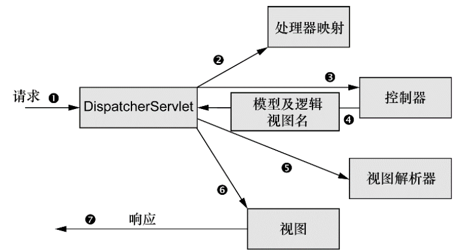

## Spring in Action

## 第二部分 Web中的Spring

## 第五章 构建Spring Web应用

Spring MVC基于模型-视图-控制器（Model-View-Controller，MVC）模式实现，它能够帮你构建像Spring框架那样灵活和松耦合的Web应用程序。
在本章中，我们将会介绍Spring MVC Web框架，并使用新的Spring MVC注解来构建处理各种Web请求、参数和表单输入的控制器。

### 1. Spring MVC起步

#### 1.1 跟踪Spring MVC的请求

每当用户在Web浏览器中点击链接或提交表单的时候，请求就开始工作了。请求是一个十分繁忙的家伙。从离开浏览器开始到获取响应返回，它会经历好多站，在每站都会留下一些信息同时也会带上其他信息。
下图展示了请求使用Spring MVC所经历的所有站点。



* 在请求离开浏览器时❶ ，会带有用户所请求内容的信息，至少会包含请求的URL。但是还可能带有其他的信息，例如用户提交的表单信息。
* 请求旅程的第一站是Spring的`DispatcherServlet`。与大多数基于Java的Web框架一样，Spring MVC所有的请求都会通过一个前端控制器（front controller）Servlet。前端控制器是常用的Web应用程序模式，在这里一个单实例的Servlet将请求委托给应用程序的其他组件来执行实际的处理。在Spring MVC中，`DispatcherServlet`就是 **前端控制器**。
* `DispatcherServlet`的任务是将请求发送给Spring MVC控制器（controller）。控制器是一个用于处理请求的Spring组件。在典型的应用程序中可能会有多个控制器，`DispatcherServlet`需要知道应该将请求发送给哪个控制器。所以`DispatcherServlet`以会查询一个或多个处理器映射（handler mapping）❷ 来确定请求的下一站在哪里。处理器映射会根据请求所携带的URL信息来进行决策。
* 一旦选择了合适的控制器，`DispatcherServlet`会将请求发送给选中的控制器❸。到了控制器，请求会卸下其负载（用户提交的信息）并耐心等待控制器处理这些信息。（实际上，设计良好的控制器本身只处理很少甚至不处理工作，而是将业务逻辑委托给一个或多个服务对象进行处理。）
* 控制器在完成逻辑处理后，通常会产生一些信息，这些信息需要返回给用户并在浏览器上显示。这些信息被称为模型（model）。不过仅仅给用户返回原始的信息是不够的——这些信息需要以用户友好的方式进行格式化，一般会是HTML。所以，信息需要发送给一个视图（view）， 通常会是JSP。
* 控制器所做的最后一件事就是将模型数据打包，并且标示出用于渲染输出的视图名。它接下来会将请求连同模型和视图名发送回`DispatcherServlet`❹。
* 这样，控制器就不会与特定的视图相耦合，传递给`DispatcherServlet`的视图名并不直接表示某个特定的JSP。实际上，它甚至并不能确这样，控制器就不会与特定的视图相耦合，传递给`DispatcherServlet`的视图名并不直接表示某个特定的JSP。实际上，它甚至并不能确定视图就是JSP。相反，它仅仅传递了一个逻辑名称，这个名字将会用来查找产生结果的真正视图。`DispatcherServle`t将会使用视图解析器（view resolver）❺来将逻辑视图名匹配为一个特定的视图实现，它可能是也可能不是JSP。
* 既然`DispatcherServlet`已经知道由哪个视图渲染结果，那请求的任务基本上也就完成了。它的最后一站是视图的实现（可能是JSP）❻， 在这里它交付模型数据。请求的任务就完成了。视图将使用模型数据渲染输出，这个输出会通过响应对象传递给客户端（不会像听上去那样硬 编码）❼。
* 可以看到，请求要经过很多的步骤，最终才能形成返回给客户端的响应。大多数的步骤都是在Spring框架内部完成的，也就是图所示的组件中。尽管本章的主要内容都关注于如何编写控制器，但在此之前我们首先看一下如何搭建Spring MVC的基础组件。

#### 1.2 搭建Spring MVC

```
.
├── java
│   └── spittr
│       ├── config                          -- java config
│       │   ├── DataConfig.java             -- 配置数据源
│       │   ├── RootConfig.java             -- 用来配置ContextLoaderListener创建的应用上下文中的bean
│       │   └── SpitterWebInitializer.java  -- 配置DispatcherServlet (不使用web.xml)
│       ├── data
│       │   ├── JdbcSpitterRepository.java
│       │   ├── JdbcSpittleRepository.java
│       │   ├── SpitterRepository.java      -- 定义数据访问的Repository ()
│       │   └── SpittleRepository.java      -- 定义数据访问的Repository (获取Spittle列表)
│       ├── Spitter.java                    -- POJO数据对象，包含用户名、口令和email信息
│       ├── Spittle.java                    -- POJO数据对象，包含消息内容、时间戳和位置信息
│       └── web
│           ├── HomeController.java         -- 控制器 (/)
│           ├── RegisterForm.java           --  (/spitter/register)
│           ├── SpitterController.java      -- 控制器 (/spitter)
│           ├── SpittleController.java      -- 控制器 (/spittles)
│           ├── SpittleForm.java            --
│           └── WebConfig.java              -- 配置类: 最小但可用的Spring MVC配置
├── resources
│   ├── log4j.xml
│   └── schema.sql
└── webapp
    ├── resources
    │   └── style.css
    └── WEB-INF
        ├── spring
        │   ├── appServlet
        │   │   └── servlet-context.xml
        │   └── root-context.xml
        └── views
            ├── home.jsp                    -- 视图 (/)
            ├── profile.jsp
            ├── registerForm.jsp
            ├── spittle.jsp
            └── spittles.jsp
```

**配置 DispatcherServlet**

`DispatcherServlet`是Spring MVC的核心。在这里请求会第一次接触到框架，它要负责将请求路由到其他的组件之中。
传统的方式，像`DispatcherServlet`这样的Servlet会配置在`web.xml`文件中，这个文件会放到应用的WAR包里面。

我们会使用Java将`DispatcherServlet`配置在Servlet容器中，而不会再使用`web.xml`文件。  

**配置 DispatcherServlet (SpitterWebInitializer.java)**
```Java
public class SpitterWebInitializer extends AbstractAnnotationConfigDispatcherServletInitializer {

  @Override
  protected Class<?>[] getRootConfigClasses() {
    return new Class<?>[] { RootConfig.class };
  }

  // 指定配置类 “WebConfig”
  @Override
  protected Class<?>[] getServletConfigClasses() {
    return new Class<?>[] { WebConfig.class };
  }

  // 将DispatcherServlet映射到 “/”
  @Override
  protected String[] getServletMappings() {
    return new String[] { "/" };
  }

}
```

扩展`AbstractAnnotationConfigDispatcherServletInitializer`的任意类都会自动地配置`DispatcherServlet`和Spring应用上下文, Spring的应用上下文会位于应用程序的Servlet上下文之中。

**AbstractAnnotationConfigDispatcherServletInitializer剖析**

如果你坚持要了解更多细节的话，那就看这里吧。在Servlet 3.0环境中，容器会在类路径中查找实现 `javax.servlet.ServletContainerInitializer` 接口的类，如果能发现的话，就会用它来配置Servlet容器。  
Spring提供了这个接口的实现，名为`SpringServletContainerInitializer`，这个类反过来又会查找实 现`WebApplicationInitializer`的类并将配置的任务交给它们来完成。
Spring 3.2引入了一个便利的`WebApplicationInitializer`基础实现，也就是`AbstractAnnotationConfigDispatcherServletInitializer`。因为我们 的`SpittrWebAppInitializer`扩展了`AbstractAnnotationConfigDispatcherServletInitializer`（同时也就实现了`WebApplicationInitializer`），因此当部署到Servlet 3.0容器中的时候，容器会自动发现它，并用它来配置Servlet上下文。

SpittrWebAppInitializer重写了三个方法:
* 第一个方法是`getServletMappings()`，它会将一个或多个路径映射到`DispatcherServlet`上。
* `getServletConfigClasses()` 返回的类将会用来定义`DispatcherServlet`应用上下文中的bean。
* `getRootConfigClasses()` 返回的类将会用来配置`ContextLoaderListener`创建的应用上下文中的bean。

**两个应用上下文之间的故事**

当`DispatcherServlet`启动的时候，它会创建Spring应用上下文，并加载配置文件或配置类中所声明的bean。在程序的`getServletConfigClasses()`方法中，我们要求`DispatcherServlet`加载应用上下文时，使用定义在`WebConfig`配置类（使用 Java配置）中的bean。
但是在Spring Web应用中，通常还会有另外一个应用上下文。另外的这个应用上下文是由`ContextLoaderListener`创建的。

`AbstractAnnotationConfigDispatcherServletInitializer`会同时创建`DispatcherServlet`和`ContextLoaderListener`。`GetServlet-ConfigClasses()`方法返回的带有`@Configuration`注解的 类将会用来定义`DispatcherServlet`应用上下文中的bean。`getRootConfigClasses()`方法返回的带有`@Configuration`注解的类将 会用来配置`ContextLoaderListener`创建的应用上下文中的bean。

**启用Spring MVC**

我们有多种方式来配置`DispatcherServlet`，与之类似，启用Spring MVC组件的方法也不仅一种。以前，Spring是使用XML进行配置的， 你可以使用`<mvc:annotation-driven>`启用注解驱动的Spring MVC。

我们所能创建的最简单的Spring MVC配置就是一个带有@EnableWebMvc注解的类.

这可以运行起来，它的确能够启用Spring MVC，但还有不少问题要解决：
* 没有配置视图解析器。如果这样的话，Spring默认会使用BeanNameView-Resolver，这个视图解析器会查找ID与视图名称匹配的 bean，并且查找的bean要实现View接口，它以这样的方式来解析视图。
* 没有启用组件扫描。这样的结果就是，Spring只能找到显式声明在配置类中的控制器。
* 这样配置的话，DispatcherServlet会映射为应用的默认Servlet，所以它会处理所有的请求，包括对静态资源的请求，如图片和样式 表（在大多数情况下，这可能并不是你想要的效果）。

因此，我们需要在WebConfig这个最小的Spring MVC配置上再加一些内容，从而让它变得真正有用。如下程序清单中的WebConfig解决了 上面所述的问题。

**最小但可用的Spring MVC配置 (WebConfig.java)**  
```java
@Configuration                 // java配置类
@EnableWebMvc                  // 启用Spring MVC        
@ComponentScan("spittr.web")   // 企用组件扫描，扫描“spittr.web”
public class WebConfig extends WebMvcConfigurerAdapter {

  @Bean
  public ViewResolver viewResolver() {
    // 配置JSP视图解析器
    InternalResourceViewResolver resolver = new InternalResourceViewResolver();
    resolver.setPrefix("/WEB-INF/views/");
    resolver.setSuffix(".jsp");
    return resolver;
  }

  // 配置静态资源处理
  @Override
  public void configureDefaultServletHandling(DefaultServletHandlerConfigurer configurer) {
    configurer.enable();
  }

  @Override
  public void addResourceHandlers(ResourceHandlerRegistry registry) {
    // TODO Auto-generated method stub
    super.addResourceHandlers(registry);
  }
}
```

说明：
* `WebConfig`添加了`@Component-Scan`注解，因此将会扫描`spitter.web`包来查找组件。稍后你就会看到，我们所编写的控制器将会带有`@Controller`注解，这会使其成为组件扫描时的候选bean。因此，我们不需要在配置类中显式声明任何的控制器。
* 我们添加了一个`ViewResolver` bean。更具体来讲，是`Internal-ResourceViewResolver`。我们将会在第6章更为详细地讨 论视图解析器。我们只需要知道它会查找JSP文件，在查找的时候，它会在视图名称上加一个特定的前缀和后缀（例如，名为`home`的视图将会解析为`/WEB-INF/views/home.jsp`）。
* 新的`WebConfig`类还扩展了`WebMvcConfigurerAdapter`并重写了其`configureDefaultServletHandling()`方法。通过调用`DefaultServlet-HandlerConfigurer`的`enable()`方法，我们要求`DispatcherServlet`将对静态资源的请求转发到Servlet容器中默认的Servlet上，而不是使用`DispatcherServlet`本身来处理此类请求。

`WebConfig`已经就绪，那`RootConfig`呢？因为本章聚焦于Web开发，而Web相关的配置通过`DispatcherServlet`创建的应用上下文都已经配置好了，因此现在的`RootConfig`相对很简单：  

**RootConfig.java**  
```java
package spittr.config;

import java.util.regex.Pattern;

import org.springframework.context.annotation.ComponentScan;
import org.springframework.context.annotation.ComponentScan.Filter;
import org.springframework.context.annotation.Configuration;
import org.springframework.context.annotation.FilterType;
import org.springframework.context.annotation.Import;
import org.springframework.core.type.filter.RegexPatternTypeFilter;

import spittr.config.RootConfig.WebPackage;

@Configuration
@Import(DataConfig.class)
@ComponentScan(basePackages={"spittr"},
    excludeFilters={
        @Filter(type=FilterType.CUSTOM, value=WebPackage.class)
    })
public class RootConfig {
  public static class WebPackage extends RegexPatternTypeFilter {
    public WebPackage() {
      super(Pattern.compile("spittr\\.web"));
    }    
  }
}
```
唯一需要注意的是`RootConfig`使用了`@ComponentScan`注解。这样的话，在本书中，我们就有很多机会用非Web的组件来充实完善`RootConfig`。

现在，我们基本上已经可以开始使用Spring MVC构建Web应用了。此时，最大的问题在于，我们要构建的应用到底是什么。

#### 1.3 Spittr应用简介

为了实现在线社交的功能，我们将要构建一个简单的微博（microblogging）应用。在很多方面，我们所构建的应用与最早的微博应用Twitter很类似。在这个过程中，我们会添加一些小的变化。当然，我们要使用Spring技术来构建这个应用。

因为从Twitter借鉴了灵感并且通过Spring来进行实现，所以它就有了一个名字：`Spitter`。再进一步，应用网站命名中流行的模式，如Flickr，我们去掉字母e，这样的话，我们就将这个应用称为`Spittr`。这个名称也有助于区分应用名称和领域类型，因为我们将会创建一个名为`Spitter`的领域类。

Spittr应用有两个基本的领域概念：`Spitter`（应用的用户）和`Spittle`（用户发布的简短状态更新）。当我们在书中完善Spittr应用的功能时，将会介绍这两个领域概念。在本章中，我们会构建应用的Web层，创建展现`Spittle`的控制器以及处理用户注册成为`Spitter`的表单。  
舞台已经搭建完成了。我们已经配置了`DispatcherServlet`，启用了基本的Spring MVC组件并确定了目标应用。让我们进入本章的核心内容：使用Spring MVC控制器处理Web请求。  

### 2. 编写基本的控制器

在Spring MVC中，控制器只是方法上添加了`@RequestMapping`注解的类，这个注解声明了它们所要处理的请求。  
开始的时候，我们尽可能简单，假设控制器类要处理对“/”的请求，并渲染应用的首页。程序清单5.3所示的`HomeController`可能是最简单的 Spring MVC控制器类了。  

**HomeController：超级简单的控制器 (HomeController.java)**  
```java
package spittr.web;
import static org.springframework.web.bind.annotation.RequestMethod.*;
import org.springframework.stereotype.Controller;
import org.springframework.ui.Model;
import org.springframework.web.bind.annotation.RequestMapping;

@Controller             // 声明为一个控制器
@RequestMapping("/")    // 处理对 “/” 的请求
public class HomeController {

  @RequestMapping(method = GET)  // 处理GET请求
  public String home(Model model) {
    return "home";  // 视图名为home
  }

}
```
你可能注意到的第一件事情就是`HomeController`带有`@Controller`注解。很显然这个注解是用来声明控制器的，但实际上这个注解对 Spring MVC本身的影响并不大。  
`HomeController` 是一个构造型（stereotype）的注解，它基于 `@Component` 注解。在这里，它的目的就是辅助实现组件扫描。因为 `HomeController` 带有 `@Controller` 注解，因此组件扫描器会自动找到`HomeController`，并将其声明为Spring应用上下文中的一个 bean。  
其实，你也可以让`HomeController`带有`@Component`注解，它所实现的效果是一样的，但是在表意性上可能会差一些，无法确定`HomeController`是什么组件类型。

`HomeController`唯一的一个方法，也就是`home()`方法，带有`@RequestMapping`注解。它的`value`属性指定了这个方法所要处理的请求路径，`method`属性细化了它所处理的HTTP方法。在本例中，当收到对`“/”`的`HTTP GET`请求时，就会调用`home()`方法。  
你可以看到，`home()`方法其实并没有做太多的事情：它返回了一个`String`类型的`“home”`。这个`String`将会被Spring MVC解读为要渲染的 视图名称。`DispatcherServlet`会要求视图解析器将这个逻辑名称解析为实际的视图。  
鉴于我们配置`InternalResourceViewResolver`的方式，视图名`“home”`将会解析为`“/WEB-INF/views/home.jsp”`路径的JSP。现在，我们会让Spittr应用的首页相当简单，如下所示。

**Spittr应用的首页，定义为一个简单的JSP (home.jsp)**  
```html
<%@ taglib uri="http://java.sun.com/jsp/jstl/core" prefix="c" %>
<%@ page session="false" %>
<html>
  <head>
    <title>Spitter</title>
    <link rel="stylesheet"
          type="text/css"
          href="<c:url value="/resources/style.css" />" >
  </head>
  <body>
    <h1>Welcome to Spitter</h1>

    <a href="<c:url value="/spittles" />">Spittles</a> |
    <a href="<c:url value="/spitter/register" />">Register</a>
  </body>
</html>
```

这个JSP并没有太多需要注意的地方。它只是欢迎应用的用户，并提供了两个链接：一个是查看`Spittle`列表，另一个是在应用中进行注册。 图5.2展现了此时的首页是什么样子的。
在本章完成之前，我们将会实现处理这些请求的控制器方法。但现在，让我们对这个控制器发起一些请求，看一下它是否能够正常工作。测试 控制器最直接的办法可能就是构建并部署应用，然后通过浏览器对其进行访问，但是自动化测试可能会给你更快的反馈和更一致的独立结果。 所以，让我们编写一个针对`HomeController`的测试。


#### 2.1 测试控制器
**HomeControllerTest：测试HomeController (HomeControllerTest)**
```java
package spittr.web;
import static org.springframework.test.web.servlet.request.MockMvcRequestBuilders.*;
import static org.springframework.test.web.servlet.result.MockMvcResultMatchers.*;
import static org.springframework.test.web.servlet.setup.MockMvcBuilders.*;

import org.junit.Test;
import org.springframework.test.web.servlet.MockMvc;

import spittr.web.HomeController;

public class HomeControllerTest {

  @Test
  public void testHomePage() throws Exception {
    HomeController controller = new HomeController();
    MockMvc mockMvc = standaloneSetup(controller).build();
    mockMvc.perform(get("/"))
           .andExpect(view().name("home"));
  }
}
```

#### 2.2 定义类级别的请求处理

现在，已经为`HomeController`编写了测试，那么我们可以做一些重构，并通过测试来保证不会对功能造成什么破坏。我们可以做的一件事就是拆分`@RequestMapping`，并将其路径映射部分放到类级别上。


#### 2.3 传递模型数据到视图中

到现在为止，就编写超级简单的控制器来说，`HomeController`已经是一个不错的样例了。但是大多数的控制器并不是这么简单。在 `Spittr` 应用中，我们需要有一个页面展现最近提交的Spittle列表。因此，我们需要一个新的方法来处理这个页面。

首先，需要定义一个数据访问的Repository。为了实现解耦以及避免陷入数据库访问的细节之中，我们将Repository定义为一个接口，并在稍后实现它（第10章中）。此时，我们只需要一个能够获取Spittle列表的Repository，如下所示的`SpittleRepository`功能已经足够了：

`SpittleRepository.java`
```java
package spittr.data;
import java.util.List;
import spittr.Spittle;

public interface SpittleRepository {
  List<Spittle> findRecentSpittles();
  List<Spittle> findSpittles(long max, int count);
  Spittle findOne(long id);
  void save(Spittle spittle);
}
```

`findSpittles()`方法接受两个参数。其中`max`参数代表所返回的Spittle中，`Spittle ID`属性的最大值，而`count`参数表明要返回多少个`Spittle`对象。为了获得最新的20个Spittle对象，我们可以这样调用`findSpittles()`：
```java
List<Spittle> recent =
  spittleRepository.findSpittles(Long.MAX_VALUE, 20);
```

现在，我们让`Spittle`类尽可能的简单。它的属性包括消息内容、时间戳以及`Spittle`发布时对应的经纬度。

**Spittle类：包含消息内容、时间戳和位置信息 (Spittle)**  
```java
package spittr;

public class Spittle {
  private final Long id;
  private final String message;
  private final Date time;
  private Double latitude;
  private Double longitude;

  public Spittle(String message, Date time) {
    this(null, message, time, null, null);
  }

  public Spittle(Long id, String message, Date time, Double longitude, Double latitude) {
    this.id = id;
    this.message = message;
    this.time = time;
    this.longitude = longitude;
    this.latitude = latitude;
  }

  public long getId()          { return id; }
  public String getMessage()   { return message; }
  public Date getTime()        { return time; }
  public Double getLongitude() { return longitude; }
  public Double getLatitude()  { return latitude; }

  @Override
  public boolean equals(Object that) {
    return EqualsBuilder.reflectionEquals(this, that, "id", "time");
  }

  @Override
  public int hashCode() {
    return HashCodeBuilder.reflectionHashCode(this, "id", "time");
  }
}
```

就大部分内容来看，Spittle就是一个基本的POJO数据对象——没有什么复杂的。唯一要注意的是，我们使用Apache Common Lang包来实 现equals()和hashCode()方法。这些方法除了常规的作用以外，当我们为控制器的处理器方法编写测试时，它们也是有用的。

既然我们说到了测试，那么我们继续讨论这个话题并为新的控制器方法编写测试。如下的程序清单使用Spring的MockMvc来断言新的处理器方法中你所期望的行为.


这个测试首先会创建SpittleRepository接口的mock实现，这个实现会从它的findSpittles()方法中返回20个Spittle对象。然后， 它将这个Repository注入到一个新的SpittleController实例中，然后创建MockMvc并使用这个控制器。

需要注意的是，与HomeController不同，这个测试在MockMvc构造器上调用了setSingleView()。这样的话，mock框架就不用解析控 制器中的视图名了。在很多场景中，其实没有必要这样做。但是对于这个控制器方法，视图名与请求路径是非常相似的，这样按照默认的视图解析规则时，MockMvc就会发生失败，因为无法区分视图路径和控制器的路径。在这个测试中，构建InternalResourceView时所设置的 实际路径是无关紧要的，但我们将其设置为与InternalResourceViewResolver配置一致。

这个测试对“/spittles”发起GET请求，然后断言视图的名称为`spittles`并且模型中包含名为`spittleList`的属性，在spittleList中包含预期 的内容。

当然，如果此时运行测试的话，它将会失败。它不是运行失败，而是在编译的时候就会失败。这是因为我们还没有编写`SpittleController`。现在，我们创建`SpittleController`，让它满足程序清单5.9的预期。如下的`SpittleController`实现将会 满足以上测试的要求。

**SpittleController：在模型中放入最新的spittle列表 (SpittleController)**
```java
package spittr.web;

@Controller
@RequestMapping("/spittles")
public class SpittleController {

  private SpittleRepository spittleRepository;
  @Autowired
  public SpittleController(SpittleRepository spittleRepository) { //注入SpittleRepository
    this.spittleRepository = spittleRepository;
  }

  @RequestMapping(method=RequestMethod.GET)
  public String spittles(Model model) {
    model.addAttribute(                                     //将spittle添加到模型中
      spittleRepository.findSpittles(Long.MAX_VALUE, 20));
    return "spittles";                                      //返回视图名
  }
}
```

我们在`spittles()`方法中给定了一个`Model`作为参数。这样，`spittles()`方法就能将Repository中获取到的Spittle列表填充到模型中。 `Model`实际上就是一个`Map`（也就是key-value对的集合），它会传递给视图，这样数据就能渲染到客户端了。当调用`addAttribute()`方法并且不指定key的时候，那么key会根据值的对象类型推断确定。在本例中，因为它是一个`List<Spittle>`，因此，键将会推断为`spittleList`。
```java
// 1. key会根据值的对象类型推断确定
@RequestMapping(method=RequestMethod.GET)
public String spittles(Model model) {
  model.addAttribute(
    spittleRepository.findSpittles(Long.MAX_VALUE, 20));
  return "spittles";
}

// 2. 如果你希望显式声明模型的key的话，那也尽可以进行指定。
@RequestMapping(method=RequestMethod.GET)
public String spittles(Model model) {
  model.addAttribute("spittleList",
    spittleRepository.findSpittles(Long.MAX_VALUE, 20));
  return "spittles";
}

// 3.如希望使用非Spring类型，那么可以用java.util.Map来代替Model。
@RequestMapping(method=RequestMethod.GET)
public String spittles(Map model) {
  model.put("spittleList",
          spittleRepository.findSpittles(Long.MAX_VALUE, 20));
  return "spittles";
}

// 4. 这个版本与其他的版本有些差别。它并没有返回视图名称，也没有显式地设定模型，这个方法返回的是Spittle列表。
//    当处理器方法像这样返回对象或集合时，这个值会放到模型中，模型的key会根据其类型推断得出.
//    在本例中，也就是spittleList）
//    而逻辑视图的名称将会根据请求路径推断得出。
//    因为这个方法处理针对“/spittles”的GET请求，因此视图的名称将会是spittles
@RequestMapping(method=RequestMethod.GET)
public List<Spittle> spittles() {
  return spittleRepository.findSpittles(Long.MAX_VALUE, 20));
}
```


SpittleController 完整版
```java
package spittr.web;

@Controller
@RequestMapping("/spittles")
public class SpittleController {

  private static final String MAX_LONG_AS_STRING = "9223372036854775807";

  private SpittleRepository spittleRepository;

  @Autowired
  public SpittleController(SpittleRepository spittleRepository) {
    this.spittleRepository = spittleRepository;
  }

  @RequestMapping(method=RequestMethod.GET)
  public List<Spittle> spittles(
      @RequestParam(value="max", defaultValue=MAX_LONG_AS_STRING) long max,
      @RequestParam(value="count", defaultValue="20") int count) {
    return spittleRepository.findSpittles(max, count);
  }

  @RequestMapping(value="/{spittleId}", method=RequestMethod.GET)
  public String spittle(
      @PathVariable("spittleId") long spittleId,
      Model model) {
    model.addAttribute(spittleRepository.findOne(spittleId));
    return "spittle";
  }

  @RequestMapping(method=RequestMethod.POST)
  public String saveSpittle(SpittleForm form, Model model) throws Exception {
    spittleRepository.save(new Spittle(null, form.getMessage(), new Date(),
        form.getLongitude(), form.getLatitude()));
    return "redirect:/spittles";
  }

}
```

不管你选择哪种方式来编写`spittles()`方法，所达成的结果都是相同的。模型中会存储一个Spittle列表，key为`spittleList`，然后这个列表会发送到名为spittles的视图中。按照我们配置`InternalResourceViewResolver`的方式，视图的JSP将会是`“/WEBINF/views/spittles.jsp”`。

现在，数据已经放到了模型中，在JSP中该如何访问它呢？实际上，当视图是JSP的时候，模型数据会作为请求属性放到请求（request）之中。因此，在`spittles.jsp`文件中可以使用JSTL（JavaServer Pages Standard Tag Library）的`<c:forEach>`标签渲染spittle列表：

spittles.jsp
```html
<c:forEach items="${spittleList}" var="spittle" >
  <li id="spittle_<c:out value="spittle.id"/>">
    <div class="spittleMessage"><c:out value="${spittle.message}" /></div>
    <div>
      <span class="spittleTime"><c:out value="${spittle.time}" /></span>
      <span class="spittleLocation">(<c:out value="${spittle.latitude}" />, <c:out value="${spittle.longitude}" />)</span>
    </div>
  </li>
</c:forEach>
```


spittles.jsp 完整本
```html
<%@ taglib prefix="c" uri="http://java.sun.com/jsp/jstl/core"%>
<%@ taglib prefix="s" uri="http://www.springframework.org/tags"%>
<%@ taglib prefix="fn" uri="http://java.sun.com/jsp/jstl/functions" %>

<html>
  <head>
    <title>Spitter</title>
    <link rel="stylesheet" type="text/css" href="<c:url value="/resources/style.css" />" >
  </head>
  <body>
    <div class="spittleForm">
      <h1>Spit it out...</h1>
      <form method="POST" name="spittleForm">
        <input type="hidden" name="latitude">
        <input type="hidden" name="longitude">
        <textarea name="message" cols="80" rows="5"></textarea><br/>
        <input type="submit" value="Add" />
      </form>
    </div>
    <div class="listTitle">
      <h1>Recent Spittles</h1>
      <ul class="spittleList">
        <c:forEach items="${spittleList}" var="spittle" >
          <li id="spittle_<c:out value="spittle.id"/>">
            <div class="spittleMessage"><c:out value="${spittle.message}" /></div>
            <div>
              <span class="spittleTime"><c:out value="${spittle.time}" /></span>
              <span class="spittleLocation">(<c:out value="${spittle.latitude}" />, <c:out value="${spittle.longitude}" />)</span>
            </div>
          </li>
        </c:forEach>
      </ul>
      <c:if test="${fn:length(spittleList) gt 20}">
        <hr />
        <s:url value="/spittles?count=${nextCount}" var="more_url" />
        <a href="${more_url}">Show more</a>
      </c:if>
    </div>
  </body>
</html>
```


### 3. 接受请求的输入

有些Web应用是只读的。人们只能通过浏览器在站点上闲逛，阅读服务器发送到浏览器中的内容。  
不过，这并不是一成不变的。众多的Web应用允许用户参与进去，将数据发送回服务器。如果没有这项能力的话，那Web将完全是另一番景象。

Spring MVC允许以多种方式将客户端中的数据传送到控制器的处理器方法中，包括：
* 查询参数（Query Parameter）。
* 表单参数（Form Parameter）。
* 路径变量（Path Variable）。

你将会看到如何编写控制器处理这些不同机制的输入。作为开始，我们先看一下如何处理带有查询参数的请求，这也是客户端往服务器端发送数据时，最简单和最直接的方式。


#### 3.1 处理查询参数

为了实现这个分页的功能，我们所编写的处理器方法要接受如下的参数：
* before参数（表明结果中所有Spittle的ID均应该在这个值之前）。
* count参数（表明在结果中要包含的Spittle数量）。

为了实现这个功能，我们将程序清单5.10中的spittles()方法替换为使用before和count参数的新spittles()方法。我们首先添加一个 测试，这个测试反映了新spittles()方法的功能。

这个测试方法与程序清单5.9中的测试方法关键区别在于它针对“/spittles”发送GET请求，同时还传入了max和count参数。它测试了这些参数存在时的处理器方法，而另一个测试方法则测试了没有这些参数时的情景。这两个测试就绪后，我们就能确保不管控制器发生什么样的变化，它 都能够处理这两种类型的请求：

```java
@RequestMapping(method=RequestMethod.GET)
public List<Spittle> spittles(
    @RequestParam("max") long max,
    @RequestParam("count") int count) {
  return spittleRepository.findSpittles(max, count);
}
```

SpittleController中的处理器方法要同时处理有参数和没有参数的场景，那我们需要对其进行修改，让它能接受参数，同时，如果这些 参数在请求中不存在的话，就使用默认值Long.MAX_VALUE和20。@RequestParam注解的defaultValue属性可以完成这项任务：
```java
@RequestMapping(method=RequestMethod.GET)
public List<Spittle> spittles(
    @RequestParam(value="max",
                  defaultValue=MAX_LONG_AS_STRING) long max,
    @RequestParam(value="count", defaultValue="20") int count) {
  return spittleRepository.findSpittles(max, count);
}
```


#### 3.2 通过路径参数接受输入

假设我们的应用程序需要根据给定的ID来展现某一个Spittle记录。其中一种方案就是编写处理器方法，通过使用`@RequestParam`注解， 让它接受ID作为查询参数：
```java
@RequestMapping(value="/show", method=RequestMethod.GET)
public String showSpittle(
    @RequestParam("spittle_id") long spittleId,
    Model model) {
  model.addAttribute(spittleRepository.findOne(spittleId));
  return "spittle";
}
```
这个处理器方法将会处理形如`“/spittles/show?spittle_id=12345”`这样的请求。 尽管这也可以正常工作，但是从面向资源的角度来看这并不理想。在理想情况下，要识别的资源（Spittle）应该通过URL路径进行标示，而不是通过查询参数。对`“/spittles/12345”`发起GET请求要优于 对`“/spittles/show?spittle_id=12345”`发起请求。 前者能够识别出要查询的资源，而后者描述的是带有参数的一个操作——本质上是通过HTTP发起的RPC。

既然已经以面向资源的控制器作为目标，那我们将这个需求转换为一个测试。程序清单5.12展现了一个新的测试方法，它会断 言SpittleController中对面向资源 请求的处理。
程序清单5.12 测试对某个Spittle的请求，其中ID要在路径变量中指定
```java

```

可以看到，这个测试构建了一个mock Repository、一个控制器和MockMvc，这与本章中我们所编写的其他测试很类似。这个测试中最重要的 部分是最后几行，它对“/spittles/12345”发起GET请求，然后断言视图的名称是spittle，并且预期的Spittle对象放到了模型之中。因为我 们还没有为这种请求实现处理器方法，因此这个请求将会失败。但是，我们可以通过为SpittleController添加新的方法来修正这个失败 的测试。
到目前为止，在我们编写的控制器中，所有的方法都映射到了（通过@RequestMapping）静态定义好的路径上。但是，如果想让这个测试 通过的话，我们编写的@RequestMapping要包含变量部分，这部分代表了Spittle ID。
为了实现这种路径变量，Spring MVC允许我们在@RequestMapping路径中添加占位符。占位符的名称要用大括号（“{”和“}”）括起来。路径 中的其他部分要与所处理的请求完全匹配，但是占位符部分可以是任意的值。

下面的处理器方法使用了占位符，将`Spittle ID`作为路径的一部分：
```java
@RequestMapping(value="/{spittleId}", method=RequestMethod.GET)
public String spittle(
    @PathVariable("spittleId") long spittleId,
    Model model) {
  model.addAttribute(spittleRepository.findOne(spittleId));
  return "spittle";
}
```

例如，它就能够处理针对“/spittles/12345”的请求，也就是程序清单5.12中的路径
我们可以看到，spittle()方法的spittleId参数上添加了`@PathVariable("spittleId")`注解，这表明在请求路径中，不管占位符 部分的值是什么都会传递到处理器方法的spittleId参数中。如果对`“/spittles/54321”`发送GET请求，那么将会把`“54321”`传递进来，作为`spittleId`的值。

需要注意的是：在样例中`spittleId`这个词出现了好几次：先是在`@RequestMapping`的路径中，然后作为`@PathVariable`属性的值，最后又作为方法的参数名称。因为方法的参数名碰巧与占位符的名称相同，因此我们可以去掉`@PathVariable`中的`value`属性：

如果`@PathVariable`中没有`value`属性的话，它会假设占位符的名称与方法的参数名相同。这能够让代码稍微简洁一些，因为不必重复写占 位符的名称了。但需要注意的是，如果你想要重命名参数时，必须要同时修改占位符的名称，使其互相匹配。
`spittle()`方法会将参数传递到`SpittleRepository`的`findOne()`方法中，用来获取某个`Spittle`对象，然后将`Spittle`对象添加到模型中。模型的key将会是`spittle`，这是根据传递到`addAttribute()`方法中的类型推断得到的。

这样`Spittle`对象中的数据就可以渲染到视图中了，此时需要引用请求中key为`spittle`的属性（与模型的key一致）。如下为渲 染Spittle的JSP视图片段：


这个视图并没有什么特别之处，它的屏幕截图如图5.4所示。

如果传递请求中少量的数据，那查询参数和路径变量是很合适的。但通常我们还需要传递很多的数据（也许是表单提交的数据），那查询参数 显得有些笨拙和受限了。下面让我们来看一下如何编写控制器方法来处理表单提交。


### 4. 处理表单

Web应用的功能通常并不局限于为用户推送内容。大多数的应用允许用户填充表单并将数据提交回应用中，通过这种方式实现与用户的交互。 像提供内容一样，Spring MVC的控制器也为表单处理提供了良好的支持。

使用表单分为两个方面：展现表单以及处理用户通过表单提交的数据。在Spittr应用中，我们需要有个表单让新用户进行注 册。SpitterController是一个新的控制器，目前只有一个请求处理的方法来展现注册表单。

**程序清单5.13 SpitterController：展现一个表单，允许用户注册该应用**
```java
package spittr.web;

import static org.springframework.web.bind.annotation.RequestMethod.*;

import javax.validation.Valid;

import org.springframework.beans.factory.annotation.Autowired;
import org.springframework.stereotype.Controller;
import org.springframework.ui.Model;
import org.springframework.validation.Errors;
import org.springframework.web.bind.annotation.PathVariable;
import org.springframework.web.bind.annotation.RequestMapping;

import spittr.Spitter;
import spittr.data.SpitterRepository;

@Controller
@RequestMapping("/spitter")
public class SpitterController {

  private SpitterRepository spitterRepository;

  @Autowired
  public SpitterController(SpitterRepository spitterRepository) {
    this.spitterRepository = spitterRepository;
  }

  @RequestMapping(value="/register", method=GET)
  public String showRegistrationForm() {
    return "registerForm";
  }

  @RequestMapping(value="/register", method=POST)
  public String processRegistration(
      @Valid Spitter spitter,
      Errors errors) {
    if (errors.hasErrors()) {
      return "registerForm";
    }

    spitterRepository.save(spitter);
    return "redirect:/spitter/" + spitter.getUsername();
  }

  @RequestMapping(value="/{username}", method=GET)
  public String showSpitterProfile(@PathVariable String username, Model model) {
    Spitter spitter = spitterRepository.findByUsername(username);
    model.addAttribute(spitter);
    return "profile";
  }

}
```
showRegistrationForm()方法的@RequestMapping注解以及类级别上的@RequestMapping注解组合起来，声明了这个方法要处理 的是针对“/spitter/register”的GET请求。这是一个简单的方法，没有任何输入并且只是返回名为registerForm的逻辑视图。按照我们配 置InternalResourceViewResolver的方式，这意味着将会使用“/WEB-INF/ views/registerForm.jsp”这个JSP来渲染注册表单。

尽管showRegistrationForm()方法非常简单，但测试依然需要覆盖到它。因为这个方法很简单，所以它的测试也比较简单。

**程序清单5.14 测试展现表单的控制器方法**
```

```

这个测试方法与首页控制器的测试非常类似。它对“/spitter/register”发送GET请求，然后断言结果的视图名为registerForm。

现在，让我们回到视图上。因为视图的名称为registerForm，所以JSP的名称需要是registerForm.jsp。这个JSP必须要包含一个HTML <form>标签，在这个标签中用户输入注册应用的信息。如下就是我们现在所要使用的JSP。

**程序清单5.15 渲染注册表单的JSP**
```
```

可以看到，这个JSP非常基础。它的HTML表单域中记录用户的名字、姓氏、用户名以及密码，然后还包含一个提交表单的按钮。在浏览器渲 染之后，它的样子大致如图5.5所示。

需要注意的是：这里的<form>标签中并没有设置action属性。在这种情况下，当表单提交时，它会提交到与展现时相同的URL路径上。也 就是说，它会提交到“/spitter/register”上。

这就意味着需要在服务器端处理该HTTP POST请求。现在，我们在Spitter-Controller中再添加一个方法来处理这个表单提交。

#### 4.1 编写处理表单的控制器

当处理注册表单的POST请求时，控制器需要接受表单数据并将表单数据保存为Spitter对象。最后，为了防止重复提交（用户点击浏览器的 刷新按钮有可能会发生这种情况），应该将浏览器重定向到新创建用户的基本信息页面。这些行为通过下面的shouldProcessRegistration()进行了测试。

**程序清单5.16 测试处理表单的控制器方法**

显然，这个测试比展现注册表单的测试复杂得多。在构建完SpitterRepository的mock实现以及所要执行的控制器和MockMvc之 后，shouldProcess-Registration()对“/spitter/ register”发起了一个POST请求。作为请求的一部分，用户信息以参数的形式放到 request中，从而模拟提交的表单。
在处理POST类型的请求时，在请求处理完成后，最好进行一下重定向，这样浏览器的刷新就不会重复提交表单了。在这个测试中，预期请求 会重定向到“/spitter/jbauer”，也就是新建用户的基本信息页面。
最后，测试会校验SpitterRepository的mock实现最终会真正用来保存表单上传入的数据。
现在，我们来实现处理表单提交的控制器方法。通过shouldProcess-Registration()方法，我们可能认为要满足这个需求需要做很多 的工作。但是，在如下的程序清单中，我们可以看到新的SpitterController并没有做太多的事情。

**程序清单5.17 处理所提交的表单并注册新用户**

我们之前创建的showRegistrationForm()方法依然还在，不过请注意新创建的processRegistration()方法，它接受一个Spitter对象作为参数。这个对象有firstName、lastName、username和password属性，这些属性将会使用请求中同名的参数进行填充。
当使用Spitter对象调用processRegistration()方法时，它会进而调用SpitterRepository的save()方 法，SpitterRepository是在Spitter-Controller的构造器中注入进来的。

processRegistration()方法做的最后一件事就是返回一个String类型，用来指定视图。但是这个视图格式和以前我们所看到的视图有所不同。这里不仅返回了视图的名称供视图解析器查找目标视图，而且返回的值还带有重定向的格式。

当InternalResourceViewResolver看到视图格式中的“redirect:”前缀时，它就知道要将其解析为重定向的规则，而不是视图的名称。在本例中，它将会重定向到用户基本信息的页面。例如，如果Spitter.username属性的值为“jbauer”，那么视图将会重定向 到“/spitter/jbauer”。
需要注意的是，除了“redirect:”，InternalResourceViewResolver还能识别“forward:”前缀。当它发现视图格式中以“forward:”作为前缀时，请求将会前往（forward）指定的URL路径，而不再是重定向。

万事俱备！现在，程序清单5.16中的测试应该能够通过了。但是，我们的任务还没有完成，因为我们重定向到了用户基本信息页面，那么我们应该往SpitterController中添加一个处理器方法，用来处理对基本信息页面的请求。如下的showSpitterProfile()将会完成这项任务：

SpitterRepository通过用户名获取一个Spitter对象，showSpitter-Profile()得到这个对象并将其添加到模型中，然后返 回profile，也就是基本信息页面的逻辑视图名。像本章展现的其他视图一样，现在的基本信息视图非常简单

图5.6展现了在Web浏览器中渲染的基本信息页面。

如果表单中没有发送username或password的话，会发生什么情况呢？或者说，如果firstName或lastName的值为空或太长的话，又会 怎么样呢？接下来，让我们看一下如何为表单提交添加校验，从而避免数据呈现的不一致性


#### 4.2 校验表单

如果用户在提交表单的时候，`username`或`password`文本域为空的话，那么将会导致在新建`Spitter`对象中，`username`或`password`是空的`String`。至少这是一种怪异的行为。如果这种现象不处理的话，这将会出现安全问题，因为不管是谁只要提交一个空的表单就能登录应用。

同时，我们还应该阻止用户提交空的`firstName`和/或`lastName`，使应用仅在一定程度上保持匿名性。有个好的办法就是限制这些输入域值的长度，保持它们的值在一个合理的长度范围，避免这些输入域的误用。

有种处理校验的方式非常初级，那就是在`processRegistration()`方法中添加代码来检查值的合法性，如果值不合法的话，就将注册表单重新显示给用户。这是一个很简短的方法，因此，添加一些额外的if语句也不是什么大问题，对吧？

与其让校验逻辑弄乱我们的处理器方法，还不如使用Spring对Java校验API（Java Validation API，又称JSR-303）的支持。从Spring 3.0开始，在Spring MVC中提供了对Java校验API的支持。在Spring MVC中要使用Java校验API的话，并不需要什么额外的配置。只要保证在类路径下包含这个Java API的实现即可，比如Hibernate Validator。

Java校验API定义了多个注解，这些注解可以放到属性上，从而限制这些属性的值。所有的注解都位于`javax.validation.constraints`包中。表5.1列出了这些校验注解。

**表5.1 Java校验API所提供的校验注解**

除了表5.1中的注解，Java校验API的实现可能还会提供额外的校验注解。同时，也可以定义自己的限制条件。但就我们来讲，将会关注于上表中的两个核心限制条件。

请考虑要添加到Spitter域上的限制条件，似乎需要使用`@NotNull`和`@Size`注解。我们所要做的事情就是将这些注解添加到`Spitter`的属性上。如下的程序清单展现了`Spitter`类，它的属性已经添加了校验注解。

**程序清单5.18 Spitter：包含了要提交到Spittle POST请求中的域**
```java

```

现在，Spitter的所有属性都添加了`@NotNull`注解，以确保它们的值不为null。类似地，属性上也添加了@Size注解以限制它们的长度在最大值和最小值之间。对Spittr应用来说，这意味着用户必须要填完注册表单，并且值的长度要在给定的范围内。

我们已经为`Spitter`添加了校验注解，接下来需要修改`processRegistration()`方法来应用校验功能。启用校验功能的`processRegistration()`如下所示：


**程序清单5.19 processRegistration()：确保所提交的数据是合法的**  

与程序清单5.17中最初的`processRegistration()`方法相比，这里有了很大的变化。`Spitter`参数添加了`@Valid`注解，这会告知Spring，需要确保这个对象满足校验限制。

在`Spitter`属性上添加校验限制并不能阻止表单提交。即便用户没有填写某个域或者某个域所给定的值超出了最大长度，`processRegistration()`方法依然会被调用。这样，我们就需要处理校验的错误，就像在`processRegistration()`方法中所看到 的那样。

如果有校验出现错误的话，那么这些错误可以通过Errors对象进行访问，现在这个对象已作为`processRegistration()`方法的参数。 （很重要一点需要注意，Errors参数要紧跟在带有`@Valid`注解的参数后面，`@Valid`注解所标注的就是要检验的参数。） `processRegistration()`方法所做的第一件事就是调用`Errors.hasErrors()`来检查是否有错误。

如果有错误的话，`Errors.hasErrors()`将会返回到`registerForm`，也就是注册表单的视图。这能够让用户的浏览器重新回到注册表单 页面，所以他们能够修正错误，然后重新尝试提交。现在，会显示空的表单，但是在下一章中，我们将在表单中显示最初提交的值并将校验错 误反馈给用户。

如果没有错误的话，Spitter对象将会通过Repository进行保存，控制器会像之前那样重定向到基本信息页面。


### 5. 小结
在本章中，我们为编写应用程序的Web部分开了一个好头。可以看到，Spring有一个强大灵活的Web框架。借助于注解，Spring MVC提供了近似于POJO的开发模式，这使得开发处理请求的控制器变得非常简单，同时也易于测试。  

当编写控制器的处理器方法时，Spring MVC极其灵活。概括来讲，如果你的处理器方法需要内容的话，只需将对应的对象作为参数，而它不需要的内容，则没有必要出现在参数列表中。这样，就为请求处理带来了无限的可能性，同时还能保持一种简单的编程模型。  

尽管本章中的很多内容都是关于控制器的请求处理的，但是渲染响应同样也是很重要的。我们通过使用JSP的方式，简单了解了如何为控制器编写视图。但是就Spring MVC的视图来说，它并不限于本章所看到的简单JSP。  

在接下来的第6章中，我们将会更深入地学习Spring视图，包括如何在JSP中使用Spring标签库。我们还会学习如何借助Apache Tiles为视图添加一致的布局结构。同时，还会了解Thymeleaf，这是一个很有意思的JSP替代方案，Spring为其提供了内置的支持。
