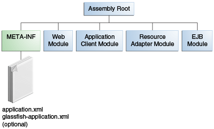

## Java EE 应用打包与部署

#### Packaging Applications

A Java EE application is delivered in a Java Archive (JAR) file, a Web Archive (WAR) file, or an Enterprise Archive (EAR) file. A WAR or EAR file is a standard JAR (.jar) file with a .war or .ear extension. Using JAR, WAR, and EAR files and modules makes it possible to assemble a number of different Java EE applications using some of the same components. No extra coding is needed; it is only a matter of assembling (or packaging) various Java EE modules into Java EE JAR, WAR, or EAR files.

An EAR file (see Figure 5-1) contains Java EE modules and, optionally, deployment descriptors. A deployment descriptor, an XML document with an .xml extension, describes the deployment settings of an application, a module, or a component. Because deployment descriptor information is declarative, it can be changed without the need to modify the source code. At runtime, the Java EE server reads the deployment descriptor and acts upon the application, module, or component accordingly.

Deployment information is most commonly specified in the source code by annotations. Deployment descriptors, if present, override what is specified in the source code.

Figure： EAR File Structure  


The two types of deployment descriptors are Java EE and runtime. A Java EE deployment descriptor is defined by a Java EE specification and can be used to configure deployment settings on any Java EE-compliant implementation. A runtime deployment descriptor is used to configure Java EE implementation-specific parameters. For example, the GlassFish Server runtime deployment descriptor contains such information as the context root of a web application as well as GlassFish Server implementation-specific parameters, such as caching directives. The GlassFish Server runtime deployment descriptors are named glassfish-moduleType.xml and are located in the same META-INF directory as the Java EE deployment descriptor.

A Java EE module consists of one or more Java EE components for the same container type and, optionally, one component deployment descriptor of that type. An enterprise bean module deployment descriptor, for example, declares transaction attributes and security authorizations for an enterprise bean. A Java EE module can be deployed as a stand-alone module.

Java EE modules are of the following types:
* EJB modules, which contain class files for enterprise beans and, optionally, an EJB deployment descriptor. EJB modules are packaged as JAR files with a .jar extension.
* Web modules, which contain servlet class files, web files, supporting class files, GIF and HTML files, and, optionally, a web application deployment descriptor. Web modules are packaged as JAR files with a .war (web archive) extension.
* Application client modules, which contain class files and, optionally, an application client deployment descriptor. Application client modules are packaged as JAR files with a .jar extension.
* Resource adapter modules, which contain all Java interfaces, classes, native libraries, and, optionally, a resource adapter deployment descriptor. Together, these implement the Connector architecture (see Java EE Connector Architecture) for a particular EIS. Resource adapter modules are packaged as JAR files with an .rar (resource adapter archive) extension.

#### Packaging Enterprise Beans

An EJB JAR file is portable and can be used for various applications.

To assemble a Java EE application, package one or more modules, such as EJB JAR files, into an EAR file, the archive file that holds the application. When deploying the EAR file that contains the enterprise bean's EJB JAR file, you also deploy the enterprise bean to GlassFish Server. You can also deploy an EJB JAR that is not contained in an EAR file. Figure 5-2 shows the contents of an EJB JAR file.

Figure：Structure of an Enterprise Bean JAR  


Enterprise beans often provide the business logic of a web application. In these cases, packaging the enterprise bean within the web application's WAR module simplifies deployment and application organization. Enterprise beans may be packaged within a WAR module as Java programming language class files or within a JAR file that is bundled within the WAR module.

To include enterprise bean class files in a WAR module, the class files should be in the WEB-INF/classes directory.

To include a JAR file that contains enterprise beans in a WAR module, add the JAR to the WEB-INF/lib directory of the WAR module.

WAR modules that contain enterprise beans do not require an ejb-jar.xml deployment descriptor. If the application uses ejb-jar.xml, it must be located in the WAR module's WEB-INF directory.

JAR files that contain enterprise bean classes packaged within a WAR module are not considered EJB JAR files, even if the bundled JAR file conforms to the format of an EJB JAR file. The enterprise beans contained within the JAR file are semantically equivalent to enterprise beans located in the WAR module's WEB-INF/classes directory, and the environment namespace of all the enterprise beans are scoped to the WAR module.

For example, suppose that a web application consists of a shopping cart enterprise bean, a credit card–processing enterprise bean, and a Java servlet front end. The shopping cart bean exposes a local, no-interface view and is defined as follows:

```java
package com.example.cart;

@Stateless
public class CartBean { ... }
```
The credit card–processing bean is packaged within its own JAR file, cc.jar, exposes a local, no-interface view, and is defined as follows:  
```java
package com.example.cc;

@Stateless
public class CreditCardBean { ... }
```

The servlet, com.example.web.StoreServlet, handles the web front end and uses both CartBean and CreditCardBean. The WAR module layout for this application is as follows:

```
WEB-INF/classes/com/example/cart/CartBean.class
WEB-INF/classes/com/example/web/StoreServlet
WEB-INF/lib/cc.jar
WEB-INF/ejb-jar.xml
WEB-INF/web.xml
```

#### Packaging Web Archives

In the Java EE architecture, a web module is the smallest deployable and usable unit of web resources. A web module contains web components and static web content files, such as images, which are called web resources. A Java EE web module corresponds to a web application as defined in the Java Servlet specification.

In addition to web components and web resources, a web module can contain other files:
* Server-side utility classes, such as shopping carts
* Client-side classes, such as utility classes

A web module has a specific structure. The top-level directory of a web module is the document root of the application. The document root is where XHTML pages, client-side classes and archives, and static web resources, such as images, are stored.

The document root contains a subdirectory named WEB-INF, which can contain the following files and directories:
* classes, a directory that contains server-side classes: servlets, enterprise bean class files, utility classes, and JavaBeans components
* lib, a directory that contains JAR files that contain enterprise beans, and JAR archives of libraries called by server-side classes
* Deployment descriptors, such as web.xml (the web application deployment descriptor) and ejb-jar.xml (an EJB deployment descriptor)

A web module needs a web.xml file if it uses JavaServer Faces technology, if it must specify certain kinds of security information, or if you want to override information specified by web component annotations.

You can also create application-specific subdirectories (that is, package directories) in either the document root or the WEB-INF/classes/ directory.

A web module can be deployed as an unpacked file structure or can be packaged in a JAR file known as a Web Archive (WAR) file. Because the contents and use of WAR files differ from those of JAR files, WAR file names use a .war extension. The web module just described is portable; you can deploy it into any web container that conforms to the Java Servlet specification.

You can provide a runtime deployment descriptor (DD) when you deploy a WAR on GlassFish Server, but it is not required under most circumstances. The runtime DD is an XML file that may contain such information as the context root of the web application, the mapping of the portable names of an application's resources to GlassFish Server resources, and the mapping of an application's security roles to users, groups, and principals defined in GlassFish Server. The GlassFish Server web application runtime DD, if used, is named glassfish-web.xml and is located in the WEB-INF directory. The structure of a web module that can be deployed on GlassFish Server is shown in Figure 5-3.

Figure: Web Module Structure  


说明
* WEB-INF	目录是固定的。放在下面的文件和目录对外界是封闭的，客户端无法直接访问。
* web.xml	web 应用的部署描述文件。文件名和位置固定。
* lib	放置 jar 文件的目录。目录名和位置固定。
* classes	放置编译后的 class 文件的目录。目录名和位置固定。
* web pages

请求 URI  
`requestURI = contextPath + servletPath + pathinfo`

* requestURI	 请求 URI  
	HttpServletRequest::getRequestURI()获取 URI。
* contextPath	 环境路径  
	HttpServletRequest::getContextPath()获取 contextPath。  
	是容器决定挑选哪个应用程序的依据。一个容器可对应多个 web 应用程序。如应用程序环境路径和 Web 服务器环境根路径相同，则应用程序环境路径为空字符串，否则，应用程序环境路径以“/”开头，不包括“/”结尾。  
	一旦决定是哪个 Web 应用程序来处理请求，接下来就进行 Servlet 的挑选，Servlet 必须设置 URL Pattern。
* servletPath	 Servlet 路径  
	HttpServletRequest::getServletPath()获取 servletPath。  
	Servlet 路径直接对应至 URL 模式信息。
* pathInfo	 路径信息  
	HttpServletRequest::getPathInfo()获取 pathInfo。  
	路径信息不包含参数，指的是不包含环境路径和 Servlet 路径部分的额外路径信息。

URL Pattern
* 路径映射 Path mapping:以“/”开头，以“/*”结尾的模式。如“/guest/*”，所有请求扣除环境路径的部分若为/guest/test.view，/guest/home.view 等以/guest/作为开头的，都会交给该 Servlet 处理。
* 扩展映射 extension mapping:以“*”开头的 URL 模式。如 URL 模式设置为“*.view”，则所有以.view 结尾的请求都会交由给 Servlet 处理。
* 环境根目录映射 Context root:空字符串“”是个特殊的 URL 模式，对应至环境根目录，也就是“/”的请求，但不用于设置<url-pattern>和 urlPattern 属性。
* 预设 Servlet :仅包括“/”的 URL 模式，当找不到合适的 URL 模式对应时，就会使用预设的 Servlet。
* 完全匹配 Exact match:不符合以上设置的其他字符串，都要作路径的严格对应。如设置为"/guest/test.view"，则请求不包含参数部分，必须是"/guest/test.view"。

如 URL 模式设置的比对规则在某些 URL 请求时有所重叠，则原则为从最严格的 URL 模式开始符合。

web-fragement.xml
* Servlet 3.0 中，可以使用标注来设置 Servlet 相关信息。
* Servlet 3.0 中，JAR 文件可以用来做为 Web 应用程序的部分模块。Servlet、监听器、过滤器均可以编写、定义标注完毕后，封装在 JAR 文件中，不是到 /WEB-INF/lib 中。JAR 文件也可以拥有自己的部署描述文件 web-fragement.xml。放在 JAR 文件的 META-INF 目录中。

Servlet

Servlet 在 web.xml 中有三个名字：<url-pattern>设置的逻辑名称，<servlet-name>注册的 Servlet 名称，<servlet-class>设置的实体类名。
* <servlet>	映射内部名到类名
* <servlet-mapping>	映射内部名到 URL 名

```xml
<web-app ...>

  <servlet>
    <servlet-name>InternalName1</servlet-name>
    <servlet-class>fo.Servlet1</servlet-class>
  </servlet>
	<servlet>
    <servlet-name>InternalName2</servlet-name>
    <servlet-class>fo.Servlet2</servlet-class>
  </servlet>

  <servlet-mapping>
    <servlet-name>InternalName1</servlet-name>
    <url-pattern>/Public1</url-pattern>
  </servlet-mapping>

  <servlet-mapping>
    <servlet-name>InternalName2</servlet-name>
    <url-pattern>/Public2</url-pattern>
  </servlet-mapping>

</web-app>
```

EJB 模块结构

```java
@WebServlet("/hello.view")
public class HelloServlet extends HttpServlet {
  protected void doGet(HttpServletRequest request, HttpServletResponse response)
        throws ServletException, IOException {
    // TODO Auto-generated method stub
	}
}
```


#### Packaging Resource Adapter Archives

A Resource Adapter Archive (RAR) file stores XML files, Java classes, and other objects for Java EE Connector Architecture (JCA) applications. A resource adapter can be deployed on any Java EE server, much like a Java EE application. A RAR file can be contained in an Enterprise Archive (EAR) file, or it can exist as a separate file.

The RAR file contains
* A JAR file with the implementation classes of the resource adapter
* An optional META-INF/ directory that can store an ra.xml file and/or an application server–specific deployment descriptor used for configuration purposes

A RAR file can be deployed on the application server as a standalone component or as part of a larger application. In both cases, the adapter is available to all applications using a lookup procedure.
