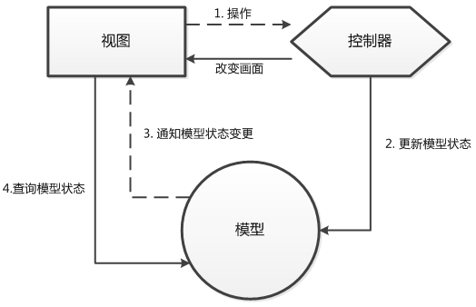
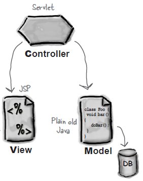
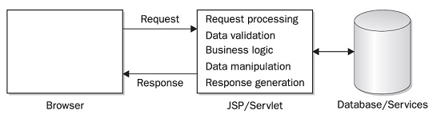
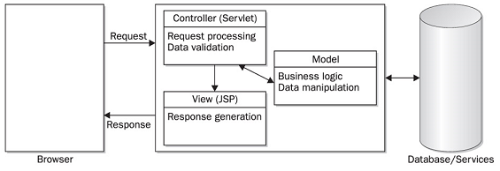
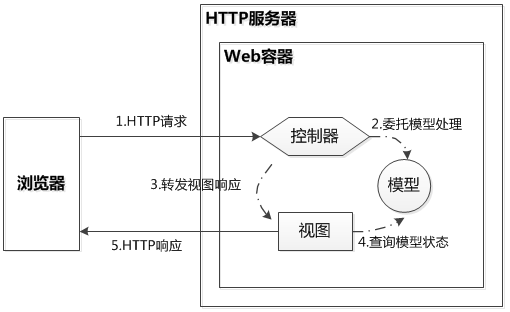
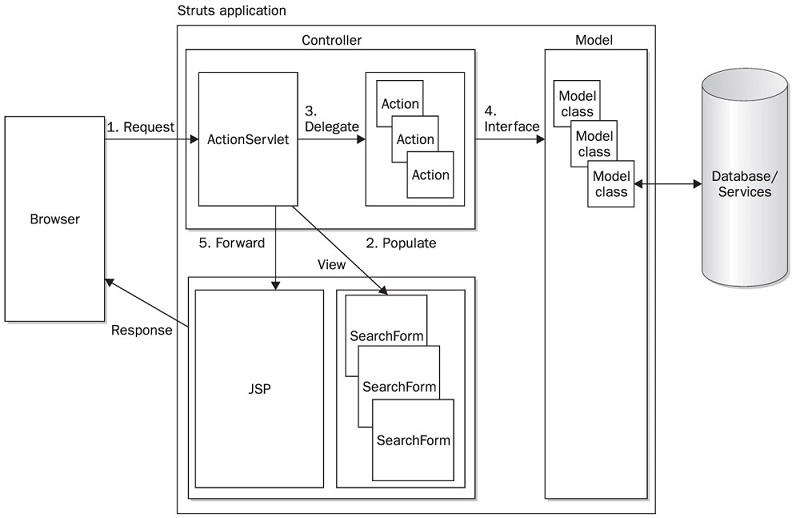
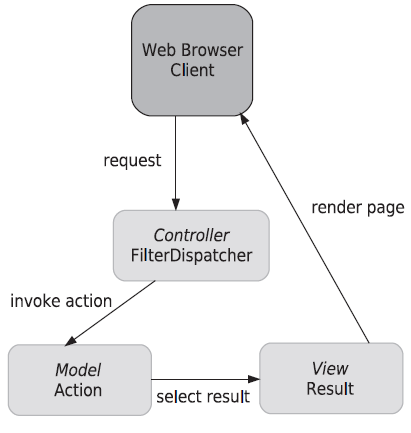
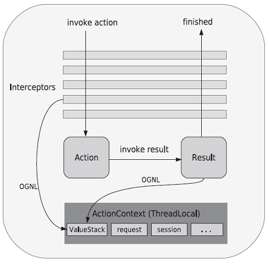

## MVC

#### MVC原理

MVC(Module、View、Control)分别为三种职责的对象。MVC 约定：
* 模型不会有画面相关的代码
* 视图负责画面相关逻辑
* 控制器知道某个操作必须调用哪些模型

MVC 职责分配，套用到 Web 应用程序设计上：
* 视图部分可由网页实现
* 服务器上的数据访问和业务逻辑由模型实现
* 控制器接送浏览器的请求，决定调用哪些模型来处理

#### MVC in the Servlet & JSP world

* **CONTROLLER**  
	Takes user input from the request and figures out what it means to the model.  
	Tells the model to update itself, and makes the new model state available for the view (the JSP).
* **VIEW**  
	Responsible for the presentation. It gets the state of the model from the Controller (although not directly; the Controller puts the model data in a place where the View can find it). It’s also the part that gets the user input that goes back to the Controller.
* **MODEL**  
	Holds the real business logic and the state. In other words, it knows the rules for getting and updating the state.  
	A Shopping Cart’s contents (and the rules for what to do with it) would be part of the Model in MVC.  
	It’s the only part of the system that talks to the database (although it probably uses another object for the actual DB communication, but we’ll save that pattern for later...)

#### MVC Model 1 architecture

#### Model 2 architecture

#### MVC/Model 2 架构说明
Web 应用程序基于 HTTP，必须基于请求/响应模型，没有请求，HTTP 服务器不可能主动对浏览器发出响应。对 MVC 模型做修订，形成 Model 2架构。

Model 2架构下，MVC 职责分配如下：
* 控制器：取得请求参数、验证请求参数、转发请求给模型、转发请求给画面，这些都是由程序代码实现。
* 模型：接受控制器的请求调用，负责处理业务逻辑、负责数据存取逻辑等。这部分还可依应用程序功能，产生多种不同职责的模型对象，模型由程序代码实现。
* 视图：接受控制器的请求调用，会从模型提取运算后的结果，根据需求呈现所需的画面，在职责分配良好的情况下，基本上可做到不出现程序代码，因此不会发生程序代码和 HTML 混杂在一起的情况。

#### Struts MVC 架构
**Struts 1**  
Struts Flow of execution  

**Struts 2**  
Struts 2 MVC is realized by three core framework components: actions, results, and the FilterDispatcher.  

Struts 2 request processing uses interceptors that fire before and after the action and result.  

