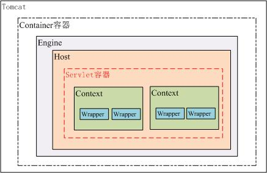
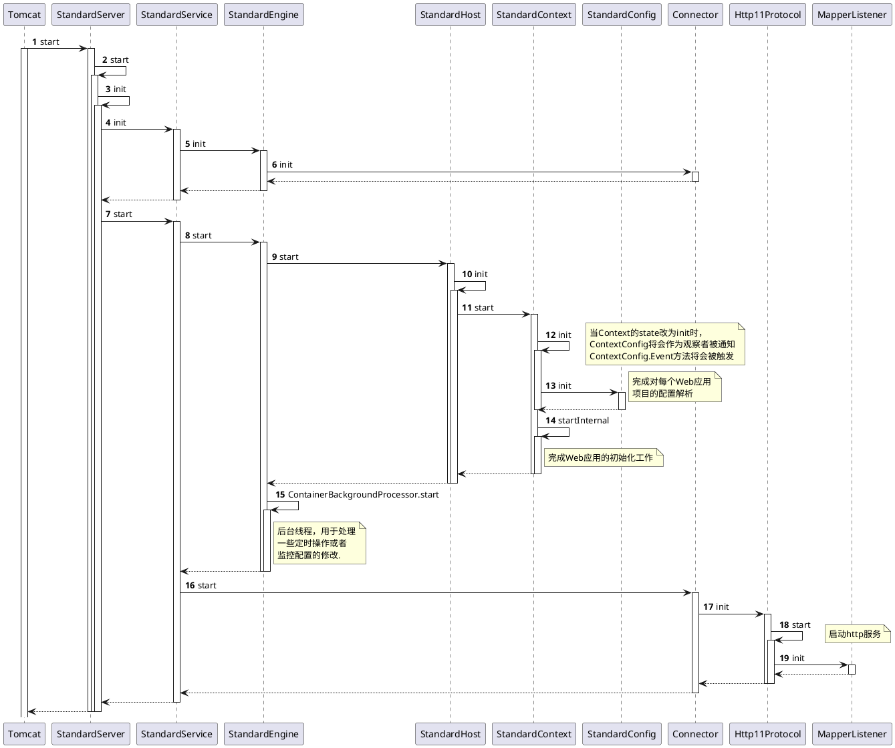

## Servlet

**参考文档**
* [Servlet 工作原理解析](https://www.ibm.com/developerworks/cn/java/j-lo-servlet/index.html)
* Tomcat 系统架构与设计模式
  [第1部分:工作原理](https://www.ibm.com/developerworks/cn/java/j-lo-tomcat1/index.html)
  [第2部分:设计模式分析](https://www.ibm.com/developerworks/cn/java/j-lo-tomcat2/)
* [Servlet工作原理](http://www.cnblogs.com/linux2009/articles/1693598.html)


## Servlet规范
一个最基本的 Java Web 项目所需的 jar 包只需要一个 `servlet-api.jar` ，这个 jar 包中的类大部分都是接口，还有一些工具类，共有 2 个包，分别是 `javax.servlet` 和 `javax.servlet.http`。所有的 Servlet 容器都带有这个包，你无需再放到Web项目里，放到这里只不过是编译的需要，运行是不需要的。如果你硬是把 `servlet-api.jar` 放到 `webapp/WEB-INF/lib` 目录下，那么 Tomcat 启动时还会报一个警告信息。
 
Servlet 是 J2EE 最重要的一部分，有了 Servlet 你就是 J2EE 了，J2EE 的其他方面的内容择需采用。而 Servlet 规范你需要掌握的就是 `servlet` 和 `filter` 这两项技术。绝大多数框架不是基于 servlet 就是基于 filter，如果它要在 Servlet 容器上运行，就永远也脱离不开这个模型。 
 
为什么 Servlet 规范会有两个包，`javax.servlet` 和 `javax.servlet.http` ，早先设计该规范的人认为 Servlet 是一种服务模型，不一定是依赖某种网络协议之上，因此就抽象出了一个 `javax.servlet`，同时在提供一个基于 HTTP 协议上的接口扩展。但是从实际运行这么多年来看，似乎没有发现有在其他协议上实现的 Servlet 技术。 
 
Servlet 规范其实就是对 HTTP 协议做面向对象的封装，HTTP协议中的请求和响应就是对应了 `HttpServletRequest` 和 `HttpServletResponse` 这两个接口。可以通过 `HttpServletRequest` 来获取所有请求相关的信息，包括 URI、Cookie、Header、请求参数等等，别无它路。因此当你使用某个框架时，你想获取HTTP请求的相关信息，只要拿到 `HttpServletRequest` 实例即可。 
而 `HttpServletResponse`接口是用来生产 HTTP 回应，包含 Cookie、Header 以及回应的内容等等。
HTTP 协议里是没有关于 Session 会话的定义，Session 是各种编程语言根据 HTTP 协议的无状态这种特点而产生的。其实现无非就是服务器端的一个哈希表，哈希表的Key就是传递给浏览器的名为 `jsessionid` 的 Cookie 值。 
 
当需要将某个值保存到 session 时，容器会执行如下几步：
1. 获取 `jsessionid` 值，没有的话就生成一个，也就是 `request.getSession()` 这个方法
2. 拿到的 `HttpSession` 对象实例就相当于一个哈希表，你可以往哈希表里存放数据(`setAttribute`)
3. 你也可以通过 `getAttribute` 来获取某个值 
而这个名为 `jsessionid` 的 `Cookie` 在浏览器关闭时会自动删除。把 `Cookie` 的 `MaxAge` 值设为 -1 就能达到浏览器关闭自动删除的效果。 
 
在 servlet 中有一个包 javax.servlet.jsp 是跟 JSP 相关的一些接口规范定义。JSP 比 Servlet 方便的地方在于可直接修改立即生效，不像 Servlet 修改后必须重启容器才能生效。 
因此 JSP 适合用来做视图，而 Servlet 则适合做控制层。 
 
**Servlet线程安全**

servlet中默认线程不安全，单例多线程，因此对于共享的数据（静态变量，堆中的对象实例等）自己维护进行同步控制，不要在`service`方法或`doGet`等由service分派出去的方法，直接使用`synchronized`方法，很显然要根据业务控制同步控制块的大小进行细粒度的控制，将不影响线程安全的耗时操作移出同步控制块；

针对Servlet的线程安全问题，Sun公司是提供有解决方案的：让Servlet去实现一个`SingleThreadModel`接口，如果某个Servlet实现了`SingleThreadModel`接口，那么Servlet引擎将以单线程模式来调用其service方法。

查看Sevlet的API可以看到，`SingleThreadModel`接口中没有定义任何方法和常量，在Java中，把没有定义任何方法和常量的接口称之为标记接口，经常看到的一个最典型的标记接口就是"Serializable"，这个接口也是没有定义任何方法和常量的，标记接口在Java中有什么用呢？主要作用就是给某个对象打上一个标志，告诉JVM，这个对象可以做什么，比如实现了"Serializable"接口的类的对象就可以被序列化，还有一个"Cloneable"接口，这个也是一个标记接口，在默认情况下，Java中的对象是不允许被克隆的，就像现实生活中的人一样，不允许克隆，但是只要实现了"Cloneable"接口，那么对象就可以被克隆了。
 
　　让Servlet实现了SingleThreadModel接口，只要在Servlet类的定义中增加实现SingleThreadModel接口的声明即可。  
　　对于实现了SingleThreadModel接口的Servlet，Servlet引擎仍然支持对该Servlet的多线程并发访问，其采用的方式是产生多个Servlet实例对象，并发的每个线程分别调用一个独立的Servlet实例对象。
　　实现SingleThreadModel接口并不能真正解决Servlet的线程安全问题，因为Servlet引擎会创建多个Servlet实例对象，而真正意义上解决多线程安全问题是指一个Servlet实例对象被多个线程同时调用的问题。事实上，在Servlet API 2.4中，已经将SingleThreadModel标记为Deprecated（过时的）。   
 Servlet（Filter）中的url-pattern
Serlvet和Filter有三种不同的匹配规则： 
（1）精确匹配：/foo； 
（2）路径匹配：/foo/*； 
（3）后缀匹配：*.html； 
Serlvet的匹配顺序是： 
首先进行精确匹配；如果不存在精确匹配的进行路径匹配；最后根据后缀进行匹配；一次请求只会匹配一个Servlet；（Filter是只要匹配成功就添加到FilterChain）
PS：其他写法（/foo/，/*.html，*/foo）都不对；“/foo*”不能匹配/foo，/foox；


## Servlet 工作原理解析

Web 技术成为当今主流的互联网 Web 应用技术之一，而 Servlet 是 Java Web 技术的核心基础。因而掌握 Servlet 的工作原理是成为一名合格的 Java Web 技术开发人员的基本要求。本文将带你认识 Java Web 技术是如何基于 Servlet 工作，你将知道：以 Tomcat 为例了解 Servlet 容器是如何工作的？一个 Web 工程在 Servlet 容器中是如何启动的？ Servlet 容器如何解析你在 web.xml 中定义的 Servlet ？用户的请求是如何被分配给指定的 Servlet 的？ Servlet 容器如何管理 Servlet 生命周期？你还将了解到最新的 Servlet 的 API 的类层次结构，以及 Servlet 中一些难点问题的分析。

### 从 Servlet 容器说起

要介绍 Servlet 必须要先把 Servlet 容器说清楚，Servlet 与 Servlet 容器的关系有点像枪和子弹的关系，枪是为子弹而生，而子弹又让枪有了杀伤力。虽然它们是彼此依存的，但是又相互独立发展，这一切都是为了适应工业化生产的结果。从技术角度来说是为了解耦，通过标准化接口来相互协作。既然接口是连接 Servlet 与 Servlet 容器的关键，那我们就从它们的接口说起。

前面说了 Servlet 容器作为一个独立发展的标准化产品，目前它的种类很多，但是它们都有自己的市场定位，很难说谁优谁劣，各有特点。例如现在比较流行的 Jetty，在定制化和移动领域有不错的发展，我们这里还是以大家最为熟悉 Tomcat 为例来介绍 Servlet 容器如何管理 Servlet。Tomcat 本身也很复杂，我们只从 Servlet 与 Servlet 容器的接口部分开始介绍，关于 Tomcat 的详细介绍可以参考我的另外一篇文章《 Tomcat 系统架构与模式设计分析》。
Tomcat 的容器等级中，Context 容器是直接管理 Servlet 在容器中的包装类 Wrapper，所以 Context 容器如何运行将直接影响 Servlet 的工作方式。

**Tomcat容器模型**  


从上图可以看出 Tomcat 的容器分为四个等级，真正管理 Servlet 的容器是 Context 容器，一个 Context 对应一个 Web 工程，在 Tomcat 的配置文件中可以很容易发现这一点，如下：
```xml
<Context path="/projectOne " docBase="/daat/projects/projectOne"
reloadable="true" />
```

下面详细介绍一下 Tomcat 解析 Context 容器的过程，包括如何构建 Servlet 的过程。

#### Servlet 容器的启动过程
Tomcat7 也开始支持嵌入式功能，增加了一个启动类 org.apache.catalina.startup.Tomcat。创建一个实例对象并调用 start 方法就可以很容易启动 Tomcat，我们还可以通过这个对象来增加和修改 Tomcat 的配置参数，如可以动态增加 Context、Servlet 等。下面我们就利用这个 Tomcat 类来管理新增的一个 Context 容器，我们就选择 Tomcat7 自带的 examples Web 工程，并看看它是如何加到这个 Context 容器中的。

**清单 2 . 给 Tomcat 增加一个 Web 工程**
```java
Tomcat tomcat = getTomcatInstance();
File appDir = new File(getBuildDirectory(), "webapps/examples");
tomcat.addWebapp(null, "/examples", appDir.getAbsolutePath());
tomcat.start();
ByteChunk res = getUrl("http://localhost:" + getPort() +
              "/examples/servlets/servlet/HelloWorldExample");
assertTrue(res.toString().indexOf("<h1>Hello World!</h1>") > 0);
```
清单 2 的代码是创建一个 Tomcat 实例并新增一个 Web 应用，然后启动 Tomcat 并调用其中的一个 `HelloWorldExample` Servlet，看有没有正确返回预期的数据。

Tomcat 的 `addWebapp` 方法的代码如下：
```java
public Context addWebapp(Host host, String url, String path) {
    silence(url);
    Context ctx = new StandardContext();
    ctx.setPath( url );
    ctx.setDocBase(path);
    if (defaultRealm == null) {
        initSimpleAuth();
    }
    ctx.setRealm(defaultRealm);
    ctx.addLifecycleListener(new DefaultWebXmlListener());
    ContextConfig ctxCfg = new ContextConfig();
    ctx.addLifecycleListener(ctxCfg);
    ctxCfg.setDefaultWebXml("org/apache/catalin/startup/NO_DEFAULT_XML");
    if (host == null) {
        getHost().addChild(ctx);
    } else {
        host.addChild(ctx);
    }
    return ctx;
}
```
前面已经介绍了一个 Web 应用对应一个 Context 容器，也就是 Servlet 运行时的 Servlet 容器，添加一个 Web 应用时将会创建一个 StandardContext 容器，并且给这个 Context 容器设置必要的参数，url 和 path 分别代表这个应用在 Tomcat 中的访问路径和这个应用实际的物理路径，这个两个参数与清单 1 中的两个参数是一致的。其中最重要的一个配置是 ContextConfig，这个类将会负责整个 Web 应用配置的解析工作，后面将会详细介绍。最后将这个 Context 容器加到父容器 Host 中。  

接下去将会调用 Tomcat 的 start 方法启动 Tomcat，如果你清楚 Tomcat 的系统架构，你会容易理解 Tomcat 的启动逻辑，Tomcat 的启动逻辑是基于观察者模式设计的，所有的容器都会继承 Lifecycle 接口，它管理者容器的整个生命周期，所有容器的的修改和状态的改变都会由它去通知已经注册的观察者（Listener），关于这个设计模式可以参考《Tomcat 的系统架构与设计模式，第二部分：设计模式》。Tomcat 启动的时序图可以用图 2 表示。

**Tomcat 主要类的启动时序图**  




```java
public static void printServletCtxInfo(ServletContext servletContext)
        throws ServletException {
    // Get attribute names from servlet context
    Enumeration attributes = servletContext.getAttributeNames();

    // For each attribute, print name and value to log
    while (attributes.hasMoreElements()) {
        String attributeName = (String) attributes.nextElement();
        Object attribute = servletContext.getAttribute(attributeName);
        servletContext.log("Attribute :" + attributeName + " Attribute :" + attribute);
    }

    // Get parameter names from context
    Enumeration parameters = servletContext.getInitParameterNames();
    // For each parameter, print name and value to log
    while (parameters.hasMoreElements()) {
        String parameterName = (String) parameters.nextElement();
        Object parameterValue = servletContext.getAttribute(parameterName);
        servletContext.log("Parameter :" + parameterName + " Parameter Value :" + parameterValue);
    }

    // Get and log real path
    String servletPath = servletContext.getRealPath("/");
    servletContext.log("Servlet Path :" + servletPath);
    // Get and log server info
    String serverInformation = servletContext.getServerInfo();
    servletContext.log("Server Information :" + serverInformation);

    // Log major and minor version of API
    servletContext.log("Major Version :" + servletContext.getMajorVersion());
    servletContext.log("Minor Version :" + servletContext.getMinorVersion());

    // Get and log resource info

    try {
        java.net.URL resource = servletContext.getResource("/");
        servletContext.log("Resource: " + resource);
    }
    catch (MalformedURLException malformedURLException) {
        servletContext.log("  Error :" + malformedURLException);
    }
}
```


### Servlet工作原理

Tomcat容器模型：  
```
Tomcat -> (Container容器) Engine -> Host -> (Servlet容器) Context -> Wrapper
```
Tomcat 的容器分为四个等级，真正管理 Servlet 的容器是 Context 容器，一个 Context 对应一个 Web 工程。
```xml
<Context path="/projectOne " docBase="/projects/projectOne" reloadable="true" />
```

**Servlet 容器的启动过程**  
Tomcat7 也开始支持嵌入式功能，增加了一个启动类 `org.apache.catalina.startup.Tomcat`。创建一个实例对象并调用 start 方法就可以很容易启动 Tomcat，我们还可以通过这个对象来增加和修改 Tomcat 的配置参数，如可以动态增加 Context、Servlet 等。下面我们就利用这个 Tomcat 类来管理新增的一个 Context 容器，我们就选择 Tomcat7 自带的 examples Web 工程，并看看它是如何加到这个 Context 容器中的。  

给 Tomcat 增加一个 Web 工程
```java
Tomcat tomcat = getTomcatInstance();
File appDir = new File(getBuildDirectory(), "webapps/examples");
tomcat.addWebapp(null, "/examples", appDir.getAbsolutePath());
tomcat.start();
ByteChunk res = getUrl("http://localhost:" + getPort() +
               "/examples/servlets/servlet/HelloWorldExample");
assertTrue(res.toString().indexOf("<h1>Hello World!</h1>") > 0);
```

清单 1 的代码是创建一个 Tomcat 实例并新增一个 Web 应用，然后启动 Tomcat 并调用其中的一个 HelloWorldExample Servlet，看有没有正确返回预期的数据。

Tomcat 的 `addWebapp` 方法的代码如下：
```java
public Context addWebapp(Host host, String url, String path) {
	silence(url);
	Context ctx = new StandardContext();
	ctx.setPath(url);
	ctx.setDocBase(path);
	if (defaultRealm == null) {
		initSimpleAuth();
	}
	ctx.setRealm(defaultRealm);
	ctx.addLifecycleListener(new DefaultWebXmlListener());
	ContextConfig ctxCfg = new ContextConfig();
	ctx.addLifecycleListener(ctxCfg);
	ctxCfg.setDefaultWebXml("org/apache/catalin/startup/NO_DEFAULT_XML");
	if (host == null) {
		getHost().addChild(ctx);
	} else {
		host.addChild(ctx);
	}
	return ctx;
}
```

**启动流程**
1. [Tomcat].start     StandardServer.start
2. [StandardServer]   StandardServer.start
3. [StandardServer]   StandardServer.init
4. [StandardServer]   StandardEngine.init
5. [StandardEngine]   Connector.init
6. [Connector]    --> [StandardServer].init
7. [StandardServer]   StandardService.start
8. [StandardService]  StandardEngine.start
9. [StandardEngine]   StandardHost.start
10. [StandardHost]    StandardHost.init
11. [StandardHost]    StandardContext.start
12. [StandardContext] StandardContext.init
13. [StandardContext] ContextConfig.init
14. [ContextConfig]   StandardContext.startInternal
15. [StandardContext] StandardEngine.ContainerBackgroundProcessor.startInternal
16. [StandardService] Connector.start
17. [Connector]       Http11Protocol.init
18. [Http11Protocol]  Http11Protocol.start
19. [Http11Protocol]  MapperListener.init
20. [MapperListener] --> [Tomacat].start


### Tomcat 系统架构与设计模式
Tomcat 总体结构
