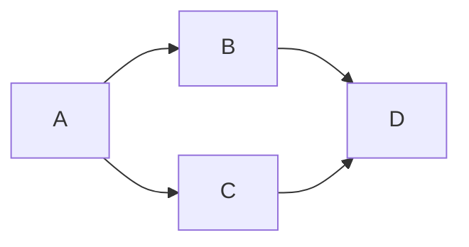
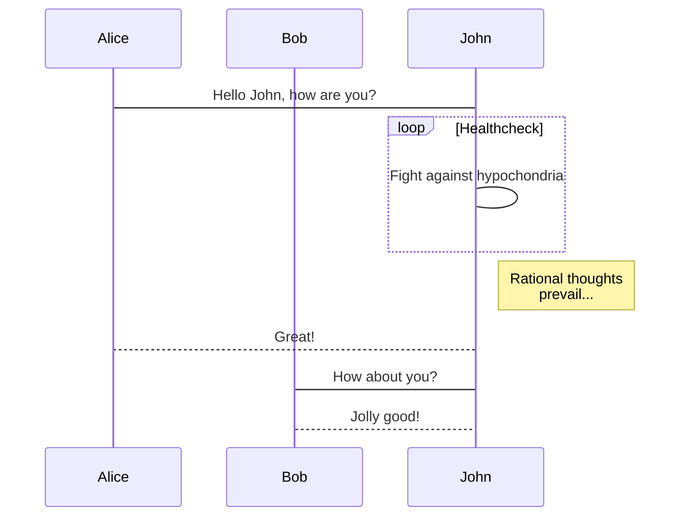
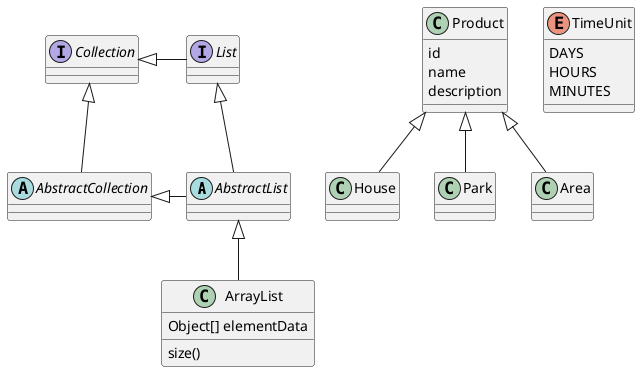
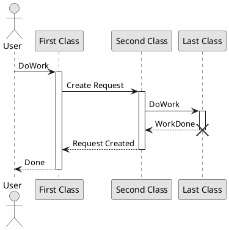

## Markdown Diagram

#### 流程图
```
st=>start: Start:>http://www.bing.com[blank]
e=>end:>http://www.bing.com
op1=>operation: My Operation
sub1=>subroutine: My Subroutine
cond=>condition: Yes or No?:>http://www.bing.com
io=>inputoutput: catch something...

st->op1->cond
cond(yes)->io->e
cond(no)->sub1(righy)->op1
```

```flow
st=>start: Start:>http://www.bing.com[blank]
e=>end:>http://www.bing.com
op1=>operation: My Operation
sub1=>subroutine: My Subroutine
cond=>condition: Yes or No?:>http://www.bing.com
io=>inputoutput: catch something...

st->op1->cond
cond(yes)->io->e
cond(no)->sub1(right)->op1
```

#### 时序图
```
Alice->Bob: Hello Bob, how are you?
Note right of Bob: Bob thinks
Bob-->Alice: How are you?
Alice->>Bob: I am good thanks!
```

```sequence 
Alice->Bob: Hello Bob, how are you?
Note right of Bob: Bob thinks
Bob-->Alice: How are you?
Alice->>Bob: I am good thanks!
```

```sequence {theme="hand"}
Alice->Bob: Hello Bob, how are you?
Note right of Bob: Bob thinks
Bob-->Alice: How are you?
Alice->>Bob: I am good thanks!
```

### Mermaid
流程图(flowchart)  


时序图(sequence diagram)


#### PlantUML
Class Digram


Sequence Digram


Timing Digram
@import "./scriptgraphs/puml-timing.puml"

#### WaveDrom
```wavedrom
{ signal: [
  { name: "clk",         wave: "p.....|..." },
  { name: "Data",        wave: "x.345x|=.x", data: ["head", "body", "tail", "data"] },
  { name: "Request",     wave: "0.1..0|1.0" },
  {},
  { name: "Acknowledge", wave: "1.....|01." }
]}
```

#### GraphViz
@import "./scriptgraphs/graphviz.dot" {as=viz}
