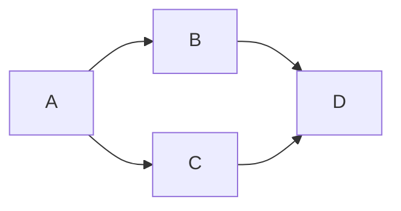
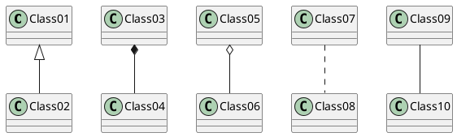

---
html:
  embed_local_images: true
  embed_svg: true
  offline: true
  toc: Markdown Preview Enhanced
print_background: false
---
# Markdown Preview Enhanced

## Markdown Preview Enhanced

# 一级标题
## 二级标题
### 三级标题
#### 四级标题
###### 六级标题

## 二级标题
### 三级标题
#### 四级标题
###### 六级标题


## Markdown Preview Enhanced

#### Online
* [markdown-preview-enhanced](https://shd101wyy.github.io/markdown-preview-enhanced/)
* [KaTeX and MathJax Comparison Demo](http://www.intmath.com/cg5/katex-mathjax-comparison.php)
* [mermaid docs](http://knsv.github.io/mermaid/#mermaid)
* [PlantUML in a nutshell](http://plantuml.com/)
* [Hitchhiker's Guide to the WaveDrom](http://wavedrom.com/tutorial.html)
* [CSDN-markdown语法之如何使用LaTeX语法编写数学公式](http://it.taocms.org/03/7247.htm)
* [DOT (graph description language)](https://en.wikipedia.org/wiki/DOT_(graph_description_language))


#### html 导出定制
在 markdown 文件开始插入如下内容
```
---
html:
  embed_local_images: true
  embed_svg: true
  offline: true
  toc: Markdown User Guide
print_background: false
---
```

#### PhantomJS 导出 
全局设置: 通过 `Markdown Preview Enhanced: Open PhantomJS Config` 命令，来打开并修改 `phantomjs_config.js` 文件。

单一文件设置：
```
---
phantomjs:
  orientation: landscape
---
```

自定义 CSS： 运行 `Markdown Preview Enhanced: Customize Css` 命令打开 `style.less` 文件修改。


#### import 外部文件
`@import "./scriptgraphs/puml-test.puml"`
@import "./scriptgraphs/puml-test.puml" {code_block=true}
@import "./scriptgraphs/puml-test.puml"


#### code chunk
* gnuplot
* matplotlib
* LaTex
* Plotly
* ER diagram

```{gnuplot output:"html", id:"chj3rwrfqp"}
set terminal svg
set title "Simple Plots" font ",20"
set key left box
set samples 50
set style data points

plot [-10:10] sin(x),atan(x),cos(atan(x))
```


#### KaTeX 或者 MathJax 来渲染数学表达式
* `$...$` 或 `\(...\)` 里的内容将被正常渲染。
* `$$...$$` 或 `\[...\]` 块代码 `math` 和 里的内容将用 displayMode 渲染。

行内公式：`$x^{y^z}=(1+e^x)^{-2xy^w}$` 显示：$x^{y^z}=(1+e^x)^{-2xy^w}$
块级公式：`$$f(x)=sin(x) + 12$$` 显示：$$f(x)=sin(x) + 12$$

块级示例：
```math
s = \sum_{n=1}^{100}
```
$$f(k)=\displaystyle= \frac{k(k+1)}{2}+k+1$$
```math
\frac{1}{\Bigl(\sqrt{\phi \sqrt{5}}-\phi\Bigr) e^{\frac25 \pi}} = 1+\frac{e^{-2\pi}} {1+\frac{e^{-4\pi}} {1+\frac{e^{-6\pi}} {1+\frac{e^{-8\pi}} {1+\cdots} } } }
```


#### Mermaid 渲染 flowchart 和 sequence diagram
* 代码块 `mermaid` 里的内容将被 `mermaid` 渲染。
* 查看 [mermaid](http://knsv.github.io/mermaid/#flowcharts-basic-syntax) 文档 来了解如何画图。

流程图(flowchart)  



#### PlantUML 渲染图形。 (Java 是必须的依赖)
* 你可以安装 `Graphviz` （非必需） 来生成其他种类的图形。
* 代码块 `puml` 或者 `plantuml` 里的内容将被 `PlantUML` 渲染。




#### WaveDrom 渲染 digital timing diagram
* 代码块 `wavedrom` 里的内容将被 `wavedrom` 渲染。

Adding Clock
```wavedrom
{ signal: [
  { name: "pclk", wave: 'p.......' },
  { name: "Pclk", wave: 'P.......' },
  { name: "nclk", wave: 'n.......' },
  { name: "Nclk", wave: 'N.......' },
  {},
  { name: 'clk0', wave: 'phnlPHNL' },
  { name: 'clk1', wave: 'xhlhLHl.' },
  { name: 'clk2', wave: 'hpHplnLn' },
  { name: 'clk3', wave: 'nhNhplPl' },
  { name: 'clk4', wave: 'xlh.L.Hx' },
]}
```
```wavedrom {code_block: true}
{ signal: [
  { name: "pclk", wave: 'p.......' },
  { name: "Pclk", wave: 'P.......' },
  { name: "nclk", wave: 'n.......' },
  { name: "Nclk", wave: 'N.......' },
  {},
  { name: 'clk0', wave: 'phnlPHNL' },
  { name: 'clk1', wave: 'xhlhLHl.' },
  { name: 'clk2', wave: 'hpHplnLn' },
  { name: 'clk3', wave: 'nhNhplPl' },
  { name: 'clk4', wave: 'xlh.L.Hx' },
]}
```
Period and Phase
```wavedrom
{ signal: [
  { name: "CK",   wave: "P.......",                                              period: 2  },
  { name: "CMD",  wave: "x.3x=x4x=x=x=x=x", data: "RAS NOP CAS NOP NOP NOP NOP", phase: 0.5 },
  { name: "ADDR", wave: "x.=x..=x........", data: "ROW COL",                     phase: 0.5 },
  { name: "DQS",  wave: "z.......0.1010z." },
  { name: "DQ",   wave: "z.........5555z.", data: "D0 D1 D2 D3" }
]}
```
```wavedrom {code_block: true}
{ signal: [
  { name: "CK",   wave: "P.......",                                              period: 2  },
  { name: "CMD",  wave: "x.3x=x4x=x=x=x=x", data: "RAS NOP CAS NOP NOP NOP NOP", phase: 0.5 },
  { name: "ADDR", wave: "x.=x..=x........", data: "ROW COL",                     phase: 0.5 },
  { name: "DQS",  wave: "z.......0.1010z." },
  { name: "DQ",   wave: "z.........5555z.", data: "D0 D1 D2 D3" }
]}
```

#### Viz.js 渲染 dot language 图形.
* 代码块 `viz` 里的内容将被 `Viz.js` 渲染。
* 在代码块第一行，可以通过`engine:[engine_name]`形式选择渲染引擎。比如:`engine:dot`。支持 `circo`, `dot`, `neato`, `osage`, or `twopi` 引擎。 `dot` 是默认引擎.

```viz
digraph { a -> b; }
```
```viz {code_block: true}
digraph { a -> b; }
```

#### reveal.js 渲染漂亮的 presentations
* `reveal.js` to render beautiful presentations.
