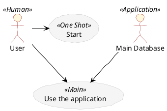

## PlantUML Diagrams

---
#### scriptgraphs/pu-version.puml
@import "scriptgraphs/pu-version.puml"
@import "scriptgraphs/pu-version.puml" {code_block=true class="line-numbers"}

---
#### Use Case

---
#### scriptgraphs/pu-class.puml
@import "scriptgraphs/pu-class.puml"
@import "scriptgraphs/pu-class.puml" {code_block=true class="line-numbers"}

---
#### scriptgraphs/pu-sequence.puml
@import "scriptgraphs/pu-sequence.puml"
@import "scriptgraphs/pu-sequence.puml" {code_block=true class="line-numbers"}

---
#### scriptgraphs/pu-activity.puml
@import "scriptgraphs/pu-activity.puml"
@import "scriptgraphs/pu-activity.puml" {code_block=true class="line-numbers"}

---
#### scriptgraphs/pu-usecase.puml
@import "scriptgraphs/pu-usecase.puml"
@import "scriptgraphs/pu-usecase.puml" {code_block=true class="line-numbers"}