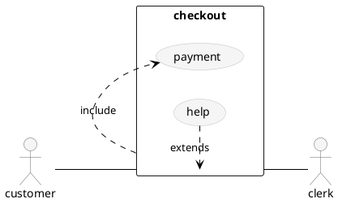
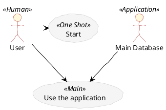
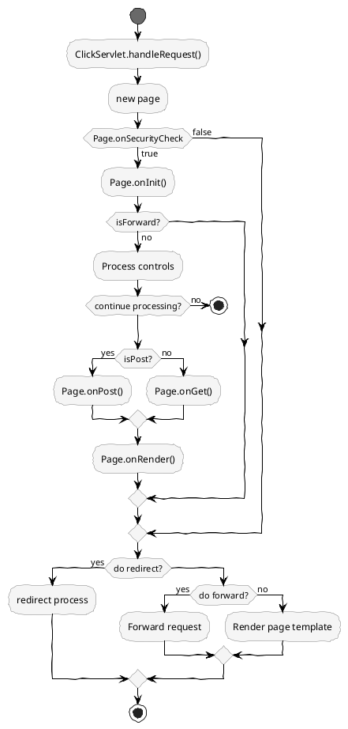
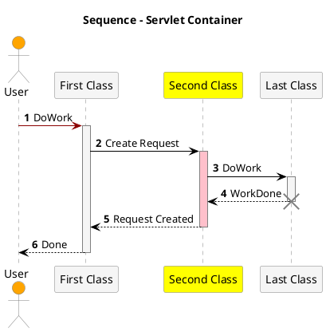
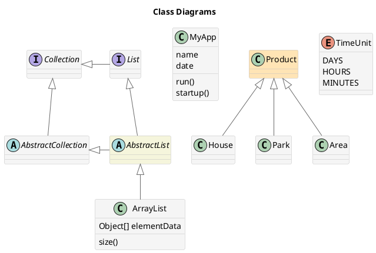

## PlantUML Diagrams

```plantuml
@startuml
checkversion
@enduml
```

---
#### Use Case Diagram





---
#### Activity Diagram



---
#### Sequence Diagram


---
#### Class Diagram



---
## PlantUML File List
#### `scriptgraphs/pu-class.puml`
@import "scriptgraphs/pu-class.puml"

---
#### `scriptgraphs/pu-sequence.puml`
@import "./scriptgraphs/pu-sequence.puml"

---
#### `scriptgraphs/pu-activity.puml`
@import "./scriptgraphs/pu-activity.puml"

---
#### `scriptgraphs/pu-usecase.puml`
@import "./scriptgraphs/pu-usecase.puml"
