## Migu UML

### 咪咕业务流程
---
#### 用户注册登录流程
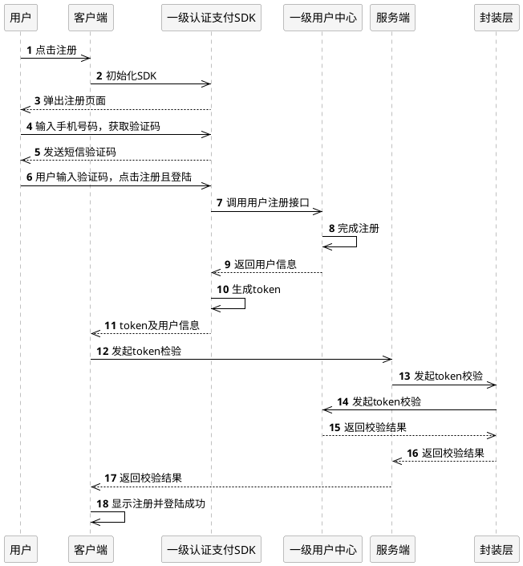
---
#### 内容使用流程
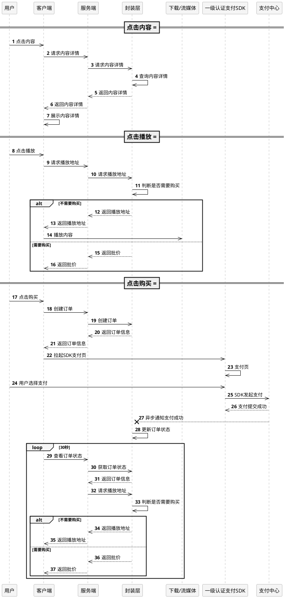

---
#### 合约类产品订购流程
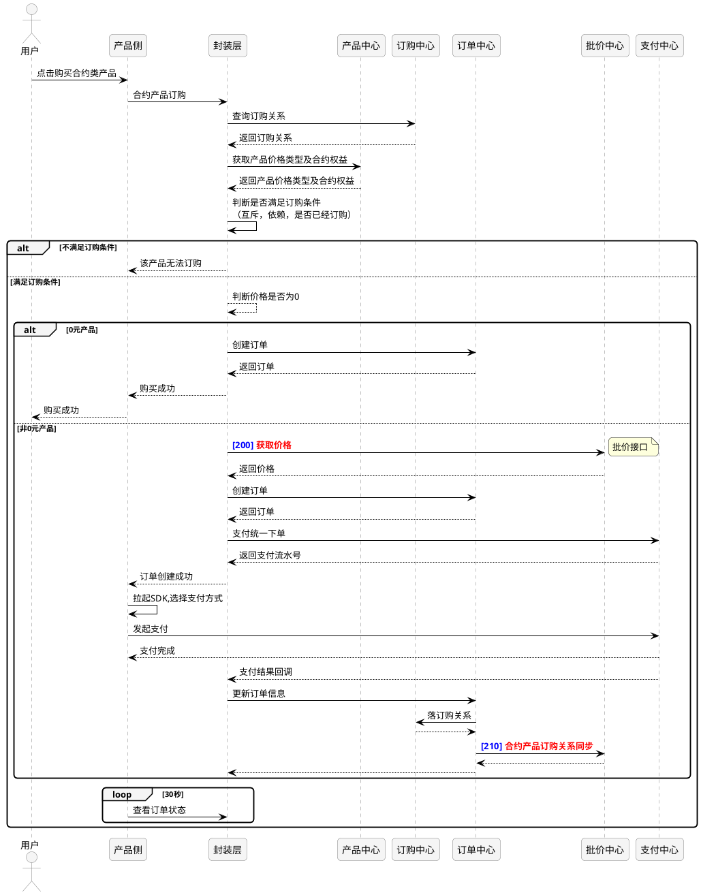

---
#### 用户注册登录流程
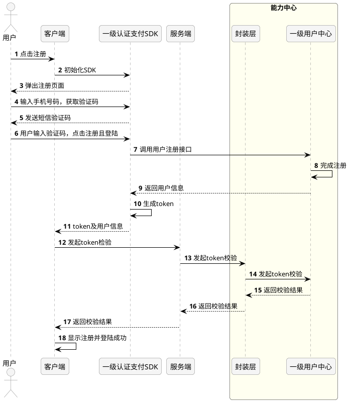

---
#### 内容使用流程
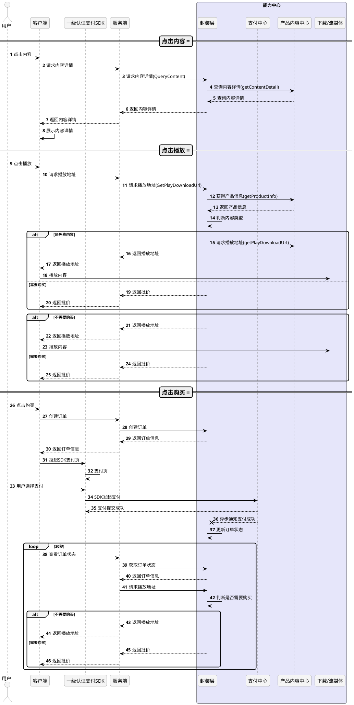

 

---
 

## 系统模型

---
#### 内容中心模型
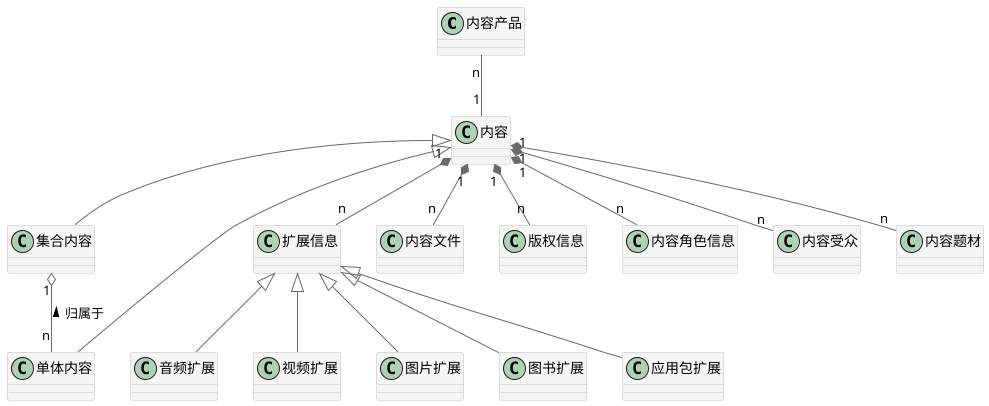

#### 合约类产品
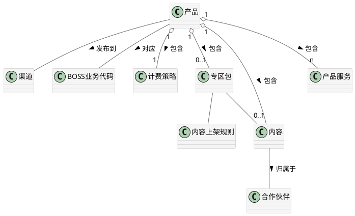

## Data Model
#### 产品
产品分为两大类：合约产品，点播产品；
点播产品又分为：点播产品(音乐)，点播产品(游戏)，点播产品(动漫阅读)和点播产品(视讯)

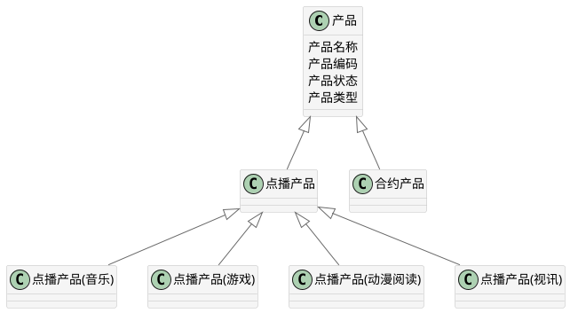

产品组成
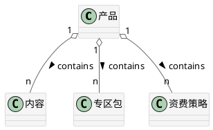

内容
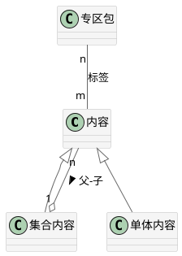

资费策略
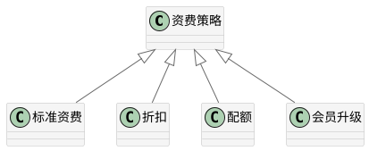

产品
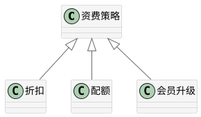

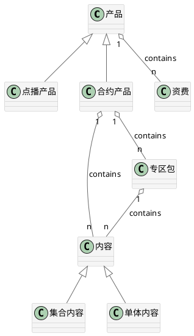
