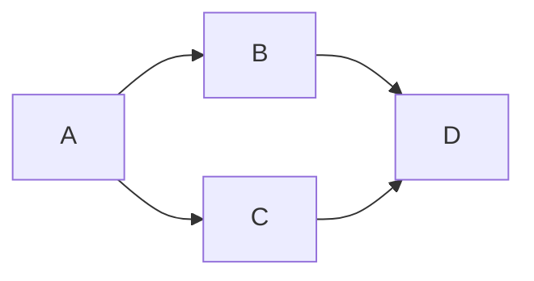
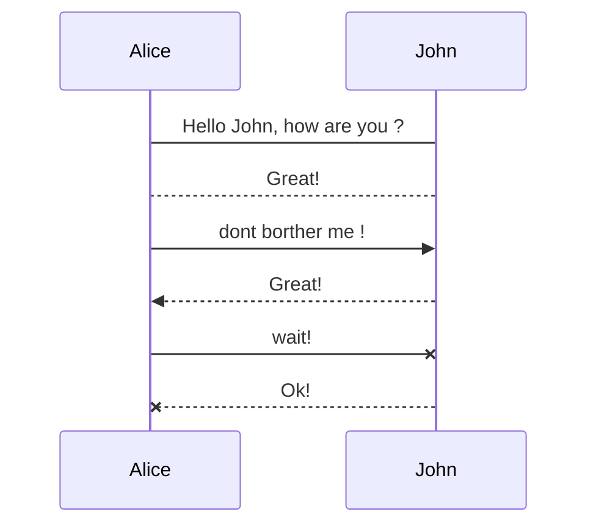
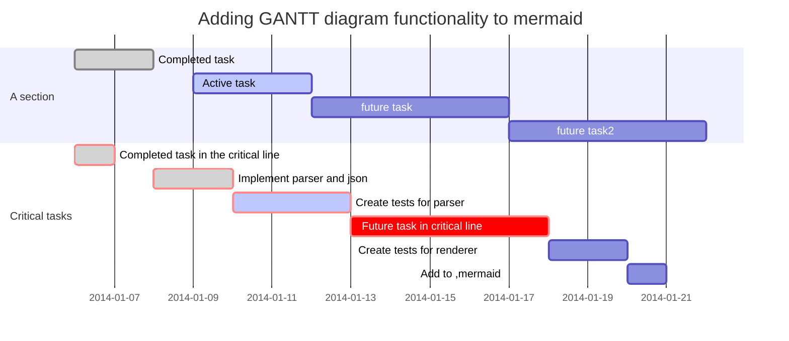
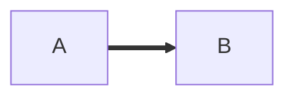
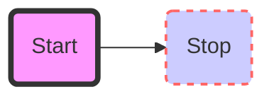

# mermaid

## 示例
流程图(flowchart)  



时序图 (Sequence Diagram)


GANNT Diagram


箭头形连接


图表 (带样式)


## 导入外部文件 
`@import *.mermaid`
```
@import "mermaid-flow.mermaid"
@import "mermaid-flow.mermaid" {code_block=true class="line-numbers"}
```

#### 流程图 (`mermaid-flow.mermaid`)
@import "mermaid-flow.mermaid"
@import "mermaid-flow.mermaid" {code_block=true class="line-numbers"}

#### 时序图 (`mermaid-sequence.mermaid`)
@import "mermaid-sequence.mermaid"
@import "mermaid-sequence.mermaid" {code_block=true class="line-numbers"}

#### 甘特图 (`mermaid-gantt.mermaid`)
@import "mermaid-gantt.mermaid"
@import "mermaid-gantt.mermaid" {code_block=true class="line-numbers"}

#### 项目计划
@import "mermaid-gantt-E01.mermaid"
