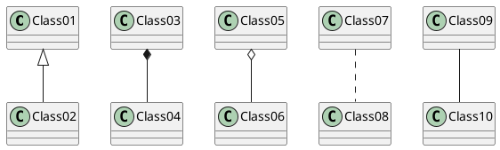
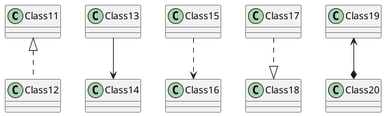
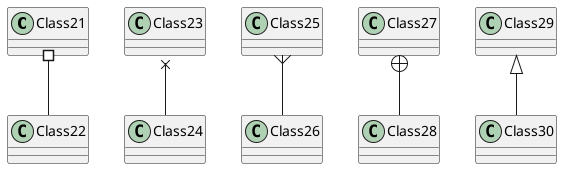
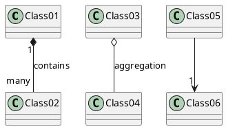
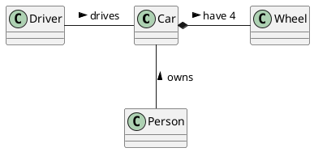
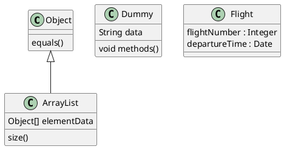
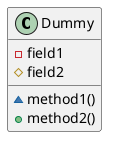
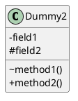
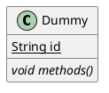
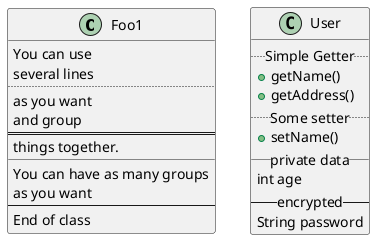

## 3. 类图 (PlantUML)
#### 3.1 类之间关系
* `<|--` 继承 ；`*--` 合成； * `o--` 聚合
* `--` 线；`..`点线；










#### 3.2 关系上的标识
* 在关系之间使用标签来说明时, 使用”`:`” 后接标签文字。
* 对元素的说明，你可以在每一边使用 `""` 来说明.
* 在标签的开始或结束位置添加 `<` 或 `>` 以表明是哪个对象作用到哪个对象上。







#### 3.3 添加方法
* 为了声明域或者方法，你可以使用后接域名或方法名。
* 系统检查是否有括号来判断是方法还是域。
* 也可以使用 `{` 把域或者方法括起来
  注意，这种语法对于类型/名字的顺序是非常灵活的。




#### 3.4 定义可访问性
* 一旦你定义了域或者方法，你可以定义相应条目的可访问性质。
* `-`(`private`); `#`(`protected`); `~`(`package private`); `+`(`public`);




* 你可以采用以下命令停用这些特性 `skinparam classAttributeIconSize 0 ：`




#### 3.5 抽象与静态
* 通过修饰符 `static` 或者 `abstract`，可以定义静态或者抽象的方法或者属性。
* 这些修饰符可以写在行的开始或者结束。也可以使用 `classifier` 这个修饰符来代替 `static`.




#### 3.6 高级类体
* PlantUML 默认自动将方法和属性重新分组，你可以自己定义分隔符来重排方法和属性，下面的分隔符 都是可用的：`--` `..` `==` `__`.
* 还可以在分隔符中添加标题：




#### 3.7 备注和模板
* 模板通过类关键字 (”`«`” 和”`»`”) 来定义
* 你可以使用 `note left of`, `note right of`, `note top of`, `note bottom of` 这些关键字来添加备注。
* 你还可以在类的声明末尾使用 `note left`, `note right`,`note top`, `note bottom` 来添加备注。
* 此外，单独用 `note` 这个关键字也是可以的，使用 `..` 符号可以作出一条连接它与其它对象的虚线。

```plantuml {code_block: true}
@startuml
class Object << general >>
Object <|--- ArrayList

note top of Object : In java, every class\nextends this one.

note "This is a floating note" as N1
note "This note is connected\nto several objects." as N2
Object .. N2
N2 .. ArrayList

class Foo
note left: On last defined class
@enduml
```

```plantuml
@startuml
class Object << general >>
Object <|--- ArrayList

note top of Object : In java, every class\nextends this one.

note "This is a floating note" as N1
note "This note is connected\nto several objects." as N2
Object .. N2
N2 .. ArrayList

class Foo
note left: On last defined class
@enduml
```

#### 3.8 更多注释
* 可以在注释中使用部分 `html` 标签：
  `<b>` `<u>` `<i>` `<s>` `<del>` `<strike>` `<font color="#AAAAAA">` or `<font color="colorName">` `<color:#AAAAAA>` or `<color:colorName>` `<size:nn>` to change font size `` or `` : the file must be accessible by the filesystem
* 你也可以在注释中展示多行。
* 你也可以在定义的 `class` 之后直接使用 `note left`, `note right`, `note top`, `note bottom` 来定义注释。

```plantuml {code_block: true}
@startuml
class Foo
note left: On last defined class

note top of Object
In java, <size:18>every</size> <u>class</u>
<b>extends</b>
<i>this</i> one.
end note

note as N1
This note is <u>also</u>
<b><color:royalBlue>on several</color>
<s>words</s> lines
And this is hosted by 
end note
@enduml
```

```plantuml
@startuml
class Foo
note left: On last defined class

note top of Object
In java, <size:18>every</size> <u>class</u>
<b>extends</b>
<i>this</i> one.
end note

note as N1
This note is <u>also</u>
<b><color:royalBlue>on several</color>
<s>words</s> lines
And this is hosted by 
end note
@enduml
```

#### 3.9 链接的注释
* 在定义链接之后，你可以用 `note on link` 给链接添加注释
* 如果想要改变注释相对于标签的位置，你也可以用 `note left on link`，`note right on link`，`note bottom on link`。（对应位置分别在 `label` 的左边，右边，下边）

```plantuml {code_block: true}
@startuml
class Dummy
Dummy --> Foo : A link
note on link #red: note that is red

Dummy --> Foo2 : Another link
note right on link #blue
this is my
note on right link
and in blue
end note
@enduml
```
```plantuml
@startuml
class Dummy
Dummy --> Foo : A link
note on link #red: note that is red

Dummy --> Foo2 : Another link
note right on link #blue
this is my
note on right link
and in blue
end note
@enduml
```
#### 3.10 抽象类和接口
* 用关键字"`abstract`" 或"`abstract class`" 来定义抽象类。抽象类用斜体显示。
* 也可以使用 `interface`, `annotation` 和 `enum` 关键字。

```plantuml {code_block: true}
@startuml
abstract class AbstractList
abstract AbstractCollection
interface List
interface Collection
List <|-- AbstractList
Collection <|-- AbstractCollection
Collection <|- List
AbstractCollection <|- AbstractList
AbstractList <|-- ArrayList
class ArrayList {
  Object[] elementData
  size()
}
enum TimeUnit {
  DAYS
  HOURS
  MINUTES
}
annotation SuppressWarnings
@enduml
```
```plantuml
@startuml
abstract class AbstractList
abstract AbstractCollection
interface List
interface Collection
List <|-- AbstractList
Collection <|-- AbstractCollection
Collection <|- List
AbstractCollection <|- AbstractList
AbstractList <|-- ArrayList
class ArrayList {
  Object[] elementData
  size()
}
enum TimeUnit {
  DAYS
  HOURS
  MINUTES
}
annotation SuppressWarnings
@enduml
```

#### 3.11 使用非字母字符
如果你想在类（或者枚举）的显示中使用非字母符号，你可以：
* 在类的定义中使用 `as` 关键字
* 在类名旁边加上 `""`

```plantuml
@startuml
class "This is my class" as class1
class class2 as "It works this way too"
class2 *-- "foo/dummy" : use
@enduml
```

#### 3.12 隐藏字段、、方法、属性、函数、等等
You can parameterize the display of classes using the `hide`/`show` command. The basic command is: `hide empty members`. This command will hide attributes or methods if they are empty.
Instead of `empty members`, you can use:
* `empty fields` or `empty attributes` for empty fields,
* `empty methods` for empty methods,
* `fields` or `attributes` which will hide fields, even if they are described,
* `methods` which will hide methods, even if they are described,
* `members` which will hide fields and methods, even if they are described,
* `circle` for the circled character in front of class name,
* `stereotype` for the stereotype.
You can also provide, just after the `hide` or `show` keyword:
* `class` for all classes,
* `interface` for all interfaces,
* `enum` for all enums,
* `<<foo1>>` for classes which are stereotyped with *foo1*,
* an existing class name.
You can use several `show`/`hide` commands to define rules and exceptions.
```plantuml {code_block: true}
@startuml
class Dummy1 {
  +myMethods()
}
class Dummy2 {
  +hiddenMethod()
}
class Dummy3 <<Serializable>> {
  String name
}
hide members
hide <<Serializable>> circle
show Dummy1 methods
show <<Serializable>> fields
@enduml
```

```plantuml
@startuml
class Dummy1 {
  +myMethods()
}
class Dummy2 {
  +hiddenMethod()
}
class Dummy3 <<Serializable>> {
  String name
}
hide members
hide <<Serializable>> circle
show Dummy1 methods
show <<Serializable>> fields
@enduml
```

#### 3.13 隐藏类
* 你也可以使用 `show`/`hide` 命令来隐藏类
* 如果你定义了一个大的`!included` 文件，且想在文件包含之后隐藏部分类，该功能会很有帮助。

```plantuml {code_block: true}
@startuml
class Foo1
class Foo2
Foo2 *-- Foo1
hide Foo2
@enduml
```

```plantuml
@startuml
class Foo1
class Foo2
Foo2 *-- Foo1
hide Foo2
@enduml
```

#### 3.14 Use generics
You can also use bracket < and > to define generics usage in a class.
```plantuml {code_block: true}
@startuml
class Foo<? extends Element> {
  int size()
}
Foo *- Element
@enduml
```

```plantuml
@startuml
class Foo<? extends Element> {
  int size()
}
Foo *- Element
@enduml
```

#### 3.15 Specific Spot
* Usually, a spotted character (`C`, `I`, `E` or `A`) is used for classes, interface, enum and abstract classes.
But you can define your own spot for a class when you define the stereotype, adding a single character and a color, like in this example:
```plantuml {code_block: true}
@startuml
class System << (S,#FF7700) Singleton >>
class Date << (D,orchid) >>
@enduml
```

```plantuml
@startuml
class System << (S,#FF7700) Singleton >>
class Date << (D,orchid) >>
@enduml
```

#### 3.16 Packages
* You can define a package using the package keyword, and optionally declare a background color for your package (Using a html color code or name).
* Note that package definitions can be nested.

```plantuml {code_block: true}
@startuml
package "Classic Collections" #DDDDDD {
  Object <|-- ArrayList
}
package net.sourceforge.plantuml {
  Object <|-- Demo1
  Demo1 *- Demo2
}
@enduml
```

```plantuml
@startuml
package "Classic Collections" #DDDDDD {
  Object <|-- ArrayList
}
package net.sourceforge.plantuml {
  Object <|-- Demo1
  Demo1 *- Demo2
}
@enduml
```

#### 3.17 Packages style
* There are different styles available for packages.
* You can specify them either by setting a default style with the command : skinparam packageStyle, or by using a stereotype on the package:

```plantuml {code_block: true}
@startuml
scale 750 width
package foo1 <<Node>> {
  class Class1
}
package foo2 <<Rectangle>> {
  class Class2
}
package foo3 <<Folder>> {
  class Class3
}
package foo4 <<Frame>> {
  class Class4
}
package foo5 <<Cloud>> {
  class Class5
}
package foo6 <<Database>> {
  class Class6
}
@enduml
```

```plantuml
@startuml
scale 750 width
package foo1 <<Node>> {
  class Class1
}
package foo2 <<Rectangle>> {
  class Class2
}
package foo3 <<Folder>> {
  class Class3
}
package foo4 <<Frame>> {
  class Class4
}
package foo5 <<Cloud>> {
  class Class5
}
package foo6 <<Database>> {
  class Class6
}
@enduml
```

* You can also define links between packages, like in the following example:

```plantuml {code_block: true}
@startuml
skinparam packageStyle rectangle
package foo1.foo2 {
}
package foo1.foo2.foo3 {
  class Object
}
foo1.foo2 +-- foo1.foo2.foo3
@enduml
```

```plantuml
@startuml
skinparam packageStyle rectangle
package foo1.foo2 {
}
package foo1.foo2.foo3 {
  class Object
}
foo1.foo2 +-- foo1.foo2.foo3
@enduml
```

#### 3.18 Namespaces
* In packages, the name of a class is the unique identifier of this class. It means that you cannot have two classes with the very same name in different packages.
* In that case, you should use namespaces instead of packages.
* You can refer to classes from other namespaces by fully qualify them. Classes from the default namespace are qualified with a starting dot.
* Note that you don’t have to explicitly create namespace : a fully qualified class is automatically put in the right namespace.

```plantuml {code_block:true}
@startuml
class BaseClass
namespace net.dummy #DDDDDD {
  .BaseClass <|-- Person
  Meeting o-- Person
  .BaseClass <|- Meeting
}
namespace net.foo {
  net.dummy.Person <|- Person
  .BaseClass <|-- Person
  net.dummy.Meeting o-- Person
}
BaseClass <|-- net.unused.Person
@enduml
```

```plantuml
@startuml
class BaseClass
namespace net.dummy #DDDDDD {
  .BaseClass <|-- Person
  Meeting o-- Person
  .BaseClass <|- Meeting
}
namespace net.foo {
  net.dummy.Person <|- Person
  .BaseClass <|-- Person
  net.dummy.Meeting o-- Person
}
BaseClass <|-- net.unused.Person
@enduml
```

#### 3.19 Automatic namespace creation
* You can define another separator (other than the dot) using the command : `set namespaceSeparator ???`.

```plantuml {code_block: true}
@startuml
set namespaceSeparator ::
class X1::X2::foo {
  some info
}
@enduml
```
```plantuml
@startuml
set namespaceSeparator ::
class X1::X2::foo {
  some info
}
@enduml
```
* You can disable automatic package creation using the command `set namespaceSeparator none`.
```plantuml {code_block: true}
@startuml
set namespaceSeparator none
class X1.X2.foo {
  some info
}
@enduml
```
```plantuml
@startuml
set namespaceSeparator none
class X1.X2.foo {
  some info
}
@enduml
```

#### 3.20 Lollipop interface
* You can also define lollipops interface on classes, using the following syntax: `bar ()- foo`;  `bar ()-- foo`; `foo -() bar`

```plantuml {code_block: true}
@startuml
class foo
bar ()- foo
@enduml
```
```plantuml
@startuml
class foo
bar ()- foo
@enduml
```

#### 3.21 改变箭头方向
类之间默认采用两个破折号 `--` 显示出垂直方向的线. 要得到水平方向的可以像这样使用单破折号 (或者点):
```plantuml {code_block: true}
@startuml
Room o- Student
Room *-- Chair
@enduml
```
```plantuml
@startuml
Room o- Student
Room *-- Chair
@enduml
```

你也可以通过改变倒置链接来改变方向
```plantuml {code_block: true}
@startuml
Student -o Room
Chair --* Room
@enduml
```
```plantuml
@startuml
Student -o Room
Chair --* Room
@enduml
```

也可通过在箭头内部使用关键字，例如 `left`, `right`, `up` 或者 `down`，来改变方向
```plantuml {code_block: true}
@startuml
foo -left-> dummyLeft
foo -right-> dummyRight
foo -up-> dummyUp
foo -down-> dummyDown
@enduml
```
```plantuml
@startuml
foo -left-> dummyLeft
foo -right-> dummyRight
foo -up-> dummyUp
foo -down-> dummyDown
@enduml
```
* You can shorten the arrow by using only the first character of the direction (for example, `-d-`instead of `-down-`) or the two first characters (`-do-`).
* Please note that you should not abuse this functionality : `Graphviz` gives usually good results without tweaking.

#### 3.22 Association classes

You can define association class after that a relation has been defined between two classes, like in this example:
```plantuml {code_block: true}
@startuml
class Student {
  Name
}

Student "0..*" - "1..*" Course
(Student, Course) .. Enrollment
class Enrollment {
  drop()
  cancel()
}
@enduml
```

```plantuml
@startuml
class Student {
  Name
}

Student "0..*" - "1..*" Course
(Student, Course) .. Enrollment
class Enrollment {
  drop()
  cancel()
}
@enduml
```
You can define it in another direction:
```plantuml {code_block: true}
@startuml
class Student {
  Name
}
Student "0..*" -- "1..*" Course
(Student, Course) . Enrollment

class Enrollment {
  drop()
  cancel()
}
@enduml
```
```plantuml
@startuml
class Student {
  Name
}
Student "0..*" -- "1..*" Course
(Student, Course) . Enrollment

class Enrollment {
  drop()
  cancel()
}
@enduml
```

#### 3.23 Skinparam
You can use the skinparam command to change colors and fonts for the drawing. You can use this command :
* In the diagram definition, like any other commands,
* In an included file,
* In a configuration file, provided in the command line or the ANT task.

```plantuml {code_block: true}
@startuml
skinparam class {
  BackgroundColor PaleGreen
  ArrowColor SeaGreen
  BorderColor SpringGreen
}

skinparam stereotypeCBackgroundColor YellowGreen

Class01 "1" *-- "many" Class02 : contains
Class03 o-- Class04 : aggregation
@enduml
```
```plantuml
@startuml
skinparam class {
  BackgroundColor PaleGreen
  ArrowColor SeaGreen
  BorderColor SpringGreen
}

skinparam stereotypeCBackgroundColor YellowGreen

Class01 "1" *-- "many" Class02 : contains
Class03 o-- Class04 : aggregation
@enduml
```

#### 3.24 Skinned Stereotypes
You can define specific color and fonts for stereotyped classes.
```plantuml {code_block: true}
@startuml
skinparam class {
  BackgroundColor PaleGreen
  ArrowColor SeaGreen
  BorderColor SpringGreen
  BackgroundColor<<Foo>> Wheat
  BorderColor<<Foo>> Tomato
}
skinparam stereotypeCBackgroundColor YellowGreen
skinparam stereotypeCBackgroundColor << Foo >> DimGray

Class01 <<Foo>>
Class03 <<Foo>>
Class01 "1" *-- "many" Class02 : contains
Class03 o-- Class04 : aggregation
@enduml
```
```plantuml
@startuml
skinparam class {
  BackgroundColor PaleGreen
  ArrowColor SeaGreen
  BorderColor SpringGreen
  BackgroundColor<<Foo>> Wheat
  BorderColor<<Foo>> Tomato
}
skinparam stereotypeCBackgroundColor YellowGreen
skinparam stereotypeCBackgroundColor << Foo >> DimGray

Class01 <<Foo>>
Class03 <<Foo>>
Class01 "1" *-- "many" Class02 : contains
Class03 o-- Class04 : aggregation
@enduml
```

#### 3.25 Color gradient
* It’s possible to declare individual color for classes or note using the notation.
* You can use either standard color name or RGB code.
* You can also use color gradient in background, with the following syntax: two colors names separated either by: `|`,  `/`,  `\`, or `~`
* depending the direction of the gradient.
* For example, you could have:

```plantuml {code_block: true}
@startuml
skinparam backgroundcolor AntiqueWhite/Gold
skinparam classBackgroundColor Wheat|CornflowerBlue

class Foo #red-green
note left of Foo #blue\9932CC
this is my note on this class
end note

package example #GreenYellow/LightGoldenRodYellow {
  class Dummy
}
@enduml
```

```plantuml
@startuml
skinparam backgroundcolor AntiqueWhite/Gold
skinparam classBackgroundColor Wheat|CornflowerBlue

class Foo #red-green
note left of Foo #blue\9932CC
this is my note on this class
end note

package example #GreenYellow/LightGoldenRodYellow {
  class Dummy
}
@enduml
```

#### 3.26 Help on layout
* Sometimes, the default layout is not perfect...
* You can use together keyword to group some classes together : the layout engine will try to group them (as if they were in the same package).
* You can also use hidden links to force the layout.

```plantuml {code_block: true}
@startuml
class Bar1
class Bar2
together {
  class Together1
  class Together2
  class Together3
}

Together1 - Together2
Together2 - Together3
Together2 -[hidden]--> Bar1
Bar1 -[hidden]> Bar2
@enduml
```
```plantuml
@startuml
class Bar1
class Bar2
together {
  class Together1
  class Together2
  class Together3
}

Together1 - Together2
Together2 - Together3
Together2 -[hidden]--> Bar1
Bar1 -[hidden]> Bar2
@enduml
```


#### 3.27 拆分大文件
* 有些情况下，会有一些很大的图片文件。
* 可以用”`page (hpages)x(vpages)`” 这个命令把生成的图片文件拆分成若干个文件。
* `hpages` 用来表示水平方向页面数，and `vpages` 用来表示垂直方面页面数。
* 你也可以使用特定的皮肤设定来给分页添加边框（见例子）
```plantuml
@startuml
' Split into 4 pages
page 2x2
skinparam pageMargin 10
skinparam pageExternalColor gray
skinparam pageBorderColor black

class BaseClass

namespace net.dummy #DDDDDD {
  .BaseClass <|-- Person
  Meeting o-- Person

  .BaseClass <|- Meeting
}

namespace net.foo {
  net.dummy.Person <|- Person
  .BaseClass <|-- Person

  net.dummy.Meeting o-- Person
}

BaseClass <|-- net.unused.Person
@enduml
```
