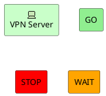
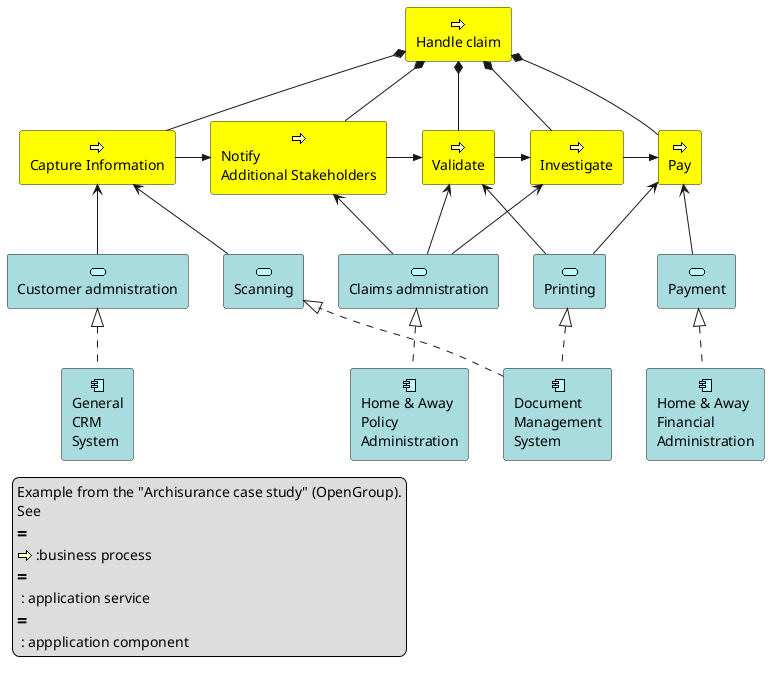
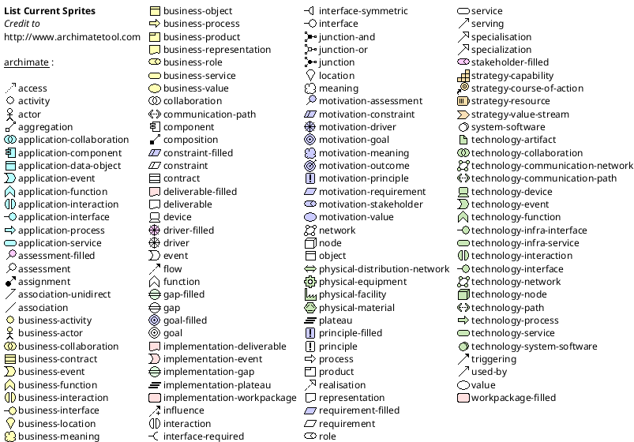
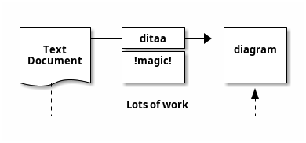
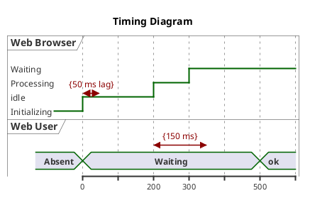

## Misc (PlantUML)

#### Archimate Diagram

@import "plantuml.puml"




**Defining Junctions**



**List possible sprites**



#### Ditaa



```plantuml {code_block: true}
@startuml
ditaa(--no-shadows, scale=0.8)
/--------\   +-------+
|cAAA    +---+Version|
|  Data  |   |   V3  |
|  Base  |   |cRED{d}|
|     {s}|   +-------+
\---+----/
@enduml
```


#### Timing Diagram

