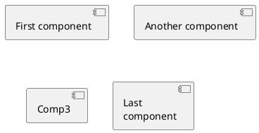
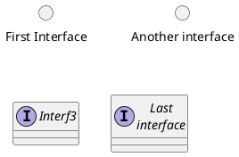
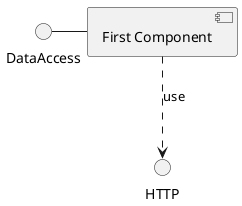
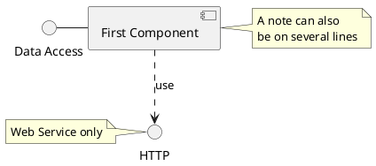
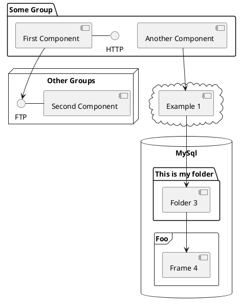
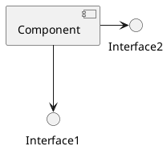
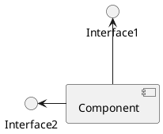
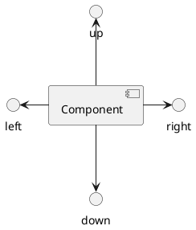
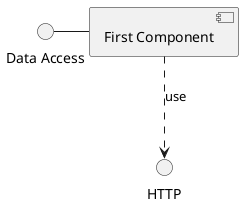
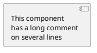

## 6. 组件图 (PlantUML)

#### 6.1 组件
组件必须用中括号括起来。
还可以使用关键字 `component` 定义一个组件。并且可以用关键字 `as` 给组件定义一个别名。这个别名可以在稍后定义关系的时候使用



#### 6.2 接口
接口可以使用 `()` 来定义 (因为这个看起来像个圆)。
还可以使用关键字 `interface` 关键字来定义接口。并且还可以使用关键字 `as` 定义一个别名。这个别名可以在稍后定义关系的时候使用。
我们稍后可以看到，接口的定义是可选的。



#### 6.3 基础的示例
元素之间可以使用虚线 (`..`)、直线 (`--`)、箭头 (`-->`) 进行连接。



#### 6.4 使用注释
你可以使用 `note left of`, `note right of`, `note top of`, `note bottom of` 等关键字定义相对于对象位置的注释。
也可以使用关键字 `note` 单独定义注释，然后使用虚线 (`..`) 将其连接到其他对象。



#### 6.5 组合组件
你可以使用多个关键字将组件和接口组合在一起。
`package`; `node`; `folder`; `frame`; `cloud`; `database`



#### 6.6 改变箭头方向
默认情况下，对象之间用 --连接，并且连接是竖直的。不过可以使用一个横线或者点设置水平方 向的连接，就行这样：


也可以使用反向连接：



还可以使用关键字 `left`, `right`, `up` or `down` 改变箭头方向。


允许使用方向单词的首字母或者前两个字母表示方向 (例如 `-d-`, `-do-`, `-down-`都是等价的)。
请不要乱用这些功能：Graphviz(PlantUML 的后端引擎) 不喜欢这个样子。

#### 6.7 使用 UML2 标记符
命令 `skinparam componentStyle uml2` 可以切换到 UML2 标记符。



#### 6.8 Long description
It is possible to put description on several lines using square brackets.



#### 6.9 不同的颜色表示
你可以在声明一个组件时加上颜色的声明。
```plantuml {code_block: true}
@startuml
component [Web Server] #Yellow
@enduml
```

```plantuml
@startuml
component [Web Server] #Yellow
@enduml
```

#### 6.10 Using Sprite in Stereotype
You can use sprites within stereotype components.
```plantuml {code_block: true}
@startuml
sprite $businessProcess [16x16/16] {
FFFFFFFFFFFFFFFF
FFFFFFFFFFFFFFFF
FFFFFFFFFFFFFFFF
FFFFFFFFFFFFFFFF
FFFFFFFFFF0FFFFF
FFFFFFFFFF00FFFF
FF00000000000FFF
FF000000000000FF
FF00000000000FFF
FFFFFFFFFF00FFFF
FFFFFFFFFF0FFFFF
FFFFFFFFFFFFFFFF
FFFFFFFFFFFFFFFF
FFFFFFFFFFFFFFFF
FFFFFFFFFFFFFFFF
FFFFFFFFFFFFFFFF
}

rectangle " End to End\nbusiness process" <<$businessProcess>> {
  rectangle "inner process 1" <<$businessProcess>> as src
  rectangle "inner process 2" <<$businessProcess>> as tgt
  src -> tgt
}
@enduml
```

```plantuml
@startuml
sprite $businessProcess [16x16/16] {
FFFFFFFFFFFFFFFF
FFFFFFFFFFFFFFFF
FFFFFFFFFFFFFFFF
FFFFFFFFFFFFFFFF
FFFFFFFFFF0FFFFF
FFFFFFFFFF00FFFF
FF00000000000FFF
FF000000000000FF
FF00000000000FFF
FFFFFFFFFF00FFFF
FFFFFFFFFF0FFFFF
FFFFFFFFFFFFFFFF
FFFFFFFFFFFFFFFF
FFFFFFFFFFFFFFFF
FFFFFFFFFFFFFFFF
FFFFFFFFFFFFFFFF
}

rectangle " End to End\nbusiness process" <<$businessProcess>> {
  rectangle "inner process 1" <<$businessProcess>> as src
  rectangle "inner process 2" <<$businessProcess>> as tgt
  src -> tgt
}
@enduml
```

#### 6.11 显示参数
* 可以使用命令 `skinparam` 改变字体和颜色。
* 你可以在如下场景使用这些命令：
  `在图示的定义中`;
  `在包含进来的文件中`;
  `在命令行或者 ANT 任务提供的配置文件中`。
* 可以为构造类型和接口定义特殊的颜色和字体。
```plantuml {code_block: true}
@startuml
skinparam interface {
  backgroundColor RosyBrown
  borderColor orange
}
skinparam component {
  FontSize 13
  BackgroundColor<<Apache>> Red
  BorderColor<<Apache>> #FF6655
  FontName Courier
  BorderColor black
  BackgroundColor gold
  ArrowFontName Impact
  ArrowColor #FF6655
  ArrowFontColor #777777
}

() "Data Access" as DA
DA - [First Component]
[First Component] ..> () HTTP : use
HTTP - [Web Server] << Apache >>
@enduml
```

```plantuml
@startuml
skinparam interface {
  backgroundColor RosyBrown
  borderColor orange
}
skinparam component {
  FontSize 13
  BackgroundColor<<Apache>> Red
  BorderColor<<Apache>> #FF6655
  FontName Courier
  BorderColor black
  BackgroundColor gold
  ArrowFontName Impact
  ArrowColor #FF6655
  ArrowFontColor #777777
}

() "Data Access" as DA
DA - [First Component]
[First Component] ..> () HTTP : use
HTTP - [Web Server] << Apache >>
@enduml
```

```plantuml {code_block: true}
@startuml
[AA] <<static lib>>
[BB] <<shared lib>>
[CC] <<static lib>>

node node1
node node2 <<shared node>>
database Production

skinparam component {
  backgroundColor<<static lib>> DarkKhaki
  backgroundColor<<shared lib>> Green
}

skinparam node {
  borderColor Green
  backgroundColor Yellow
  backgroundColor<<shared node>> Magenta
}
skinparam databaseBackgroundColor Aqua
@enduml
```

```plantuml
@startuml
[AA] <<static lib>>
[BB] <<shared lib>>
[CC] <<static lib>>

node node1
node node2 <<shared node>>
database Production

skinparam component {
  backgroundColor<<static lib>> DarkKhaki
  backgroundColor<<shared lib>> Green
}

skinparam node {
  borderColor Green
  backgroundColor Yellow
  backgroundColor<<shared node>> Magenta
}
skinparam databaseBackgroundColor Aqua
@enduml
```


<!-- pagebreak -->
## 7 状态图
#### 7.1 简单状态
使用 (`[*]`) 开始和结束状态图。 使用 `-->` 添加箭头。
```plantuml {code_block: true}
@startuml
[*] --> State1
State1 --> [*]
State1 : this is a string
State1 : this is another string
State1 -> State2
State2 --> [*]
@enduml
```

```plantuml
@startuml
[*] --> State1
State1 --> [*]
State1 : this is a string
State1 : this is another string
State1 -> State2
State2 --> [*]
@enduml
```

#### 7.2 合成状态
一个状态也可能是合成的，必须使用关键字 `state` 和花括号来定义合成状态。
```plantuml {code_block: true}
@startuml
scale 350 width
[*] --> NotShooting

state NotShooting {
  [*] --> Idle
  Idle --> Configuring : EvConfig
  Configuring --> Idle : EvConfig
}

state Configuring {
  [*] --> NewValueSelection
  NewValueSelection --> NewValuePreview : EvNewValue
  NewValuePreview --> NewValueSelection : EvNewValueRejected
  NewValuePreview --> NewValueSelection : EvNewValueSaved

  state NewValuePreview {
    State1 -> State2
  }
}
@enduml
```

```plantuml
@startuml
scale 350 width
[*] --> NotShooting

state NotShooting {
  [*] --> Idle
  Idle --> Configuring : EvConfig
  Configuring --> Idle : EvConfig
}

state Configuring {
  [*] --> NewValueSelection
  NewValueSelection --> NewValuePreview : EvNewValue
  NewValuePreview --> NewValueSelection : EvNewValueRejected
  NewValuePreview --> NewValueSelection : EvNewValueSaved

  state NewValuePreview {
    State1 -> State2
  }
}
@enduml
```

#### 7.3 长名字
也可以使用关键字 `state` 定义长名字状态。
```plantuml {code_block: true}
@startuml
scale 600 width

[*] -> State1
State1 --> State2 : Succeeded
State1 --> [*] : Aborted
State2 --> State3 : Succeeded
State2 --> [*] : Aborted
state State3 {
  state "Accumulate Enough Data\nLong State Name" as long1
  long1 : Just a test
  [*] --> long1
  long1 --> long1 : New Data
  long1 --> ProcessData : Enough Data
}
State3 --> State3 : Failed
State3 --> [*] : Succeeded / Save Result
State3 --> [*] : Aborted
@enduml
```

```plantuml
@startuml
scale 600 width

[*] -> State1
State1 --> State2 : Succeeded
State1 --> [*] : Aborted
State2 --> State3 : Succeeded
State2 --> [*] : Aborted
state State3 {
  state "Accumulate Enough Data\nLong State Name" as long1
  long1 : Just a test
  [*] --> long1
  long1 --> long1 : New Data
  long1 --> ProcessData : Enough Data
}
State3 --> State3 : Failed
State3 --> [*] : Succeeded / Save Result
State3 --> [*] : Aborted
@enduml
```

#### 7.4 并发状态
用 `--`作为分隔符来合成并发状态。
```plantuml {code_block: true}
@startuml [*] --> Active

state Active {
  [*] -> NumLockOff
  NumLockOff --> NumLockOn : EvNumLockPressed
  NumLockOn --> NumLockOff : EvNumLockPressed
  --
  [*] -> CapsLockOff
  CapsLockOff --> CapsLockOn : EvCapsLockPressed
  CapsLockOn --> CapsLockOff : EvCapsLockPressed
  --
  [*] -> ScrollLockOff
  ScrollLockOff --> ScrollLockOn : EvCapsLockPressed
  ScrollLockOn --> ScrollLockOff : EvCapsLockPressed
}
@enduml
```

```plantuml
@startuml [*] --> Active

state Active {
  [*] -> NumLockOff
  NumLockOff --> NumLockOn : EvNumLockPressed
  NumLockOn --> NumLockOff : EvNumLockPressed
  --
  [*] -> CapsLockOff
  CapsLockOff --> CapsLockOn : EvCapsLockPressed
  CapsLockOn --> CapsLockOff : EvCapsLockPressed
  --
  [*] -> ScrollLockOff
  ScrollLockOff --> ScrollLockOn : EvCapsLockPressed
  ScrollLockOn --> ScrollLockOff : EvCapsLockPressed
}
@enduml
```

#### 7.5 箭头方向
使用 `->` 定义水平箭头，也可以使用下列格式强制设置箭头方向：
  `-down->` (default arrow); `-right->` or `->`; `-left->`; `-up->`

```plantuml {code_block: true}
@startuml
[*] -up-> First
First -right-> Second
Second --> Third
Third -left-> Last
@enduml
```

```plantuml
@startuml
[*] -up-> First
First -right-> Second
Second --> Third
Third -left-> Last
@enduml
```
可以用首字母缩写或者开始的两个字母定义方向 (如, `-d-`，`-down-`和 `-do-`是完全等价的)。 请不要滥用这些功能，Graphviz 不喜欢这样。


7.6 注释
可以用 `note left of`, `note right of`, `note top of`, `note bottom of` 关键字来定义注释。
还可以定义多行注释。
```plantuml {code_block: true}
@startuml
[*] --> Active
Active --> Inactive
note left of Active : this is a short\nnote
note right of Inactive
A note can also
be defined on
several lines
end note
@enduml
```
```plantuml
@startuml
[*] --> Active
Active --> Inactive
note left of Active : this is a short\nnote
note right of Inactive
A note can also
be defined on
several lines
end note
@enduml
```
以及浮动注释。
```plantuml {code_block: true}
@startuml
state foo
note "This is a floating note" as N1
@enduml
```
```plantuml
@startuml
state foo
note "This is a floating note" as N1
@enduml
```

#### 7.7 更多注释
可以在合成状态中放置注释。
```plantuml {code_block: true}
@startuml
[*] --> NotShooting
state "Not Shooting State" as NotShooting {
  state "Idle mode" as Idle
  state "Configuring mode" as Configuring
  [*] --> Idle
  Idle --> Configuring : EvConfig
  Configuring --> Idle : EvConfig
}
note right of NotShooting : This is a note on a composite state
@enduml
```
```plantuml
@startuml
[*] --> NotShooting
state "Not Shooting State" as NotShooting {
  state "Idle mode" as Idle
  state "Configuring mode" as Configuring
  [*] --> Idle
  Idle --> Configuring : EvConfig
  Configuring --> Idle : EvConfig
}
note right of NotShooting : This is a note on a composite state
@enduml
```

#### 7.8 显示参数
* 使用 `skinparam` 命令改变字体和颜色。
* 在如下场景使用： 在图示定义中; 在包含进来的文件中; 在命令行或 ANT 任务提供的配置文件中。
* 还可以为状态的构造类型指定特殊的字体和颜色。
```plantuml {code_block: true}
@startuml
skinparam backgroundColor LightYellow
skinparam state {
  StartColor MediumBlue
  EndColor Red
  BackgroundColor Peru
  BackgroundColor<<Warning>> Olive
  BorderColor Gray
  FontName Impact
}

[*] --> NotShooting
state "Not Shooting State" as NotShooting {
  state "Idle mode" as Idle <<Warning>>
  state "Configuring mode" as Configuring
  [*] --> Idle
  Idle --> Configuring : EvConfig
  Configuring --> Idle : EvConfig
}
NotShooting --> [*]
@enduml
```

```plantuml
@startuml
skinparam backgroundColor LightYellow
skinparam state {
  StartColor MediumBlue
  EndColor Red
  BackgroundColor Peru
  BackgroundColor<<Warning>> Olive
  BorderColor Gray
  FontName Impact
}

[*] --> NotShooting
state "Not Shooting State" as NotShooting {
  state "Idle mode" as Idle <<Warning>>
  state "Configuring mode" as Configuring
  [*] --> Idle
  Idle --> Configuring : EvConfig
  Configuring --> Idle : EvConfig
}
NotShooting --> [*]
@enduml
```


<!-- pagebreak -->

## 8 对象图 (PlantUML)
#### 8.1 对象的定义
使用关键字 object 定义实例。
```plantuml {code_block: true}
@startuml
object firstObject
object "My Second Object" as o2
@enduml
```

```plantuml
@startuml
object firstObject
object "My Second Object" as o2
@enduml
```

#### 8.2 对象之间的关系
* 对象之间的关系用如下符号定义：
  继承 `<|-`;  合成 `*-`; 聚合 `o-`; 也可以用”`..`” 来代替”`--`” 以使用点线。
* 知道了这些规则，就可以画下面的图：
* 可以用冒号给关系添加标签，标签内容紧跟在冒号之后。
* 用双引号在关系的两边添加基数。
```plantuml {code_block: true}
@startuml
object Object01
object Object02
object Object03
object Object04
object Object05
object Object06
object Object07
object Object08

Object01 <|-- Object02
Object03 *-- Object04
Object05 o-- "4" Object06
Object07 .. Object08 : some labels
@enduml
```

```plantuml
@startuml
object Object01
object Object02
object Object03
object Object04
object Object05
object Object06
object Object07
object Object08

Object01 <|-- Object02
Object03 *-- Object04
Object05 o-- "4" Object06
Object07 .. Object08 : some labels
@enduml
```

#### 8.3 添加属性
用冒号加属性名的形式声明属性。
```plantuml {code_block: true}
@startuml
object user
user : name = "Dummy"
user : id = 123
@enduml
```
```plantuml
@startuml
object user
user : name = "Dummy"
user : id = 123
@enduml
```

也可以用大括号批量声明属性。
```plantuml {code_block: true}
@startuml
object user {
  name = "Dummy"
  id = 123
}
@enduml
```

```plantuml
@startuml
object user {
  name = "Dummy"
  id = 123
}
@enduml
```

#### 8.4 类图中的通用特性
* 可见性
* 定义注释
* 使用包
* 美化输出内容


<!-- pagebreak -->
## 9 通用命令 (PlantUML)
#### 9.1 注释
所有以单引号开头的行 ' 都是注释 你也可以使用多行注释，多行注释以 /' 开头 '/ 结尾。

#### 9.2 脚注和标头
你可以使用 `header` 或 `footer` 给任何图示添加脚注或标头
还可以 (可选) 使用关键字 `center`, `left` 或 `right` 设置脚注或标头位置。
也可以定义多行脚注或标头。
还可以在标头或脚注中放置 `HTML` 语句。
```plantuml {code_block: true}
@startuml
Alice -> Bob: Authentication Request

header
<font color=red>Warning:</font>
Do not use in production.
endheader

center footer Generated for demonstration
@enduml
```

```plantuml
@startuml
Alice -> Bob: Authentication Request

header
<font color=red>Warning:</font>
Do not use in production.
endheader

center footer Generated for demonstration
@enduml
```

#### 9.3 缩放
* 你可以用缩放命令来调整生成的图像
* 你可以指定缩放因子你还可以指定宽度或者高度（像素）你也可以同时指定宽度和高度：图像将被 缩放到适合给定的大小。
  `scale 1.5`;
  `scale 2/3`;
  `scale 200 width`;
  `scale 200 height`;
  `scale 200*100`
  `scale max 300*200`;
  `scale max 1024 width`;
  `scale max 800 height`;

```plantuml {code_block: true}
@startuml
scale 180*90
Bob->Alice : hello
@enduml
```  
```plantuml
@startuml
scale 180*90
Bob->Alice : hello
@enduml
```

#### 9.4 标题（Title）
* `title` 关键字用于设置一个标题. 在标题描述中使用 `\n` 表示换行。
* Some skinparam settings are available to put borders on the title.

```plantuml {code_block: true}
@startuml
skinparam titleBorderRoundCorner 15
skinparam titleBorderThickness 2
skinparam titleBorderColor red
skinparam titleBackgroundColor Aqua-CadetBlue

title Simple communication\nexample

Alice -> Bob: Authentication Request
Bob --> Alice: Authentication Response
@enduml
```
```plantuml
@startuml
skinparam titleBorderRoundCorner 15
skinparam titleBorderThickness 2
skinparam titleBorderColor red
skinparam titleBackgroundColor Aqua-CadetBlue

title Simple communication\nexample

Alice -> Bob: Authentication Request
Bob --> Alice: Authentication Response
@enduml
```

* 你可以在标题中使用 `creole` 格式。
* 还可以使用关键字 `title` 和 `end title` 定义多行标题。

```plantuml {code_block: true}
@startuml
title
<u>Simple</u> communication
example on <i>several</i> lines and using <back:cadetblue>creole tags</back>
end title
Alice -> Bob: Authentication Request
Bob -> Alice: Authentication Response
@enduml
```
```plantuml
@startuml
title
<u>Simple</u> communication
example on <i>several</i> lines and using <back:cadetblue>creole tags</back>
end title
Alice -> Bob: Authentication Request
Bob -> Alice: Authentication Response
@enduml
```

#### 9.5 Caption
There is also a `caption` keyword to put a caption under the diagram.
```plantuml {code_block: true}
@startuml
caption figure 1
Alice -> Bob: Hello
@enduml
```
```plantuml
@startuml
caption figure 1
Alice -> Bob: Hello
@enduml
```

#### 9.6 给图表 (diagram) 添加备注
关键字 `legend` 和 `end legend` 用于添加备注。
可选项 `left`，`right` 和 `center` 可用于设置标注的对齐方式。
```plantuml {code_block: true}
@startuml
Alice -> Bob : Hello
legend right
Short legend
endlegend
@enduml
```

```plantuml
@startuml
Alice -> Bob : Hello
legend right
Short legend
endlegend
@enduml
```

<!-- pagebreak -->
## 10 Salt (PlantUML)
Salt 是 PlantUML 下面的子项目用来帮助用户来设计图形接口.
可以用 `@startsalt` 关键字，或者使用 `@startuml` 紧接着下一行使用 `salt` 关键字.


## 11 Creole (PlantUML)
* A light Creole engine have been integrated into PlantUML to have a standardized way of defining text style.
* All diagrams are now supporting this syntax.
* Note that ascending compatibility with HTML syntax is preserved.

## 12 修改字体和颜色 (PlantUML)
#### 12.1 使用方法
* 使用 `skinparam` 命令修改字体和颜色。例如：
  `skinparam backgroundColor yellow`
* 可以在如下场景中使用：
  在图示的定义中;
  在包含进来的文件中（见预处理）;
  在命令行或 ANT 任务提供的配置文件中。

#### 12.2 嵌套
* 为了避免重复，可以使用嵌套的定义。所以下面的定义：
  ```
  skinparam xxxxParam1 value1
  skinparam xxxxParam2 value2
  skinparam xxxxParam3 value3
  skinparam xxxxParam4 value4
  ```
* 完全等价于：
  ```
  skinparam xxxx {
    Param1 value1
    Param2 value2
    Param3 value3
    Param4 value4
  }
  ```

#### 12.3 颜色
既可以使用颜色的标准名字也可以使用 RGB 颜色值。

#### 12.4 字体的颜色、名字和尺寸
用如下参数改变字体属性：`xxxFontColor xxxFontSize` and `xxxFontName`。
例如：
  ```
  skinparam classFontColor red
  skinparam classFontSize 10
  skinparam classFontName Aapex
  ```
还可以改变默认的字体属性，像这样：`skinparam defaultFontName`。
例如： `skinparam defaultFontName Aapex`
注意字体名称有很高的系统依赖性，如果想有好的移植性，就不要过度依赖于字体名字。

#### 12.5 黑白色
可以使用 `skinparam monochrome true` 命令强制使用黑白色进行输出。
```plantuml {code_block: true}
@startuml
skinparam monochrome true
actor User
participant "First Class" as A
participant "Second Class" as B
participant "Last Class" as C

User -> A: DoWork
activate A
A -> B: Create Request
activate B
B -> C: DoWork
activate C
C --> B: WorkDone
destroy C
B --> A: Request Created
deactivate B
A --> User: Done
deactivate A
@enduml
```

```plantuml
@startuml
skinparam monochrome true
actor User
participant "First Class" as A
participant "Second Class" as B
participant "Last Class" as C

User -> A: DoWork
activate A
A -> B: Create Request
activate B
B -> C: DoWork
activate C
C --> B: WorkDone
destroy C
B --> A: Request Created
deactivate B
A --> User: Done
deactivate A
@enduml
```

<!-- pagebreak -->
## 13 预处理 (PlantUML)
* PlantUML 包含少量的预处理功能，该功能对所有类型的图示都可用。
* 预处理功能跟 C 语言的预处理非常类似，只是把 `#` 换成`!` 即可。

#### 13.1 引入文件
用`!include` 指令引入文件。
比如你可能有一个类出现在多个图示中，这时你可以定义一个文件保存该类的描述，然后在其他图 示描述文件中引入该文件而不用重复描述这个类。
```plantuml {code_block: true}
@startuml
!include List.iuml
List <|.. ArrayList
@enduml
```

```plantuml
@startuml
!include List.iuml
List <|.. ArrayList
@enduml
```

File `List.iuml`:
```
interface List
List : int size()
List : void clear()
```
* 文件 `List.iuml` 可以包含进多个图示描述中，一旦这个文件被修改，所有包含它的图示描述中都 会作相应的改动。
* A file can be only be included once. If you want to include several times the very same file, you have to use the directive `!include_many` instead of `!include`.
* 你可以在被引入的文件中声明多个 `@startuml/@enduml` 文本块，引入该文件时使用`!0` 语法来指定引入哪个 `@startuml/@enduml` 文本块，`0` 是文本块的编号。
* 举起个例子，`!include foo.txt!1` 表示 `foo.txt` 文件中的第二个 `@startuml/@enduml` 文本块被引入。
* You can also put an id to some `@startuml/@enduml` text block in an included file using `@startuml(id=MY_OWN_ID)` syntax and then include the block adding `!MY_OWN_ID` when including the file, so using something like !include `foo.txt!MY_OWN_ID`.

#### 13.2 通过 URL 引入文件
* 使用 `!includeurl` 指令可以从 Internet 或 Intranet 引入文件到你的图示中。
* 你也可以使用`!includeurl http://someurl.com/mypath!0`来指定 `http://someurl.com/mypath` 中引入某个 `@startuml/@enduml` 文本块，`!0` 表示第一个。

#### 13.3 定义常量
可以使用`!define` 指令定义常量，就像在 C 语音中定义常量一样，它只能包含字母、下划线或数 字，并且不能以数字作为开头。
```plantuml {code_block: true}
@startuml
!define SEQUENCE (S,#AAAAAA) Database Sequence
!define TABLE (T,#FFAAAA) Database Table

class USER << TABLE >>
class ACCOUNT << TABLE >>
class UID << SEQUENCE >>
USER "1" -- "*" ACCOUNT
USER -> UID
@enduml
```

```plantuml
@startuml
!define SEQUENCE (S,#AAAAAA) Database Sequence
!define TABLE (T,#FFAAAA) Database Table

class USER << TABLE >>
class ACCOUNT << TABLE >>
class UID << SEQUENCE >>
USER "1" -- "*" ACCOUNT
USER -> UID
@enduml
```

* 当然你也可以把所有的常量在一个文件中定义好，然后用`!include` 指令引入到图示的描述中。
* 常量可以用`!undef XXX` 指令取消。
* 你也可以在命令行中用 `-D` 指定常量。
  `java -jar plantuml.jar -DTITLE="My title" atest1.txt`
* 注意 -D 一定要放在”-jar plantuml.jar” 之后。

#### 13.4 宏定义
你可以定义带参数的宏。
```plantuml {code_block: true}
@startuml
!define module(x) component x <<module>>
module(ABC)
module(XYZ)
@enduml
```

```plantuml
@startuml
!define module(x) component x <<module>>
module(ABC)
module(XYZ)
@enduml
```
宏可以带有多个参数。
```plantuml {code_block: true}
@startuml
!define send(a,b,c) a->b : c
send(Alice, Bob, Hello)
send(Bob, Alice, ok)
@enduml
```

```plantuml
@startuml
!define send(a,b,c) a->b : c
send(Alice, Bob, Hello)
send(Bob, Alice, ok)
@enduml
```

#### 13.5 Adding date and time
You can also expand current date and time using the special variable `%date%`.
Date format can be specified using format specified in SimpleDataFormat documentation.
```plantuml {code_block: true}
@startuml
!define ANOTHER_DATE %date[yyyy.MM.dd 'at' HH:mm]%
Title Generated %date% or ANOTHER_DATE
alice -> bob
@enduml
```

```plantuml
@startuml
!define ANOTHER_DATE %date[yyyy.MM.dd 'at' HH:mm]%
Title Generated %date% or ANOTHER_DATE
alice -> bob
@enduml
```

#### 13.6 Other special variables
You can also use the following special variables: `%dirpath%` Path of the current file `%filename%` Name of the current file

#### 13.7 多行宏
可以使用`!definelong` 和 `!enddefinelong` 定义跨多行的宏。
```plantuml {code_block: true}
@startuml
!define DOUBLE(x) x x
!definelong AUTHEN(x,y)
x -> y : DOUBLE(hello)
y -> x : ok
!enddefinelong
AUTHEN(Bob,Alice)
@enduml
```
```plantuml
@startuml
!define DOUBLE(x) x x
!definelong AUTHEN(x,y)
x -> y : DOUBLE(hello)
y -> x : ok
!enddefinelong
AUTHEN(Bob,Alice)
@enduml
```

#### 13.8 Default values for macro parameters
It is possible to assign default values to macro parameters.
```plantuml {code_block: true}
@startuml
!define some_macro(x, y = "some default" , z = 'another default' ) x and y and z
class foo {
  some_macro(Z1, Z2, Z3)
  some_macro(Z1, Z2)
  some_macro(A)
}
@enduml
```
```plantuml
@startuml
!define some_macro(x, y = "some default" , z = 'another default' ) x and y and z
class foo {
  some_macro(Z1, Z2, Z3)
  some_macro(Z1, Z2)
  some_macro(A)
}
@enduml
```

#### 13.9 条件判断
使用`!ifdef XXX` 和 `!endif` 指令进行有条件的绘制。
只有当`!ifdef` 指令后的常量被定义之后，两个指令之间的命令才会有效。
还可以添加`!else` 部分，当常量没有被定义的时候这部分生效。
```plantuml {code_block: true}
@startuml
!include ArrayList.iuml
@enduml
```
```plantuml
@startuml
!include ArrayList.iuml
@enduml
```

之后就可以用`!define` 指令激活条件判断部分。
```plantuml {code_block: true}
@startuml
!define SHOW_METHODS
!include ArrayList.iuml
@enduml
```
```plantuml
@startuml
!define SHOW_METHODS
!include ArrayList.iuml
@enduml
```

还可以使用`!ifndef` 指令，含义跟`!ifdef XXX` 正好相反。
You can use boolean expression with parenthesis, operators and `||` in the test.
```plantuml {code_block: true}
@startuml
!define SHOW_FIELDS
!undef SHOW_METHODS
class foo {
  !ifdef SHOW_FIELDS || SHOW_METHODS
  This is shown
  !endif
  !ifdef SHOW_FIELDS && SHOW_METHODS
  This is NOT shown
  !endif
}
@enduml
```
```plantuml
@startuml
!define SHOW_FIELDS
!undef SHOW_METHODS
class foo {
  !ifdef SHOW_FIELDS || SHOW_METHODS
  This is shown
  !endif
  !ifdef SHOW_FIELDS && SHOW_METHODS
  This is NOT shown
  !endif
}
@enduml
```

#### 13.10 搜索路径
* 可以在命令行指定”`plantuml.include.path`” 属性。 例如：
  `java -Dplantuml.include.path="c:/mydir" -jar plantuml.jar atest1.txt`
* 注意 `-D` 选项必须在 `-jar` 选项之前，如果 `-D` 位于 `-jar` 之后，那么 `-D` 选项将会被用于定义 plantuml 的预处理常量。

#### 13.11 高级特效
可以使用 `##` 在宏参数之后追加文字。
```plantuml {code_block: true}
@startuml
!definelong COMP_TEXTGENCOMP(name)
[name] << Comp >>
interface Ifc << IfcType >> AS name##Ifc
name##Ifc - [name]
!enddefinelong
COMP_TEXTGENCOMP(dummy)
@enduml
```
```plantuml
@startuml
!definelong COMP_TEXTGENCOMP(name)
[name] << Comp >>
interface Ifc << IfcType >> AS name##Ifc
name##Ifc - [name]
!enddefinelong
COMP_TEXTGENCOMP(dummy)
@enduml
```

还可以在宏定义中定义其他宏。
```plantuml {code_block: true}
@startuml
!define DOUBLE(x) x x
!definelong AUTHEN(x,y)
x -> y : DOUBLE(hello)
y -> x : ok
!enddefinelong
AUTHEN(Bob,Alice)
@enduml
```
```plantuml
@startuml
!define DOUBLE(x) x x
!definelong AUTHEN(x,y)
x -> y : DOUBLE(hello)
y -> x : ok
!enddefinelong
AUTHEN(Bob,Alice)
@enduml
```

宏支持根据参数个数的多态定义。
```plantuml {code_block: true}
@startuml
!define module(x) component x <<module>>
!define module(x,y) component x as y <<module>>
module(foo)
module(bar, barcode)
@enduml
```
```plantuml
@startuml
!define module(x) component x <<module>>
!define module(x,y) component x as y <<module>>
module(foo)
module(bar, barcode)
@enduml
```

当使用文件引入的时候可以使用系统环境变量或者预定义常量。
```
!include %windir%/test1.txt
!define PLANTUML_HOME /home/foo
!include PLANTUML_HOME/test1.txt
```


<!-- pagebreak -->
## 14 国际化 (PlantUML)
PlantUML 语言使用字符定义角色、使用案例等待，但是字符并不仅限于 `A-Z` 的拉丁字符，它可以是来自任何语言的字符。
```plantuml {code_block: true}
@startuml
skinparam backgroundColor #EEEBDC
actor 使用者
participant "头等舱" as A
participant "第二类" as B
participant "最后一堂课" as 别的东西
使用者 -> A: 完成这项工作
activate A
A -> B: 创建请求
activate B
B -> 别的东西: 创建请求
activate 别的东西
别的东西 --> B: 这项工作完成
destroy 别的东西
B --> A: 创建请求
deactivate B
A --> 使用者: 做完
deactivate A
@enduml
```

```plantuml
@startuml
skinparam backgroundColor #EEEBDC
actor 使用者
participant "头等舱" as A
participant "第二类" as B
participant "最后一堂课" as 别的东西
使用者 -> A: 完成这项工作
activate A
A -> B: 创建请求
activate B
B -> 别的东西: 创建请求
activate 别的东西
别的东西 --> B: 这项工作完成
destroy 别的东西
B --> A: 创建请求
deactivate B
A --> 使用者: 做完
deactivate A
@enduml
```

#### 14.1 字符集
读取 UML 描述文件时使用系统默认的字符集。一般情况下这没有问题，但是有时你可能想使用其他字符集，如使用如下命令:
`java -jar plantuml.jar -charset UTF-8 files.txt` 或者使用 `ant` 任务:
```xml
<target name="main">
<plantuml dir="./src" charset="UTF-8" />
</target>
```
下面是可用的字符集 (这依赖于你的 Java 安装情况): `ISO-8859-1`, `UTF-8`, `UTF-16BE`, `UTF-16LE`, `UTF-16`.

## 15 可用的色彩名称 (PlantUML)
以下是 PlantUML 中可用的色彩名称. 这些名称是大小不敏感的。
