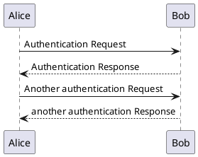
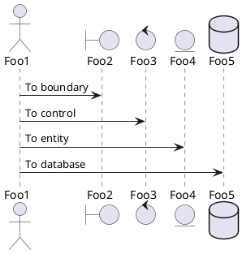
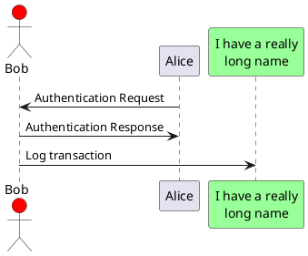
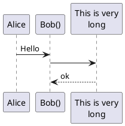
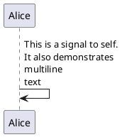
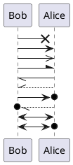
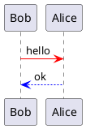
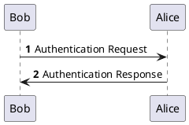
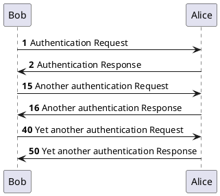
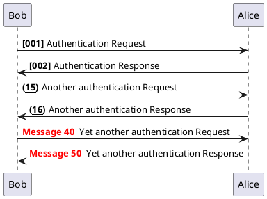

## 1. 时序图 (PlantUMLM)

#### 1.1 简单示例（Basic examples）
* 你可以用 `->` 来绘制参与者之间传递的消息，而不必显式地声明参与者。
* 你也可以使用”`-->`” 绘制一个虚线箭头表示异步消息。
* 另外，你还能用”`<-`” 和”`<--`”，这不影响绘图，但可以提高可读性。注意：仅适用于时序图，对于其它示意图，规则是不同的。




#### 1.2 声明参与者（Declaring participant）
* 关键字 `participant` 用于改变参与者的先后顺序。
* 你也可以使用其它关键字来声明参与者：
  `actor`; `boundary`; `control`; `entity`; `database`




* 关键字 `as` 用于重命名参与者
* 你可以使用 RGB 值或者颜色名修改 `actor` 或参与者的背景颜色。




<!-- pagebreak -->
#### 1.3 在参与者中使用非字母符号（Use non-letters in participants）
你可以使用引号定义参与者，还可以用关键字 `as` 给参与者定义别名。



#### 1.4 给自己发消息（Message to self）
参与者可以给自己发信息， 消息文字可以用 `\n` 来换行。



<!-- pagebreak -->
#### 1.5 修改箭头样式（Change arrow style）
修改箭头样式的方式有以下几种:
* 表示一条丢失的消息：末尾加 `x`
* 让箭头只有上半部分或者下半部分：将 `<` 和 `>` 替换成 `\` 或者 `/`
* 细箭头：将箭头标记写两次 (如 `>>` 或 `//`)
* 虚线箭头：用 `--` 替代
* 箭头末尾加圈：`->o`
* 双向箭头：`<->




#### 1.6 修改箭头颜色（Change arrow color）
你可以用以下记号修改箭头的颜色：



#### 1.7 对消息序列编号（Message sequence numbering）
关键字 `autonumber` 用于自动对消息编号。



语句 `autonumber 'start'` 用于指定编号的初始值，而 `autonumber 'start'` `'increment'` 可以同时指定编号的初始值和每次增加的值。



你可以在双引号内指定编号的格式。
格式是由 Java 的 `DecimalFormat` 类实现的：(’`0`’ 表示数字；’`#`’ 也表示数字，但默认为 `0`)。
你也可以用 `HTML` 标签来制定格式。



你还可以用语句 `autonumber stop` 和 `autonumber resume 'increment' 'format'` 来表示暂停或继 续使用自动编号。

```plantuml {code_block: true}
@startuml
autonumber 10 10 "<b>[000]"
Bob -> Alice : Authentication Request
Bob <- Alice : Authentication Response

autonumber stop
Bob -> Alice : dummy

autonumber resume "<font color=red><b>Message 0 "
Bob -> Alice : Yet another authentication Request
Bob <- Alice : Yet another authentication Response

autonumber stop
Bob -> Alice : dummy

autonumber resume 1 "<font color=blue><b>Message 0 "
Bob -> Alice : Yet another authentication Request
Bob <- Alice : Yet another authentication Response
@enduml
```

```plantuml
@startuml
autonumber 10 10 "<b>[000]"
Bob -> Alice : Authentication Request
Bob <- Alice : Authentication Response

autonumber stop
Bob -> Alice : dummy

autonumber resume "<font color=red><b>Message 0 "
Bob -> Alice : Yet another authentication Request
Bob <- Alice : Yet another authentication Response

autonumber stop
Bob -> Alice : dummy

autonumber resume 1 "<font color=blue><b>Message 0 "
Bob -> Alice : Yet another authentication Request
Bob <- Alice : Yet another authentication Response
@enduml
```

<!-- pagebreak -->
#### 1.8 分割示意图 (Splitting diagrams)
关键字 `newpage` 用于把一张图分割成多张。
在 `newpage` 之后添加文字，作为新的示意图的标题。
这样就能很方便地在 Word 中将长图分几页打印。

```plantuml {code_block: true}
@startuml
Alice -> Bob : message 1
Alice -> Bob : message 2

newpage

Alice -> Bob : message 3
Alice -> Bob : message 4

newpage A title for the\nlast page
Alice -> Bob : message 5
Alice -> Bob : message 6
@enduml
```

```plantuml
@startuml
Alice -> Bob : message 1
Alice -> Bob : message 2

newpage

Alice -> Bob : message 3
Alice -> Bob : message 4

newpage A title for the\nlast page
Alice -> Bob : message 5
Alice -> Bob : message 6
@enduml
```

#### 1.9 组合消息
* 我们可以通过以下关键词将组合消息：
  `alt/else`; `opt`; `loop`; `par`; `break`; `critical`; `group` 后面紧跟着消息内容
* 可以在标头 (`header`) 添加需要显示的文字 (`group` 除外)。 关键词 `end` 用来结束分组。
* 注意，分组可以嵌套使用。

```plantuml {code_block: true}
@startuml
Alice -> Bob: Authentication Request

alt successful case

Bob -> Alice: Authentication Accepted

else some kind of failure
Bob -> Alice: Authentication Failure
group My own label
Alice -> Log : Log attack start
loop 1000 times
Alice -> Bob: DNS Attack
end
Alice -> Log : Log attack end
end

else Another type of failure

Bob -> Alice: Please repeat

end
@enduml
```

```plantuml
@startuml
Alice -> Bob: Authentication Request

alt successful case

Bob -> Alice: Authentication Accepted

else some kind of failure
Bob -> Alice: Authentication Failure
group My own label
Alice -> Log : Log attack start
loop 1000 times
Alice -> Bob: DNS Attack
end
Alice -> Log : Log attack end
end

else Another type of failure

Bob -> Alice: Please repeat

end
@enduml
```

#### 1.10 给消息添加注释
我们可以通过在消息后面添加 `note left` 或者 `note right` 关键词来给消息添加注释。
你也可以通过使用 `end note` 来添加多行注释。
```plantuml {code_block: true}
@startuml
Alice->Bob : hello
note left: this is a first note

Bob->Alice : ok
note right: this is another note
Bob->Bob : I am thinking

note left
a note
can also be defined
on several lines
end note
@enduml
```

```plantuml
@startuml
Alice->Bob : hello
note left: this is a first note

Bob->Alice : ok
note right: this is another note

Bob->Bob : I am thinking
note left
a note
can also be defined
on several lines
end note
@enduml
```

#### 1.11 其他的注释
可以使用 `note left of`，`note right of` 或 `note over` 在节点 (`participant`) 的相对位置放置注释。
还可以通过修改背景色来高亮显示注释。
以及使用关键字 `end note` 来添加多行注释。
```plantuml {code_block: true}
@startuml
participant Alice
participant Bob
note left of Alice #aqua
This is displayed
left of Alice.
end note

note right of Alice: This is displayed right of Alice.
note over Alice: This is displayed over Alice.
note over Alice, Bob #FFAAAA: This is displayed\n over Bob and Alice.

note over Bob, Alice
This is yet another example of a long note.
end note
@enduml
```

```plantuml
@startuml
participant Alice
participant Bob
note left of Alice #aqua
This is displayed
left of Alice.
end note

note right of Alice: This is displayed right of Alice.
note over Alice: This is displayed over Alice.
note over Alice, Bob #FFAAAA: This is displayed\n over Bob and Alice.

note over Bob, Alice
This is yet another example of a long note.
end note
@enduml
```


#### 1.12 改变备注框的形状
你可以使用 `hnote` 和 `rnote` 这两个关键字来修改备注框的形状。
```plantuml {code_block: true}
@startuml
caller -> server : conReq
hnote over caller : idle
caller <- server : conConf
rnote over server
"r" as rectangle
"h" as hexagon
endrnote
@enduml
```

```plantuml
@startuml
caller -> server : conReq
hnote over caller : idle
caller <- server : conConf
rnote over server
"r" as rectangle
"h" as hexagon
endrnote
@enduml
```

#### 1.13 Creole 和 HTML
可以使用 creole 格式。
```plantuml {code_block: true}
@startuml
participant Alice
participant "The **Famous** Bob" as Bob

Alice -> Bob : hello --there-
... Some ~~long delay~~ ...
Bob -> Alice : ok
note left
This is **bold**
This is //italics//
This is ""monospaced""
This is --stroked-
This is __underlined__
This is ~~waved~~
end note

Alice -> Bob : A //well formatted// message
note right of Alice
This is <back:cadetblue><size:18>displayed</size></back>
__left of__ Alice.
end note
note left of Bob
<u:red>This</u> is <color #118888>displayed</color>
**<color purple>left of</color> <s:red>Alice</strike> Bob**.
end note
note over Alice, Bob
<w:#FF33FF>This is hosted</w> by 
end note
@enduml
```

```plantuml
@startuml
participant Alice
participant "The **Famous** Bob" as Bob

Alice -> Bob : hello --there-
... Some ~~long delay~~ ...
Bob -> Alice : ok
note left
This is **bold**
This is //italics//
This is ""monospaced""
This is --stroked-
This is __underlined__
This is ~~waved~~
end note

Alice -> Bob : A //well formatted// message
note right of Alice
This is <back:cadetblue><size:18>displayed</size></back>
__left of__ Alice.
end note
note left of Bob
<u:red>This</u> is <color #118888>displayed</color>
**<color purple>left of</color> <s:red>Alice</strike> Bob**.
end note
note over Alice, Bob
<w:#FF33FF>This is hosted</w> by 
end note
@enduml
```


#### 1.14 分隔符
你可以通过使用 `==` 关键词来将你的图表分割多个步骤。
```plantuml {code_block: true}
@startuml
== Initialization ==
Alice -> Bob: Authentication Request
Bob --> Alice: Authentication Response
== Repetition ==
Alice -> Bob: Another authentication Request
Alice <-- Bob: another authentication Response
@enduml
```

```plantuml
@startuml
== Initialization ==
Alice -> Bob: Authentication Request
Bob --> Alice: Authentication Response
== Repetition ==
Alice -> Bob: Another authentication Request
Alice <-- Bob: another authentication Response
@enduml
```

#### 1.15 引用
你可以在图中通过使用 `ref over` 关键词来实现引用
```plantuml {code_block: true}
@startuml
participant Alice
actor Bob

ref over Alice, Bob : init

Alice -> Bob : hello

ref over Bob
This can be on
several lines
end ref
@enduml
```

```plantuml
@startuml
participant Alice
actor Bob

ref over Alice, Bob : init

Alice -> Bob : hello

ref over Bob
This can be on
several lines
end ref
@enduml
```


#### 1.16 延迟
你可以使用`...` 来表示延迟，并且还可以给延迟添加注释。
```plantuml {code_block: true}
@startuml
Alice -> Bob: Authentication Request
...
Bob --> Alice: Authentication Response
...5 minutes latter...
Bob --> Alice: Bye !
@enduml
```

```plantuml
@startuml
Alice -> Bob: Authentication Request
...
Bob --> Alice: Authentication Response
...5 minutes latter...
Bob --> Alice: Bye !
@enduml
```

#### 1.17 空间
你可以使用 `|||` 来增加空间。
还可以使用数字指定增加的像素的数量。
```plantuml {code_block: true}
@startuml
Alice -> Bob: message 1
Bob --> Alice: ok
|||
Alice -> Bob: message 2
Bob --> Alice: ok
||45||
Alice -> Bob: message 3
Bob --> Alice: ok
@enduml
```

```plantuml
@startuml
Alice -> Bob: message 1
Bob --> Alice: ok
|||
Alice -> Bob: message 2
Bob --> Alice: ok
||45||
Alice -> Bob: message 3
Bob --> Alice: ok
@enduml
```


#### 1.18 生命线的激活与撤销
关键字 `activate` 和 `deactivate` 用来表示参与者的生命活动。
一旦参与者被激活，它的生命线就会显示出来。
`activate` 和 `deactivate` 适用于以上情形。
`destroy` 表示一个参与者的生命线的终结。

```plantuml {code_block: true}
@startuml
participant User

User -> A: DoWork
activate A

A -> B: << createRequest >>
activate B

B -> C: DoWork
activate C

C --> B: WorkDone
destroy C

B --> A: RequestCreated
deactivate B

A -> User: Done
deactivate A
@enduml
```

```plantuml
@startuml
participant User

User -> A: DoWork
activate A

A -> B: << createRequest >>
activate B

B -> C: DoWork
activate C

C --> B: WorkDone
destroy C

B --> A: RequestCreated
deactivate B

A -> User: Done
deactivate A
@enduml
```

还可以使用嵌套的生命线，并且运行给生命线添加颜色。
```plantuml {code_block: true}
@startuml
participant User

User -> A: DoWork
activate A #FFBBBB

A -> A: Internal call
activate A #DarkSalmon

A -> B: << createRequest >>
activate B

B --> A: RequestCreated
deactivate B
deactivate A
A -> User: Done
deactivate A
@enduml
```

```plantuml
@startuml
participant User

User -> A: DoWork
activate A #FFBBBB

A -> A: Internal call
activate A #DarkSalmon

A -> B: << createRequest >>
activate B

B --> A: RequestCreated
deactivate B
deactivate A
A -> User: Done
deactivate A
@enduml
```

#### 1.19 创建参与者
你可以把关键字 `create` 放在第一次接收到消息之前，以强调本次消息实际上是在创建新的对象。
```plantuml {code_block: true}
@startuml
Bob -> Alice : hello

create Other
Alice -> Other : new

create control String
Alice -> String
note right : You can also put notes!

Alice --> Bob : ok
@enduml
```

```plantuml
@startuml
Bob -> Alice : hello

create Other
Alice -> Other : new

create control String
Alice -> String
note right : You can also put notes!

Alice --> Bob : ok
@enduml
```

#### 1.20 进入和发出消息
如果只想关注部分图示，你可以使用进入和发出箭头。 使用方括号 [和] 表示图示的左、右两侧。
```plantuml {code_block: true}
@startuml
[-> A: DoWork

activate A

A -> A: Internal call
activate A

A ->] : << createRequest >>

A<--] : RequestCreated
deactivate A
[<- A: Done
deactivate A
@enduml
```

```plantuml
@startuml
[-> A: DoWork

activate A

A -> A: Internal call
activate A

A ->] : << createRequest >>

A<--] : RequestCreated
deactivate A
[<- A: Done
deactivate A
@enduml
```

还可以使用下面的语法:
```plantuml {code_block: true}
@startuml
[-> Bob
[o-> Bob
[o->o Bob
[x-> Bob

[<- Bob
[x<- Bob

Bob ->]
Bob ->o]
Bob o->o]
Bob ->x]

Bob <-]
Bob x<-]
@enduml
```

```plantuml
@startuml
[-> Bob
[o-> Bob
[o->o Bob
[x-> Bob

[<- Bob
[x<- Bob

Bob ->]
Bob ->o]
Bob o->o]
Bob ->x]

Bob <-]
Bob x<-]
@enduml
```

#### 1.21 构造类型和圈点
* 可以使用 `<<` 和 `>>` 给参与者添加构造类型。
* 在构造类型中，你可以使用 `(X,color)` 格式的语法添加一个圆圈圈起来的字符。

```plantuml {code_block: true}
@startuml
participant "Famous Bob" as Bob << Generated >>
participant Alice << (C,#ADD1B2) Testable >>
Bob->Alice: First message
@enduml
```

```plantuml
@startuml
participant "Famous Bob" as Bob << Generated >>
participant Alice << (C,#ADD1B2) Testable >>
Bob->Alice: First message
@enduml
```

* 默认使用 guillemet 字符来显示构造类型。你可以使用外观参数 guillemet 来修改显示行为。
```plantuml {code_block: true}
@startuml
skinparam guillemet false
participant "Famous Bob" as Bob << Generated >>
participant Alice << (C,#ADD1B2) Testable >>
Bob->Alice: First message
@enduml
```

```plantuml
@startuml
skinparam guillemet false
participant "Famous Bob" as Bob << Generated >>
participant Alice << (C,#ADD1B2) Testable >>
Bob->Alice: First message
@enduml
```

```plantuml {code_block: true}
@startuml
participant Bob << (C,#ADD1B2) >>
participant Alice << (C,#ADD1B2) >>
Bob->Alice: First message
@enduml
```

```plantuml
@startuml
participant Bob << (C,#ADD1B2) >>
participant Alice << (C,#ADD1B2) >>
Bob->Alice: First message
@enduml
```

#### 1.22 更多标题信息
你可以在标题中使用 `creole` 格式。
```plantuml {code_block: true}
@startuml
title __Simple__ **communication** example
Alice -> Bob: Authentication Request
Bob -> Alice: Authentication Response
@enduml
```

```plantuml
@startuml
title __Simple__ **communication** example
Alice -> Bob: Authentication Request
Bob -> Alice: Authentication Response
@enduml
```

在标题描述中使用 \n 表示换行。
```plantuml {code_block: true}
@startuml
title __Simple__ communication example\non several lines
Alice -> Bob: Authentication Request
Bob -> Alice: Authentication Response
@enduml
```

```plantuml
@startuml
Bob -> Alice : hello
title __Simple__ communication example\non several lines
Alice -> Bob: Authentication Request
Bob -> Alice: Authentication Response
@enduml
```

还可以使用关键字 `title` 和 `end title` 定义多行标题。
```plantuml {code_block: true}
@startuml
title
<u>Simple</u> communication example
on <i>several</i> lines and using <font color=red>html</font>
This is hosted by 
end title

Alice -> Bob: Authentication Request
Bob -> Alice: Authentication Response
@enduml
```

```plantuml
@startuml
title
<u>Simple</u> communication example
on <i>several</i> lines and using <font color=red>html</font>
This is hosted by 
end title

Alice -> Bob: Authentication Request
Bob -> Alice: Authentication Response
@enduml
```

#### 1.23 包裹参与者
* 可以使用 `box` 和 `end box` 画一个盒子将参与者包裹起来。
* 还可以在 `box` 关键字之后添加标题或者背景颜色。

```plantuml {code_block: true}
@startuml
box "Internal Service" #LightBlue
participant Bob
participant Alice
end box
participant Other

Alice -> Other : hello
@enduml
```

```plantuml
@startuml
box "Internal Service" #LightBlue
participant Bob
participant Alice
end box
participant Other

Bob -> Alice : hello
Alice -> Other : hello
@enduml
```

#### 1.24 移除脚注
使用 `hide footbox` 关键字移除脚注。
```plantuml {code_block: true}
@startuml
hide footbox
title Footer removed

Alice -> Bob: Authentication Request
Bob --> Alice: Authentication Response
@enduml
```

```plantuml
@startuml
hide footbox
title Footer removed

Alice -> Bob: Authentication Request
Bob --> Alice: Authentication Response
@enduml
```

#### 1.25 外观参数 (skinparam)
* 使用 `skinparam` 命令改变颜色和字体。
* 如下场景可以使用这一命令：
  在图示定义中，
  在一个包含文件中,
  在由命令行或者 ANT 任务提供的配置文件中。
* 你也可以修改其他渲染元素，如以下示例：

```plantuml {code_block: true}
@startuml
skinparam sequenceArrowThickness 2
skinparam roundcorner 20
skinparam maxmessagesize 60
skinparam sequenceParticipant underline

actor User
participant "First Class" as A
participant "Second Class" as B
participant "Last Class" as C

User -> A: DoWork
activate A

A -> B: Create Request
activate B

B -> C: DoWork
activate C

C --> B: WorkDone
destroy C

B --> A: Request Created
deactivate B

A --> User: Done
deactivate A
@enduml
```

```plantuml
@startuml
skinparam sequenceArrowThickness 2
skinparam roundcorner 20
skinparam maxmessagesize 60
skinparam sequenceParticipant underline

actor User
participant "First Class" as A
participant "Second Class" as B
participant "Last Class" as C

User -> A: DoWork
activate A

A -> B: Create Request
activate B

B -> C: DoWork
activate C

C --> B: WorkDone
destroy C

B --> A: Request Created
deactivate B

A --> User: Done
deactivate A
@enduml
```

```plantuml {code_block: true}
@startuml
skinparam backgroundColor #EEEBDC
skinparam handwritten true

skinparam sequence {
  ArrowColor DeepSkyBlue
  ActorBorderColor DeepSkyBlue
  LifeLineBorderColor blue
  LifeLineBackgroundColor #A9DCDF
  ParticipantBorderColor DeepSkyBlue
  ParticipantBackgroundColor DodgerBlue
  ParticipantFontName Impact
  ParticipantFontSize 17
  ParticipantFontColor #A9DCDF
  ActorBackgroundColor aqua
  ActorFontColor DeepSkyBlue
  ActorFontSize 17
  ActorFontName Aapex
}

actor User
participant "First Class" as A
participant "Second Class" as B
participant "Last Class" as C

User -> A: DoWork
activate A

A -> B: Create Request
activate B

B -> C: DoWork
activate C

C --> B: WorkDone
destroy C

B --> A: Request Created
deactivate B

A --> User: Done
deactivate A
@enduml
```

```plantuml
@startuml
skinparam backgroundColor #EEEBDC
skinparam handwritten true

skinparam sequence {
  ArrowColor DeepSkyBlue
  ActorBorderColor DeepSkyBlue
  LifeLineBorderColor blue
  LifeLineBackgroundColor #A9DCDF
  ParticipantBorderColor DeepSkyBlue
  ParticipantBackgroundColor DodgerBlue
  ParticipantFontName Impact
  ParticipantFontSize 17
  ParticipantFontColor #A9DCDF
  ActorBackgroundColor aqua
  ActorFontColor DeepSkyBlue
  ActorFontSize 17
  ActorFontName Aapex
}

actor User
participant "First Class" as A
participant "Second Class" as B
participant "Last Class" as C

User -> A: DoWork
activate A

A -> B: Create Request
activate B

B -> C: DoWork
activate C

C --> B: WorkDone
destroy C

B --> A: Request Created
deactivate B

A --> User: Done
deactivate A
@enduml
```


#### 1.26 填充区设置
可以设定填充区的参数配置。
```plantuml {code_block: true}
@startuml
skinparam ParticipantPadding 20
skinparam BoxPadding 10

box "Foo1"
participant Alice1
participant Alice2
end box
box "Foo2"
participant Bob1
participant Bob2
end box
Alice1 -> Bob1 : hello
Alice1 -> Out : out
@enduml
```

```plantuml
@startuml
skinparam ParticipantPadding 20
skinparam BoxPadding 10

box "Foo1"
participant Alice1
participant Alice2
end box
box "Foo2"
participant Bob1
participant Bob2
end box
Alice1 -> Bob1 : hello
Alice1 -> Out : out
@enduml
```
