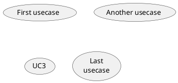
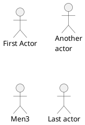
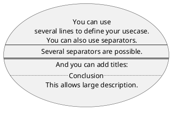
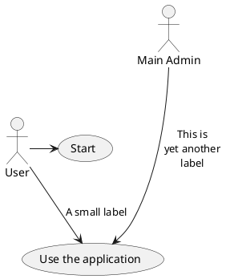
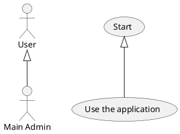
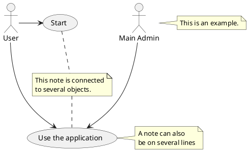
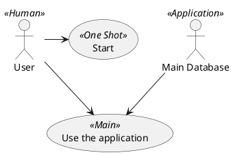
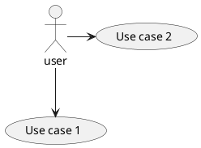
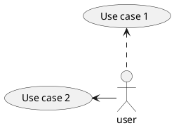
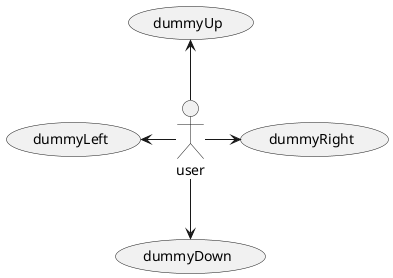

## 2 用例图 (PlantUML)
#### 2.1 用例
* 用例用圆括号括起来。
* 也可以用关键字 `usecase` 来定义用例。
* 还可以用关键字 `as` 定义一个别名，这个别名可以在以后定义关系的时候使用。




#### 2.2 角色
* 角色用两个冒号包裹起来。
* 也可以用 `actor` 关键字来定义角色。
* 还可以用关键字 `as` 来定义一个别名，这个别名可以在以后定义关系的时候使用。
* 后面我们会看到角色的定义是可选的。




#### 2.3 用例描述
* 如果想定义跨越多行的用例描述，可以用双引号将其裹起来。
* 还可以使用这些分隔符：`--` `..` `==` `__`。并且还可以在分隔符中间放置标题。




#### 2.4 基础示例
* 用箭头 `-->` 连接角色和用例。
* 横杠"`-`" 越多，箭头越长。通过在箭头定义的后面加一个冒号及文字的方式来添加标签。
* 在这个例子中，`User` 并没有定义，而是直接拿来当做一个角色使用。




#### 2.5 继承
如果一个角色或者用例继承于另一个，那么可以用 `<|--`符号表示。



#### 2.6 使用注释
* 可以用 note left of , note right of , note top of , note bottom of 等关键字给一个对象添加注释。
* 注释还可以通过 note 关键字来定义，然后用.. 连接其他对象。




#### 2.7 构造类型
用”`<<`” 和”`>>`” 来定义角色或者用例的构造类型。



#### 2.8 改变箭头方向
默认连接是竖直方向的，用 `--`表示，可以用一个横杠或点来表示水平连接。



也可以通过翻转箭头来改变方向。



还可以通过给箭头添加 `left`, `right`, `up` 或 `down` 等关键字来改变方向。



这些方向关键字也可以只是用首字母或者前两个字母的缩写来代替。 但是请注意，这样的缩写不要乱用，Graphviz 不喜欢这样。

#### 2.9 分割图示
用 `newpage` 关键字将图示分解为多个页面。
```plantuml {code_block: true}
@startuml
:actor1: --> (Usecase1)
newpage
:actor2: --> (Usecase2)
@enduml
```

```plantuml
@startuml
:actor1: --> (Usecase1)
newpage
:actor2: --> (Usecase2)
@enduml
```

#### 2.10 从左向右方向
默认从上往下构建图示。
```plantuml {code_block: true}
@startuml
'default
top to bottom direction
user1 --> (Usecase 1)
user2 --> (Usecase 2)
@enduml
```

```plantuml
@startuml
'default
top to bottom direction
user1 --> (Usecase 1)
user2 --> (Usecase 2)
@enduml
```

你可以用 `left to right direction` 命令改变图示方向。
```plantuml {code_block: true}
@startuml
left to right direction
user1 --> (Usecase 1)
user2 --> (Usecase 2)
@enduml
```

```plantuml
@startuml
left to right direction
user1 --> (Usecase 1)
user2 --> (Usecase 2)
@enduml
```


#### 2.11 显示参数
用 `skinparam` 改变字体和颜色。 可以在如下场景中使用：
* 在图示的定义中，
* 在引入的文件中，
* 在命令行或者 `ANT` 任务提供的配置文件中。
你也可以给构造的角色和用例指定特殊颜色和字体。
```plantuml {code_block: true}
@startuml
skinparam handwritten true

skinparam usecase {
  BackgroundColor DarkSeaGreen
  BorderColor DarkSlateGray
  BackgroundColor<< Main >> YellowGreen
  BorderColor<< Main >> YellowGreen
  ArrowColor Olive
  ActorBorderColor black
  ActorFontName Courier
  ActorBackgroundColor << Human >> Gold
}

User << Human >>
:Main Database: as MySql << Application >>
(Start) << One Shot >>
(Use the application) as (Use) << Main >>
User -> (Start)
User --> (Use)

MySql --> (Use)
@enduml
```

```plantuml
@startuml
skinparam handwritten true

skinparam usecase {
  BackgroundColor DarkSeaGreen
  BorderColor DarkSlateGray
  BackgroundColor<< Main >> YellowGreen
  BorderColor<< Main >> YellowGreen
  ArrowColor Olive
  ActorBorderColor black
  ActorFontName Courier
  ActorBackgroundColor << Human >> Gold
}

User << Human >>
:Main Database: as MySql << Application >>
(Start) << One Shot >>
(Use the application) as (Use) << Main >>
User -> (Start)
User --> (Use)

MySql --> (Use)
@enduml
```

#### 2.12 一个完整的例子

```plantuml {code_block: true}
@startuml
left to right direction
skinparam packageStyle rectangle
actor customer
actor clerk
rectangle checkout {
  customer -- (checkout)
  (checkout) .> (payment) : include
  (help) .> (checkout) : extends
  (checkout) -- clerk
}
@enduml
```

```plantuml
@startuml
left to right direction
skinparam packageStyle rectangle
actor customer
actor clerk
rectangle checkout {
  customer -- (checkout)
  (checkout) .> (payment) : include
  (help) .> (checkout) : extends
  (checkout) -- clerk
}
@enduml
```
