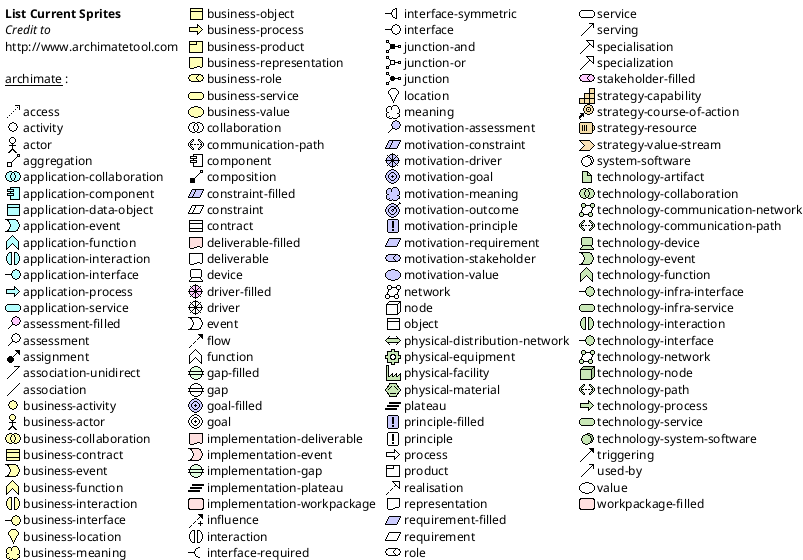

## PlantUML - import puml
---
#### Ditaa
//@import "puml-ditaa.puml"
@import "puml-ditaa.puml" {code_block=true class="line-numbers"}

//@import "puml-ditaa2.puml"
@import "puml-ditaa2.puml" {code_block=true class="line-numbers"}

---
#### Archimate Diagram
@import "puml-archimate.1.puml"
@import "puml-archimate.1.puml" {code_block=true class="line-numbers"}

@import "puml-archimate.puml"
@import "puml-archimate.puml" {code_block=true class="line-numbers"}

---
#### Class Digram
@import "puml-class.puml"
@import "puml-class.puml" {code_block=true class="line-numbers"}

---
#### Use Case
@import "puml-usecase.puml"
@import "puml-usecase.puml" {code_block=true class="line-numbers"}

---
#### Activity
@import "puml-activity.puml"
@import "puml-activity.puml" {code_block=true class="line-numbers"}

---
#### Activity (new)
@import "puml-activity-new.puml"
@import "puml-activity-new.puml" {code_block=true class="line-numbers"}

---
#### Component Diagram
@import "puml-component.puml"
@import "puml-component.puml" {code_block=true class="line-numbers"}

---
#### Timing Diagram
@import "puml-timing.puml"
@import "puml-timing.puml" {code_block=true class="line-numbers"}

---
#### List possible sprites

---
#### Test
@import "puml-test.puml"
@import "puml-test.puml" {code_block=true class="line-numbers"}
