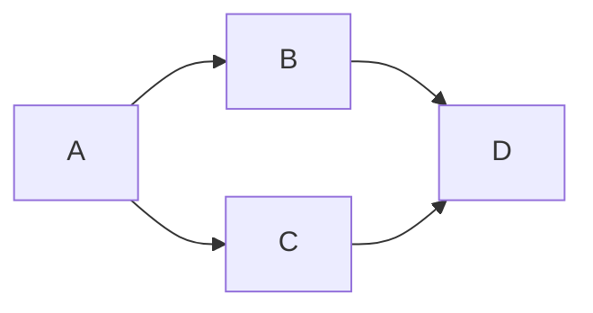
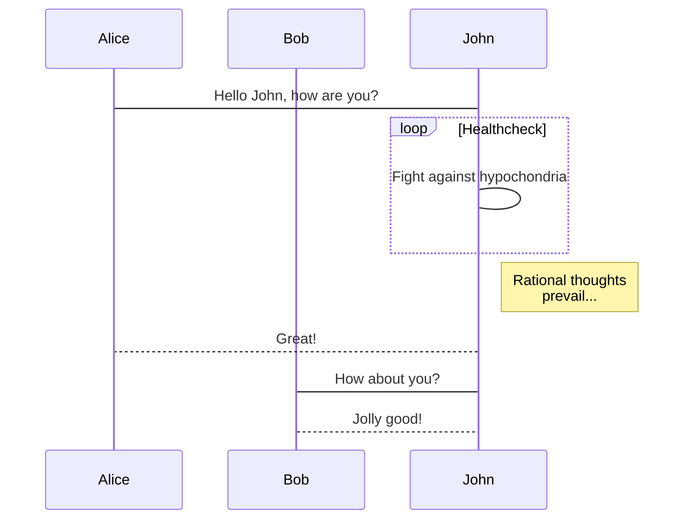
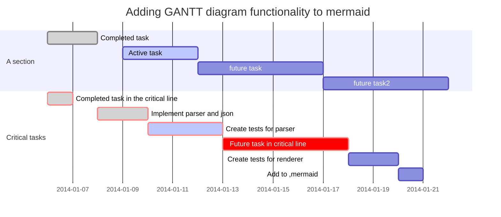
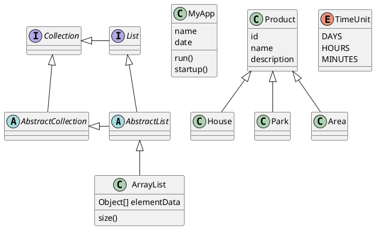

## Script Graphs

Contents
* [概述](#summary)
* [Mermaid Diagrams](#mermaid-example)
* [PlantUML Diagrams](#plantuml-example)
* [Wavedrom Diagrams](#wavedrom-example)
* [Graphviz Diagrams](#graphviz-example)

Online
* [Graphviz](http://www.graphviz.org/)
* [yEd](http://www.yworks.com/products/yed)
* [PlantUML](http://plantuml.com/)
* [mermaid](http://knsv.github.io/mermaid/index.html)
* [yUML](https://yuml.me/)
* [脚本绘图工具总结](http://www.cnblogs.com/hbccdf/p/Script_drawing_tool_summary.html)
* [使用Graphviz绘制流程图和关系图](http://www.tuicool.com/articles/qeqeuyb)
* [使用 Sublime + PlantUML 高效地画图](http://www.cnblogs.com/codingWarrior/p/5147183.html)
* [mermaid简介](http://www.cnblogs.com/wangyaning/p/6131468.html)
* [markdown-preview-enhanced](https://atom.io/packages/markdown-preview-enhanced)
* [CSDN-markdown语法之如何使用LaTeX语法编写数学公式](http://it.taocms.org/03/7247.htm)
* [KaTeX and MathJax Comparison Demo](http://www.intmath.com/cg5/katex-mathjax-comparison.php)

---
<span id="summary"></span>
### 概述
#### PlantUML
* [PlantUML](http://www.plantuml.com/)
* [Using PlantUML](http://plantuml.com/running)
* [Use it with Atom](https://atom.io/packages/plantuml)
* [PlantUML language package for Atom](https://atom.io/packages/language-plantuml)

文件扩展名 `.pu` Atom 中预览 `ctrl-alt-p`。

PlantUML图形颜色, 可使用 `skinparam 参数 值` 配置:
`skinparam classBackgroundColor WhiteSmoke` 

可以使用 `skinparam monochrome true` 命令强制使用黑白色进行输出。 
```
参数名字                            默认值  注释
backgroundColor                     white   页面背景色
activityArrowColor                  #A80036 活动图中箭头的颜色
activityBackgroundColor             #FEFECE 活动的背景色
activityBorderColor                 #A80036 活动边界的颜色
activityStartColor                  black   活动图开始的圆圈的颜色
activityEndColor                    black   活动图结束的圆圈的颜色
activityBarColor                    black   活动图中同步条的颜色
usecaseArrowColor                   #A80036 usecase 图中箭头的颜色
usecaseActorBackgroundColor         #FEFECE usecase 图中角色头部的颜色
usecaseActorBorderColor             #A80036 usecase 图中角色的边界的颜色
usecaseBackgroundColor              #FEFECE usecase 的背景色
usecaseBorderColor                  #A80036 usecase 图中 usecase 边界的颜色
classArrowColor                     #A80036 类图中箭头的颜色
classBackgroundColor                #FEFECE 类图中类、接口、枚举的背景色
classBorderColor                    #A80036 类图中类、接口、枚举的边界颜色
packageBackgroundColor              #FEFECE 类图中包的背景色
packageBorderColor                  #A80036 类图中包的边界颜色
stereotypeCBackgroundColor          #ADD1B2 类图中圆圈的背景色
stereotypeABackgroundColor          #A9DCDF 类图中抽象类圆圈的背景色
stereotypeIBackgroundColor          #B4A7E5 类图中接口圆圈的背景色
stereotypeEBackgroundColor          #EB937F 类图中枚举圆圈的背景色
componentArrowColor                 #A80036 组件图中箭头的颜色
componentBackgroundColor            #FEFECE 组件的背景色
componentBorderColor                #A80036 组件的边界颜色
componentInterfaceBackgroundColor   #FEFECE 组件图中接口的背景色
componentInterfaceBorderColor       #A80036 组件图中接口的边界颜色
noteBackgroundColor                 #FBFB77 注释的背景色
noteBorderColor                     #A80036 注释的边界颜色
stateBackgroundColor                #FEFECE 状态图中状态的背景色
stateBorderColor                    #A80036 状态图中状态的边界颜色
stateArrowColor                     #A80036 状态图中箭头的颜色
stateStartColor                     black   状态图中开始圆圈的颜色
stateEndColor                       black   状态图中结束圆圈的颜色
sequenceArrowColor                  #A80036 序列图中箭头的颜色
sequenceActorBackgroundColor        #FEFECE 序列图中角色的头部颜色
sequenceActorBorderColor            #A80036 序列图中角色的边界颜色
sequenceGroupBackgroundColor        #EEEEEE 序列图中 alt/opt/loop 的标头颜色
sequenceLifeLineBackgroundColor     white   序列图中生命线的背景色
sequenceLifeLineBorderColor         #A80036 序列图中生命线的边界的颜色
sequenceParticipantBackgroundColor  #FEFECE 序列图中参与者的背景色
sequenceParticipantBorderColor      #A80036 序列图中参与者的边界颜色
```


#### Graphviz
* [Graphviz](http://www.graphviz.org/)
* [graphviz-preview](https://atom.io/packages/graphviz-preview)
* [graphviz-preview-plus](https://atom.io/packages/graphviz-preview-plus)
* [language-dot](https://atom.io/packages/language-dot)

安装 Graphviz，设置  `GRAPHVIZ_DOT` 为 `C:\winapp\graphviz\bin\dot.exe`   

建议使用 `graphviz-preview-plus`
Write and preview GraphViz dot. Shortcut: `ctrl-shift-V`.
Enabled for `.dot` and `.gv` files

#### Mermaid
* [atom-mermaid](https://atom.io/packages/atom-mermaid)
* [markdown-preview-enhanced](https://atom.io/packages/markdown-preview-enhanced)

#### WaveDrom
* [Hitchhiker's Guide to the WaveDrom](http://wavedrom.com/tutorial.html)
* [drom/wavedrom](https://github.com/drom/wavedrom)


----
### Diagrams

<span id="mermaid-example"></span>
#### Mermaid 
流程图(flowchart)  


时序图(sequence diagram)



甘特图(GANNT Diagram)


<span id="plantuml-example"></span>
#### PlantUML
Class Digram


<span id="wavedrom-example"></span>
#### Wavedrom
```wavedrom
{ signal: [
  { name: "CK",   wave: "P.......",                                              period: 2  },
  { name: "CMD",  wave: "x.3x=x4x=x=x=x=x", data: "RAS NOP CAS NOP NOP NOP NOP", phase: 0.5 },
  { name: "ADDR", wave: "x.=x..=x........", data: "ROW COL",                     phase: 0.5 },
  { name: "DQS",  wave: "z.......0.1010z." },
  { name: "DQ",   wave: "z.........5555z.", data: "D0 D1 D2 D3" }
]}
```

<span id="graphviz-example"></span>
#### Graphviz
```viz
digraph G {
subgraph cluster0 {
node [style=filled,color=white];
style=filled;
color=lightgrey;
a0 -> a1 -> a2 -> a3;
label = "process #1";
}
subgraph cluster1 {
node [style=filled];
b0 -> b1 -> b2 -> b3;
label = "process #2";
color=blue
}
start -> a0;
start -> b0;
a1 -> b3;
b2 -> a3;
a3 -> a0;
a3 -> end;
b3 -> end;
start [shape=Mdiamond];
end [shape=Msquare];
}
```
