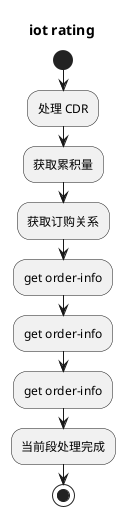
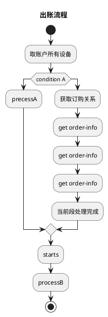
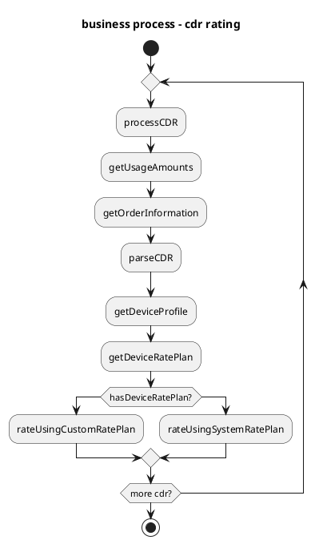
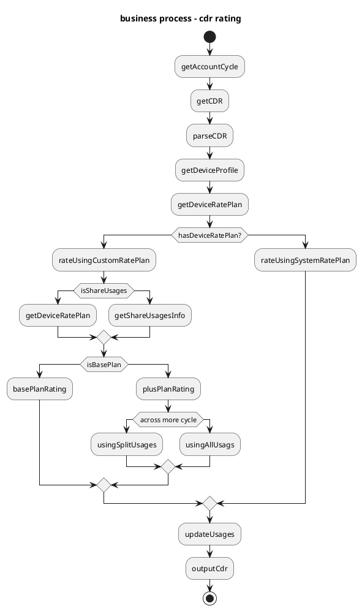
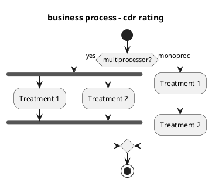

# IOT design

```plantuml
@startuml
title iot rating
start
:处理 CDR;
:获取累积量;
:获取订购关系;
:get order-info;
:get order-info;
:get order-info;
:当前段处理完成;
stop

@enduml
```

#### 出账流程

```plantuml
@startuml
title 出账流程
start
:取账户所有设备;
if (condition A)
  : precessA;
else
  :获取订购关系;
  :get order-info;
  :get order-info;
  :get order-info;
  :当前段处理完成;
endif
:starts;
:processB;
stop

@enduml
```

#### 业务处理流程

```plantuml
@startuml
title business process - cdr rating
start

repeat
:processCDR;
:getUsageAmounts;
:getOrderInformation;
:parseCDR;
:getDeviceProfile;
:getDeviceRatePlan;
if (hasDeviceRatePlan?)
  :rateUsingCustomRatePlan;
else
  :rateUsingSystemRatePlan;
endif
repeat while (more cdr?)

stop
@enduml
```

```plantuml
@startuml
title business process - cdr rating
start

:getAccountCycle;
:getCDR;
:parseCDR;
:getDeviceProfile;
:getDeviceRatePlan;
if (hasDeviceRatePlan?)
  :rateUsingCustomRatePlan;
  if (isShareUsages)
    :getDeviceRatePlan;
  else
    :getShareUsagesInfo;
  endif
  if (isBasePlan)
    :basePlanRating;
  else
    :plusPlanRating;
    if (across more cycle)
      :usingSplitUsages;
    else
      :usingAllUsags;
    endif
  endif
else
  :rateUsingSystemRatePlan;
endif
:updateUsages;
:outputCdr;

stop
@enduml
```

#### 业务处理流程 - 回退

```plantuml
@startuml
title business process - cdr rating
start

if (multiprocessor?) then (yes)
  fork
    :Treatment 1;
  fork again
    :Treatment 2;
  end fork
else (monoproc)
  :Treatment 1;
  :Treatment 2;
endif

stop
@enduml
```
