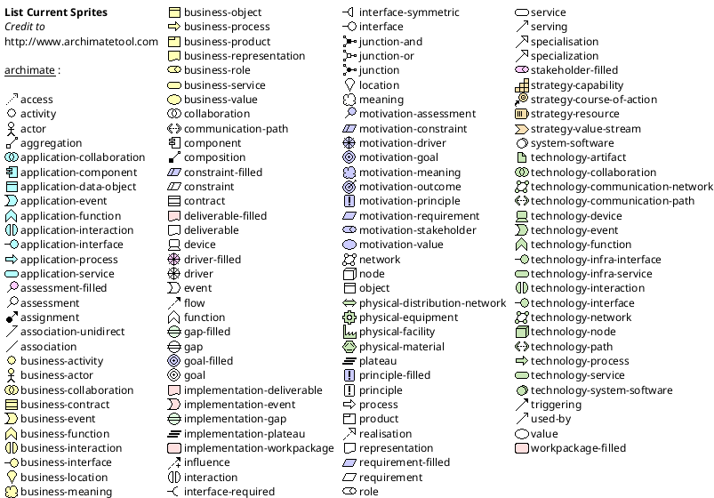

## PlantUML

#### Archimate Diagram
@import "puml-archimate.puml"

#### List possible sprites

#### Class Digram
@import "puml-class.puml"

#### Use Case
@import "puml-usecase.puml"

#### Activity
@import "puml-activity.puml"

#### Component Diagram
@import "puml-component.puml"

#### Timing Diagram
@import "puml-timing.puml"
